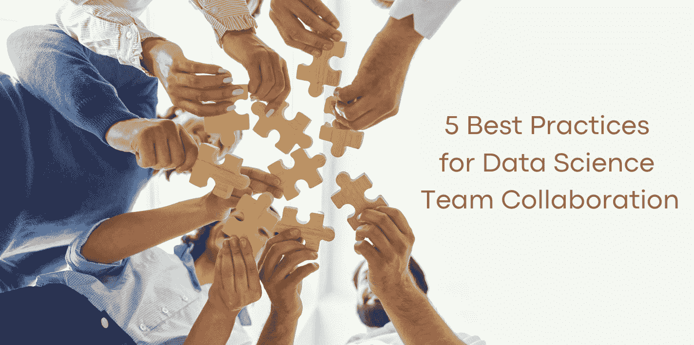

# 数据科学团队协作的五个最佳实践

> 原文：[`www.kdnuggets.com/2023/06/5-best-practices-data-science-team-collaboration.html`](https://www.kdnuggets.com/2023/06/5-best-practices-data-science-team-collaboration.html)

作者提供的图片

数据科学项目包含广泛的技能，不同的团队成员扮演不同的角色。每个人都有自己的技能和职责，这些都在协作技术工作中发挥着重要作用。

* * *

## 我们的前三个课程推荐

 1\. [谷歌网络安全证书](https://www.kdnuggets.com/google-cybersecurity) - 快速入门网络安全职业。

 2\. [谷歌数据分析专业证书](https://www.kdnuggets.com/google-data-analytics) - 提升你的数据分析技能

 3\. [谷歌 IT 支持专业证书](https://www.kdnuggets.com/google-itsupport) - 支持你组织的 IT 需求

* * *

然而，我们仍然面临全球疫情的反弹以及越来越多人继续在家工作的情况。这自然会导致人们的工作和操作方式发生变化。

那么数据科学团队可以做些什么来提高协作效率呢？让我们来探讨一下。

# 确保模型投入生产

众所周知，有许多模型花费了大量的时间、精力和金钱来构建，但它们很少投入生产。根据 [VentureBeat AI](https://venturebeat.com/ai/why-do-87-of-data-science-projects-never-make-it-into-production/)，87%的数据科学项目从未投入生产。这是一个相当高的数字！但为什么这么高呢？

这是因为业务的数据科学元素和业务的实际目标并不匹配。而它们不匹配的主要原因是数据科学团队需要提供的内容与业务需求之间存在模糊地带。

数据科学团队与商业决策者之间的更好沟通将使数据团队的成员能够有效地生产所需的内容。这可以通过回答以下问题来实现：

1.  业务问题是什么？

1.  解决这个问题可能吗？

1.  商业是否会采纳数据洞察中的解决方案？

回答这三个问题可以使数据科学团队深入了解需要完成的任务。

# 文档项目

一个数据科学项目由不同角色的人组成，从数据科学家到数据工程师、产品经理、IT 管理员等。进行项目时，记录你所做的每一步可以使团队中的每个人更清楚地了解项目的过程，以及接下来需要做什么。

数据科学项目不会总是成功，但记录下你的每一步可以让你从项目中吸取教训，并在下次确保成功时知道该做什么。

记录项目时需要遵循的两个规则是：

1.  尽管文档编制有助于与当前员工协作，但它也是与未来员工协作的方式。

1.  要循序渐进。在处理数据科学项目时，像撰写研究论文一样操作。不要急于生产最终产品，而是要建立一个有效且成功地实现商业目标的最终产品。

# 知识共享

通过记录一切，你也在公司内提供了知识共享。数据科学团队在公司中持有许多**宝贵的资产**。许多公司面临的最大挑战之一是重复生产相同的工作或资源。

创建一个知识共享平台，让每个人都能访问代码、项目和模型等信息，将为你的组织节省大量时间，避免重复制作相同的内容。

知识共享与项目文档编制密切相关，因为员工应该能够看到数据科学家使用了哪些数据源、建模方法、环境版本等信息。

# 版本化你的工作

现在来详细讨论数据科学项目的技术元素。大多数数据以平面文件存储或通过关系数据库系统访问。然而，数据科学团队面临的最大挑战是，当团队成员下载原始数据并在本地生成工作时，没有将中间数据版本推送回团队的其他成员。

不幸的是，数据科学团队的其他成员可能会完成相同的工作，导致工作负担的重复。共享你的工作非常有价值，因为它给你的同事提供了利用你所做工作的机会，使他们可以在此基础上继续工作。

你的所有工作都应该被版本化并推送到非本地系统，允许其他人查看更改并获取这些更改进行工作。

你可以通过以下方式确保这一点：

1.  为你的团队使用共享服务器。

1.  使用自动化工具将中间数据文件推送回适当的位置。

1.  利用像 Slack 和 GitHub 这样的集成工具，以便接收变更通知。

# 数据管道

数据管道允许数据科学项目的数据流动，因为数据处理元素是串联连接的，一个元素的输出是下一个元素的输入。与其花费额外时间运行两个或多个命令从原始数据到达最终结果，不如使用数据管道，通过一个命令就能看到整个转换过程。

这不仅可以减少从头开始重建项目所花费的时间，还可以让你对数据转换有一个结构化的理解。

# 总结

尽管还有其他实践方法可以用来确保更好的数据科学团队协作方法。然而，这 5 个实践方法如果正确有效地实施，将使你的团队在更有效和高效的方式下取得进展。

想了解如何自动化你的数据科学工作流，请阅读：数据科学工作流的自动化

**[尼莎·阿亚](https://www.linkedin.com/in/nisha-arya-ahmed/)**是一位数据科学家、自由技术撰稿人以及 KDnuggets 的社区经理。她特别感兴趣于提供数据科学职业建议、教程以及理论知识。她还希望探索人工智能如何有助于人类生命的延续。她是一个热衷学习者，寻求拓宽技术知识和写作技能，同时帮助指导他人。

### 更多相关主题

+   [上下文、一致性与协作是数据科学成功的关键](https://www.kdnuggets.com/2022/01/context-consistency-collaboration-essential-data-science-success.html)

+   [数据协作中的失败（以及修复的 4 个技巧）](https://www.kdnuggets.com/2023/01/collaboration-fails-around-data-4-tips-fixing.html)

+   [协作的力量：开源项目如何推动 AI 发展](https://www.kdnuggets.com/2023/08/power-collaboration-opensource-projects-advancing-ai.html)

+   [将 ChatGPT 融入数据科学工作流：技巧和最佳实践](https://www.kdnuggets.com/2023/05/integrating-chatgpt-data-science-workflows-tips-best-practices.html)

+   [5 个数据科学的 Python 最佳实践](https://www.kdnuggets.com/5-python-best-practices-for-data-science)

+   [数据仓库和 ETL 最佳实践](https://www.kdnuggets.com/2023/02/data-warehousing-etl-best-practices.html)
