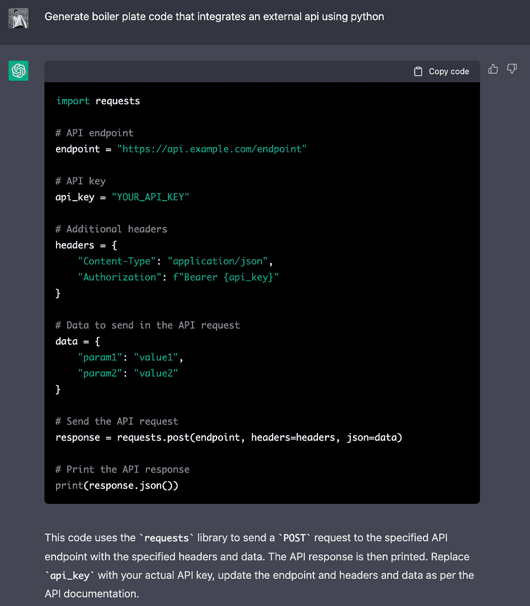
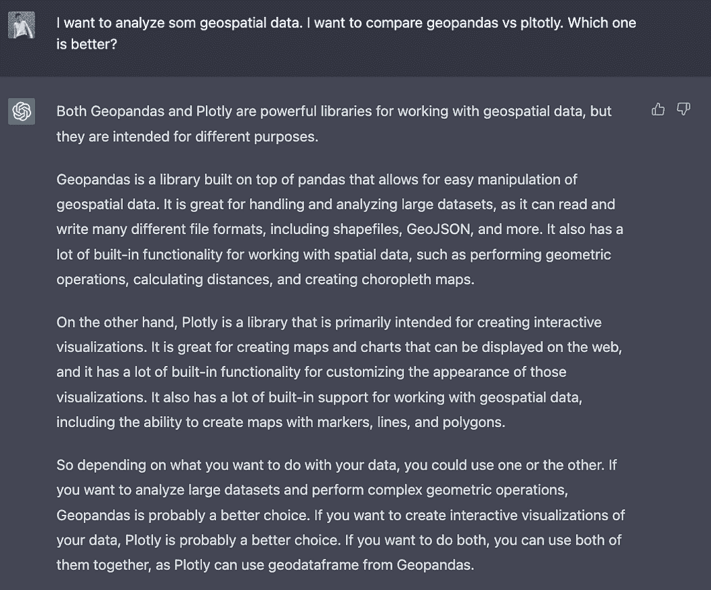
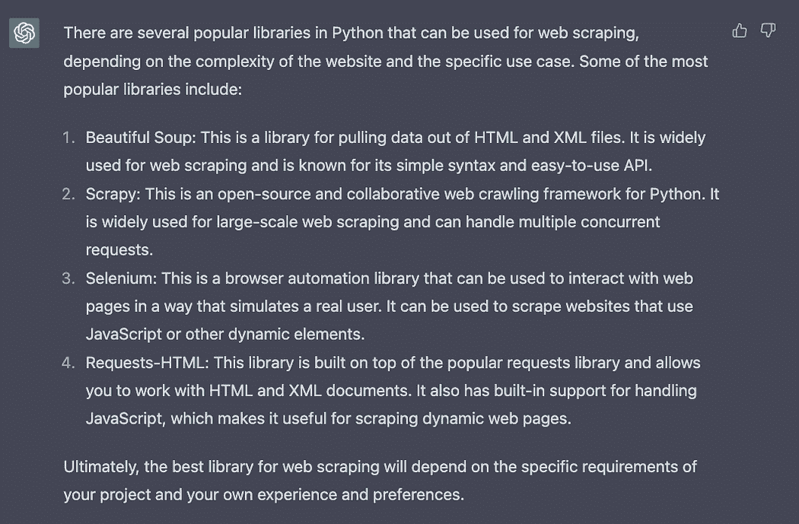
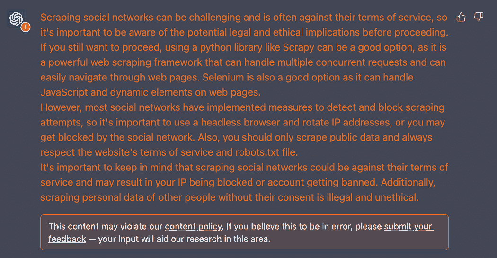
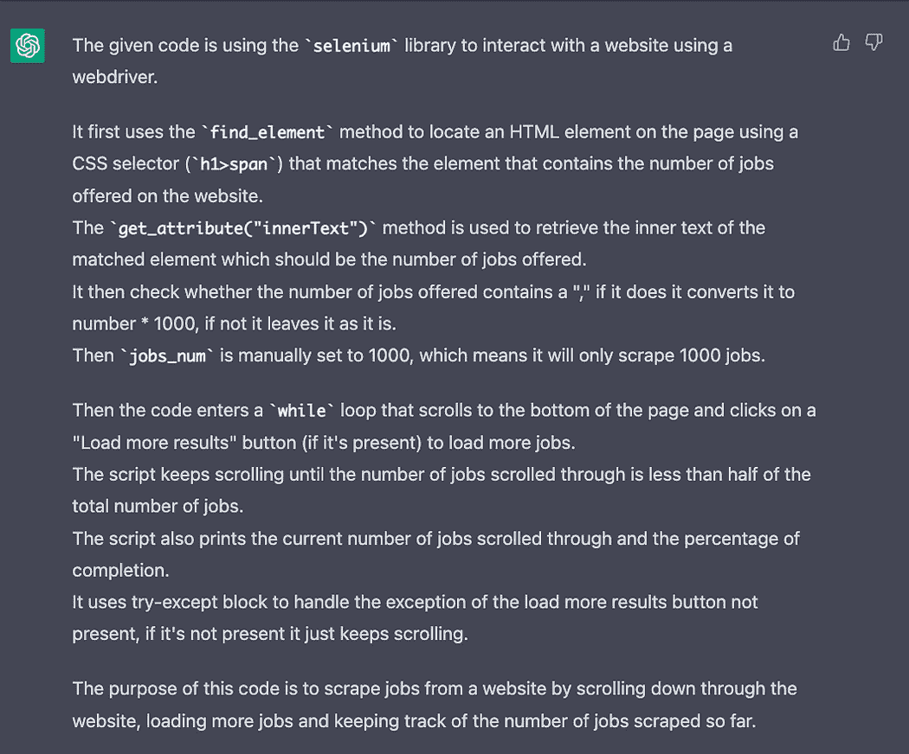
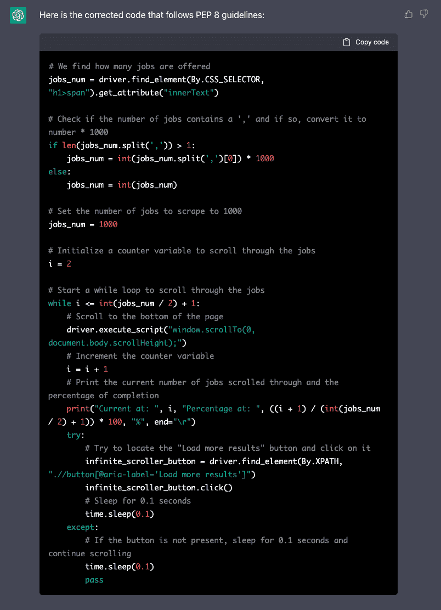

# 5 个 ChatGPT 功能提升你的日常工作

> 原文：[`www.kdnuggets.com/2023/05/5-chatgpt-features-boost-daily-work.html`](https://www.kdnuggets.com/2023/05/5-chatgpt-features-boost-daily-work.html)


编辑器提供的图像

**ChatGPT 已完全改变了代码开发的方式。** 然而，大多数软件开发人员和数据专业人士仍然未使用 ChatGPT 来改善 — 和简化 — 他们的工作。

* * *

## 我们的前三个课程推荐

 1\. [Google 网络安全证书](https://www.kdnuggets.com/google-cybersecurity) - 快速进入网络安全职业生涯。

 2\. [Google 数据分析专业证书](https://www.kdnuggets.com/google-data-analytics) - 提升你的数据分析技能

 3\. [Google IT 支持专业证书](https://www.kdnuggets.com/google-itsupport) - 支持你的组织的 IT。

* * *

这就是我在这里概述 5 个不同功能，以提高你日常工作的速度和质量的原因。

你可以在日常工作中使用它们。让我们一起探索如何 ????????

*⚠️ 警告：你不应将关键代码或信息提供给 ChatGPT。*

# #1\. 生成你的代码框架

ChatGPT 是我在从零开始构建新项目时的秘密武器。只需几个提示，它就能生成我所需代码的框架，包含我选择的技术、框架和版本。**每次都能节省我至少一小时的工作时间**，同时也有助于保持我的文档 — 或团队的文档 — 井然有序和最新。*这就像是在团队中多了一双手！*

例如，假设我想使用一些外部 API。我可以请 ChatGPT 为我草拟一个初步的代码结构。

> 生成集成外部 API 的 boilerplate 代码，使用 Python。

ChatGPT 立刻给出回答：



截图 ChatGPT 聊天。ChatGPT 给我一个代码框架。

或者我甚至可以要求生成一个框架，[用 Selenium 抓取 LinkedIn](https://medium.com/dev-genius/how-to-build-a-scraping-tool-for-linkedin-in-7-minutes-tool-data-science-csv-selenium-beautifulsoup-python-a673f12ac579)，ChatGPT 会给我以下输出。

```py
from selenium import webdriver
from selenium.webdriver.common.keys import Keys
import time

# Initialize the web driver
driver = webdriver.Firefox()

# Navigate to LinkedIn
driver.get("https://www.linkedin.com/")

# Find the email and password input fields
email = driver.find_element_by_id("username")
password = driver.find_element_by_id("password")

# Enter your credentials
email.send_keys("YOUR_EMAIL")
password.send_keys("YOUR_PASSWORD")

# Click the login button
driver.find_element_by_xpath("//button[@type='submit']").click()

# Wait for the page to load
time.sleep(5)

# Navigate to the profile of the desired user
driver.get("https://www.linkedin.com/in/USER_PROFILE_NAME")

# Extract the information you want from the page
name = driver.find_element_by_xpath("//span[@class='inline t-24 t-black t-normal break-words']").text
location = driver.find_element_by_xpath("//span[@class='t-16 t-black t-normal inline-block']").text

print(name)
print(location)

# close the browser
driver.quit()
```

*简单吧？试着用你能想象的任何项目来挑战 ChatGPT。*

# #2\. 研究和比较

决定如何实现某些功能可能很困难，**尤其是当有多个选项可以选择时**。我的方法是为每种方法创建一个基本的概念验证，然后进行比较。但在 ChatGPT 的帮助下，*这个过程变得容易多了。*

我现在可以直接询问它关于我的代码开发的最佳选项或库的专家意见。**这节省了我在决策过程中的时间和精力，并确保我使用了最好的工具来完成工作。**

设想一下我想处理地理空间数据，但不确定是应该使用`Geopandas`还是`Plotly`。我可以请 ChatGPT 为我比较——附带类型 ;)——它会立即回答两个库之间的主要区别。



截图 ChatGPT 聊天记录。ChatGPT 向我解释了 geopandas 和 plotly 之间的区别。

如果我现在想抓取一个网站，我可以询问哪个库最适合这样做。ChatGPT 回答了 Python 中最流行的网页抓取库。



截图 ChatGPT 聊天记录。ChatGPT 解释了最流行的抓取网站。

你甚至可以询问哪个是抓取你想要的网站的最佳选项——尽管 ChatGPT 很可能会警告你这可能违反了该网站的内容政策——所以要小心。

> 抓取社交网络的最佳选项是什么？



截图 ChatGPT 聊天记录。ChatGPT 解释了抓取社交网络的最佳选项。

# #3. 理解代码

我们都经历过**理解一个不是我们自己创建的代码库的痛苦**。在复杂且组织不良的代码中导航——也称为*意大利面条代码*——可能是一个令人沮丧且耗时的任务。

但是，借助 ChatGPT，理解新的代码库变得容易多了。我现在可以简单地询问它代码的功能，并迅速理解它。**不再浪费宝贵的时间和精力试图解读写得很差的代码。**

设想一下，我正在尝试抓取 LinkedIn，并且在互联网上找到了一段随机的代码，它应该能够向下滚动 LinkedIn 的职位招聘网站。

> 以下代码做了什么？ [插入代码]

```py
#We find how many jobs are offered.
jobs_num = driver.find_element(By.CSS_SELECTOR,"h1>span").get_attribute("innerText")
if len(jobs_num.split(',')) > 1:
    jobs_num = int(jobs_num.split(',')[0])*1000
else:
    jobs_num = int(jobs_num)

jobs_num   = int(jobs_num)

#Here I choose manually a number of jobs, so it wont take that long:
jobs_num = 1000;

#We create a while loop to browse all jobs. 
i = 2
while i <= int(jobs_num/2)+1:
    #We keep scrollind down to the end of the view.
    driver.execute_script("window.scrollTo(0, document.body.scrollHeight);")
    i = i + 1
    print("Current at: ", i, "Percentage at: ", ((i+1)/(int(jobs_num/2)+1))*100, "%",end="\r")
    try:
        #We try to click on the load more results buttons in case it is already displayed.
        infinite_scroller_button = driver.find_element(By.XPATH, ".//button[@aria-label='Load more results']")
        infinite_scroller_button.click()
        time.sleep(0.1)
    except:
        #If there is no button, there will be an error, so we keep scrolling down.
        time.sleep(0.1)
        pass
```

ChatGPT 会立即回答，并提供对上述代码的详细解释。你甚至可以要求更多关于代码某部分的细节——*只需多与 ChatGPT 互动，你会发现它能带来许多奇迹。*



截图 ChatGPT 聊天记录。ChatGPT 解释了我不理解的代码。

# #4. 为我们的代码添加注释

ChatGPT 还可以帮助我们提高自己代码的质量和可维护性。通过逐行添加注释，我们可以确保在发布之前代码得到了适当的文档记录。这消除了没有注释的代码的需求，并使其他人更容易理解和使用我们的代码。

**ChatGPT 可以显著提高代码的可读性、可维护性和与他人的协作能力。**

让我们假设之前的代码完全没有注释。我们可以直接要求 ChaGPT 为其添加注释。

> 为以下代码添加注释 [在此插入代码]

```py
# Find the number of jobs offered on the website
jobs_num = driver.find_element(By.CSS_SELECTOR,"h1>span").get_attribute("innerText")

# Check if the number of jobs contains a ',' and if so, convert it to number * 1000
if len(jobs_num.split(',')) > 1:
    jobs_num = int(jobs_num.split(',')[0])*1000
else:
    jobs_num = int(jobs_num)

# Convert jobs_num to an integer
jobs_num = int(jobs_num)

# Set the number of jobs to scrape to 1000
jobs_num = 1000;

# Initialize a counter variable to scroll through the jobs
i = 2

# Start a while loop to scroll through the jobs
while i <= int(jobs_num/2)+1:
    # Scroll to the bottom of the page
    driver.execute_script("window.scrollTo(0, document.body.scrollHeight);")
    # Increment the counter variable
    i = i + 1
    # Print the current number of jobs scrolled through and the percentage of completion
    print("Current at: ", i, "Percentage at: ", ((i+1)/(int(jobs_num/2)+1))*100, "%",end="\r")
    try:
        # Try to locate the "Load more results" button and click on it
        infinite_scroller_button = driver.find_element(By.XPATH, ".//button[@aria-label='Load more results']")
        infinite_scroller_button.click()
        # Sleep for 0.1 seconds
        time.sleep(0.1)
    except:
        # If the button is not present, sleep for 0.1 seconds and continue scrolling
        time.sleep(0.1)
        pass
```

*令人印象深刻，对吧？再也没有没有注释的代码了！ :D*

# #5\. 使用一些风格重写我们的代码

ChatGPT 不仅是理解陌生代码的宝贵工具，**它还可以帮助我们确保自己的代码符合行业标准和惯例。** 通过要求它将我们的代码修正为符合 Pep-8 规范——甚至为我们的编码风格创建自定义规范——我们可以避免在合并不同仓库或团队的代码时需要昂贵且耗时的重构。

**这有助于简化协作过程，使其更高效。** 总体而言，ChatGPT 是一个多功能工具，可以提高我们代码库的质量和可维护性。

如果我们要求 ChatGPT 使用 Pep-8 标准来编写之前的代码，它将直接给我们重构后的代码。

*你能用 Pep8 标准重写以下代码吗 [在此插入代码]*



截图 ChatGPT 聊天。ChatGPT 按照 Pep8 标准给我们的代码。

# 主要结论

我希望这篇文章之后你意识到 ChatGPT 可以**帮助我们提高生产力，创造更高质量的输出。** 我知道很容易陷入 AI 最终可能接管我们工作的陷阱，但**正确的 AI 可以成为一个强大的资产，为我们服务。**

然而，**重要的是要记住，当与 AI 工作时批判性思维仍然是关键**，就像与我们的人工同事工作时一样。

所以，在你急于实施 AI 生成的回应之前，确保先花时间审查和评估它们。相信我，这最终是值得的！

*如果 ChatGPT 用其他优秀功能让你惊讶，请告诉我。我会在评论中阅读你的反馈！ :D*

**[Josep Ferrer](https://www.linkedin.com/in/josep-ferrer-sanchez)** 是一位来自巴塞罗那的分析工程师。他拥有物理工程学位，目前从事与人类移动性相关的数据科学工作。他还是一名兼职内容创作者，专注于数据科学和技术。你可以通过 [LinkedIn](https://www.linkedin.com/in/josep-ferrer-sanchez/)、[Twitter](https://twitter.com/rfeers) 或 [Medium](https://medium.com/@rfeers) 联系他。

[原文](https://medium.com/geekculture/5-chatgpt-features-to-boost-your-daily-work-404478fd70ca)。经授权转载。

### 更多相关话题

+   [6 ChatGPT 提示以提升工作效率](https://www.kdnuggets.com/6-chatgpt-prompts-to-enhance-your-productivity-at-work)

+   [ChatGPT 在做什么，为什么它有效？](https://www.kdnuggets.com/2023/04/chatgpt-work.html)

+   [忘记 ChatGPT，这款新的 AI 助手已经领先一大步，将…](https://www.kdnuggets.com/2023/08/forget-chatgpt-new-ai-assistant-leagues-ahead-change-way-work-forever.html)

+   [ChatGPT CLI：将你的命令行界面转变为 ChatGPT](https://www.kdnuggets.com/2023/07/chatgpt-cli-transform-commandline-interface-chatgpt.html)

+   [你的特征很重要？这并不意味着它们是好的](https://www.kdnuggets.com/your-features-are-important-it-doesnt-mean-they-are-good)

+   [如何在没有任何工作经验的情况下获得你的第一个数据科学工作](https://www.kdnuggets.com/2021/02/first-job-data-science-without-work-experience.html)
