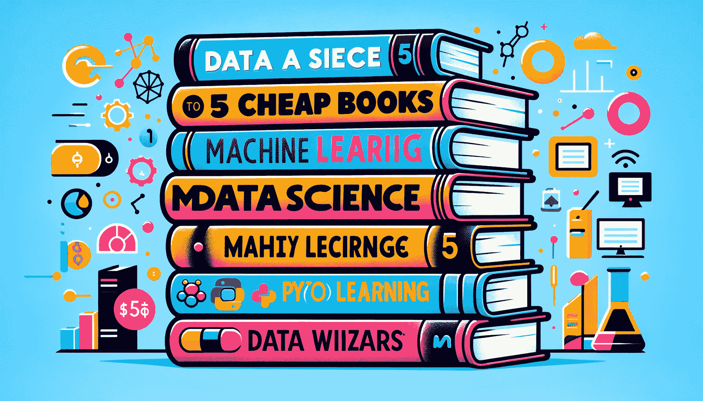

# 5 本便宜的书籍来精通数据科学

> 原文：[`www.kdnuggets.com/5-cheap-books-to-master-data-science`](https://www.kdnuggets.com/5-cheap-books-to-master-data-science)

使用 DALLE-3 生成的图像

数据科学是一个前景广阔的高收入领域。随着 AI 的最新进展，数据科学仍然成为最受欢迎的职业之一并不令人惊讶。然而，我知道这是一个难以突破的领域。

* * *

## 我们的三大课程推荐

 1\. [谷歌网络安全证书](https://www.kdnuggets.com/google-cybersecurity) - 快速进入网络安全职业生涯

 2\. [谷歌数据分析专业证书](https://www.kdnuggets.com/google-data-analytics) - 提升你的数据分析技能

 3\. [谷歌 IT 支持专业证书](https://www.kdnuggets.com/google-itsupport) - 支持组织的 IT 需求

* * *

如果你想进入数据科学领域并了解许多数据方面，那就有很多学习要做。这也意味着我们需要好的学习材料，以免浪费时间。本文将讨论五本便宜的书籍，你可以用来精通数据科学。

这些书籍是什么？让我们深入了解一下。

# 数据科学（麻省理工学院出版社必备知识系列）

要精通这一领域，我们需要深入了解我们希望从事的领域。我们需要理解数据科学，以便为我们的工作带来价值并避免完全找不到工作。

[数据科学](https://www.amazon.com/Data-Science-Press-Essential-Knowledge-ebook/dp/B08BT6M8JR) 书籍，由 John D. Kelleher 和 Brendan Tierney 编写，可能成为你了解整体数据科学行业的第一步。价格为 9 美元，你将从书中学到以下内容：

1.  数据科学历史

1.  数据科学应用

1.  数据科学工具

1.  数据科学应用中的伦理问题

1.  数据科学职业发展

这本书是任何想进入数据科学领域或更好理解数据科学概念的人的绝佳入门书籍。

# Python 数据分析

编程技能已经成为数据科学家的支柱，每家公司都将其列为要求。通常要求是 Python 语言，这是现代数据科学家的编程语言。没有 Python 技能，我们很可能无法正确完成工作。

[Python 数据分析](https://www.amazon.com/Python-Data-Analysis-collection-visualization-ebook/dp/B0859CVGB4/) 书籍，由 Avinash Navlani、Armando Fandango 和 Ivan Idris（作者）编写，将提供有关使用必要的 Python 技能导航数据科学领域的完整学习内容。你将学习到以下内容：

1.  核心 Python 库和数据处理

1.  统计和数学基础

1.  高级数据分析技术

1.  专门的数据分析

1.  使用 Dask 的计算效率

这本书的价格约为$16，相较于其他书籍来说较为便宜。然而，这本书的价值很大。

# 裸统计：剥离数据中的恐惧

尽管数据科学家需要掌握编程语言，但我们也必须理解统计理论。我们的数据分析和机器学习算法是基于统计方法的，我们需要理解基本统计学以了解我们所做的数据活动。

[《裸统计：剥离数据中的恐惧》](https://www.amazon.com/Naked-Statistics-Stripping-Dread-Data/dp/039334777X)由 Charles Wheelan 撰写，以有趣的方式和应用实例拆解了统计学概念。书中包含以下案例：

1.  政治民调案例中的标准误差和置信区间应用。

1.  英国健康问题风险的回归分析。

1.  Netflix 和 Target 在产品推荐中的统计推断应用。

这本书中你仍会学到许多统计概念。以$8 的价格，你很容易理解统计学在数据科学中的重要性。

# 《机器学习算法的搭车指南》

在对数据科学有了基本了解后，我们应该学习机器学习算法。数据科学家的主要工具是机器学习模型，理解每个模型的工作原理以及我们为何使用它们至关重要。

[《机器学习算法的搭车指南》](https://www.amazon.com/Hitchhikers-Guide-Machine-Learning-Algorithms/dp/B0CDNGTG6Z)由 Devin Schumacher、Francis La Bounty Jr. 和 Devanshu Mahapatra 编写，将作为进一步理解机器学习算法的参考。你将从这本书中学习到以下概念：

1.  分类与回归技术

1.  聚类算法

1.  神经网络与深度学习

1.  优化与问题解决算法

1.  集成方法与降维技术

1.  强化学习

每章都是独立的部分，因此我们可以跳到任何感兴趣的章节。以$12 的价格，你可以从理论到实际的机器学习应用中获取大量知识。

# 数据洞察的交付

数据科学不仅仅是编程、机器学习或统计学。它的核心在于从我们拥有的数据中提供价值。因此，任何数据科学家都必须理解如何将我们的技术结果以利益相关者或非技术人员能理解的见解传达出来。

在[《数据洞察的交付》](https://www.amazon.com/dp/B0C9S86T7J)这本书中，Mo Villagran 解释了数据专业人士因为与利益相关者沟通不畅、被营销炒作刺激的非现实期望以及大多数数据产品的未充分利用而难以交付价值。凭借她的经验，她制定了七个步骤，以便我们能够更好地沟通并评估利益相关者的需求。

只需 15 美元，你可以快速学习这些步骤，并通过始终需要的软技能提升自己。

# 结论

数据科学是一个具有挑战性的领域。这就是为什么这五本便宜的书籍将帮助你掌握数据科学。这些书籍包括：

1.  《数据科学》（麻省理工学院出版社核心知识系列）

1.  Python 数据分析

1.  《裸统计：揭示数据中的恐惧》

1.  《机器学习算法指南》

1.  数据洞察力传递

**[Cornellius Yudha Wijaya](https://www.linkedin.com/in/cornellius-yudha-wijaya/)** 是一名数据科学助理经理和数据撰写者。在全职工作于安联印尼期间，他喜欢通过社交媒体和写作分享 Python 和数据技巧。Cornellius 撰写了多种 AI 和机器学习相关的主题。

### 更多相关主题

+   [掌握机器学习的 5 本便宜书籍](https://www.kdnuggets.com/5-cheap-books-to-master-machine-learning)

+   [它活了！用 Python 和一些便宜的基本组件构建你的第一个机器人](https://www.kdnuggets.com/2023/06/manning-build-first-robots-python-cheap-basic-components.html)

+   [掌握 SQL、Python、数据科学、机器学习和自然语言处理的 25 本免费书籍](https://www.kdnuggets.com/25-free-books-to-master-sql-python-data-science-machine-learning-and-natural-language-processing)

+   [掌握数据科学的 5 本免费书籍](https://www.kdnuggets.com/5-free-books-to-master-data-science)

+   [掌握数据科学的 5 本免费书籍](https://www.kdnuggets.com/5-free-books-to-master-statistics-for-data-science)

+   [掌握数据策略的 15 本书](https://www.kdnuggets.com/2022/06/top-15-books-master-data-strategy.html)
