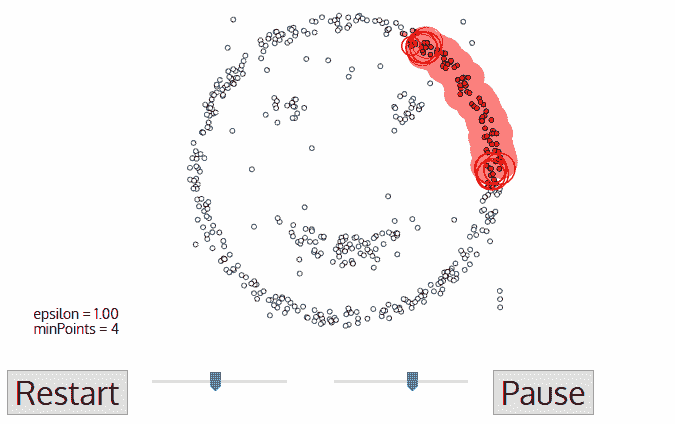
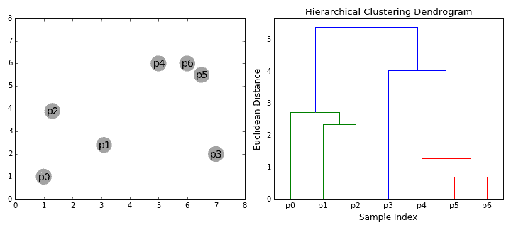

# 数据科学家需要了解的 5 种聚类算法

> 原文：[`www.kdnuggets.com/2018/06/5-clustering-algorithms-data-scientists-need-know.html`](https://www.kdnuggets.com/2018/06/5-clustering-algorithms-data-scientists-need-know.html)

 评论

聚类是一种机器学习技术，它涉及数据点的分组。给定一组数据点，我们可以使用聚类算法将每个数据点分类到一个特定的组中。理论上，处于同一组的数据点应该具有相似的属性和/或特征，而不同组中的数据点应该具有高度不同的属性和/或特征。聚类是一种无监督学习方法，是许多领域中用于统计数据分析的常用技术。

在数据科学中，我们可以通过聚类分析从数据中获得一些有价值的见解，观察数据点应用聚类算法时落入了哪些组。今天，我们将深入探讨数据科学家需要了解的 5 种流行的聚类算法及其优缺点！

* * *

## 我们的前三个课程推荐

 1\. [Google 网络安全证书](https://www.kdnuggets.com/google-cybersecurity) - 快速进入网络安全职业。

 2\. [Google 数据分析专业证书](https://www.kdnuggets.com/google-data-analytics) - 提升你的数据分析能力

 3\. [Google IT 支持专业证书](https://www.kdnuggets.com/google-itsupport) - 支持你的组织 IT

* * *

### **K-Means 聚类**

K-Means 可能是最知名的聚类算法。它在许多入门数据科学和机器学习课程中都有教授。它易于理解和编码实现！请查看下面的图示。

K-Means 聚类

1.  开始时，我们首先选择要使用的类别/组的数量，并随机初始化它们各自的中心点。为了确定使用的类别数量，最好快速查看数据并尝试识别任何明显的分组。中心点是与每个数据点向量长度相同的向量，是上图中的“X”。

1.  每个数据点通过计算该点与每个组中心之间的距离来进行分类，然后将该点分类到离它最近的组中。

1.  基于这些分类点，我们通过取组中所有向量的均值来重新计算组中心。

1.  重复这些步骤直到达到设定的迭代次数或直到组中心在迭代之间变化不大。你也可以选择随机初始化组中心几次，然后选择看起来效果最佳的运行结果。

K-Means 的一个优点是速度相当快，因为我们实际做的只是计算点和组中心之间的距离；计算非常少！因此，它具有线性复杂度 *O*(*n*)。

另一方面，K-Means 有一些缺点。首先，你必须选择有多少个组/类。这并不总是简单的，理想情况下，我们希望聚类算法能为我们解决这个问题，因为它的目的是从数据中获得一些洞察。K-Means 还从随机选择的簇中心开始，因此可能会在算法的不同运行中产生不同的聚类结果。因此，结果可能无法重复且缺乏一致性。其他聚类方法则更具一致性。

K-Medians 是另一种与 K-Means 相关的聚类算法，只不过它不是使用均值来重新计算组中心点，而是使用组的中位数向量。这种方法对离群点的敏感性较低（因为使用了中位数），但对于较大的数据集来说，速度要慢得多，因为在计算中位数向量时每次迭代都需要排序。

### **均值漂移聚类**

均值漂移聚类是一种基于滑动窗口的算法，旨在找到数据点的密集区域。它是一种基于中心点的算法，意味着目标是定位每个组/类的中心点，这通过更新中心点候选为滑动窗口内点的均值来实现。这些候选窗口随后在后处理阶段进行过滤，以消除近似重复项，形成最终的中心点集合及其对应的组。请查看下方的图示。

单个滑动窗口的均值漂移聚类

1.  为了解释均值漂移，我们将考虑二维空间中的一组点，如上图所示。我们从一个以点 C（随机选择）为中心，半径为 r 的圆形滑动窗口开始，作为核。均值漂移是一种爬山算法，涉及在每一步将该核迭代地移动到更高密度区域，直到收敛。

1.  在每次迭代中，滑动窗口被向更高密度的区域移动，通过将中心点移到窗口内点的均值（因此得名）。滑动窗口内的密度与其中的点数成正比。自然地，通过向窗口中点的均值移动，它将逐渐朝着点密度更高的区域移动。

1.  我们继续根据均值移动滑动窗口，直到没有方向可以使得更多点进入核。请查看上面的图示；我们继续移动圆圈，直到我们不再增加密度（即窗口中的点数）。

1.  步骤 1 到步骤 3 的过程会用许多滑动窗口完成，直到所有点都在一个窗口内。当多个滑动窗口重叠时，会保留包含最多点的窗口。然后根据点所在的滑动窗口进行聚类。

下方展示了整个过程的插图，包含所有滑动窗口。每个黑点表示一个滑动窗口的质心，每个灰点是一个数据点。

Mean-Shift 聚类的整个过程

与 K-means 聚类相比，无需选择聚类的数量，因为均值漂移会自动发现这一点。这是一个巨大的优势。聚类中心收敛到最大密度点的事实也相当理想，因为它直观易懂，并且很好地符合自然数据驱动的感觉。缺点是窗口大小/半径“r”的选择可能并不简单。

### **基于密度的空间聚类应用与噪声（DBSCAN）**

DBSCAN 是一种基于密度的聚类算法，类似于均值漂移，但具有一些显著的优势。查看下面的另一个炫酷图形，我们开始吧！

DBSCAN 微笑面孔聚类

1.  DBSCAN 从一个未被访问的任意起始数据点开始。通过距离 ε (所有在 ε 距离内的点都是邻域点) 提取该点的邻域。

1.  如果在这个邻域内有足够数量的点（根据 minPoints），则开始聚类过程，当前数据点成为新聚类中的第一个点。否则，该点会被标记为噪声（以后这个噪声点可能会成为聚类的一部分）。在这两种情况下，该点都会被标记为“已访问”。

1.  对于新聚类中的第一个点，距离其 ε 距离邻域内的点也会成为相同的聚类的一部分。这个将 ε 邻域内的所有点归入相同聚类的过程会对刚刚添加到聚类组中的所有新点重复进行。

1.  步骤 2 和步骤 3 的过程会重复进行，直到确定聚类中的所有点，即所有在聚类的 ε 邻域内的点都已被访问和标记。

1.  一旦完成当前的聚类，就会检索并处理一个新的未访问点，从而发现进一步的聚类或噪声。这个过程会重复进行，直到所有点都被标记为已访问。由于最终所有点都已被访问，因此每个点都会被标记为属于某个聚类或是噪声。

DBSCAN 相较于其他聚类算法有一些很好的优势。首先，它根本不需要预设的聚类数量。它还将离群点识别为噪声，这与均值漂移不同，均值漂移即使数据点非常不同也会将它们放入聚类中。此外，它能够很好地找到任意大小和任意形状的聚类。

DBSCAN 的主要缺点是当聚类的密度变化时，它的表现不如其他方法。这是因为用于识别邻域点的距离阈值ε和 minPoints 的设置会随着聚类密度的变化而变化。这个缺点也出现在非常高维的数据中，因为距离阈值ε的估计变得具有挑战性。

### **期望最大化（EM）使用高斯混合模型（GMM）的聚类**

K 均值的一个主要缺点是它对聚类中心的均值值的简单使用。通过查看下图，我们可以看到为什么这不是最好的方法。在左侧，人眼很明显地看到有两个不同半径的圆形聚类，以相同的均值为中心。K 均值无法处理这种情况，因为聚类的均值非常接近。K 均值在聚类不是圆形的情况下也会失败，这又是因为使用均值作为聚类中心。

K 均值的两个失败案例

高斯混合模型（GMMs）比 K 均值提供了更多的灵活性。使用 GMM 时，我们假设数据点是高斯分布的；这一假设比使用均值假设数据点为圆形要不那么严格。因此，我们有两个参数来描述聚类的形状：均值和标准差！以二维为例，这意味着聚类可以采取任何形状的椭圆（因为我们在 x 和 y 方向都有标准差）。因此，每个高斯分布被分配到一个单独的聚类中。

为了找到每个聚类的高斯参数（如均值和标准差），我们将使用一种称为期望最大化（EM）的优化算法。请查看下面的图形，以说明高斯如何适应聚类。然后，我们可以继续进行使用 GMM 的期望最大化聚类过程。

使用 GMM 的 EM 聚类

1.  我们首先选择聚类的数量（像 K 均值那样）并随机初始化每个聚类的高斯分布参数。可以通过快速查看数据来尝试提供一个好的初始参数估计。尽管要注意，如上图所示，这并不是 100%必要，因为高斯初始时很差，但会很快得到优化。

1.  给定每个簇的高斯分布，计算每个数据点属于特定簇的概率。一个点离高斯中心越近，它属于该簇的可能性就越大。这应该是直观的，因为在高斯分布中，我们假设大多数数据点更靠近簇的中心。

1.  基于这些概率，我们计算高斯分布的新参数集，以最大化簇内数据点的概率。我们使用数据点位置的加权和来计算这些新参数，其中权重是数据点属于特定簇的概率。为了直观地解释这一点，我们可以查看上面的图形，特别是黄色簇作为例子。分布在第一次迭代时是随机的，但我们可以看到大多数黄色点位于该分布的右侧。当我们计算加权和时，即使有些点靠近中心，大多数点还是在右侧。因此，分布的均值自然会向这些点的集合移动。我们还可以看到大多数点的分布是“从左上到右下”。因此，标准差发生变化，形成一个更适合这些点的椭圆，以最大化加权和。

1.  第 2 步和第 3 步会反复进行，直到收敛为止，此时分布在每次迭代中变化不大。

使用 GMM 有两个主要优势。首先，GMM 在**簇协方差**方面比 K-Means 更加**灵活**；由于标准差参数，簇可以呈现任何椭圆形状，而不是局限于圆形。K-Means 实际上是 GMM 的一个特例，其中每个簇在所有维度上的协方差接近 0。其次，由于 GMM 使用概率，它们可以为每个数据点提供多个簇。因此，如果一个数据点位于两个重叠簇的中间，我们可以简单地定义它的类别，表示它属于类别 1 的概率是 X%，属于类别 2 的概率是 Y%。即 GMM 支持**混合** **成员资格**。

### **聚合层次聚类**

层次聚类算法实际上分为两类：自上而下和自下而上。自下而上的算法在开始时将每个数据点视为一个单独的簇，然后逐步合并（或*聚合*）簇对，直到所有簇合并为一个包含所有数据点的单一簇。因此，自下而上的层次聚类被称为*层次聚合聚类*或*HAC*。这种簇的层次结构表示为一棵树（或树状图）。树的根是一个唯一的簇，汇集了所有样本，叶子是仅包含一个样本的簇。请查看下面的图示，然后再继续算法步骤。

聚合层次聚类

1.  我们开始时将每个数据点视为一个单独的簇，即如果数据集中有 X 个数据点，那么我们就有 X 个簇。然后，我们选择一种度量簇间距离的距离度量。例如，我们将使用*平均连接*，它定义了两个簇之间的距离为第一个簇中的数据点和第二个簇中的数据点之间的平均距离。

1.  在每次迭代中，我们将两个簇合并为一个。被合并的两个簇是选择那些具有最小平均连接的簇。即根据我们选择的距离度量，这两个簇之间的距离最小，因此它们是最相似的，应该被合并。

1.  步骤 2 重复进行，直到我们到达树的根部，即我们只剩下一个包含所有数据点的簇。通过这种方式，我们可以选择最终需要多少个簇，只需选择何时停止合并簇，即何时停止构建树！

层次聚类不需要我们指定簇的数量，我们甚至可以选择哪个簇的数量看起来最好，因为我们在构建树。此外，该算法对距离度量的选择不敏感；所有度量通常效果相同，而其他聚类算法中，距离度量的选择至关重要。层次聚类方法的一个特别好的用例是，当基础数据具有层次结构时，你希望恢复这种层次结构；其他聚类算法无法做到这一点。这些层次聚类的优点是以较低效率为代价的，因为它的时间复杂度为*O(n³)*，不同于 K-Means 和 GMM 的线性复杂度。

### **结论**

这就是数据科学家应知道的前五种聚类算法！我们将以一个精彩的可视化结束，展示这些算法以及其他一些算法的表现，感谢 Scikit Learn！

**简介： [George Seif](https://towardsdatascience.com/@george.seif94)** 是一名认证的极客和人工智能 / 机器学习工程师。

[原文](https://towardsdatascience.com/the-5-clustering-algorithms-data-scientists-need-to-know-a36d136ef68)。经许可转载。

**相关：**

+   比较聚类技术：简明技术概述

+   必知：如何确定最有用的簇数量？

+   通过朴素分片质心初始化方法提高 k-means 聚类效率

### 更多相关内容

+   [成为优秀数据科学家所需的 5 项关键技能](https://www.kdnuggets.com/2021/12/5-key-skills-needed-become-great-data-scientist.html)

+   [每个初学者数据科学家应该掌握的 6 种预测模型](https://www.kdnuggets.com/2021/12/6-predictive-models-every-beginner-data-scientist-master.html)

+   [2021 年最佳 ETL 工具](https://www.kdnuggets.com/2021/12/mozart-best-etl-tools-2021.html)

+   [每个数据科学家都应该知道的三个 R 库（即使你使用 Python）](https://www.kdnuggets.com/2021/12/three-r-libraries-every-data-scientist-know-even-python.html)

+   [解放聚类：理解 K-Means 聚类](https://www.kdnuggets.com/2023/07/clustering-unleashed-understanding-kmeans-clustering.html)

+   [停止学习数据科学以寻找目标，找到目标再……](https://www.kdnuggets.com/2021/12/stop-learning-data-science-find-purpose.html)
