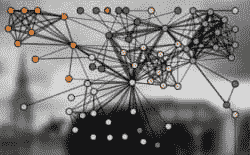
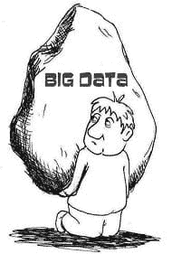

# 5 个标准来确定你的数据是否准备好进行严肃的数据科学

> 原文：[`www.kdnuggets.com/2015/12/5-criteria-data-ready-data-science.html`](https://www.kdnuggets.com/2015/12/5-criteria-data-ready-data-science.html)

 评论

数据科学是一种花哨的说法，用来描述用数字和名字回答问题。你可以从视频、测量、录音或文本开始，但当数据科学家开始工作时，它们都已经被转化为数字和名字的形式。数据科学能够做的所有强大功能最终都归结于此。从照片中估计某人的年龄。推荐你可能喜欢的电影。识别使用你信用卡的怪人。这些都始于一个问题和一些数字与名字。

但不仅仅是任何问题或任何数据集能够得到你想要的结果。在数据科学能够构建解决方案以简化你的生活或为你赚取大量资金之前，你必须提供一些高质量的原材料。就像做披萨一样，起始原料越好，最终产品越好。你会知道你准备好了，当：

### 1\. 你的问题很明确

在选择你的数据科学问题时，想象你在接近一个可以告诉你宇宙中任何事物的神谕，只要答案是一个数字或一个名字。但它是一个顽皮的神谕，它的回答将尽可能含糊和混乱。你希望用一个密不透风的问题来逼它告诉你你想知道的内容。糟糕的问题例子包括“我的数据能告诉我关于我的业务什么？”、“我该怎么办？”或“我如何提高我的利润？”这些问题留下了大量模糊的空间，可能会得到无用的答案。相比之下，像“在第三季度，我会在蒙特利尔卖出多少个 Q 型小玩意儿？”或“我的车队中哪辆车最有可能先坏？”这样的问题，其答案则不可避免。

### 2\. 你的数据衡量你关心的内容

一旦你有了问题，确保你的数据相关性很重要。如果你想回答“哪些客户最有可能离开我去找竞争对手？”的问题，你需要有关哪些客户过去已经转向竞争对手的信息。此外，你还需要有关导致他们离开的因素的信息。如果你只有他们的出生日期和鞋码，你很可能无法找到离开的客户的模式。但如果你有相关数据，比如他们的购买历史和对客户满意度调查的回应，那么你就有了更好的机会。

### 3\. 你的数据是准确的

数据科学中最大的误区是认为可以通过拥有大量数据来弥补糟糕的数据。在这个虚拟的世界里，数字是否缺少小数、传感器是否故障、名字是否输入错误都无所谓。数据的庞大量神秘地弥补了这些问题。确实，像拼写检查这样的专业工具可以自动纠正一些错误。确实，尽管仔细记录的数据中不可避免地存在噪音，但有时可以去除或绕过这些噪音。但是，由粗心和忽视引入的错误是无法自动修复的。它们污染了数据集，使得寻找模式变得更加困难。通常，少量精心收集的数据对数据科学家来说比大量粗心收集的数据更有价值。

### 4\. 你的数据是关联的

将一个州的司机年龄与另一个州司机的事故率进行比较，并不能说明司机年龄与事故率之间的关系。为此，你需要查看*同一组*司机的年龄和事故率。如果数据点不一致，再准确、相关的数据也无济于事。这也被称为缺失值问题。这就像是你的司机通过填写表单来提供信息，但一半人留下了年龄字段为空，另一半人没有告诉你他们的事故历史。一些缺失值是正常且几乎不可避免的。缺失值过多会让你的数据采集像瑞士奶酪一样，严重影响其有效性。

### 5\. 你有大量数据

就像许多事情一样，数据质量比数量更重要。但数量也很重要。一个小而高质量的数据集比一个噪声极大的庞大数据集更有价值。但一个大而高质量的数据集可以做得比它们更好。更多的数据通常更好，因为它可以让你看到更多细节，提出更具体的问题，并对发现结果有更大的信心。不要因为已经有了数百万个数据点或填满了一个一 TB 的硬盘就假设你有足够的数据。只要不降低相关性、准确性或完整性，更多的数据总是更好。

如果你覆盖了这五点–

> **一个大规模的、相关的、准确的、完整的数据集** 和 **一个清晰的问题**

– 那么恭喜你。你准备好进行一些高级的数据科学工作了。如果你在几个方面有不足之处，也不用担心。这只是意味着你正在现实世界中工作。

这可能需要一些细致的工作。你仍然可能获得所需的信息。但如果这些陈述只有一两个是真的，那么你需要做更多的准备工作。收集更多的数据，明确你的问题，整理数据，移除最嘈杂的数据点——无论你能做什么来提升原材料的质量。如果你直接处理这些数据，任何得到的答案都可能会受到高度怀疑。

本系列的接下来的两个部分将涵盖数据科学可以回答的各种问题及其适用的算法家族，并提供大量示例。敬请关注。

**个人简介：[Brandon Rohrer](https://www.linkedin.com/in/brohrer)**，[ @_brohrer_](https://twitter.com/_brohrer_)，是微软的高级数据科学家。他的工作地点在美国马萨诸塞州波士顿。

[原文](https://www.linkedin.com/pulse/what-can-data-science-do-me-brandon-rohrer)

**相关：**

+   在你准备好数据科学之前，停止招聘数据科学家

+   Michael Li，Data Incubator 论数据驱动的招聘策略

+   如何成为数据科学家并找到工作

### 相关主题更多

+   [如何使用 Python 确定最佳拟合数据分布](https://www.kdnuggets.com/2021/09/determine-best-fitting-data-distribution-python.html)

+   [数据中心人工智能：这是真的吗？适合所有人吗？我们准备好了吗？](https://www.kdnuggets.com/2022/03/data-centric-ai-real-everyone-ready.html)

+   [具有开发者准备软件栈的设备端 AI](https://www.kdnuggets.com/2022/03/qualcomm-ondevice-ai-developer-ready-software-stacks.html)

+   [MLOps 心态：始终准备好投入生产](https://www.kdnuggets.com/2023/07/mlops-mindset-always-productionready.html)

+   [30 天内获得就业准备的 4 个认证](https://www.kdnuggets.com/4-certifications-to-become-job-ready-in-30-days)

+   [最佳文本分类任务架构：基准测试…](https://www.kdnuggets.com/2023/04/best-architecture-text-classification-task-benchmarking-options.html)
