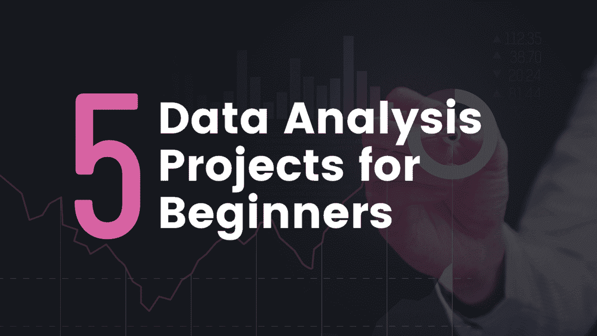
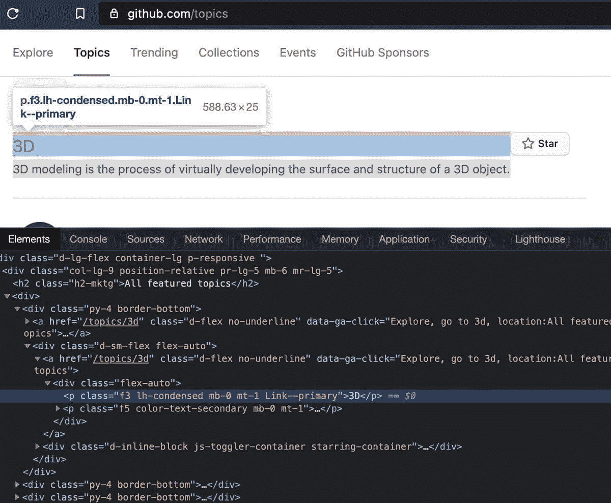
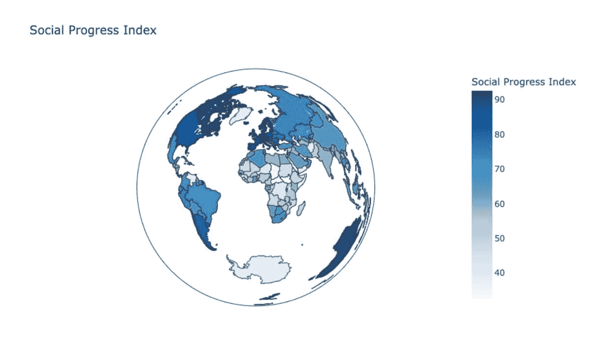
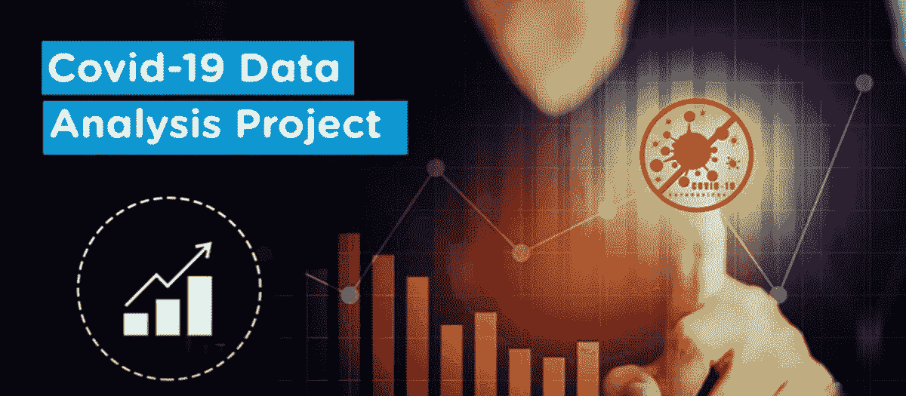
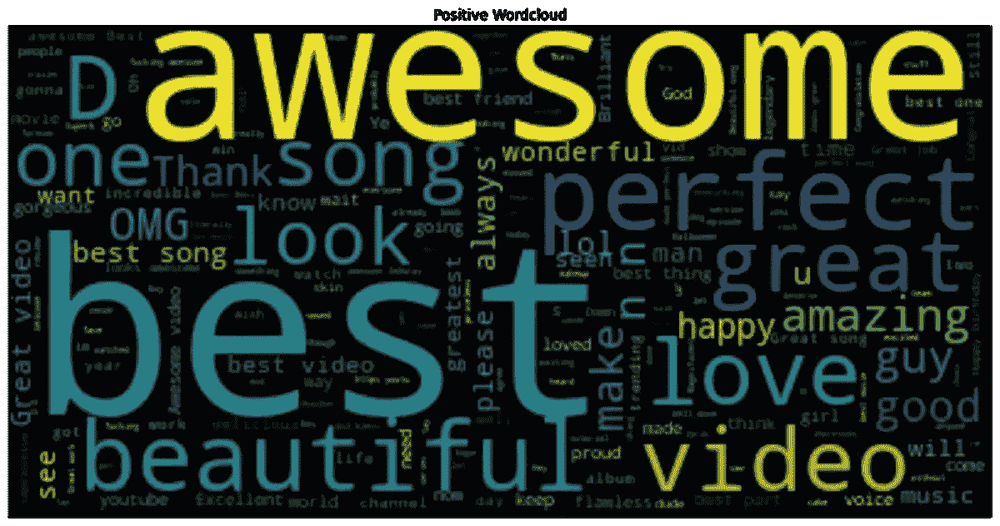

# 适合初学者的 5 个数据分析项目

> 原文：[`www.kdnuggets.com/2023/02/5-data-analysis-projects-beginners.html`](https://www.kdnuggets.com/2023/02/5-data-analysis-projects-beginners.html)

作者提供的图片

# 介绍

* * *

## 我们的前三个课程推荐

 1\. [谷歌网络安全证书](https://www.kdnuggets.com/google-cybersecurity) - 快速进入网络安全职业道路。

 2\. [谷歌数据分析专业证书](https://www.kdnuggets.com/google-data-analytics) - 提升你的数据分析技能

 3\. [谷歌 IT 支持专业证书](https://www.kdnuggets.com/google-itsupport) - 支持你的组织的 IT 需求

* * *

你是否期待开始你的数据分析师职业生涯，但职位列表要求经验？完全不用担心！你来对地方了。通过构建你的项目将展示你的技能，帮助你找到第一份工作。我将指导你选择适合初学者的数据分析项目，这些项目将说服招聘经理你是这个职位的合适人选。虽然随机选择项目可能会提高你的技能，但请记住这是一个竞争激烈的市场，你必须脱颖而出。你的作品集项目必须展示你收集、清理、分析和以视觉上吸引人的方式呈现数据的能力。

不再拖延，我们来深入探讨这 5 个项目，帮助你开启职业生涯：

# 1\. 在 GitHub 上抓取热门话题的顶级仓库

项目图片

尽管有很多公共数据集可以自由使用，但作为数据分析师，你必须知道如何从网站上抓取更相关的数据以满足特定的使用场景。网络抓取就是以自动化的方式提取数据。

在这个项目中，你将为每个 GitHub 话题创建一个单独的 CSV 文件。每个 CSV 文件包含该话题下的前 25 个仓库，并附有一些额外的信息，如用户名、星标数量以及仓库的 URL。这是一个非常适合初学者的项目，可以添加到你的简历中，由 Jovian（数据科学和机器学习社区平台）首席执行官 Aakash N S 教授。该项目还附带了一个视频教程，链接已提供以供参考。

项目链接：[在 GitHub 上抓取热门话题的顶级仓库](https://jovian.com/aakashns-6l3/scraping-github-topics-repositories)

视频教程：[从头开始构建一个 Python 网络抓取项目](https://www.youtube.com/live/RKsLLG-bzEY?feature=share)

# 2\. 社会进步指数分析

项目中的图片

社会进步指数是衡量一个国家关心其公民发展的程度的指标。在这个项目中，一些主要因素如基本人类需求、福祉、机会、健康、安全、住房等被用来预测 SPI 分数。完成此项目将使你能够对其他每年发布的全球报告进行类似分析。此外，这些见解对于衡量一个国家在可持续性和发展目标方面的进展是非常有帮助的。

项目链接：[社会进步指数分析](https://thecleverprogrammer.com/2022/12/26/social-progress-index-analysis-using-python/)

# 3\. Covid-19 数据分析项目

项目中的图片

此类项目展示了你分析、解释和可视化真实世界数据的能力。在这个使用 Python 和 Tableau 的 Covid-19 数据分析视频项目中，你将学习如何使用 Python 进行探索性数据分析，并了解如何在 Tableau 中构建 Covid-19 仪表盘。你将了解 Covid-19 在印度的影响以及疫苗接种状态。使用 Tableau，你将创建关于全球病例、死亡和康复的图表。

项目链接：[Covid-19 数据分析项目](https://youtu.be/DJofs2JyIVM)

# 4\. YouTube 情感、词云和表情符号分析

项目中的图片

近年来，文本数据增长迅速，使用词云是可视化和紧凑展示这些大量信息的绝佳方式。在这个项目中，你将通过分析 YouTube 视频的观众反应和评论来学习情感分析。

项目链接：[YouTube 情感、词云和表情符号分析](https://blog.devgenius.io/text-data-analysis-youtube-sentiment-wordcloud-and-emojis-analysis-c65657bfa2b8)

# 5\. HR 分析初学者项目

项目中的图片

这是一个很棒的端到端项目，你可以将其添加到简历中，并且适合初学者。你将利用 Power BI 解决 HR 领域的实时问题。你将学习如何使用 Power Query 收集和转换数据，使用 DAX 创建指标以及创建仪表盘等。欲了解更多详细信息，请点击下面的链接查看完整播放列表：

项目链接：[HR 分析初学者项目](https://youtube.com/playlist?list=PLeo1K3hjS3uuVQccZa7yFwK3ltoGQOWbM)

# 结论

完成这五个令人惊叹的项目将为你作为初学者建立坚实的基础，但这可能无法保证你找到工作。因此，你必须继续构建项目以磨练你的技能。我相信，借助互联网上丰富的开源数据集，你将永远不会缺少练习技能的机会。请在评论区告知我你对上述项目的看法。

**[Kanwal Mehreen](https://www.linkedin.com/in/kanwal-mehreen1)** 是一位有志的软件开发者，对数据科学及人工智能在医学中的应用充满热情。Kanwal 被选为 2022 年 APAC 地区的 Google Generation Scholar。Kanwal 喜欢通过撰写关于热门话题的文章来分享技术知识，并热衷于改善女性在科技行业中的代表性。

### 更多相关主题

+   [适合初学者的 7 个 Python 项目](https://www.kdnuggets.com/2022/11/7-python-projects-beginners.html)

+   [KDnuggets 新闻，6 月 29 日：数据科学的 20 个基础 Linux 命令…](https://www.kdnuggets.com/2022/n26.html)

+   [适合数据科学初学者的 20 个基础 Linux 命令](https://www.kdnuggets.com/2022/06/20-basic-linux-commands-data-science-beginners.html)

+   [KDnuggets 新闻，10 月 5 日：适合初学者的顶级免费 Git GUI 客户端 •…](https://www.kdnuggets.com/2022/n39.html)

+   [适合初学者的 19 个数据科学项目创意](https://www.kdnuggets.com/2021/11/19-data-science-project-ideas-beginners.html)

+   [适合初学者的 Snowflake 数据仓库](https://www.kdnuggets.com/2022/02/data-warehousing-snowflake-beginners.html)
