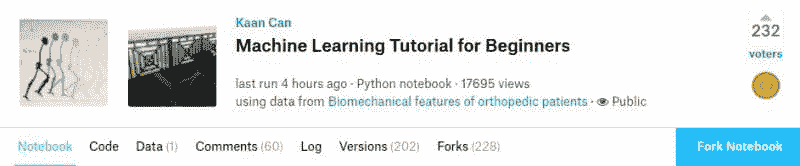
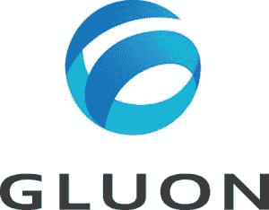
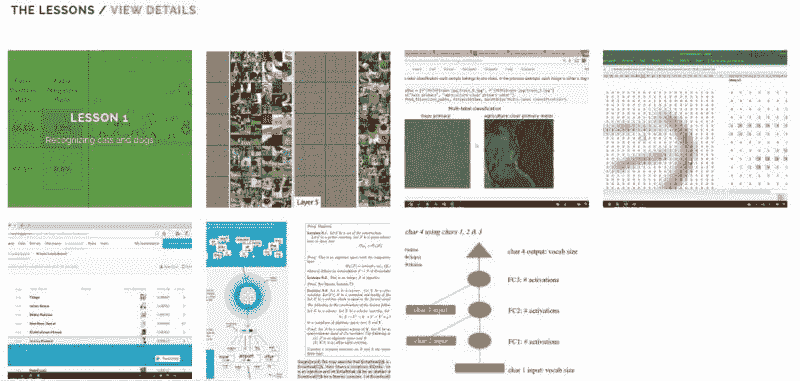

# 5 个绝佳的实际机器学习资源

> 原文：[`www.kdnuggets.com/2018/02/5-fantastic-practical-machine-learning-resources.html`](https://www.kdnuggets.com/2018/02/5-fantastic-practical-machine-learning-resources.html)

 评论

想要开始学习机器学习吗？

由于许多好的理由，大部分高质量的机器学习教育资源往往非常注重理论，特别是在开始阶段。然而，似乎有越来越多的趋势从一开始就进入实践，并在资源进展过程中混合实践和理论。本文介绍了 5 个这样的资源。

* * *

## 我们的三大课程推荐

 1\. [谷歌网络安全证书](https://www.kdnuggets.com/google-cybersecurity) - 快速进入网络安全职业的快车道。

 2\. [谷歌数据分析专业证书](https://www.kdnuggets.com/google-data-analytics) - 提升你的数据分析技能

 3\. [谷歌 IT 支持专业证书](https://www.kdnuggets.com/google-itsupport) - 支持你的组织的 IT

* * *

这些资源涵盖了从基础知识到从零开始编码算法以及使用特定深度学习框架的内容，范围相当广泛。它们都是免费的，所以快去阅读、观看和编码吧。

**1\. [初学者机器学习教程](https://www.kaggle.com/kanncaa1/machine-learning-tutorial-for-beginners)**

由 Kaggler Kaan Can 提供的第一个资源从基础开始。

> 在这个教程中，我不会教你机器学习，而是讲解如何自己学习东西。

这个教程直接切入重点，快速实现 Python 库中的机器学习算法。它还涵盖了一些使用 Pandas 的数据清洗和处理，以及一些库的数据可视化，然后再进行建模。

**2\. [Python 机器学习（第 2 版）代码库](https://github.com/rasbt/python-machine-learning-book-2nd-edition)**

这是 Sebastian Raschka 和 Vahid Mirjalili 的精彩书籍“[Python 机器学习（第 2 版）](https://www.amazon.com/Python-Machine-Learning-scikit-learn-TensorFlow/dp/1787125939)”的代码库。

不过请注意：

> 请注意，这些仅仅是配合书籍的代码示例，为了方便你，我上传了这些示例；请留意，没有公式和描述性文字，这些笔记本可能没什么用。

尽管如此，当这段代码与[本书的第一版](https://github.com/rasbt/python-machine-learning-book)中的类似材料配合使用时，仍然是一套有用的资源。

我有没有提到这是我绝对最喜欢的实用机器学习书籍？因为确实是。

**3\. [从头开始的机器学习](https://github.com/eriklindernoren/ML-From-Scratch)**

从使用现有库转向实现机器学习模型，这个 Github 仓库包含了一些从头开始实现的机器学习算法的 Python 实现（因此得名）。虽然不是工业级别，且缺乏像 Scikit-learn 这样经过打磨的库的连贯性、优化和便利性，但这些实现易于跟随，旨在作为实现自己算法或更好理解它们功能的学习材料。

> 从头开始实现一些基础的机器学习模型和算法的 Python 实现。
> 
> 这个项目的目的不是为了生成尽可能优化和计算效率高的算法，而是以透明和易于理解的方式呈现它们的内部工作。

**4\. [深度学习 - 直截了当](http://gluon.mxnet.io/)**

*“一本关于深度学习的互动书籍。非常简单，所以是 MXNet。哇。”*

这本在线书籍做了两件事：一是介绍机器学习基础和深度学习理论，二是通过大量的代码让读者实现这些思想。具体来说，这本书的代码是用 Python 编写的，并使用了 MXNet 库及其高级 Gluon API。

> 这个仓库包含一系列增量笔记本，旨在教授深度学习、Apache MXNet（孵化中）和 gluon 接口。我们的目标是利用 Jupyter 笔记本的优势，将文本、图形、公式和代码汇集在一个地方。如果我们成功了，结果将是一个同时作为书籍、课程材料、现场教程的道具以及一个可以在我们许可下“借鉴”有用代码的资源。

你也可以感到一些安慰，因为它是由一些著名的机器学习人士编写的。快去看看吧。

**5\. [fast.ai 实用深度学习编程者教程，第一部分（2018 版）](http://course.fast.ai/)**

fast.ai 最初大约在一年半前发布了这门实用深度学习 MOOC，现已重新发布。最显著的变化是这次 MOOC 使用了 PyTorch 和他们自己开发的 fast.ai 高级深度学习框架。

> 了解如何构建最先进的模型，无需研究生级别的数学——但也不会降低任何难度。哦，还有一件事……完全免费！而且有一个由成千上万的其他学习者组成的社区，随时准备帮助你完成学习之旅——如果你需要任何帮助，或者只是想和其他深度学习学习者聊聊，直接访问 forums.fast.ai。

**相关：**

+   Andrew Ng 的深度学习专精 - 21 个学习心得

+   Andrew Ng 的计算机视觉 - 11 个学习心得

+   15 分钟指南：选择有效的机器学习和数据科学课程

### 了解更多相关话题

+   [成为出色数据科学家所需的 5 项关键技能](https://www.kdnuggets.com/2021/12/5-key-skills-needed-become-great-data-scientist.html)

+   [每位初学者数据科学家应掌握的 6 种预测模型](https://www.kdnuggets.com/2021/12/6-predictive-models-every-beginner-data-scientist-master.html)

+   [2021 年最佳 ETL 工具](https://www.kdnuggets.com/2021/12/mozart-best-etl-tools-2021.html)

+   [学习数据科学统计的最佳资源](https://www.kdnuggets.com/2021/12/springboard-top-resources-learn-data-science-statistics.html)

+   [停止学习数据科学以寻找目标，并寻找目标来……](https://www.kdnuggets.com/2021/12/stop-learning-data-science-find-purpose.html)

+   [建立一个坚实的数据团队](https://www.kdnuggets.com/2021/12/build-solid-data-team.html)
