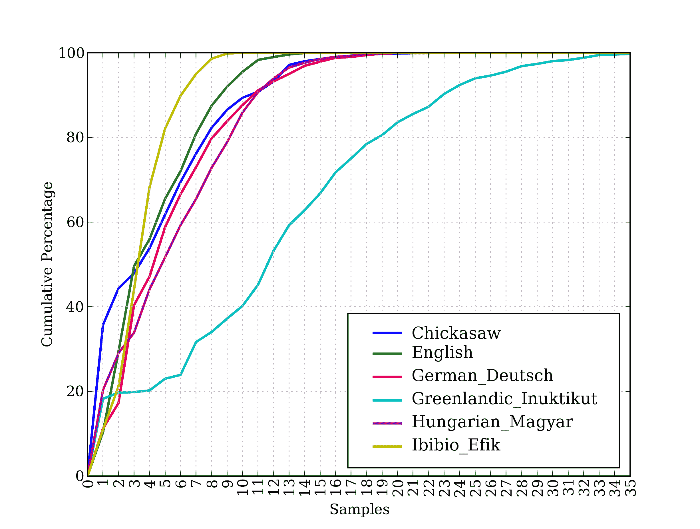
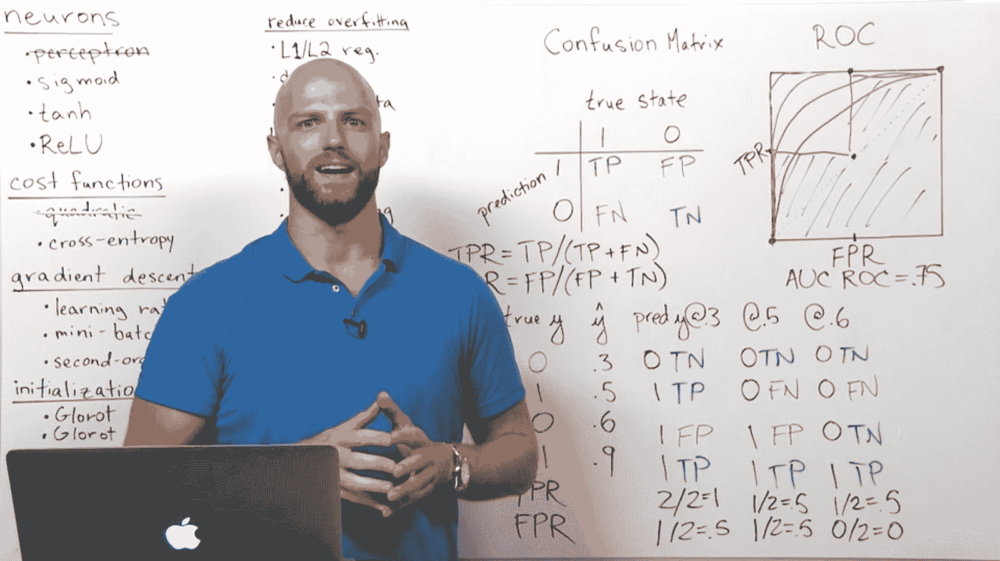
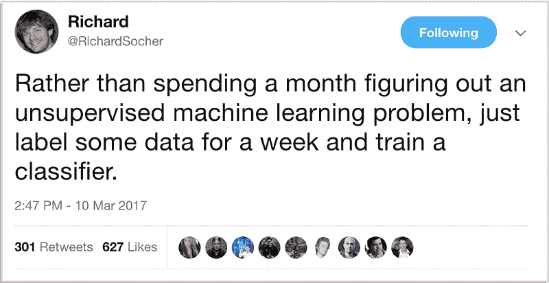
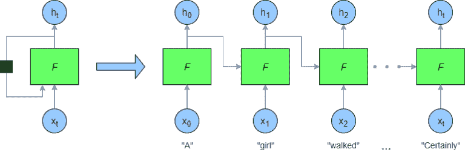
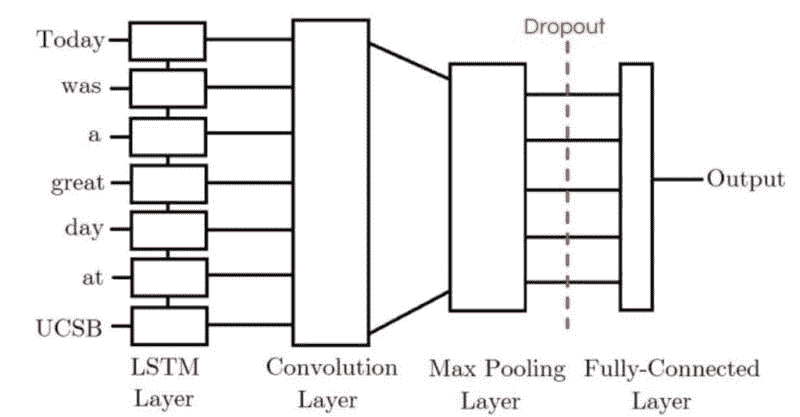

# 5 个极好的实际自然语言处理资源

> 原文：[`www.kdnuggets.com/2018/02/5-fantastic-practical-natural-language-processing-resources.html`](https://www.kdnuggets.com/2018/02/5-fantastic-practical-natural-language-processing-resources.html)

 评论

你对一些实际的自然语言处理资源感兴趣吗？

在线有很多 NLP 资源，尤其是那些依赖于深度学习的方法，筛选出优质资源可能是一项艰巨的任务。这里有一些知名的、顶级的理论性资源，尤其是斯坦福和牛津的深度学习课程：

+   [自然语言处理中的深度学习（斯坦福）](http://web.stanford.edu/class/cs224n/)

+   [自然语言处理中的深度学习（牛津）](https://www.cs.ox.ac.uk/teaching/courses/2016-2017/dl/)

* * *

## 我们的前三名课程推荐

 1\. [谷歌网络安全证书](https://www.kdnuggets.com/google-cybersecurity) - 快速进入网络安全职业。

 2\. [谷歌数据分析专业证书](https://www.kdnuggets.com/google-data-analytics) - 提升你的数据分析技能

 3\. [谷歌 IT 支持专业证书](https://www.kdnuggets.com/google-itsupport) - 支持你的组织的 IT

* * *

但如果你已经完成了这些，已经建立了 NLP 基础，想要转向一些实际资源，或者对其他方法感兴趣（这些方法可能不依赖于神经网络），这篇文章（希望）会对你有帮助。

**1\. [用 Python 进行自然语言处理 – 使用自然语言工具包分析文本](http://www.nltk.org/book/)**

这是**最**基础的自然语言处理书籍，至少从实用性和 Python 生态系统的双重视角来看。

> 这本书提供了对 NLP 领域的高度可读的介绍。它可以用于个人学习，也可以作为自然语言处理或计算语言学课程的教材，或作为人工智能、文本挖掘或语料库语言学课程的补充材料。

正如标题所示，这本书通过使用自然语言工具包（NLTK）来处理 NLP，你可能已经听说过，或者需要立即开始学习。

> NLTK 包括大量的软件、数据和文档，所有这些都可以从 [`nltk.org/`](http://nltk.org/) 免费下载。我们为 Windows、Macintosh 和 Unix 平台提供了分发版本。我们强烈建议你下载 Python 和 NLTK，尝试其中的示例和练习。

这本书的最佳部分在于直接切入主题；没有废话，只有大量的代码和概念。

**2\. [自然语言处理的深度学习：Jupyter 笔记本教程](https://insights.untapt.com/deep-learning-for-natural-language-processing-tutorials-with-jupyter-notebooks-ad67f336ce3f)**

这是与 Jon Krohn 的深度学习 NLP 视频系列配套的 Jupyter 笔记本库。这些笔记本直接从他的视频演示中提取，因此内容几乎没有遗漏。小贴士：如果你有兴趣观看他的视频——这些视频通过 O'Reilly 的 Safari 平台提供——可以注册免费的 10 天试用，并在到期前观看几小时的视频。

这是 Jon 在这些笔记本和配套视频中覆盖内容的概述：

> 如果你想学习如何：
> 
> +   为机器学习应用预处理自然语言数据；
> +   
> +   将自然语言转换为数值表示（使用 word2vec）；
> +   
> +   使用训练好的深度学习模型进行预测；
> +   
> +   使用 Keras（高层次的 TensorFlow API）应用高级 NLP 方法；或者
> +   
> +   通过调整超参数来提高深度学习模型的性能。

笔记本、视频以及你自己环境的结合，是打发漫长下午的好方法。

**3\. [如何解决 90%的 NLP 问题：逐步指南](https://blog.insightdatascience.com/how-to-solve-90-of-nlp-problems-a-step-by-step-guide-fda605278e4e)**

这是另一套很棒的笔记本教程，风格上类似于上面的 Krohn。

Insight AI 的 Emmanuel Ameisen 拆解了完成各项任务所需的步骤，但他的总结文章真正出色地将课程内容结合起来，并提供了一些很好的可视化效果。

> 阅读本文后，你将知道如何：
> 
> +   收集、准备和检查数据
> +   
> +   从构建简单模型开始，如有必要过渡到深度学习
> +   
> +   解释和理解你的模型，确保你实际上在捕获信息而不是噪声
> +   
> 我们编写了这篇文章作为逐步指南；它也可以作为非常有效的标准方法的高级概述

**4\. [Keras LSTM 教程 – 如何轻松构建强大的深度学习语言模型](http://adventuresinmachinelearning.com/keras-lstm-tutorial/)**

这个教程比之前的资源更为专注，因为它涉及在 Keras 中实现 LSTM 用于语言建模。就是这样。但它详细地进行了说明，包括解释、代码和视觉展示，并且传达了重点。与其他资源相比，它所需的时间更少，你可以在几个小时内完成从头到尾的学习，包括自己复现代码。

> 在这个教程中，我将重点介绍如何在 Keras 中创建 LSTM 网络，简要回顾或概述 LSTM 的工作原理。在这个 Keras LSTM 教程中，我们将利用一个名为 PTB 语料库的大型文本数据集来实现一个序列到序列的文本预测模型。

**5\. [结合 LSTM-CNN 模型的 Twitter 情感分析](http://konukoii.com/blog/2018/02/19/twitter-sentiment-analysis-using-combined-lstm-cnn-models/)**

我故意寻找了一个新的情感分析资源来包含在其中，原因是：人们向我询问优质情感分析资源的请求比其他任何东西都要多。

这个较短的教程帖子 -- 这是一个[论文](https://www.academia.edu/35947062/Twitter_Sentiment_Analysis_using_combined_LSTM-CNN_Models)的概述，包含[代码在此](https://github.com/pmsosa/CS291K) -- 使用了结合 LSTM/CNN 的方法来分析情感。这个项目展示了不同的架构，并报告了不同的性能。

> 我们的 CNN-LSTM 模型的准确率比 CNN 模型高出 3%，但比 LSTM 模型低 3.2%。与此同时，我们的 LSTM-CNN 模型比 CNN 模型好 8.5%，比 LSTM 模型好 2.7%。

我不能独立认可该项目的结果；然而，创新的情感分析方法（以及它作为情感分析资源的事实）以及将不同神经网络架构混合在一起，是我将其包含在此列表中的原因，尽管它的长度较短。

**相关内容**：

+   5 个免费的深度学习自然语言处理入门资源

+   自然语言处理关键术语解释

+   处理文本数据科学任务的框架

### 更多相关话题

+   [N-gram 语言建模在自然语言处理中的应用](https://www.kdnuggets.com/2022/06/ngram-language-modeling-natural-language-processing.html)

+   [自然语言处理关键术语解释](https://www.kdnuggets.com/2017/02/natural-language-processing-key-terms-explained.html)

+   [自然语言处理任务的数据表示](https://www.kdnuggets.com/2018/11/data-representation-natural-language-processing.html)

+   [图像识别和自然语言处理的迁移学习](https://www.kdnuggets.com/2022/01/transfer-learning-image-recognition-natural-language-processing.html)

+   [如何使用 PyTorch 开始自然语言处理](https://www.kdnuggets.com/2022/04/start-natural-language-processing-pytorch.html)

+   [自然语言处理的温和入门](https://www.kdnuggets.com/2022/06/gentle-introduction-natural-language-processing.html)
