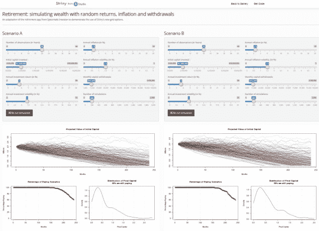
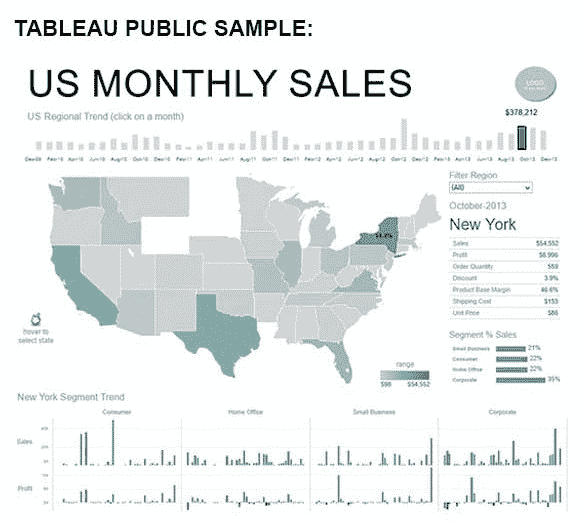
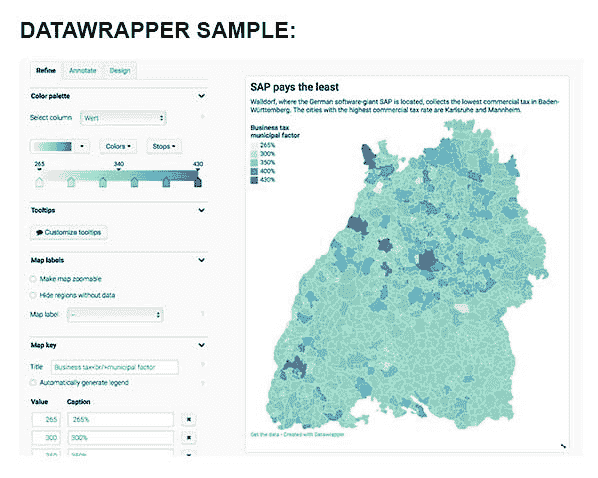
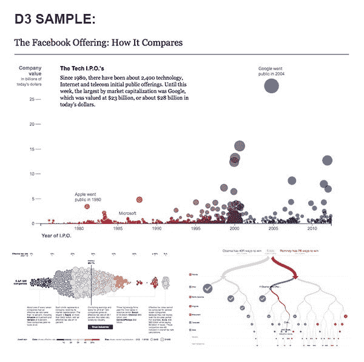

# 我们最喜欢的 5 个免费可视化工具

> 原文：[`www.kdnuggets.com/2018/07/5-favorite-open-source-visualization-tools.html`](https://www.kdnuggets.com/2018/07/5-favorite-open-source-visualization-tools.html)

 评论

**由 [Richard Vermillion](https://www.linkedin.com/in/rvermillion/)，CEO [Fulcrum Analytics](https://www.fulcrumanalytics.com/)**

现在越来越明显的是，对于那些希望继续成长的企业而言，数据的收集和应用比以往任何时候都更为重要。缺点？随着我们不断发现数据的益处，个人编制、展示和实施发现的难度也会增加。幸运的是，有许多免费的数据可视化工具可以将你独特的空间和表格数据，通过先进的图表和图形呈现给你。

* * *

## 我们的前三课程推荐

 1\. [谷歌网络安全证书](https://www.kdnuggets.com/google-cybersecurity) - 快速进入网络安全职业轨道。

 2\. [谷歌数据分析专业证书](https://www.kdnuggets.com/google-data-analytics) - 提升你的数据分析水平

 3\. [谷歌 IT 支持专业证书](https://www.kdnuggets.com/google-itsupport) - 支持你的组织的 IT

* * *

那么，哪些工具值得花时间探索和/或可能采纳呢？以下是我们整理的 5 个最喜欢的免费数据可视化工具，它们以必要的图示方法处理复杂数据。

**R Shiny**

R Shiny 是一个开源包，它提供了构建数据可视化、交互式图表和应用程序的网络框架，使用 R 编写。这个工具可以帮助你将分析结果转化为简洁的交互式网页视觉效果，无需深入了解 HTML、CSS 或 JavaScript。就像电子表格一样，这种反应式编程模型允许轻松操作数据，而不是等待整个页面重新加载……我们已经看到在零售行业中，那些不断更新数据并寻找可以跟上每分钟变化的平台的人取得了成功。

**Tableau Public**

Tableau Public 是一款流行的数据可视化工具，能够显示图表、图形、地图等，并且完全免费。用户可以使用高达 10 GB 的存储空间和拖放界面，实时查看数据更新，同时与团队中的其他成员协作。Tableau 的“公共”部分意味着你只能将数据保存到公共资料中，其他人可以访问你的数据，但如果你不是一个隐私问题优先的大型公开公司，Tableau Public 对于商业分析师和管理者来说有诸多优势。最新版本针对移动设备进行了优化，可以连接到除了 Excel 之外的多种数据源，并可以直接链接到 Google Sheets。

**Datawrapper**

Datawrapper 是一个出色的开源工具，能够完全可视化数据并嵌入实时和互动的图表。只需上传一个 CSV 文件，在线工具即可构建定制化的视觉效果，如条形图和折线图。Datawrapper 非常适合小型企业或演示使用，因为每个图表允许的查看次数仅为 10,000 次，但对于拥有大量客户的大型企业来说可能不太理想。然而，大多数人认为，易于使用的界面和能够快速以直观的方式展示统计数据是非常有帮助的。

**Pivot**

Pivot 是一个直观的用户界面，旨在利用备受欢迎的拖放界面进行事件数据的探索性分析。Pivot 的一个特点是它围绕两个操作：过滤（Filter）和拆分（Split）展开。过滤器（Filter）缩小数据视图，相当于 SQL 中的“WHERE”子句，而拆分（Split）非常类似于 SQL 的“GROUP BY”函数。然而，拆分（Split）允许数据跨多个维度进行切割——我们在杂货价格/促销分析和优化中取得了很大的成功。

**D3**

D3，代表数据驱动文档，是一个 JavaScript 库，用于将任意数据绑定到文档对象模型（DOM），然后对文档应用数据驱动的转换。尽管 D3 可能更吸引程序员，因为该工具涉及编写代码，但 D3 能够在网页中构建一系列真正吸引人的图表、地图、图示等。如果你愿意付出一些额外的努力，视觉效果绝对值得。

不论行业如何，这些工具都是理解不断涌入的宝贵数据的关键。这些工具易于使用，并且能够在不花费一分钱的情况下可视化模式或强调趋势。

对于这些工具如何应用于你的业务感到好奇？点击 [这里](http://www.fulcrumanalytics.com/contact-us/) 了解我们如何帮助你理解数据。

**图片来源**

| 来源 | 链接 |
| --- | --- |
| *来自 R Studio 的 Shiny* | https://shiny.rstudio.com/gallery/retirement-simulation.html |
| *仪表板布局和设计，Tableau Public* | https://public.tableau.com/en-us/s/blog/2013/10/dashboard-layout-and-design |
| *创建地图演示，Datawrapper* | https://www.datawrapper.de/ |
| *Imply Pivot* | https://github.com/geo-opensource/pivot |
| *Facebook 发行情况：与之比较，《纽约时报》* | https://archive.nytimes.com/www.nytimes.com/interactive/2012/05/17/business/dealbook/how-the-facebook-offering-compares.html |
| *美国公司税率差异，《纽约时报》* | https://archive.nytimes.com/www.nytimes.com/interactive/2013/05/25/sunday-review/corporate-taxes.html |
| *通往白宫的 512 条路径，《纽约时报》* | http://archive.nytimes.com/www.nytimes.com/interactive/2012/11/02/us/politics/paths-to-the-white-house.html |

**简历：** [理查德·弗梅里昂](https://www.linkedin.com/in/rvermillion/) 自 2011 年起担任[Fulcrum Analytics](https://www.fulcrumanalytics.com/)的首席执行官。Fulcrum 正在建立一个世界级的数据科学和数据工程组织，解决全球顶级公司在零售、保险、投资、零售银行和医疗保健领域面临的最困难的问题。

**相关：**

+   [如何在 D3 中制作简单的条形图](https://www.kdnuggets.com/2018/03/simple-bar-chart-d3.html)

+   [使用 Tableau 进行有效可视化的 6 个技巧](https://www.kdnuggets.com/2018/05/6-tips-effective-visualization-tableau.html)

+   [你应该了解的 7 种简单数据可视化（R 语言）](https://www.kdnuggets.com/2018/06/7-simple-data-visualizations-should-know-r.html)

### 更多相关话题

+   [2021 年最佳 ETL 工具](https://www.kdnuggets.com/2021/12/mozart-best-etl-tools-2021.html)

+   [成为优秀数据科学家所需的 5 项关键技能](https://www.kdnuggets.com/2021/12/5-key-skills-needed-become-great-data-scientist.html)

+   [每个初学者数据科学家都应该掌握的 6 种预测模型](https://www.kdnuggets.com/2021/12/6-predictive-models-every-beginner-data-scientist-master.html)

+   [停止学习数据科学以寻找目标，并寻找目标来...](https://www.kdnuggets.com/2021/12/stop-learning-data-science-find-purpose.html)

+   [一笔 90 亿美元的 AI 失败，详解](https://www.kdnuggets.com/2021/12/9b-ai-failure-examined.html)

+   [建立一个坚实的数据团队](https://www.kdnuggets.com/2021/12/build-solid-data-team.html)
