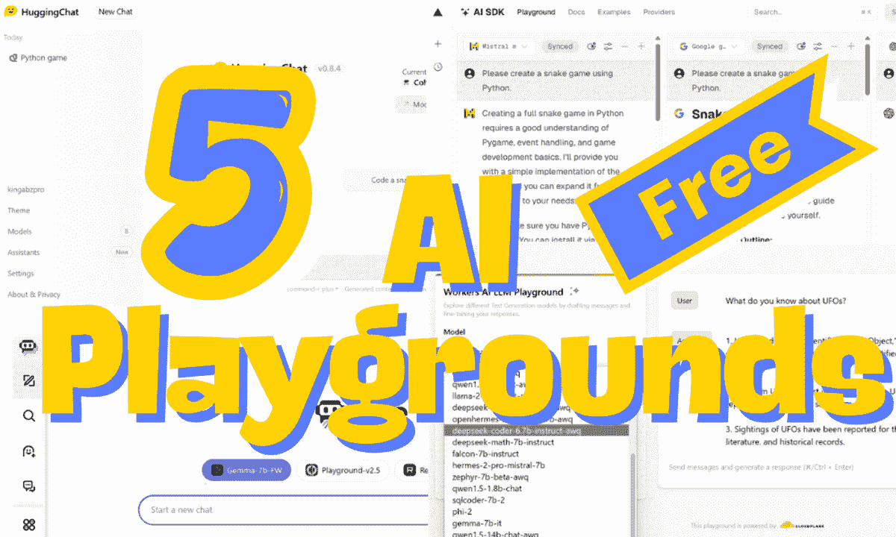
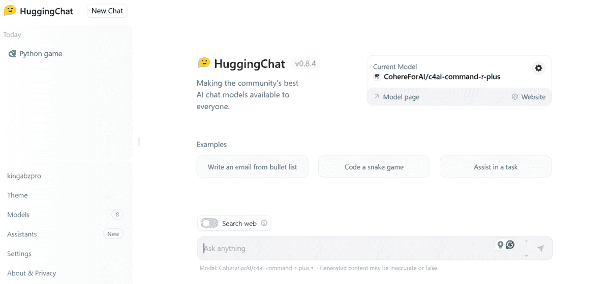
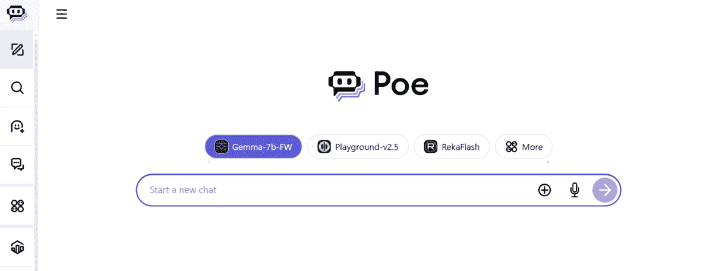
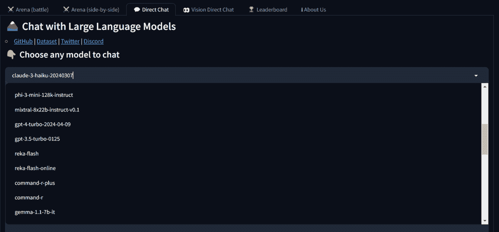
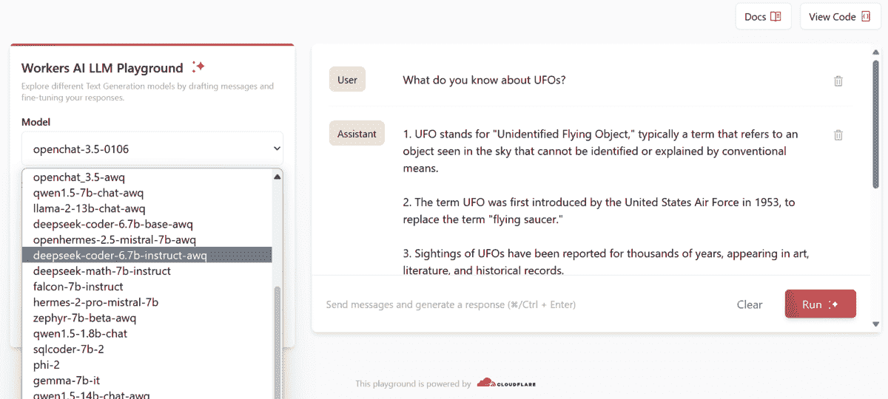

# 2024 年 5 个免费的 AI 游乐场供你尝试

> 原文：[`www.kdnuggets.com/5-free-ai-playgrounds-for-you-to-try-in-2024`](https://www.kdnuggets.com/5-free-ai-playgrounds-for-you-to-try-in-2024)

作者提供的图片

你想尝试最新发布的大型语言模型（LLMs）吗？还是希望成为首批探索前沿开源模型并与同行讨论的人？对于 AI 爱好者来说，现在是一个激动人心的时刻，因为多个平台提供了对最先进模型的免费访问，让每个人都能试用并比较。所以，准备好深入 AI 游乐场的世界，探索这些改变世界的新发布的 AI 模型的潜力吧。

* * *

## 我们的前三大课程推荐

 1\. [Google 网络安全证书](https://www.kdnuggets.com/google-cybersecurity) - 快速进入网络安全职业道路。

 2\. [Google 数据分析专业证书](https://www.kdnuggets.com/google-data-analytics) - 提升你的数据分析技能

 3\. [Google IT 支持专业证书](https://www.kdnuggets.com/google-itsupport) - 支持你的组织 IT

* * *

在这篇博客中，我将分享 5 个用户友好、快速、互动的 AI 游乐场，它们提供自定义模型并且免费使用。有些平台甚至提供了对专有模型的免费访问。

## 1\. HuggingChat

[HuggingChat](https://huggingface.co/chat/)是我最喜欢的，即使我有 ChatGPT Pro。我每天使用 HuggingChat，因为它的用户界面、快速响应生成和在模型之间切换的能力都非常出色。

图片来源于 HuggingChat

Hugging Face 为其用户提供了最先进的开源模型，并逐步停用老旧且效率低的模型。因此，你可以放心地享受最佳的 AI 体验，包括代码调试、内容生成、学习新概念和解决问题。

## 2\. Poe

[Poe](https://poe.com/)是我第二喜欢的平台，因为它拥有更广泛的大型语言模型库。它快速，用户界面互动且易于导航。Poe AI 游乐场的关键特点是让你尝试所有顶尖的开源和闭源模型。简而言之，你只需收藏 Poe，便可以获得全方位的 AI 体验。

图片来源于 Poe

Poe 还提供创建自定义 AI 聊天机器人的选项，或者你可以探索公共库中的成千上万的聊天机器人。这些聊天机器人通过系统提示、模型类型和知识来源进行定制。

## 3\. Chat LMSys

[Chat LMSys](https://chat.lmsys.org/) 以其聊天机器人排行榜而闻名，但它也可以作为聊天机器人和 AI 游乐场使用。它提供访问 40 个最先进的 AI 模型，包括开源和专有模型，你可以比较它们的结果。

图片来自 Chat LMSys

有三个缺点使我不愿意每天使用它：

+   用户界面不好。

+   网站加载时间。

+   直接聊天中模型的可用性不足。

你必须参与区域战斗才能访问准备模型。

## 4\. AI SDK

[AI SDK](https://sdk.vercel.ai/) 是另一个简单且快速的 AI 游乐场。它还提供访问顶级开源和闭源模型的功能。要访问像 GPT-4-turbo 这样的最先进模型，你可能需要订阅 Vercel Pro。但在我看来，这里提供的一些免费模型在其他平台上并不免费。因此，你可以将它与 Poe 或 Chat LMSys 组合使用。

图片来自 Vercel AI 的 AI SDK

AI SDK 无需登录即可使用，你可以同时比较多个模型。它快速，并提供额外选项来修改和改善模型响应。此外，你可以同步提示或为每个模型使用不同的提示。

## 5\. 工作者 AI

[工作者 AI](https://playground.ai.cloudflare.com/) 最近才被我了解到。它快速且简单，并提供访问开源 AI 模型的功能。这个平台的特别之处在于，你可以添加多个输入（用户和助手）来创建一个历史或上下文，以便 LLM 理解和适当地回应。除此之外，它加载速度很快，无需任何注册。

图片来自工作者 AI

我把它放在底部，因为它简单、缺乏核心功能、没有所有顶级 AI 模型，最重要的是，你无法调整模型参数来改善响应。

## 结论

如果你想访问所有的 AI 模型并亲身体验魔法，我建议你查看 Hugging Face [Spaces](https://huggingface.co/spaces) 页面。每天都有新的和令人兴奋的内容可以尝试，在社交媒体上给人留下深刻印象。你可以找到免费的和开放的图像生成、语音生成、LLMs 和多模态模型。

在这篇博客中，我们了解了 5 个你在 2024 年应该使用的 AI 游乐场。它们将帮助你免费访问顶级的 LLMs；其中一些甚至无需注册。

****[Abid Ali Awan](https://www.polywork.com/kingabzpro)**** ([@1abidaliawan](https://www.linkedin.com/in/1abidaliawan)) 是一位认证的数据科学专业人士，热衷于构建机器学习模型。目前，他专注于内容创作，并撰写有关机器学习和数据科学技术的技术博客。Abid 拥有技术管理硕士学位和电信工程学士学位。他的愿景是利用图神经网络构建一款 AI 产品，帮助那些与心理健康问题作斗争的学生。

### 更多相关话题

+   [2023 年你需要尝试的 5 个惊人的免费 LLMs 试验场](https://www.kdnuggets.com/5-amazing-free-llms-playgrounds-you-need-to-try-in-2023)

+   [2024 年你必须尝试的 5 款最佳向量数据库](https://www.kdnuggets.com/the-5-best-vector-databases-you-must-try-in-2024)

+   [2024 年你必须尝试的 7 款端到端 MLOps 平台](https://www.kdnuggets.com/7-end-to-end-mlops-platforms-you-must-try-in-2024)

+   [8 个免费的 AI 和 LLMs 试验场](https://www.kdnuggets.com/2023/05/8-free-ai-llms-playgrounds.html)

+   [你必须尝试的 5 款顶级 AI 编码助手](https://www.kdnuggets.com/top-5-ai-coding-assistants-you-must-try)

+   [在神经网络之前尝试的 10 个简单步骤](https://www.kdnuggets.com/2021/12/10-simple-things-try-neural-networks.html)
