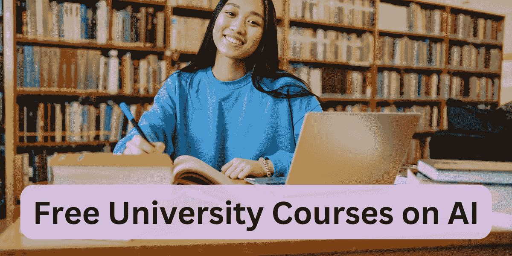

# 来自顶尖大学的 5 门免费人工智能课程

> 原文：[`www.kdnuggets.com/5-free-artificial-intelligence-courses-from-top-universities`](https://www.kdnuggets.com/5-free-artificial-intelligence-courses-from-top-universities)

作者提供的图片

目前，构建 AI 助手和 AI 代理在开发者中非常受欢迎。无论你从事哪个领域——数据分析、机器学习、DevOps 等，你都可以通过 AI 改进工作流程。那么你从哪里开始呢？

* * *

## 我们的三大课程推荐

1\. [Google 网络安全证书](https://www.kdnuggets.com/google-cybersecurity) - 快速进入网络安全职业的快车道。

2\. [Google 数据分析专业证书](https://www.kdnuggets.com/google-data-analytics) - 提升你的数据分析技能

3\. [Google IT 支持专业证书](https://www.kdnuggets.com/google-itsupport) - 支持你的组织进行 IT 管理

* * *

好吧，你可以直接开始构建 AI 应用程序，并在过程中学习。但学习 AI 的基础知识同样重要。我们整理了一些免费的大学课程，帮助你学习 AI 基础。

> **注意**: 你可以免费访问所有以下课程，包括 Coursera 和 edX 上提供的课程。你无需支付即可访问课程材料和学习。你只需支付费用才能获得 Coursera 和 edX 上的认证证书。

让我们来看看这些课程。

## 1\. CS50 的 Python 人工智能导论 – 哈佛大学

[CS50 的 Python 人工智能导论](https://www.edx.org/learn/artificial-intelligence/harvard-university-cs50-s-introduction-to-artificial-intelligence-with-python)来自哈佛大学，是一门很好的入门课程，帮助你建立人工智能的算法基础。

为了跟上这门课程（以及接下来的其他课程），你应该对使用 Python 编程感到舒适。在这门课程中，你将探索搜索算法、机器学习、大型语言模型等。课程持续约 7 周，你可以在每个模块中进行项目练习。

这是本课程覆盖的主题概述：

+   图搜索算法

+   高级搜索

+   知识表示

+   逻辑推理

+   贝叶斯网络

+   马尔可夫模型

+   机器学习

+   神经网络

+   自然语言处理

**链接**: [CS50 的 Python 人工智能导论](https://www.edx.org/learn/artificial-intelligence/harvard-university-cs50-s-introduction-to-artificial-intelligence-with-python)

## 2\. 人工智能 – 麻省理工学院

[人工智能](https://ocw.mit.edu/courses/6-034-artificial-intelligence-fall-2010/)（6.034）由麻省理工学院提供，是一门本科级别的 AI 课程，帮助你学习构建智能系统所需的基础知识。

重点关注以下内容：

+   知识表示

+   问题解决

+   AI 学习方法论

你可以在 MIT OpenCourseWare 上免费访问所有课程内容。本课程涵盖以下主题：

+   推理

+   搜索

+   约束

+   学习算法

+   深度神经网络

+   概率推理

**链接**: [人工智能](https://ocw.mit.edu/courses/6-034-artificial-intelligence-fall-2010/)

## 3. 人工智能：原则与技术 – 斯坦福大学

[人工智能：原则与技术](https://www.youtube.com/playlist?list=PLoROMvodv4rO1NB9TD4iUZ3qghGEGtqNX)（CS221）来自斯坦福大学，是一门全面的课程，提供 AI 领域的概述。你将学习机器学习、搜索、游戏玩法等内容。

本课程覆盖的主题如下：

+   机器学习

+   搜索算法

+   马尔科夫决策过程

+   游戏玩法

+   因子图

+   贝叶斯网络

+   逻辑

+   深度学习

**链接**: [斯坦福 CS221: 人工智能：原则与技术](https://www.youtube.com/playlist?list=PLoROMvodv4rO1NB9TD4iUZ3qghGEGtqNX)

## 4. 医疗健康中的 AI 专业课程 – 斯坦福大学

医疗健康仍然是 AI 应用受益的重要领域之一。从高效的预测和诊断到使医疗更易获得，AI 应用——包括 AI 安全和 AI 伦理——可以极大地提供帮助。

如果你想学习医疗健康中的 AI 应用，查看斯坦福大学在 Coursera 上提供的[医疗健康中的 AI](https://www.coursera.org/specializations/ai-healthcare)专业课程。这门专业课程包括以下课程和一个综合项目：

+   医疗健康简介

+   临床数据简介

+   医疗健康的机器学习基础

+   医疗 AI 应用评估

**链接**: [医疗健康中的 AI 专业课程](https://www.coursera.org/specializations/ai-healthcare)

## 5. 生成式 AI 简介 – 杜克大学

生成式 AI 由于近期的进展和持续的研究变得非常流行。而构建有用的应用程序是开发人员当前最喜欢的事情。

[生成式 AI 简介](https://www.coursera.org/learn/intro-gen-ai)，由杜克大学在 Coursera 上提供，将向你介绍生成式 AI 的背景：与开源和闭源的大型语言模型、云 API 等合作。本课程的模块如下：

+   生成式 AI 简介

+   与模型交互

+   构建稳健的生成式 AI 系统

+   大型语言模型的应用

**链接**: [生成式 AI 简介](https://www.coursera.org/learn/intro-gen-ai)

## 总结

希望你觉得这篇关于免费 AI 课程的总结有帮助。对于 Coursera 和 edX 等平台上的课程，你可以注册一个免费账户并审计课程，以免费访问课程内容。

如果你有兴趣学习机器学习基础，请阅读 [5 个免费大学课程学习机器学习](https://www.kdnuggets.com/5-free-university-courses-to-learn-machine-learning)。

****[Bala Priya C](https://www.kdnuggets.com/wp-content/uploads/bala-priya-author-image-update-230821.jpg)**** 是来自印度的开发人员和技术作家。她喜欢在数学、编程、数据科学和内容创作的交汇处工作。她的兴趣和专长领域包括 DevOps、数据科学和自然语言处理。她喜欢阅读、写作、编码和咖啡！目前，她正致力于学习并通过编写教程、操作指南、观点文章等方式与开发者社区分享她的知识。Bala 还创建了引人入胜的资源概述和编码教程。

### 更多相关内容

+   [10 个来自顶尖大学的免费机器学习课程](https://www.kdnuggets.com/2023/02/10-free-machine-learning-courses-top-universities.html)

+   [带有 YouTube 播放列表的大学 AI 最佳课程](https://www.kdnuggets.com/2023/08/best-courses-ai-universities-youtube-playlists.html)

+   [免费人工智能与深度学习速成课程](https://www.kdnuggets.com/2022/07/free-artificial-intelligence-deep-learning-crash-course.html)

+   [人工智能系统中的不确定性量化](https://www.kdnuggets.com/2022/04/uncertainty-quantification-artificial-intelligencebased-systems.html)

+   [人工智能如何变革数据整合](https://www.kdnuggets.com/2022/04/artificial-intelligence-transform-data-integration.html)

+   [2022 年最受需求的人工智能技能](https://www.kdnuggets.com/2022/08/indemand-artificial-intelligence-skills-learn-2022.html)
