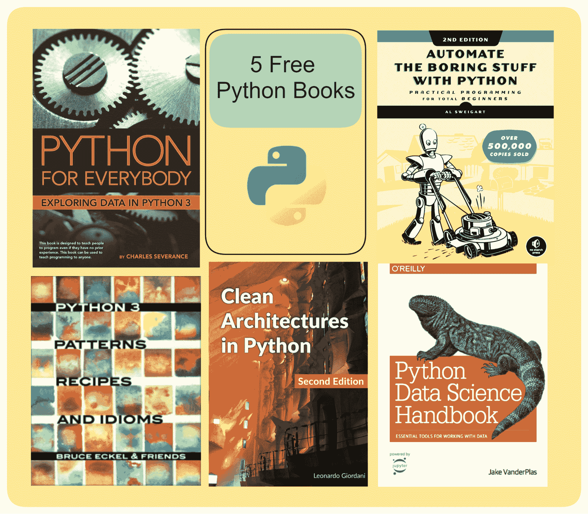

# 5 本免费书籍帮助你掌握 Python

> 原文：[`www.kdnuggets.com/5-free-books-to-help-you-master-python`](https://www.kdnuggets.com/5-free-books-to-help-you-master-python)

图片由作者提供

当你学习一种新的编程语言或技术栈时，你通常会被大量的资源——书籍、课程、教程等——所淹没。

* * *

## 我们的前三个课程推荐

 1\. [Google 网络安全证书](https://www.kdnuggets.com/google-cybersecurity) - 快速进入网络安全职业

 2\. [Google 数据分析专业证书](https://www.kdnuggets.com/google-data-analytics) - 提升你的数据分析技能

 3\. [Google IT 支持专业证书](https://www.kdnuggets.com/google-itsupport) - 支持你的组织 IT 需求

* * *

如果你是一个有经验的程序员在学习 Python，随需应变的学习以完成特定项目可能更有效。但如果你希望有一个完整的学习路径，你可能会更喜欢一个结构化的学习课程——加上项目——来熟悉语言。

在这里，我们介绍了五本 Python 书籍，帮助你掌握 Python 的各种功能并构建可维护的应用程序。无论你是初学者还是有经验的 Python 程序员，这些书籍将帮助你加深对语言的理解。

# 1\. Python for Everybody: Exploring Data in Python 3

[Python for Everybody](https://www.py4e.com/lessons) 由 Dr. Charles Severance（Dr. Chuck）编写，提供了一种以代码为主的 Python 编程语言学习方法。如果你刚刚开始学习 Python，这是一本非常好的书籍。

从安装 Python 到网页抓取和处理常见数据格式，这本书涵盖了广泛的主题——以及练习题和解决方案。你还可以通过 [Python for Everybody 讲座](https://www.youtube.com/watch?v=8DvywoWv6fI)——在 freeCodeCamp YouTube 频道上免费提供——进行学习。

这本书涵盖的主题包括：

+   变量、表达式和语句

+   条件执行

+   函数

+   循环和迭代

+   处理字符串和文件

+   列表、元组和字典

+   正则表达式

+   网络编程

+   使用网络服务

+   面向对象编程 (OOP)

+   数据库

+   数据可视化

开始阅读: [Python for Everybody (PY4E)](https://www.py4e.com/lessons)

# 2\. 使用 Python 自动化枯燥的任务

[使用 Python 自动化枯燥的任务](https://automatetheboringstuff.com/) 由 Al Sweigart 编写，是另一个非常适合初学者的资源，可以学习基础到中级的 Python 概念。

你将学习基础知识，如内置数据结构、控制流和异常处理。此外，你将学习编写 Python 脚本以自动化任务，如搜索文件、从网络下载文件、处理 PDF 等。

这是本书涵盖的一些主题概述（除了基础知识）：

+   使用正则表达式进行模式匹配

+   输入验证

+   从文件中读取和写入数据

+   调试

+   网络爬虫

+   在 Python 中处理电子表格、PDF、CSV 和 JSON

+   任务调度

+   图像处理

+   GUI 自动化

开始阅读： [用 Python 自动化无聊的事情](https://automatetheboringstuff.com/)

# 3\. Python 3 模式、配方与习语

[Python 3 模式、配方与习语](https://python-3-patterns-idioms-test.readthedocs.io/en/latest/index.html)是一本适合中级 Python 程序员的书籍，他们已经熟悉语言的特性并希望进一步提升。

这本书从 Python 函数和类的回顾开始，涵盖了以下内容：

+   实例的初始化和清理

+   Python 中的单元测试和测试驱动开发

+   装饰器

+   元编程

+   生成器、迭代器、itertools

+   Python 中的设计模式和模式重构

开始阅读： [Python 3 模式、配方与习语](https://python-3-patterns-idioms-test.readthedocs.io/en/latest/index.html)

# 4\. Python 中的清晰架构

当你超越简单的 Python 脚本，开始构建应用程序时，你需要理解清晰架构并构建生产就绪的应用程序。

[《Python 中的清晰架构》](https://leanpub.com/clean-architectures-in-python)由 Leonardo Giordani 编写，是一本免费的书籍，内容包括：

+   清晰架构基础

+   清晰架构的组件

+   与外部系统集成（Postgres 和 MongoDB）

+   运行生产就绪的系统

开始阅读：[《Python 中的清晰架构》](https://leanpub.com/clean-architectures-in-python)

# 5\. Python 数据科学手册

你已经对核心 Python 和内置模块的功能有所了解。你也知道编写干净 Python 代码的最佳实践。那么接下来是什么？

如果你想开始数据科学，你还需要添加一些 Python 数据科学库。[Python 数据科学手册](https://jakevdp.github.io/PythonDataScienceHandbook/)是一本全面的资源，可以帮助你掌握清理、分析和处理数据的基础。

本书涵盖了 Python 的概念，如 Python 魔法命令、调试和代码分析。它还涵盖了足够的内容，以帮助你开始使用 Python 数据科学库和构建机器学习模型。以下是概述：

+   NumPy

+   Pandas

+   Matplotlib

+   机器学习

开始阅读： [Python 数据科学手册](https://jakevdp.github.io/PythonDataScienceHandbook/)

# 总结与下一步

如前所述，将所学知识应用到你感兴趣的小项目中是非常重要的！这些书籍将成为你在这一过程中不可或缺的伴侣。

当你开始构建应用程序时，可能会在代码中引入一些微妙的反模式。因此，无论你使用什么编程语言，务必阅读 [《代码整洁之道》](https://www.oreilly.com/library/view/clean-code-a/9780136083238/) 和 [《程序员修炼之道》](https://pragprog.com/titles/tpp20/the-pragmatic-programmer-20th-anniversary-edition/) 以构建更好的应用程序。

**[Bala Priya C](https://www.linkedin.com/in/bala-priya/)** 是来自印度的开发者和技术作家。她喜欢在数学、编程、数据科学和内容创作的交汇点上工作。她的兴趣和专长领域包括 DevOps、数据科学和自然语言处理。她喜欢阅读、写作、编程和喝咖啡！目前，她正在通过编写教程、操作指南、评论文章等，学习并与开发者社区分享她的知识。

### 更多相关话题

+   [免费 Python 资源，助你成为专业人士](https://www.kdnuggets.com/free-python-resources-that-can-help-you-become-a-pro)

+   [25 本免费书籍掌握 SQL、Python、数据科学、机器学习…](https://www.kdnuggets.com/25-free-books-to-master-sql-python-data-science-machine-learning-and-natural-language-processing)

+   [5 本免费书籍掌握 SQL](https://www.kdnuggets.com/5-free-books-to-master-sql)

+   [5 本免费书籍掌握数据科学](https://www.kdnuggets.com/5-free-books-to-master-data-science)

+   [5 本免费书籍掌握机器学习](https://www.kdnuggets.com/5-free-books-to-master-machine-learning)

+   [5 本免费书籍掌握数据科学中的统计学](https://www.kdnuggets.com/5-free-books-to-master-statistics-for-data-science)
