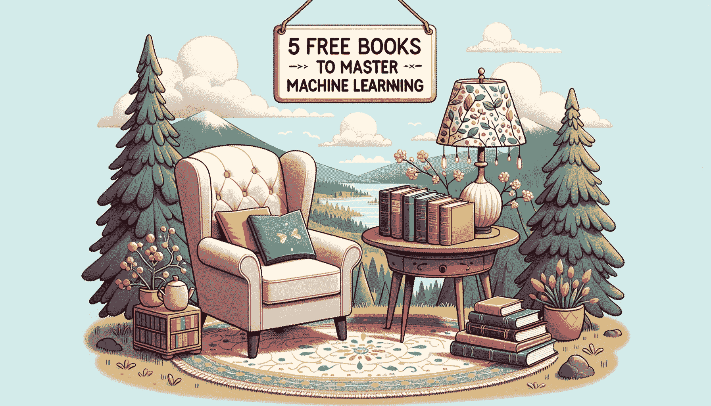
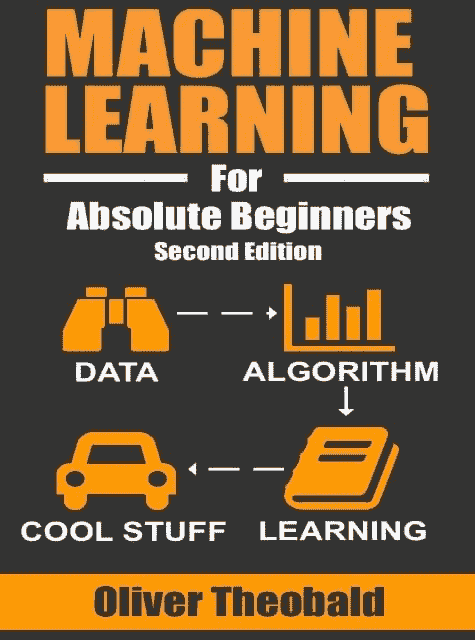
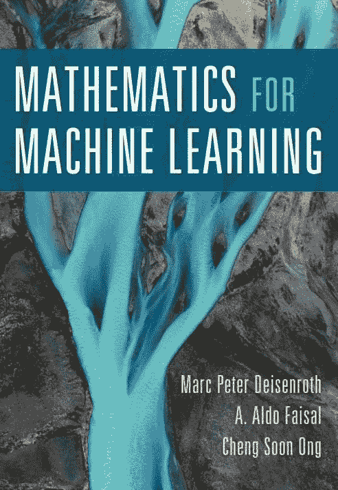
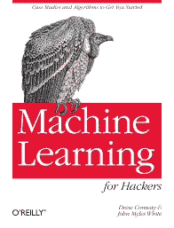
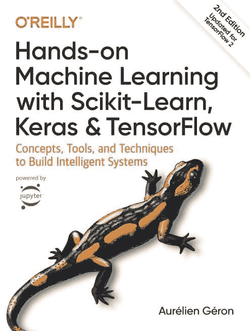
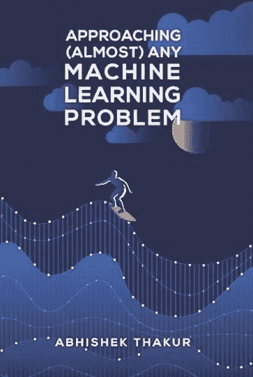

# 5 本免费书籍掌握机器学习

> 原文：[`www.kdnuggets.com/5-free-books-to-master-machine-learning`](https://www.kdnuggets.com/5-free-books-to-master-machine-learning)

图片生成于 DALL-E 3

在今天的高科技世界中，机器学习非常重要。你可能已经参加了一些在线课程，但它们往往忽略了细节。如果你真的想深入探究并掌握机器学习，书籍是最佳选择。我知道面对如此多的选择可能会感到不知所措。但别担心，我们会为你提供帮助。

* * *

## 我们的前三大课程推荐

 1\. [谷歌网络安全证书](https://www.kdnuggets.com/google-cybersecurity) - 快速入门网络安全职业

 2\. [谷歌数据分析专业证书](https://www.kdnuggets.com/google-data-analytics) - 提升你的数据分析技能

 3\. [谷歌 IT 支持专业证书](https://www.kdnuggets.com/google-itsupport) - 支持你的组织的 IT 工作

* * *

我精心挑选了五本在我自己的机器学习旅程中产生重大影响的书籍。这些书籍将帮助你在 2023 年更好地理解机器学习。

所以，如果你准备好将你的知识提升到一个新的水平，深入探索这一迷人领域，继续阅读。

# 1\. 绝对初学者的机器学习

作者: 奥利弗·西奥博德

链接: [绝对初学者的机器学习](https://bmansoori.ir/book/Machine%20Learning%20For%20Absolute%20Beginners.pdf)

书籍封面

你听说过**机器学习**这个词，想要深入了解这个激动人心的领域，但不知道从哪里开始。那么这本书是适合你的！

这本书非常适合那些对这个领域新手且没有任何编程经验的人。它以通俗易懂的语言编写，不需要任何先前的编程经验。书中提供了机器学习的高层次介绍、可下载的代码练习和视频演示。还有什么比这更好的呢？

**涵盖的主题:**

+   什么是机器学习？

+   机器学习类别

+   机器学习工具箱

+   数据清洗

+   设置你的数据

+   回归分析

+   聚类

+   偏差与方差

+   人工神经网络

+   决策树

+   集成建模

+   在 Python 中构建模型

+   模型优化

# 2\. 机器学习的数学

作者: 马克·彼得·德森罗斯

链接: [机器学习数学](https://mml-book.github.io/book/mml-book.pdf)

书籍封面

既然你已经了解了一些基本概念，现在是时候为复杂的机器学习主题打下基础了。你现在应该做什么？**机器学习的数学**就是你所需要的！

这是一本自包含的教科书，介绍了理解机器学习所需的基本数学工具。该书以最少的先决条件呈现数学概念，并利用这些概念推导出四种核心机器学习方法：线性回归、主成分分析、高斯混合模型和支持向量机。

本书的作者 Marc Peter Deisenroth 是伦敦大学学院的 DeepMind 人工智能主席，并因其在机器学习领域的研究获得了多个奖项。

**涉及主题:**

+   线性代数

+   解析几何

+   矩阵分解

+   向量微积分

+   概率与分布

+   连续优化

+   当模型遇到数据

+   线性回归

+   主成分分析的维度缩减

+   使用高斯混合模型的密度估计

+   使用支持向量机的分类

# 3\. 《黑客的机器学习》

作者: Drew Conway 和 John Myles White

链接: [黑客的机器学习](https://doc.lagout.org/science/Artificial%20Intelligence/Machine%20learning/Machine%20Learning%20for%20Hackers_%20Case%20Studies%20and%20Algorithms%20to%20Get%20You%20Started%20%5BConway%20%26%20White%202012-02-25%5D.pdf)

书籍封面

你至今一直在学习理论，现在你真的想开始深入的机器学习编码。那就不用担心了。如果你对编程和编码有天赋，这本书就是为你量身定制的。

本书结合了实际案例研究，展示了机器学习算法的现实相关性。这些示例，包括一个关于构建 Twitter 关注者推荐系统的示例，帮助将抽象概念与具体应用联系起来。这本书最适合喜欢实际案例研究的程序员。

**涉及主题:**

+   数据探索

+   分类: 垃圾邮件过滤

+   排序: 优先收件箱

+   回归: 预测页面浏览量

+   正则化: 文本回归

+   优化: 破解代码

+   PCA: 构建市场指数

+   MDS: 视觉探索美国参议员相似性

+   kNN: 推荐系统

+   分析社交图谱

+   模型比较

# 4\. 《使用 Scikit-Learn、Keras 和 TensorFlow 的动手机器学习》

作者: Geron Aurelien

链接: [使用 Scikit-Learn、Keras 和 TensorFlow 的动手机器学习](http://14.139.161.31/OddSem-0822-1122/Hands-On_Machine_Learning_with_Scikit-Learn-Keras-and-TensorFlow-2nd-Edition-Aurelien-Geron.pdf)

书籍封面

这本书是一本实用的机器学习指南，重点在于构建端到端的系统。书中涵盖了线性回归、决策树、集成方法、神经网络、深度学习等广泛主题。

本书的最新版本包含了来自前沿版本的机器学习和深度学习库（如 TensorFlow 和 Scikit-Learn）的代码。

**涵盖的主题：**

+   性能测量选择

+   测试集创建

+   使用梯度下降进行线性回归

+   岭回归、套索回归和弹性网回归

+   用于分类的 SVM

+   决策树与基尼不纯度

+   集成学习方法

+   主成分分析（PCA）

+   使用 K-Means 和 DBSCAN 进行聚类

+   使用 Keras 的人工神经网络

+   深度神经网络训练

+   使用 TensorFlow 的自定义模型

+   使用 TensorFlow 的数据加载和预处理

+   深度学习中的 CNN、RNN 和 GAN

# 5\. 接近（几乎）任何机器学习问题

作者：Abhishek Thakur

链接：[接近（几乎）任何机器学习问题](https://docdrop.org/download_annotation_doc/AAAMLP-569to.pdf)

书籍封面

想把你的机器学习技能提升到一个新水平吗？这本书是你通向应用机器学习精彩世界的通行证。虽然它没有让你陷入复杂的算法，但它全是关于如何和什么来解决现实世界中的问题。若你渴望弥合理论与实践之间的差距，这本书肯定会成为你的指南！

**涵盖的主题：**

+   监督学习与非监督学习

+   交叉验证技术

+   评估指标

+   结构化机器学习项目

+   处理分类变量

+   特征工程

+   特征选择

+   超参数优化

+   图像和文本分类、集成和可重复代码

# 结论

在这篇文章中，我们向你介绍了 2023 年学习机器学习的五本最佳书籍。这些书涵盖了从机器学习基础到更高级的深度学习主题，内容都写得很好，即使是初学者也容易跟随。

如果你认真对待机器学习，我建议你阅读这五本书。然而，如果你只能读一两本，我推荐 **Oliver Theobald 的《绝对初学者的机器学习》** 和 **Aurélien Géron 的《动手机器学习：使用 Scikit-Learn、Keras 和 TensorFlow》**。

我们很想知道哪些书在你的机器学习旅程中发挥了关键作用。欢迎在评论区分享你的推荐。

****[Kanwal Mehreen](https://www.linkedin.com/in/kanwal-mehreen1/)**** Kanwal 是一名机器学习工程师和技术作家，对数据科学和人工智能与医学的交叉领域充满了深厚的热情。她共同撰写了电子书《利用 ChatGPT 最大化生产力》。作为 2022 年 APAC 的 Google Generation Scholar，她倡导多样性和学术卓越。她还被认定为 Teradata 技术多样性学者、Mitacs Globalink 研究学者和哈佛 WeCode 学者。Kanwal 是变革的坚定倡导者，她创立了 FEMCodes 以支持 STEM 领域的女性。

### 更多相关主题

+   [25 本免费书籍掌握 SQL、Python、数据科学、机器学习等](https://www.kdnuggets.com/25-free-books-to-master-sql-python-data-science-machine-learning-and-natural-language-processing)

+   [KDnuggets 新闻，6 月 22 日：主要的监督学习算法](https://www.kdnuggets.com/2022/n25.html)

+   [5 本免费书籍掌握 SQL](https://www.kdnuggets.com/5-free-books-to-master-sql)

+   [5 本免费书籍帮助你掌握 Python](https://www.kdnuggets.com/5-free-books-to-help-you-master-python)

+   [5 本免费书籍掌握数据科学](https://www.kdnuggets.com/5-free-books-to-master-data-science)

+   [5 本免费书籍掌握数据科学的统计学](https://www.kdnuggets.com/5-free-books-to-master-statistics-for-data-science)
