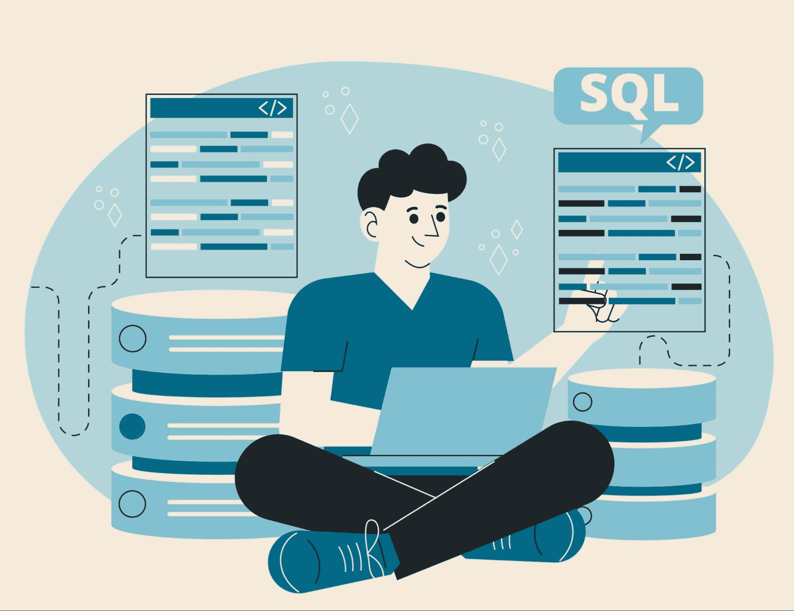

# 5 本免费 SQL 书籍

> 原文：[`www.kdnuggets.com/5-free-books-to-master-sql`](https://www.kdnuggets.com/5-free-books-to-master-sql)

图片由[Freepik](https://www.freepik.com/free-vector/hand-drawn-flat-design-sql-illustration_21901980.htm#query=sql&position=2&from_view=search&track=sph)提供

SQL，或结构化查询语言，是许多公司标准的数据库操作语言。目前，每个数据相关的职位都期望了解 SQL 语言，因为我们的工作涉及提取这些存储的数据以进行进一步分析。这就是为什么无论我们的专业水平如何，都应该提升我们的 SQL 知识。

* * *

## 我们的前三大课程推荐

 1\. [Google 网络安全证书](https://www.kdnuggets.com/google-cybersecurity) - 快速进入网络安全职业生涯。

 2\. [Google 数据分析专业证书](https://www.kdnuggets.com/google-data-analytics) - 提升你的数据分析技能

 3\. [Google IT 支持专业证书](https://www.kdnuggets.com/google-itsupport) - 支持你所在组织的 IT 工作

* * *

本文将讨论五本免费书籍，这些书籍可以提升你的 SQL 水平。我们将涵盖从初级到高级的各种需求。

这些书籍是什么？让我们深入了解一下。

# SQL 专业笔记

[GoalKicker.com](https://www.kdnuggets.com/5-free-books-to-master-sql)提供的《SQL 专业笔记》是一本超过 150 页的免费 SQL 书籍，涵盖了 SQL 的主要使用场景。在每一章中，你将学习到语法的简要说明、示例用法以及使用语法时的技巧。

这本书可以成为你学习和刷新基础知识的首选，因为它适合任何专业水平。这本书主要涵盖以下概念：

+   SQL 基础知识

+   数据操作

+   数据库和表管理

+   函数和表达式

+   数据清理和维护

+   处理特殊数据类型

你可以在以下页面获取这本书：[SQL 专业笔记](https://books.goalkicker.com/SQLBook/)。

# 学习 SQL

这是另一本适合任何初学者和高级用户的免费书籍，旨在提升你的 SQL 技能。该书由 Stack Overflow 的贡献者编写，旨在解答你大部分的 SQL 问题。

这本书提供了 64 章，超过 200 页。每章包含简单的解释和易于跟随的用法示例。总体而言，这本书的内容如下：

+   SQL 基础知识

+   数据库设计

+   高级查询技术

+   管理和错误处理

+   理解 SQL 的元数据

+   SQL 的信息检索

你可以在以下页面获取这本书：[SQL 学习](https://riptutorial.com/ebook/sql)。

# SQL 简介

[Bobby Iliev](https://twitter.com/bobbyiliev_) 的入门书籍是一本开源书籍，旨在教会初学者使用 SQL。它为每一章提供了清晰的解释，并提供了跟随示例所需的教程和前提条件。这本书使用了 MySQL，所以如果你想进一步了解这种语言，它也是不错的选择。

书籍内容包括：

+   MySQL 基础

+   数据操作

+   使用 JOINS 和子查询的高级查询

+   使用 MySQL 特定功能

+   最佳实践和编写干净代码

你可以在以下页面获取该书：[SQL 入门](https://github.com/bobbyiliev/introduction-to-sql)。

# 必备 SQL

必备 SQL 是 [必备编程](https://www.programming-books.io/) 书籍的一部分，是 2017 年停止更新的 Stack Overflow 文档的延续。电子书对每个主题提供了简单的解释，并提供了一个示例操作场地，你可以在其中进行调整。这是一本适合初学者和高级用户的优秀电子书。

电子书包含以下内容：

+   SQL 基础知识

+   数据检索和操作

+   优化和高级查询

+   数据库设计和管理

+   最佳实践和维护

你可以在这里访问电子书：[必备 SQL](https://www.programming-books.io/essential/sql/)。

# SQL 索引和调优

SQL 索引和调优是由 [Markus Winand](https://winand.at/) 开发的电子书，专注于索引 SQL 活动。这本电子书更适合高级用户，但从长远来看将有助于我们的工作。

电子书内容包括：

+   索引基础

+   索引结构

+   索引性能问题

+   索引管理最佳实践

+   高级索引技术和考虑事项

# 结论

SQL 是数据专业人员必备的重要技能，因为它将成为我们日常工作的一个部分。为了提高你的 SQL 知识，我们可以利用一些免费的 SQL 书籍，这些书籍在本文中有讨论。这些书籍增强了你的 SQL 基础，并提供了实际案例中的示例。

****[Cornellius Yudha Wijaya](https://www.linkedin.com/in/cornellius-yudha-wijaya/)**** 是一名数据科学助理经理和数据撰写员。在全职工作于 Allianz Indonesia 的同时，他喜欢通过社交媒体和写作分享 Python 和数据技巧。Cornellius 在各种 AI 和机器学习主题上都有所撰写。

### 更多相关内容

+   [掌握 SQL、Python、数据科学、机器学习等的 25 本免费书籍](https://www.kdnuggets.com/25-free-books-to-master-sql-python-data-science-machine-learning-and-natural-language-processing)

+   [帮助你掌握 Python 的 5 本免费书籍](https://www.kdnuggets.com/5-free-books-to-help-you-master-python)

+   [掌握数据科学的 5 本免费书籍](https://www.kdnuggets.com/5-free-books-to-master-data-science)

+   [掌握机器学习的 5 本免费书籍](https://www.kdnuggets.com/5-free-books-to-master-machine-learning)

+   [5 本免费书籍掌握数据科学统计](https://www.kdnuggets.com/5-free-books-to-master-statistics-for-data-science)

+   [15 本顶级书籍掌握数据策略](https://www.kdnuggets.com/2022/06/top-15-books-master-data-strategy.html)
