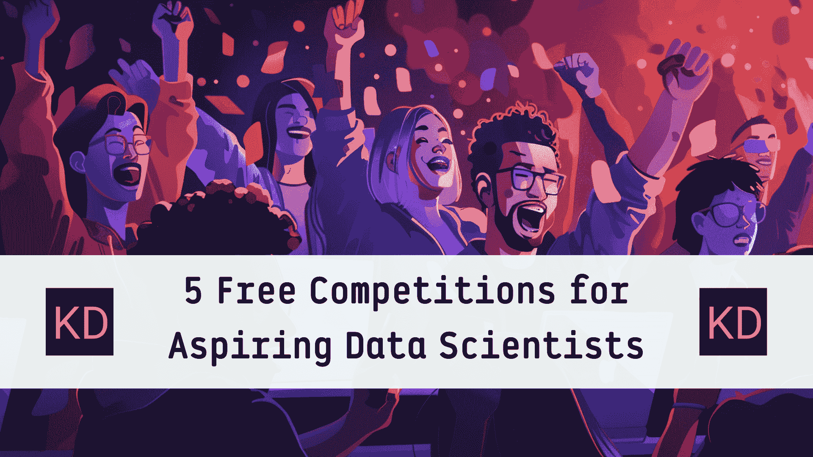

# 5 个免费竞赛，适合有志的数据科学家

> 原文：[`www.kdnuggets.com/5-free-competitions-for-aspiring-data-scientists`](https://www.kdnuggets.com/5-free-competitions-for-aspiring-data-scientists)

图片由编辑 | Midjourney & Canva

数据科学就像艺术，因为解决问题的方法有很多种。这就是为什么数据科学竞赛存在的原因，以获得破解数据科学问题的最佳方法。

* * *

## 我们的前 3 个课程推荐

 1\. [Google 网络安全证书](https://www.kdnuggets.com/google-cybersecurity) - 快速进入网络安全职业生涯。

 2\. [Google 数据分析专业证书](https://www.kdnuggets.com/google-data-analytics) - 提升你的数据分析能力

 3\. [Google IT 支持专业证书](https://www.kdnuggets.com/google-itsupport) - 支持你的组织的 IT 需求

* * *

我见过一些有志的数据科学家因为数据科学竞赛而开启职业生涯。这些竞赛展示了参与者能够解决问题并且具有创造力。此外，竞赛还允许你进行网络交流并向同行学习。

数据科学竞赛是提高我们技能的有趣方式，同时使我们在其他有志之士中具有竞争优势。在本文中，我将解释你现在可以参加的五个免费数据科学竞赛。

你感兴趣吗？让我们开始吧。

## Kaggle 竞赛

Kaggle 是一个专为数据科学家设计的在线平台和社区。它提供了许多功能，包括公开数据集共享用于分析和数据项目、免费的教程学习以及一个 [竞赛平台](https://www.kaggle.com/competitions)。

竞赛平台是数据科学竞赛最受欢迎的地方之一，因为许多现实世界的公司在这里举办竞赛。此外，无论你的经验水平如何，这里都有许多竞赛供有志之士参加。

一些竞赛有时间限制，但许多竞赛总是可以参加。所有这些竞赛都是免费的，许多竞赛甚至还有奖金。然而，那里的竞争可能非常激烈，因为许多才华横溢的专业人士也会参加这些竞赛。不过，如果你想开始你的数据科学竞赛经历，这里是一个不错的地方。

## DataHack 由 Analytic Vidhya 主办

你可以参加的下一个免费竞赛是 [DataHack](https://datahack.analyticsvidhya.com/contest/all/)。这是由 Analytics Vidhya 主办的数据科学竞赛平台，Analytics Vidhya 是一个在线平台和数据科学社区。它提供了许多文章、教程、职位平台和竞赛。

DataHack 是一个数据科学竞赛平台，允许参与者解决现实世界中的问题并争夺奖品。你不需要有数据科学经验就可以参加竞赛，而且是免费的。此外，许多竞赛对公众开放，没有奖品，因为它们旨在用于学习。

总体而言，该平台非常适合那些希望体验与全球其他人竞争的感觉，同时仍能与社区互动的人。通过观察他人如何应对竞赛，你可以学到很多东西。

## MachineHack 的 AI Hackathons

MachineHack 是一个为数据科学和机器学习爱好者提供的在线平台。它主要提供竞赛和黑客马拉松，以提高用户的技能和积累经验。排行榜是公开的，这使得它成为通过竞赛建立声誉的绝佳平台。

[AI Hackathon](https://machinehack.com/hackathons) 是 MachineHack 提供竞赛的地方。你可以加入各种竞赛，无需支付任何费用，同时争夺第一名。有些竞赛可能提供奖金，而许多则用于练习你的技能。

竞赛吸引了许多有才华的个人，因此你可以尝试与他们竞争，提高你的数据科学能力。同时，你可以建立一个项目组合，并与该领域的其他专业人士建立联系。

## AI Crowd

[AI Crowd](https://www.aicrowd.com/challenges) 旨在作为一个研究平台，但它是通过提供数据科学竞赛来推动研究的。该平台的原则是开放科学和可重复的研究，这可能会带来现实问题的创造性解决方案。

与前一个平台类似，这个平台提供了许多有奖金的竞赛。然而，竞赛的种类并不多，因为许多竞赛是为了研究目的而设计的。尽管如此，该平台上的竞赛大多足够高级，可以作为竞赛者的学习经历。

## DrivenData

[DrivenData](https://www.drivendata.org/competitions/) 与 AI Crowd 相似，它是一个基于现实世界问题的数据科学竞赛平台。它为用户提供了解决具有实际影响问题的机会。

竞赛的例子包括预测疾病传播或管理水资源，这使它们非常适合学习并带来实际改变。该平台是提升数据科学技能和积累现实经验的绝佳方式。你甚至可以在过程中赢得一些奖金。

## 结论

竞赛是提高数据科学技能并与同行建立联系的绝佳方式。如果你在竞赛中表现出色，可能会赢得一些奖品。在本文中，我们讨论了 5 个适合有志数据科学家的免费竞赛：

1.  Kaggle 竞赛

1.  Analytic Vidhya 的 DataHack

1.  MachineHack 的 AI Hackathons

1.  AI Crowd

1.  DrivenData

希望这对你有所帮助。

**[Cornellius Yudha Wijaya](https://www.linkedin.com/in/cornellius-yudha-wijaya/)** 是一名数据科学助理经理和数据编写员。在全职工作于 Allianz Indonesia 的同时，他喜欢通过社交媒体和写作媒体分享 Python 和数据技巧。Cornellius 在各种人工智能和机器学习主题上撰写文章。

### 更多相关内容

+   [哈佛大学顶级免费课程，适合有志成为数据科学家的你](https://www.kdnuggets.com/harvard-top-free-courses-for-aspiring-data-scientists)

+   [通过参加竞赛学习机器学习的速度快 4 倍](https://www.kdnuggets.com/2022/01/learn-machine-learning-4x-faster-participating-competitions.html)

+   [Kaggle 竞赛对现实世界问题有用吗？](https://www.kdnuggets.com/are-kaggle-competitions-useful-for-real-world-problems)

+   [适用于数据工程师和数据科学家的高保真合成数据](https://www.kdnuggets.com/2022/tonic-high-fidelity-synthetic-data-engineers-scientists-alike.html)

+   [我们不需要数据科学家，我们需要数据工程师](https://www.kdnuggets.com/2021/02/dont-need-data-scientists-need-data-engineers.html)

+   [数据分析师和数据科学家之间的区别是什么？](https://www.kdnuggets.com/2022/03/difference-data-analysts-data-scientists.html)
