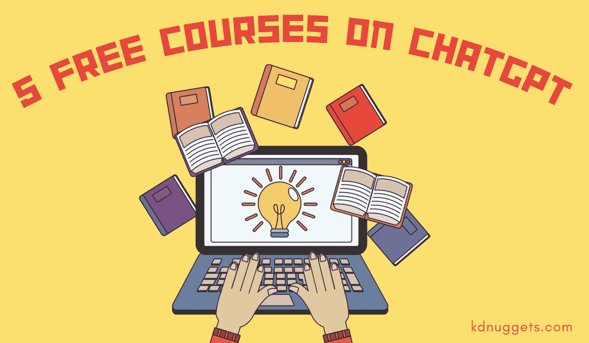

# 5 个免费的 ChatGPT 课程

> 原文：[`www.kdnuggets.com/2023/07/5-free-courses-chatgpt.html`](https://www.kdnuggets.com/2023/07/5-free-courses-chatgpt.html)

你可能听说过很多关于 ChatGPT 的事情，使用过它，也听说过人们用它做的各种疯狂的事情。你可能会想，这些人是如何学会使用 ChatGPT 的，我该从哪里学习？

不用再寻找了。本文将介绍 5 个免费课程，帮助你提升 ChatGPT 技能，并充分利用它！所以我们开始吧

# 1\. ChatGPT 入门

链接: [ChatGPT 入门](https://www.datacamp.com/courses/introduction-to-chatgpt)

如果你在玩弄 ChatGPT，但不清楚它的全部潜力 - 这个 DataCamp 的 ChatGPT 入门课程可能适合你。无需任何先前知识，因此你可以开始了解 ChatGPT 的能力和局限性，以及如何在日常生活中利用它。

许多人在提示 ChatGPT 时遇到困难，本课程的前半部分将讲解提示 ChatGPT 以生成高质量相关内容的最佳实践。然后，你将学习如何通过了解文本摘要和代码解释等不同用例，将 ChatGPT 转化为业务价值。

# 2\. ChatGPT 初学者指南：适用于每个人的终极用例

链接: [ChatGPT 初学者指南：适用于每个人的终极用例](https://www.udemy.com/course/chatgpt-for-beginners-the-ultimate-use-cases-for-everyone/)

很多人想知道如何利用 ChatGPT 将业务提升到新的水平。ChatGPT 已经简化了许多员工的生活，但仍有些人不清楚这些功能是如何实现的。

该课程将介绍如何通过从商业和个人的角度审视 ChatGPT 的能力来大幅提升当前业务。你将了解到如何利用 ChatGPT 为你完成工作，从而赚取更多利润并最大化成本效益。

# 3\. ChatGPT 的提示工程

链接: [ChatGPT 的提示工程](https://www.coursera.org/learn/prompt-engineering)

由计算机科学副教授 Dr. Jules White 设计的课程，旨在向学生介绍如何为大规模语言模型（LLMs）编写有效提示的模式和方法。该课程对任何人开放，只需要基础的计算机知识，例如使用浏览器和访问 ChatGPT。

你将从理解基本提示开始，逐渐建立起编写更复杂提示的能力，帮助你解决各种任务。ChatGPT 具有许多用途，例如担任辅导员、制定餐计划、为软件应用编写代码等。能够理解如何提示 ChatGPT 将使你成为这些生成型 AI 工具的专家用户，拥有强大的提示工程技能，适用于任何用例。

# 4\. ChatGPT 提示工程师课程

链接: [ChatGPT 提示工程师课程](https://www.deeplearning.ai/short-courses/chatgpt-prompt-engineering-for-developers/)

由 DeepLearning.AI 和 OpenAI 提供的 1 小时短期课程，适合所有人——初学者和高级人员。讲师是 Isa Fulford（OpenAI）和 Andrew Ng（DeepLearning.AI），课程仅限时间免费。

在这个短期课程中，你将学习如何使用大型语言模型（LLMs）构建新的高效应用程序，了解提示工程的最佳实践，并展示如何将 LLM API 用于各种任务。

例如，你将学习如何总结用户评价，确定情感，识别主题，改善语法等。在课程中，你将学习如何创建一个独特的聊天机器人，并编写强有力的提示。这些都有助于为开发人员提供如何最有效使用 LLMs 的知识。

无论你有什么样的编程经验，这门课程在 LLMs 如雨后春笋般涌现的世界中都至关重要。

# 5\. 使用 ChatGPT API 构建系统

链接: [使用 ChatGPT API 构建系统](https://www.deeplearning.ai/short-courses/building-systems-with-chatgpt/)

另一个由 DeepLearning.AI 和 OpenAI 提供的短期课程，你将深入了解 ChatGPT API 以及如何使用这些 API 通过链式调用 LLMs 来自动化复杂的工作流程。讲师是 Isa Fulford 和 Andrew Ng，课程仅限时间免费。

这是一个适合初学者的课程，你需要具备基础的 Python 知识来完成课程。该课程也适合中级或高级的机器学习工程师，他们希望了解关于 LLMs 的前沿提示工程技能。

你将学习如何构建与之前提示相关的提示链，创建与完成和新提示交互的系统，以及从课程中学到的知识制作一个客户服务聊天机器人。

# 总结

完成上述所有免费课程后，你将能够熟练理解 ChatGPT，学习如何在不同的应用场景中使用它，定制符合你需求的提示，并利用 ChatGPT API 创建聊天机器人等。

如果你知道其他免费的 ChatGPT 课程，请在下方评论中分享，以便其他人学习！

**[Nisha Arya](https://www.linkedin.com/in/nisha-arya-ahmed/)** 是一位数据科学家、自由技术作家以及 KDnuggets 的社区经理。她特别关注于提供数据科学职业建议或教程以及数据科学的理论知识。她还希望探索人工智能如何或将如何促进人类寿命的延续。她是一位热衷学习的者，寻求拓宽她的技术知识和写作技能，同时帮助指导他人。

### 更多相关主题

+   [5 门免费的 AI 和 ChatGPT 课程，让你从零到百](https://www.kdnuggets.com/5-free-courses-on-ai-and-chatgpt-to-take-you-from-0-100)

+   [Visual ChatGPT：微软结合 ChatGPT 和 VFMs](https://www.kdnuggets.com/2023/03/visual-chatgpt-microsoft-combine-chatgpt-vfms.html)

+   [ChatGPT CLI：将你的命令行界面转换为 ChatGPT](https://www.kdnuggets.com/2023/07/chatgpt-cli-transform-commandline-interface-chatgpt.html)

+   [通过这些课程构建类似 ChatGPT 的聊天机器人](https://www.kdnuggets.com/2023/05/build-chatgptlike-chatbot-courses.html)

+   [实际上免费的免费课程：AI 与机器学习版](https://www.kdnuggets.com/free-courses-that-are-actually-free-ai-ml-edition)

+   [GPT4All 是你文档的本地 ChatGPT，并且它是免费的！](https://www.kdnuggets.com/2023/06/gpt4all-local-chatgpt-documents-free.html)
