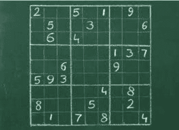

# 5 个免费课程帮助你入门人工智能

> 原文：[`www.kdnuggets.com/2017/02/5-free-courses-getting-started-artificial-intelligence.html`](https://www.kdnuggets.com/2017/02/5-free-courses-getting-started-artificial-intelligence.html)

对人工智能感兴趣？不知道从哪里或如何开始学习？

没有任何东西可以替代严格的正规教育，但由于各种原因，这并非对每个人都是一个选项。然而，深入了解人工智能及其众多交叉和相关领域与应用领域并不需要博士学位。刚开始可能会让人感到不安，但不要灰心；查看这个激励和启发的帖子，作者在一年内从对**机器学习**的初步了解，到积极有效地在工作中应用这些技术。

寻找来自网络上自由提供的材料的研究生级人工智能课程？随着越来越多的高等教育机构决定通过网络让课程材料对非学生开放，几乎任何地方的任何人都可以突然体验到伪大学课程。查看以下所有适合初学者的免费课程材料，其中一些也涵盖了特定应用概念和材料。

一些教授及其分享的材料在塑造世界顶尖 AI 研究人员和从业者的思想方面发挥了重要作用。你完全可以从这些相同的材料和教学中受益。

**1\. [人工智能简介（加州大学伯克利分校）](http://ai.berkeley.edu/home.html)**

这**可能**被视为现存的首屈一指、开创性的、面向在线的开放访问大学级人工智能课程。

并非所有内容对非加州大学伯克利分校的学生开放（作业和自动评分），但绝大多数材料都是公开的。这些材料完整且组织良好，包括以下内容：

+   2014 年春季的课程样本时间表

+   讲义和视频的完整集

+   电子作业提交接口

+   课件

+   Pacman 项目规格

+   伯克利 CS188 课程的源文件和过去的考试 PDF

+   申请 edX 托管的自动评分器的表单（用于作业和项目等）

+   联系信息

虽然提到作业不公开，但一系列逐步进行的 Pacman 项目是公开的，涵盖了搜索、强化学习、分类等方面。

由 Dan Klein 和 Pieter Abbeel 教授主讲，讲座、视频、考试及其他材料可追溯到 2014 年；然而，你在这门课程中学到的内容绝不会过时。我自己几年前就学习了这部分课程材料，你可以在这里获得对基础 AI 主题的充分概述，包括理论和实践。

**2\. [人工智能：原则与技术（斯坦福大学）](http://web.stanford.edu/class/cs221/2016/)**

斯坦福大学在其网站上对这门课程这样描述：

> **这门课程讲什么？** 网络搜索、语音识别、人脸识别、机器翻译、自动驾驶和自动排程有什么共同之处？这些都是复杂的现实世界问题，而人工智能（AI）的目标是用严格的数学工具来解决这些问题。在这门课程中，你将学习驱动这些应用的基础原理，并练习实现一些这些系统。

从一些领域内最受推崇的文本（Russell & Norvig；Koller & Friedman；Hastie, Tibshirani & Friedman；Sutton & Barto）中汲取灵感，这些材料包括笔记、幻灯片、作业、考试和项目（包括解决方案）。你会发现与上述伯克利课程有重叠，但这里开放的作业种类可能更丰富，其中包括如下项目：

+   情感分类

+   二十一点

+   吃豆人

+   排程

+   汽车跟踪

+   语言与逻辑

很容易认为，这前两门课程材料的某种组合会提供一个实质性的人工智能入门教育。此外，考虑到斯坦福课程中至少有一些文本是（合法地）在线免费提供的，几乎可以实现沉浸式体验。

**3\. [强化学习](http://www0.cs.ucl.ac.uk/staff/d.silver/web/Teaching.html)**

这是 David Silver 在伦敦大学学院的著名强化学习课程。材料简明扼要，包括讲座视频和对应的幻灯片，内容丰富。

这不是一门入门 AI 课程，与前两门课程不同，它专注于最令人兴奋和活跃研究的领域之一。由 Google DeepMind 的专家构建的这门课程非常值得花时间学习。

**4\. [深度强化学习（加州大学伯克利分校）](http://rll.berkeley.edu/deeprlcourse/)**

由 Sergey Levine、John Schulman 和 Chelsea Finn 教授的这门课程是对强化学习的另一种探讨。课程目前正在进行中，新的讲座会实时直播，并且课程结束后也可以观看。

课程材料包括前述的视频、幻灯片、教程和作业。计划安排了嘉宾讲座，其中包括 OpenAI 的 Igor Mordatch 和 Google Brain Team 的 Mohammad Norouzi（以及其他伯克利的明星教授）。作业使用了如 TensorFlow 和 OpenAI Gym 等标准框架。

再次提一下，这门课程仍在进行中，所以你需要跟随课程的进度，因为下周的讲座材料尚不可用 :)

**5. [MIT 的自动驾驶汽车深度学习课程](http://selfdrivingcars.mit.edu/)**

这门课程自上线以来在网上引起了广泛关注，这是由 Lex Fridman 主讲的 MIT 自动驾驶汽车课程。与之前的课程一样，这门课程也在进行中。

随着深度学习从研究转向实际应用，看到这些专注于深度学习的应用课程在世界各地的知名大学中涌现出非常有趣。此外，随着[Udacity 的自动驾驶汽车纳米学位](https://www.udacity.com/course/self-driving-car-engineer-nanodegree--nd013)的最近宣布，将这两种热门技术结合到课程材料中是顺理成章的。这不是隐晦的批评：这些技术是非常互补的，代表了*事实上的*技术必要的结合。

回到课程，它包含了视频讲座以及大量相关材料，从经过验证的 Python 和深度学习入门教程到历史性自动驾驶车辆信息。

课程依赖于 DeepTesla 和 DeepTraffic 模拟器，并计划在学期末安排一些嘉宾讲座。有趣的是，公众（非 MIT 学生）甚至可以在网站上注册账户。

**相关**：

+   进入机器学习职业之前需要阅读的 5 本电子书

+   1 月你不能忽视的 5 个机器学习项目

+   自动化机器学习的现状

### 更多相关内容

+   [来自顶级大学的 5 门免费人工智能课程](https://www.kdnuggets.com/5-free-artificial-intelligence-courses-from-top-universities)

+   [免费人工智能与深度学习速成课程](https://www.kdnuggets.com/2022/07/free-artificial-intelligence-deep-learning-crash-course.html)

+   [基于人工智能的系统中的不确定性量化](https://www.kdnuggets.com/2022/04/uncertainty-quantification-artificial-intelligencebased-systems.html)

+   [人工智能如何变革数据集成](https://www.kdnuggets.com/2022/04/artificial-intelligence-transform-data-integration.html)

+   [2022 年最受欢迎的人工智能技能学习指南](https://www.kdnuggets.com/2022/08/indemand-artificial-intelligence-skills-learn-2022.html)

+   [从人工智能到机器学习再到…的演变](https://www.kdnuggets.com/2022/08/evolution-artificial-intelligence-machine-learning-data-science.html)
