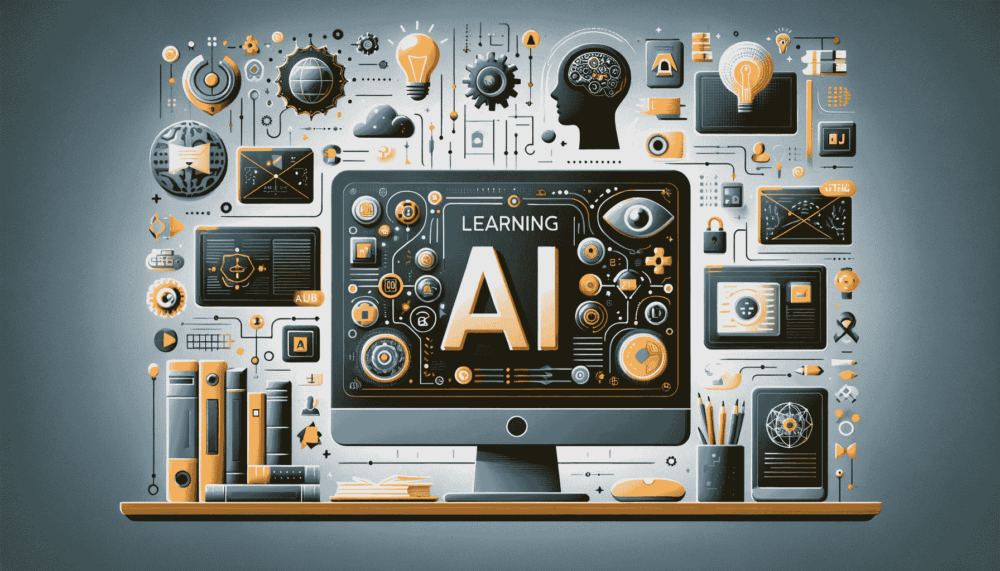

# 5 免费的 AI 和 ChatGPT 课程，从 0 到 100

> 原文：[`www.kdnuggets.com/5-free-courses-on-ai-and-chatgpt-to-take-you-from-0-100`](https://www.kdnuggets.com/5-free-courses-on-ai-and-chatgpt-to-take-you-from-0-100)

图片来源：DALLE 3

生活在这个时代真是太棒了。而现在学习 AI 元素，比如生成式 AI，特别是 ChatGPT，再好不过了！很多人对这个领域感兴趣，但有些人需要更多的知识来达到目标。

* * *

## 我们的前三大课程推荐

 1\. [Google 网络安全证书](https://www.kdnuggets.com/google-cybersecurity) - 快速进入网络安全职业的轨道。

 2\. [Google 数据分析专业证书](https://www.kdnuggets.com/google-data-analytics) - 提升你的数据分析技能

 3\. [Google IT 支持专业证书](https://www.kdnuggets.com/google-itsupport) - 支持你所在的组织的 IT 工作

* * *

本博客提供了来自哈佛、IBM、DeepLearning.AI 等可信机构的免费课程列表。

让我们开始吧。

# Python 人工智能简介（哈佛）

链接: [哈佛 - Python 人工智能简介](https://edx.sjv.io/21q3xz)

这是一个为期 7 周的自学课程，学习如何在 Python 中使用机器学习来进行人工智能研究。在这门课程中，你将学习现代人工智能的不同概念和算法。你将深入探讨实际应用案例，如手写识别和机器翻译。

你不仅会学习到相关知识，还有机会参与实际项目，这将使你能够将理论知识应用于机器学习和人工智能的不同方面，并将其融入到自己的 Python 程序中。

到课程结束时，你将对机器学习中使用的库和人工智能的原理有深刻的了解，以便你可以构建自己的智能系统。

# 人工智能基础知识（IBM）

链接: [IBM - 人工智能基础知识：掌握基础](https://edx.sjv.io/g1d4z0)

AI 无处不在，每个人都在谈论它。如果你对它了解不多——这门课程就是为你准备的。在这门课程中，你将掌握人工智能的基础知识，并理解其应用及机器学习、深度学习和神经网络等关键概念。

你还将深入探讨与 AI 相关的伦理问题，这是目前非常热门的话题。通过这门课程，你还将获得有关如何开始 AI 新职业的专家建议。

# 数据与 AI 基础（Linux）

链接: [Linux Foundation - 数据与 AI 基础](https://edx.sjv.io/oqdB2Y)

Linux 是一种操作系统，通过他们提供的课程，你将学习人工智能的基础知识，以及 Linux Foundation AI & Data 项目生态系统的概述。这是一个为期 10 周的课程，采用自我节奏学习，适合任何对人工智能感兴趣的人，无论其职业背景和技术知识水平如何。

该课程将为你提供进入 Linux Foundation AI & Data 生态系统的机会，这与开源工具相关，帮助你继续发展新的数据和人工智能技能。如前所述，这个课程对来自金融、制造等各种行业的任何人都有帮助。

通过这个课程，你将能够了解人工智能技术领域中可用的不同职业选择。

# 微调大型语言模型（DeepLearning.AI）

链接: [深度学习 - 微调大型语言模型](https://www.deeplearning.ai/short-courses/finetuning-large-language-models/)

你们中的一些人可能已经对人工智能和大型语言模型（LLMs）有了较好的了解，并可能希望完善技能或学习新知识。这个与 DeepLearning.AI 合作的课程将通过一个快速的 1 小时课程讲解微调 LLM 的基础知识。

你将了解微调与提示工程的不同之处，以及何时使用这两者，同时获得使用真实数据集的实践经验，并学习如何将这些工具和技术应用到自己的项目中。

如果你对 Python 语言已经比较熟悉，并且对深度学习框架如 PyTorch 和微调的应用有较好的理解，那么这个课程适合你。

# 人工智能项目

链接: [人工智能项目](https://www.mygreatlearning.com/academy/learn-for-free/courses/artificial-intelligence-projects)

在科技领域，有很多很棒的资源供你学习和发展新技能。然而，重要的是要记住，你必须在实际场景中应用这些技能——以项目的形式。

这个课程旨在帮助学习者将人工智能的解决方案和模型应用于实际问题。你将学习人工神经网络（ANNs）、时间序列预测、聊天机器人等内容。

# 总结

这个博客针对的是人工智能领域的新手，但不限于初学者。如果你想提升现有技能或适应现有技能，这些免费课程可以帮助你快速入门，而无需花费一分钱！

****[Nisha Arya](https://www.linkedin.com/in/nisha-arya-ahmed/)****是一位数据科学家、自由技术写作人，以及 KDnuggets 的编辑和社区经理。她特别感兴趣于提供数据科学职业建议或教程，并围绕数据科学的理论知识展开讨论。Nisha 涉及广泛的主题，并希望探索人工智能如何有益于人类生命的长寿。作为一个热衷学习者，Nisha 寻求拓宽她的技术知识和写作技能，同时帮助指导他人。

### 更多相关内容

+   [2024 年你可以参加的 5 个顶级机器学习课程](https://www.kdnuggets.com/5-top-machine-learning-courses-you-can-take-in-2024)

+   [9 个可以帮助你获得学位的专业证书……如果……](https://www.kdnuggets.com/9-professional-certificates-that-can-take-you-onto-a-degree-if-you-really-want-to)

+   [10 个免费的必修数据科学课程，助你入门](https://www.kdnuggets.com/10-free-must-take-data-science-courses-to-get-started)

+   [在参加任何免费数据科学课程之前阅读此文](https://www.kdnuggets.com/read-this-before-you-take-any-free-data-science-course)

+   [现在可以参加的 8 个 AWS GenAI 课程](https://www.kdnuggets.com/top-8-genai-courses-for-aws-to-take-now)

+   [学习数据科学基础需要多长时间？](https://www.kdnuggets.com/2022/03/long-take-learn-data-science-fundamentals.html)
