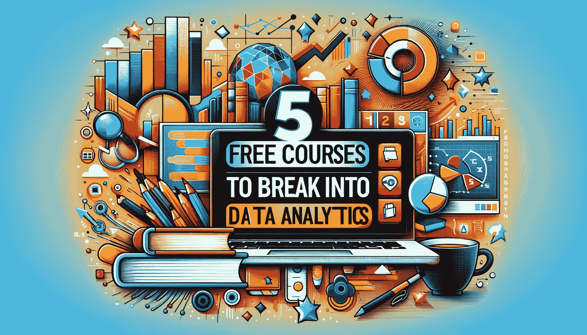

# 5 个免费课程助你进入数据分析领域

> 原文：[`www.kdnuggets.com/5-free-courses-to-break-into-data-analytics`](https://www.kdnuggets.com/5-free-courses-to-break-into-data-analytics)

图像由 DALLE-3 生成

如果你想转行进入数据领域，学习数据分析非常有帮助。这就是为什么我们整理了这份免费数据分析课程的列表，帮助你启动你的学习之旅！

* * *

## 我们的 3 个顶级课程推荐

 1\. [Google 网络安全证书](https://www.kdnuggets.com/google-cybersecurity) - 快速进入网络安全职业。

 2\. [Google 数据分析专业证书](https://www.kdnuggets.com/google-data-analytics) - 提升你的数据分析技能

 3\. [Google IT 支持专业证书](https://www.kdnuggets.com/google-itsupport) - 支持你的组织的 IT

* * *

即使你是一个对数据领域充满热情的绝对初学者，你也会发现这些课程非常有用。因为它们针对的是有志于成为数据专业人士的人，并且不需要先前的编程经验。

让我们开始吧。

# 1\. Google 数据分析专业证书

链接：[Google 数据分析专业证书](https://www.coursera.org/professional-certificates/google-data-analytics)

[Google 数据分析专业证书](https://www.coursera.org/professional-certificates/google-data-analytics) 是 Coursera 上最受欢迎的专业化之一，全球近 200 万学习者参与其中。这个认证项目旨在让你迅速掌握数据分析的基础知识，以帮助你在不到 6 个月的时间内获得入门级的数据分析职位。它也不需要任何先前的经验。

该专业化包括 8 门课程，帮助你学习使用 SQL、电子表格、Tableau 和 R 编程进行数据分析的基础知识。Google 数据分析证书项目包括以下课程：

+   基础知识：数据，数据，无处不在

+   提出问题以做出数据驱动的决策

+   为探索准备数据

+   将数据从脏数据处理为干净数据

+   分析数据以回答问题

+   通过可视化艺术分享数据

+   使用 R 编程进行数据分析

+   Google 数据分析总结项目：完成一个案例研究

**注意**：如果你有兴趣获得 Google 数据分析专业化证书，你需要拥有 Coursera Plus 订阅。如果你无法支付证书费用，你可以考虑申请经济援助。**不过，你可以免费审计课程并访问课程材料。**

# 2\. 针对 Excel 用户的 Python 数据分析

链接：[Python 数据分析（针对 Excel 用户）](https://youtu.be/WcDaZ67TVRo?feature=shared)

谷歌数据分析专业证书应该让你对数据分析领域有了良好的掌握，并掌握了一些基本工具，如电子表格、SQL、R 和 Tableau。

既然你已经熟练使用电子表格，你可以学习用于数据分析的 Python。Python 不仅比 R 更容易学习，而且应用范围更广。

[Excel 用户的数据分析与 Python](https://youtu.be/WcDaZ67TVRo?feature=shared) 课程由 freeCodeCamp 提供，是一门免费课程，用于学习 Python 数据分析的基础。它从教你如何设置 Python 开发环境和使用 Jupyter notebooks 开始。

本课程包括以下三个模块：

+   模块 1: Hello world（涵盖 Python 基础）

+   模块 2: Pandas 简介

+   模块 3: Pandas 中的透视表简介

这门课程应该帮助你打下用 Python 分析数据的基础，然后可以根据需要进行扩展。

# 3\. freeCodeCamp 的 Python 数据分析

链接: [Python 数据分析认证](https://www.freecodecamp.org/learn/data-analysis-with-python/)

既然你已经掌握了 Python 数据分析的基础，现在是时候进一步学习了。[Python 数据分析](https://www.freecodecamp.org/learn/data-analysis-with-python/)，这是 freeCodeCamp 提供的免费认证课程，将教你 Python 数据分析库的所有内容，同时还会进行简单项目的实践。

你将学习使用 Python 库 NumPy、pandas、matplotlib 和 Seaborn：

+   Jupyter notebooks 基础

+   NumPy

+   Pandas

+   数据清洗

+   数据可视化

+   从各种来源读取数据

+   解析 HTML

你将在这个认证中构建的项目包括：

+   均值-方差-标准差计算器

+   人口数据分析器

+   医疗数据可视化工具

+   页面浏览时间序列可视化工具

+   海平面预测器

这个认证完全免费。在完成课程后，你需要完成所有项目才能领取证书。

# 4\. 谷歌高级数据分析专业证书

链接: [谷歌高级数据分析专业证书](https://www.coursera.org/professional-certificates/google-advanced-data-analytics)

[谷歌高级数据分析专业证书](https://www.coursera.org/professional-certificates/google-advanced-data-analytics)将帮助你深入了解 Python 数据分析，同时学习统计学概念和构建机器学习模型。本专业还提供了一个结业项目的机会，以应用你所学的知识。

本专业的课程如下：

+   数据科学基础

+   开始使用 Python

+   超越数字: 将数据转化为洞察

+   统计学的力量

+   回归分析: 简化复杂的数据关系

+   机器学习的基础知识

+   谷歌高级数据分析结业项目

**注意**：与 Google 数据分析专业证书一样，你可以免费旁听 Google 高级数据分析专项。

# 5\. IBM 数据分析师专业证书

链接：[IBM 数据分析师专业证书](https://www.coursera.org/professional-certificates/ibm-data-analyst)

[IBM 数据分析师专业证书](https://www.coursera.org/professional-certificates/ibm-data-analyst)是 IBM 在 Coursera 上提供的另一个全面的数据分析专项，它将帮助你学习所有基础知识和必备工具，以启动你的数据分析职业生涯。

该认证也适合初学者，因此你无需具备编程和数据分析的先前经验。通过一系列课程和顶点项目，该专项将帮助你在以下方面提高熟练度：

+   Python 和 SQL 基础

+   Excel 和 Tableau

+   使用 API 和网络服务

+   Python 数据科学库

推荐的时间框架大约为 4 个月，每周学习约 10 小时。以下是该数据分析师专业证书的课程：

+   数据分析导论

+   数据分析基础知识

+   使用 Excel 和 Cognos 进行数据可视化和仪表盘

+   Python 在数据科学、AI 和开发中的应用

+   数据科学的 Python 项目

+   数据库和 SQL 在 Python 中的数据科学

+   使用 Python 进行数据可视化

+   IBM 数据分析师顶点项目

**注意**：与其他 Coursera 专项课程一样，你可以免费旁听此课程。

# 总结

希望你觉得这份数据分析课程列表对你有帮助。如果你打算很快转向数据分析领域，祝你学习顺利。

如果你在寻找数据岗位市场的技巧，请阅读 你在找数据科学工作时遇到的 7 个困难原因。

****[Bala Priya C](https://www.kdnuggets.com/wp-content/uploads/bala-priya-author-image-update-230821.jpg)**** 是一位来自印度的开发者和技术作家。她喜欢在数学、编程、数据科学和内容创作的交汇处工作。她的兴趣和专长领域包括 DevOps、数据科学和自然语言处理。她喜欢阅读、写作、编码和喝咖啡！目前，她正在通过撰写教程、使用指南、观点文章等与开发者社区分享她的知识。Bala 还创建了有趣的资源概述和编码教程。

### 更多相关内容

+   [真正免费的课程：AI & ML 版](https://www.kdnuggets.com/free-courses-that-are-actually-free-ai-ml-edition)

+   [如果你没有合适的学位，如何进入数据分析领域](https://www.kdnuggets.com/2021/12/how-to-get-into-data-analytics.html)

+   [用 DuckDB 和……将你的笔记本电脑变成个人分析引擎](https://www.kdnuggets.com/turn-your-laptop-into-a-personal-analytics-engine-with-duckdb-and-motherduck)

+   [5 门免费大学数据分析课程](https://www.kdnuggets.com/5-free-university-courses-on-data-analytics)

+   [KDnuggets™ 新闻 22:n03, 1 月 19 日: 深入探讨 13 个数据…](https://www.kdnuggets.com/2022/n03.html)

+   [进入数据科学的 3 种可能途径](https://www.kdnuggets.com/2022/03/3-possible-ways-get-data-science.html)
