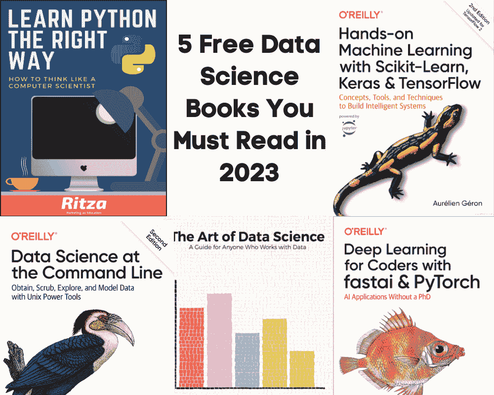
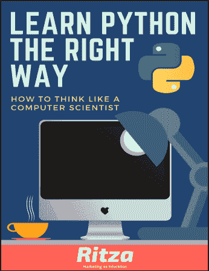
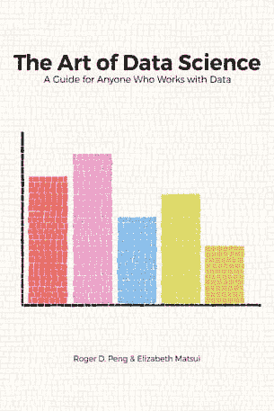
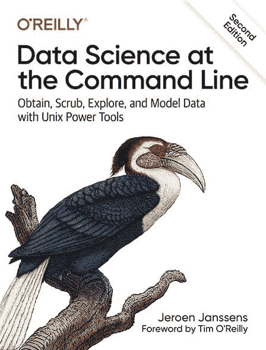
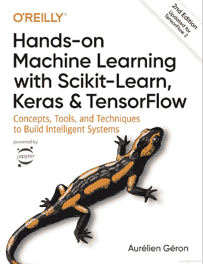
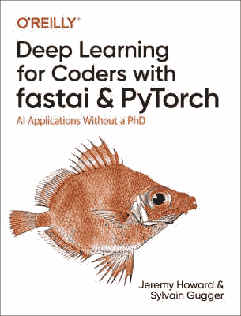

# 2023 年必须阅读的 5 本免费数据科学书籍

> 原文：[`www.kdnuggets.com/2023/01/5-free-data-science-books-must-read-2023.html`](https://www.kdnuggets.com/2023/01/5-free-data-science-books-must-read-2023.html)

图片由作者提供

如果你和我一样是一个书迷，你应该开始关注那些免费的数据科学书籍。这些书将教你 Python 编程、数据科学的艺术、机器学习，并介绍新的工具和框架。此外，一些书籍像网站一样构建，以便你可以探索、搜索和互动。

* * *

## 我们的前三个课程推荐

 1\. [谷歌网络安全证书](https://www.kdnuggets.com/google-cybersecurity) - 快速开启网络安全职业生涯。

 2\. [谷歌数据分析专业证书](https://www.kdnuggets.com/google-data-analytics) - 提升你的数据分析能力

 3\. [谷歌 IT 支持专业证书](https://www.kdnuggets.com/google-itsupport) - 支持你所在组织的 IT 工作

* * *

# 1\. 正确学习 Python

[《正确学习 Python》](https://learnpythontherightway.com/#read) 是一本适合初学者的书，专门为那些想学习 Python 但不知道从何开始的人准备。你可以下载这本书或使用网页界面在线阅读。每一章都有一个 YouTube 教程，详细解释语法和功能。

书封面

你可以阅读书籍，观看教程，甚至在免费的在线 IDE [Replit](https://replit.com/) 上练习代码。它涵盖了你开始数据科学职业生涯所需的所有基础知识。

**本书涵盖：**

1.  Python 设置和基础

1.  变量、表达式和语句

1.  创建第一个 Python 程序

1.  函数

1.  条件语句

1.  复杂函数。

1.  迭代

1.  字符串

1.  元组

1.  事件处理，异常

1.  列表，字典，模块，文件

1.  算法，类，对象，面向对象编程，继承

1.  PyGame，递归，队列

1.  链表，栈，树

# 2\. 数据科学的艺术

[Roger D. Peng 等人的《数据科学的艺术》](https://leanpub.com/artofdatascience) 将数据分析表现为理解问题、探索数据、进行正式建模、解释结果和沟通发现的艺术。

书封面

这本书不仅关注统计和编码，还教你批判性思维。你将学习如何细化问题，进行探索性数据分析，应用线性回归或随机森林，并解释结果以提供可操作的见解。

**本书涵盖：**

1.  分析的周期

1.  陈述和细化问题

1.  探索性数据分析

1.  使用模型探索数据

1.  推理：入门

1.  形式化建模

1.  推理与预测：对建模策略的影响

1.  解释你的结果

1.  沟通

# 3\. 命令行中的数据科学

[命令行中的数据科学](https://datascienceatthecommandline.com/)是我最喜欢的书籍，我在 KDnuggets 博客上写了详细的评价。你可以选择从 Amazon 购买这本书，也可以免费阅读在线版本。在线版本具有互动性，并带有有趣的功能。

书籍封面

本书通过示例介绍了执行各种数据科学任务所需的基本命令行工具。你可以在终端中完成数据清洗、数据分析和可视化，以及训练机器学习模型。

**书中涵盖：**

1.  获取数据

1.  创建命令行工具

1.  数据清洗

1.  使用 Make 进行项目管理

1.  探索数据

1.  并行管道

1.  数据建模

1.  多语言数据科学

# 4\. 使用 Scikit-Learn、Keras 和 TensorFlow 的动手机器学习

[使用 Scikit-Learn、Keras 和 TensorFlow 的动手机器学习](https://books.google.com.pk/books?id=HHetDwAAQBAJ&printsec=frontcover&source=gbs_ge_summary_r&cad=0#v=onepage&q&f=false)将从头开始教你所有关于机器学习的知识。你将学习如何使用 Scikit-Learn、Keras 和 TensorFlow 构建基础到深度学习模型。你将学习分类、RNNs、CNNs、NLP、GANs 和强化学习模型。

书籍封面

在阅读本书之前，你需要了解本书假设你已经掌握了 Python 及 NumPy、pandas、matplotlib 等库的基础知识。

**书中涵盖：**

1.  从头到尾的机器学习项目

1.  分类

1.  训练模型

1.  支持向量机

1.  决策树

1.  集成学习

1.  降维

1.  RNNs 和 CNNs

1.  自然语言处理

1.  GANs

1.  强化学习

1.  规模化训练和部署模型

# 5\. 实用深度学习（面向程序员）

[实用深度学习（面向程序员）](https://fastai.github.io/fastbook2e/)是一本纸质书、一本基于网页的书籍，以及一门介绍如何使用 fastai 和 PyTorch 进行深度学习的课程。这是我最喜欢的课程和书籍。你将学习所有关于神经网络的知识，而无需深入数学或编程。这门课程适合任何了解 Python 基础的人。

书籍封面

**书中涵盖：**

1.  从模型到生产

1.  数据伦理

1.  训练数字分类器

1.  图像分类

1.  其他计算机视觉问题

1.  训练最先进的模型

1.  协同过滤深入探讨

1.  表格建模深入分析

1.  NLP 深入分析：RNNs

1.  使用 fastai 的中级 API 进行数据清洗

1.  从头开始的语言模型

1.  卷积神经网络

1.  ResNets

1.  应用架构深入分析

1.  训练过程

1.  从基础开始的神经网络

1.  使用 CAM 进行 CNN 解释

1.  从头开始的 fastai 学习者

# 结论

这五本书都非常棒，我强烈推荐给任何对数据科学职业感到怀疑的初学者。此外，这些书还附有实用指南、代码示例和视觉辅助，以简单的方式解释复杂的术语。

希望你喜欢我的列表。如果你有任何推荐，请在评论中提到，我会尝试将它们添加到下一个列表中。

**[Abid Ali Awan](https://www.polywork.com/kingabzpro)**（[@1abidaliawan](https://twitter.com/1abidaliawan)）是一位认证的数据科学专业人士，热衷于构建机器学习模型。目前，他专注于内容创作和撰写关于机器学习和数据科学技术的技术博客。Abid 拥有技术管理硕士学位和电信工程学士学位。他的愿景是利用图神经网络为那些正在与心理健康问题作斗争的学生开发一个 AI 产品。

### 更多相关内容

+   [2023 年值得阅读的 5 本自然语言处理免费书籍](https://www.kdnuggets.com/2023/06/5-free-books-natural-language-processing-read-2023.html)

+   [2022 年你需要阅读的机器学习书籍](https://www.kdnuggets.com/2022/04/machine-learning-books-need-read-2022.html)

+   [KDnuggets 新闻，4 月 27 日：对 Papers With Code 的简要介绍；…](https://www.kdnuggets.com/2022/n17.html)

+   [过去 12 个月必须阅读的 NLP 论文](https://www.kdnuggets.com/2023/03/must-read-nlp-papers-last-12-months.html)

+   [2023 年值得阅读的顶级机器学习论文](https://www.kdnuggets.com/2023/03/top-machine-learning-papers-read-2023.html)

+   [KDnuggets 新闻，5 月 4 日：9 门免费哈佛课程以学习数据…](https://www.kdnuggets.com/2022/n18.html)
