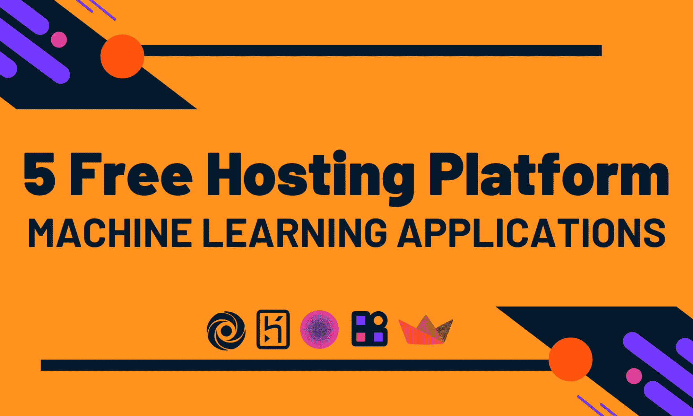

# 5 个免费托管平台用于机器学习应用

> 原文：[`www.kdnuggets.com/2022/05/5-free-hosting-platform-machine-learning-applications.html`](https://www.kdnuggets.com/2022/05/5-free-hosting-platform-machine-learning-applications.html)

作者提供的图片

在完成机器学习项目后，是时候展示你的模型表现如何了。你可以创建前端应用程序或使用 REST API。随着 Streamlit、Gradio 和 FAST API 的引入，创建前端应用程序变得轻松自如。这些 Web 框架只需几行代码即可创建交互式用户界面。与公众分享你的工作有助于你建立强大的数据科学作品集。它也帮助非技术人员理解你的项目。因此，在构建 Web 应用程序后，是时候将应用程序部署到云服务器上了。

* * *

## 我们的前三个课程推荐

 1\. [谷歌网络安全证书](https://www.kdnuggets.com/google-cybersecurity) - 快速进入网络安全职业生涯。

 2\. [谷歌数据分析专业证书](https://www.kdnuggets.com/google-data-analytics) - 提升你的数据分析技能

 3\. [谷歌 IT 支持专业证书](https://www.kdnuggets.com/google-itsupport) - 支持你的组织的 IT 需求

* * *

在这篇博客中，我们将了解五个最佳免费的机器学习演示托管平台。我将分享我在每个平台上的经验，并解释它们为何独特。

# 1\. Hugging Face Spaces

[**Spaces**](https://huggingface.co/spaces) 已成为机器学习社区的新亮点。我使用这个平台来部署几乎所有的机器学习演示。它通过 Git 提供了简单的部署选项，并为环境和 Python 包相关的问题提供了友好的解决方案。Spaces 允许你部署 Streamlit、Gradio 和基于 HTML 的 Web 应用程序。它速度快且可靠，服务器运行时间长。你甚至不需要上传模型或数据。它与 Hugging Face 数据集和模型的集成无缝。此外，Gradio 允许我们使用回调保存和更新标记数据集，这是一个非常令人兴奋的功能。

Spaces 是社区主导的机器学习演示共享平台。你可以找到计算机视觉、音频、自然语言处理、表格数据甚至简单仪表板的 Web 应用程序。你可以将你的应用程序保持私密或与公众分享。这个平台的最佳部分是，它为你提供了许多功能而不收取任何费用。Hugging Face 确实在让机器学习变得更加民主化。

**Gradio 应用在 Spaces 上:** [实时乌尔都语 ASR](https://huggingface.co/spaces/kingabzpro/real-time-Urdu-ASR)

# 2\. Streamlit Cloud

[**Streamlit Cloud**](https://streamlit.io/cloud) 允许你免费部署一个私人和无限制的公共 Streamlit 应用。该平台提供了一键部署选项，支持 GitHub 集成。简而言之，你将代码推送到 GitHub 仓库，Streamlit 云会自动检测更改并重建服务器。此外，你可以享受与数据源的安全集成、身份验证、Streamlit 项目的协作，以及最多 1 GB 的存储空间。

我喜欢 Streamlit Cloud，因为它完全是为 Streamlit 开源 Web 框架量身定制的。每个新版本，平台在速度、正常运行时间和可访问性方面都在不断改进。它对初学者友好，提供了无忧的部署体验。

**Cloud 上的 Streamlit 应用:** [Traingenerator](https://traingenerator.jrieke.com/)

# 3\. Heroku

[**Heroku**](https://www.heroku.com/home) 是一个用于部署各种 Web 应用程序的云平台。你可以从小做起，然后随着时间的推移扩展项目。Heroku 支持最流行的编程语言、数据库和 Web 框架。此外，你可以找到大量的集成用于日志记录、电子邮件通知、测试、仪表盘、图像处理和 DevOps。

我第一次使用托管服务是 Heroku，我发现修改和部署更改到服务器相当容易。你可以使用 GitHub 集成、Heroku CLI 和 Git 远程部署你的应用。我由于存储限制停止使用它，但我仍然认为它是数据应用程序的顶级托管平台之一。易于使用和多个集成使其成为我前三个首选的 Web 开发平台。

**深度学习 Streamlit 应用在 Heroku 上:** [dagshub-pc-app.herokuapp.com](https://dagshub-pc-app.herokuapp.com/)

**教程**: 将 Streamlit WebApp 部署到 Heroku 使用 DAGsHub

# 4\. Deta

[**Deta**](https://web.deta.sh/) 最适合微服务。你可以免费部署 REST API 或 Node.JS 应用，提供免费的存储和数据库。Deta 提供了其风格的 SQL 数据库和大容量存储服务。除此之外，你还可以安排运行、自定义域名，并添加 API 密钥。

在我第一次使用 Deta 时，我完全被 Deta CLI 和服务器提供的简洁性和强大功能所吸引。我甚至写了一篇博客: 部署你的第一个机器学习 API。我花了 5 分钟理解文档、安装 CLI 并部署我的机器学习应用。如果你想创建自己的机器学习微服务并启动自己的公司，那么 Deta 是最好的起点。

**FastAPI ML 应用在 Deta 上:** [fastapimlproject.deta.dev/docs](https://fastapimlproject.deta.dev/docs)

# 5\. Replit

[**Replit**](https://replit.com/~)是一个云集成开发环境（IDE），为各种项目提供免费计算、存储和托管服务。它是一个由社区驱动的平台，人们（主要是学生）在这里分享与游戏、网页设计、微服务构建，甚至创建新框架相关的项目。

它如何帮助我们构建机器学习应用程序？在每个项目中，你可以运行一个临时服务器，并使用公共 URL 托管你的应用程序。例如，创建一个 FastAPI 机器学习应用程序，当你按下运行按钮时，它会自动启动一个带有 URL 的 Web 服务器，你可以分享这个 URL。你可以使用 ping 技巧保持服务器在线，或者购买 Pro 版本。

目前，我在运行四个强化学习机器人、三个 NLP 聊天机器人和一个 FastAPI 项目。你可以在一个地方创建和部署应用程序，而无需担心依赖关系或开发问题。这是我尝试新事物和测试 API 的首选平台。如果你是编程初学者，想进入机器学习的世界，那么从 Replit 开始吧。

**Replit 上的应用程序：** [DailoGPT-RickBot](https://replit.com/@kingabzpro/DailoGPT-RickBot#web_app.py)

**[Abid Ali Awan](https://www.polywork.com/kingabzpro)**（[@1abidaliawan](https://twitter.com/1abidaliawan)）是一位认证数据科学专业人士，热衷于构建机器学习模型。目前，他专注于内容创作，并撰写有关机器学习和数据科学技术的技术博客。Abid 拥有技术管理硕士学位和电信工程学士学位。他的愿景是利用图神经网络构建一款 AI 产品，帮助那些在精神健康方面挣扎的学生。

### 相关话题

+   [KDnuggets 新闻，5 月 18 日：5 个免费的机器学习托管平台…](https://www.kdnuggets.com/2022/n20.html)

+   [介绍 OpenChat：一个免费的、简单的平台用于构建…](https://www.kdnuggets.com/2023/06/introducing-openchat-free-simple-platform-building-custom-chatbots-minutes.html)

+   [KDnuggets 新闻 2022 年 3 月 9 日：5 步构建机器学习 Web 应用程序…](https://www.kdnuggets.com/2022/n10.html)

+   [Qdrant：具有托管云平台的开源向量搜索引擎](https://www.kdnuggets.com/2023/02/qdrant-open-source-vector-search-engine-managed-cloud-platform.html)

+   [数据成熟度金字塔：从报告到主动智能数据平台…](https://www.kdnuggets.com/the-data-maturity-pyramid-from-reporting-to-a-proactive-intelligent-data-platform)

+   [5 步入门 Google Cloud Platform](https://www.kdnuggets.com/5-steps-google-cloud-platform)
