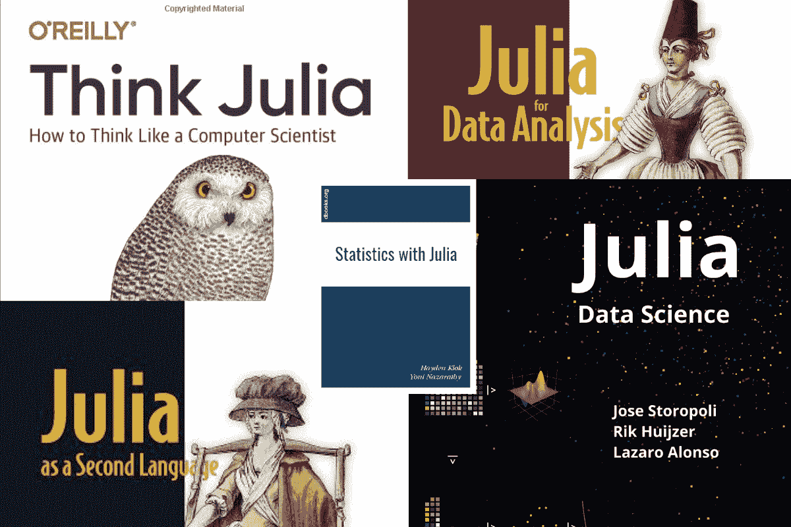
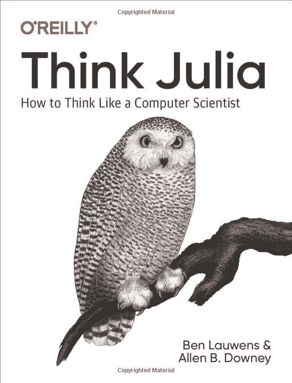
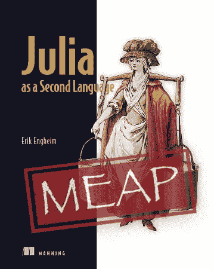
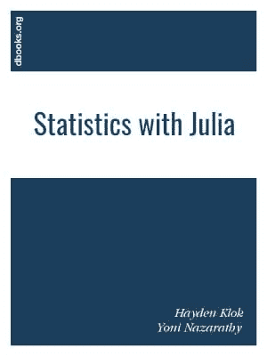
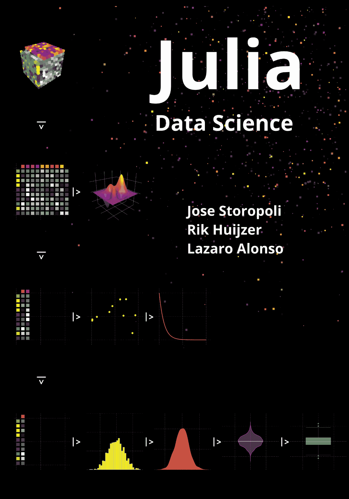
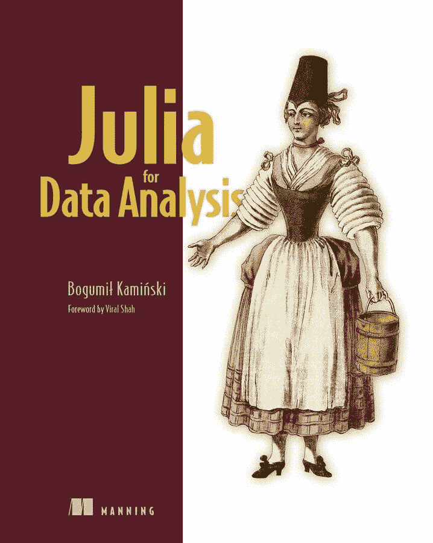

# 5 本免费的 Julia 数据科学书籍

> 原文：[`www.kdnuggets.com/2023/06/5-free-julia-books-data-science.html`](https://www.kdnuggets.com/2023/06/5-free-julia-books-data-science.html)

作者提供的图片

你可能经常听到关于 Julia 以及它为何是数据科学未来的讨论，但你不知道从何开始。我有一个完美的解决方案。你可以通过查看关于 Julia 编程语言的精彩免费书籍列表来为软件工程和数据科学相关任务做好准备。

* * *

## 我们的前三个课程推荐

 1\. [Google 网络安全证书](https://www.kdnuggets.com/google-cybersecurity) - 快速进入网络安全职业生涯。

 2\. [Google 数据分析专业证书](https://www.kdnuggets.com/google-data-analytics) - 提升你的数据分析技能

 3\. [Google IT 支持专业证书](https://www.kdnuggets.com/google-itsupport) - 支持你组织的 IT 部门

* * *

你将学习有关 Julia 数据框架、数据可视化、机器学习以及创建和运行网络服务的库。此外，你还将学习面向对象编程、元编程和并行计算。

# 1\. 《Think Julia》

[《Think Julia: How to Think Like a Computer Scientist》](https://benlauwens.github.io/ThinkJulia.jl/latest/book.html#_the_first_program)由 Ben Lauwens 和 Allen B. Downey 编写，是一本适合所有想学习 Julia 的读者的书，从初学者到经验丰富的程序员皆可。

图书封面

本书从 Julia 的介绍开始，解释了它是什么、如何工作以及为什么与其他编程语言不同。作者随后简要回顾了 Julia 的历史，并讨论了它当前的发展和未来潜力。

本书通过简单的示例来说明每个概念，并在每章末尾提供练习题以巩固学习。

本书还涵盖了更高级的主题，包括数组、矩阵、字符串和输入/输出。此外，它还涉及面向对象编程、元编程和并行计算。

# 2\. 《Julia 作为第二语言》

[《Julia 作为第二语言》](https://www.manning.com/books/julia-as-a-second-language)由 Erik Engheim 编写，是一本适合已经熟悉其他编程语言的程序员的入门指南，帮助他们将 Julia 学习为第二语言。

本书从 Julia 及其历史的介绍开始，接着讨论了它的特性、优点和独特的卖点。它将 Julia 与其他流行编程语言，如 Python、MATLAB 和 R 进行了比较。

书籍封面

书中还涵盖了面向对象编程、函数式编程和高级主题，如数组、矩阵、字符串以及输入/输出。作者还涉及了元编程、并行计算以及如何使用外部库和包。

# 3\. 使用 Julia 进行统计分析

[使用 Julia 进行统计分析](https://www.dbooks.org/statistics-with-julia-1534/) 由 Hayden Klok 和 Yoni Nazarathy 编写，是一本关于使用 Julia 编程语言进行统计分析的全面指南。适合任何希望学习如何使用 Julia 进行统计分析和建模的人。

书籍封面

书中涵盖了基本语法，接着介绍了统计学基础，包括概率论、描述性统计、统计推断、统计方法和模型，包括线性回归、逻辑回归、聚类和时间序列分析。

书中还涵盖了如何处理外部数据源，包括 CSV 文件和数据库，以及如何使用 Julia 的绘图库可视化数据。

你将学习统计分析中的可重复性以及如何组织和记录代码和数据。

# 4\. Julia 数据科学

[Julia 数据科学](https://juliadatascience.io/) 由 Storopoli、Huijzer 和 Alonso 编写，是一本开源且开放访问的书籍，介绍了如何使用 Julia 编程进行数据科学相关任务。

书中首先解释了什么是数据科学和软件工程，然后解释了为什么你应该花时间学习那些在招聘信息中从未提到的语言。

书籍封面

书本开始介绍 Julia 语法、数据结构、文件系统和标准库。然后，转到数据分析和建模所需的重要主题，使用数据框和数据可视化库。

这本书写得很好，易于理解，为初学者或有经验的数据科学家提供了数据分析和建模库的全面介绍。

# 5\. Julia 数据分析

[Julia 数据分析](https://www.manning.com/books/julia-for-data-analysis) 由 Bogumi? Kami?ski 编写，是一本实用指南，适合经验丰富的数据分析师、程序员以及希望学习如何使用 Julia 进行有效数据分析和报告的初学者。

书籍封面

这本书分为两个部分。

第一部分是关于 Julia 编程的基础，你将学习语法、循环和数据结构。接着，你将学习在创建可扩展项目时 Julia 语言中重要的元素。

第二部分涉及数据分析的工具箱。在这一部分，你将学习如何使用数据框处理数据，清洗、操作和转换数据以进行分析，并创建一个用于分享数据分析结果的网页服务。

**[Abid Ali Awan](https://www.polywork.com/kingabzpro)** ([@1abidaliawan](https://twitter.com/1abidaliawan)) 是一位认证数据科学专业人士，热衷于构建机器学习模型。目前，他专注于内容创作和撰写有关机器学习和数据科学技术的技术博客。Abid 拥有技术管理硕士学位和电信工程学士学位。他的愿景是利用图神经网络为那些在心理健康方面挣扎的学生打造一款人工智能产品。

### 更多相关主题

+   [3 个用于数据可视化的 Julia 包](https://www.kdnuggets.com/2023/02/3-julia-packages-data-visualization.html)

+   [使用 Julia 进行数据分析](https://www.kdnuggets.com/learn-data-analysis-with-julia)

+   [我应该学习 Julia 吗？](https://www.kdnuggets.com/2022/11/learn-julia.html)

+   [如何在 Jupyter Notebook 上设置 Julia](https://www.kdnuggets.com/2022/11/setup-julia-jupyter-notebook.html)

+   [KDnuggets 新闻，11 月 2 日：数据科学的现状…](https://www.kdnuggets.com/2022/n43.html)

+   [2023 年你必须阅读的 5 本免费数据科学书籍](https://www.kdnuggets.com/2023/01/5-free-data-science-books-must-read-2023.html)
