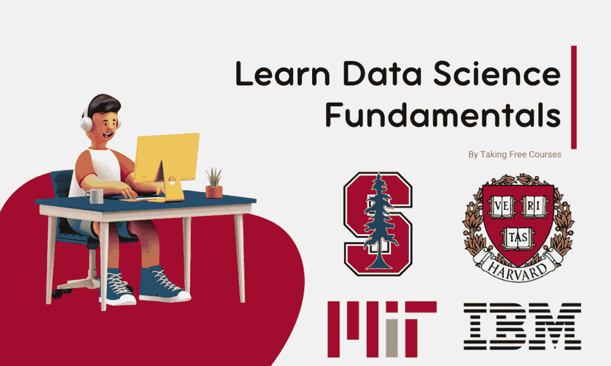

# 5 门免费在线课程，学习数据科学基础

> 原文：[`www.kdnuggets.com/5-free-online-courses-to-learn-data-science-fundamentals`](https://www.kdnuggets.com/5-free-online-courses-to-learn-data-science-fundamentals)

作者提供的图片

很多技术专家和课程销售商会告诉你，你可以在短短两周或两个月内成为一名准备好的数据科学家。然而，他们往往隐藏了很多事实。虽然在短时间内成为专业数据科学家是可能的，但这通常假设你已经具备了数据科学基础知识，如统计学、概率论、SQL 和用于数据管理和分析的 Python，以及各种数据处理和分析技术。

* * *

## 我们的前三大课程推荐

 1\. [谷歌网络安全证书](https://www.kdnuggets.com/google-cybersecurity) - 快速进入网络安全职业生涯。

 2\. [谷歌数据分析专业证书](https://www.kdnuggets.com/google-data-analytics) - 提升你的数据分析技能

 3\. [谷歌 IT 支持专业证书](https://www.kdnuggets.com/google-itsupport) - 支持你的组织在 IT 方面

* * *

在开始数据科学之旅之前，我强烈建议你花时间学习这些基础知识。我在这篇博客中分享的课程来自顶尖大学和 IBM，提供高质量的教育，帮助你建立坚实的基础。

## 1\. **数据库入门与 SQL** - 哈佛大学

**数据库入门与 SQL** 是任何希望了解数据存储和处理核心的人的绝佳起点。该课程涵盖了 SQL 的基础知识，SQL 是用于与数据库沟通的语言。通过动手项目和现实世界的例子，你将学习如何查询数据库、设计模式、查询优化等。

**链接：** [CS50 的 SQL 数据库入门 (harvard.edu)](https://cs50.harvard.edu/sql/2024/)

## 2\. **Python 数据科学入门** - 哈佛大学

Python 数据科学课程非常适合那些希望使用 Python 这个数据科学和机器学习中最受欢迎的编程语言来深入数据科学的人。该课程涵盖数据处理、可视化、分析和建模，使用的库包括 pandas、matplotlib 和 scikit-learn。课程结束时，你将能够进行复杂的数据分析并构建预测模型。

**链接：** [Python 数据科学入门 | 哈佛大学](https://pll.harvard.edu/course/introduction-data-science-python/2023-10)

## 3\. **使用 R 进行统计学习** – 斯坦福大学

统计学习与 R 课程是对数据科学和机器学习中使用的关键概念和技术的全面介绍。本课程涵盖统计方法、线性回归、分类、重采样方法、基于树的方法、聚类、深度学习等。它为那些具备基础统计学和线性代数知识的人设计。课程材料包括讲座视频和练习。

**链接：** [统计学习 | 斯坦福在线](https://online.stanford.edu/courses/sohs-ystatslearning-statistical-learning-r)

## 4\. 数据科学数学主题 – 麻省理工学院

数据科学数学主题课程深入探讨了数据科学的数学基础。该课程专为那些对研究用于从数据中提取信息的算法理论方面有浓厚兴趣的人而设计。课程内容包括主成分分析、流形学习和扩散图谱、谱聚类、群体测试、随机图上的聚类等。

**链接：** [数据科学数学主题 | 数学 | 麻省理工学院开放课程](https://ocw.mit.edu/courses/18-s096-topics-in-mathematics-of-data-science-fall-2015/)

## 5\. 数据分析入门 - IBM

数据分析入门课程，提供于 Coursera，提供了对数据分析的实用介绍。本课程涵盖数据分析过程，从数据清理和准备到可视化和解释。你将通过视频教程、书面内容、测验和最终作业来学习基础概念。

**链接：** [IBM 数据分析入门课程 | Coursera](https://imp.i384100.net/KjQo2a)

## 结论

如果你对数据科学职业感到困惑或不知从何开始，我建议从免费数据科学基础课程开始。这些课程简短且涵盖 Python、SQL、统计学和各种数据分析技术的基础知识。完成这些课程后，我强烈建议报名参加付费训练营，以成为一名专业的数据科学家。训练营将为你提供实际经验，并为现代职场做好准备。

****[Abid Ali Awan](https://www.polywork.com/kingabzpro)**** ([@1abidaliawan](https://www.linkedin.com/in/1abidaliawan)) 是一位认证的数据科学专业人士，热衷于构建机器学习模型。目前，他专注于内容创作，并撰写关于机器学习和数据科学技术的技术博客。Abid 拥有技术管理硕士学位和电信工程学士学位。他的愿景是使用图神经网络为患有心理疾病的学生开发 AI 产品。

### 关于这个话题更多

+   [5 个免费在线课程，学习数据工程基础](https://www.kdnuggets.com/5-free-online-courses-to-learn-data-engineering-fundamentals)

+   [KDnuggets 新闻 2022 年 3 月 16 日：学习数据科学基础及更多…](https://www.kdnuggets.com/2022/n11.html)

+   [学习数据科学基础需要多长时间？](https://www.kdnuggets.com/2022/03/long-take-learn-data-science-fundamentals.html)

+   [KDnuggets 新闻 4 月 6 日：8 门免费 MIT 课程学习数据科学…](https://www.kdnuggets.com/2022/n14.html)

+   [8 门免费 MIT 课程在线学习数据科学](https://www.kdnuggets.com/2022/03/8-free-mit-courses-learn-data-science-online.html)

+   [6 个最佳免费在线课程学习 Python 并提升你的职业生涯](https://www.kdnuggets.com/2022/11/corise-6-best-free-online-courses-python-boost-career.html)
