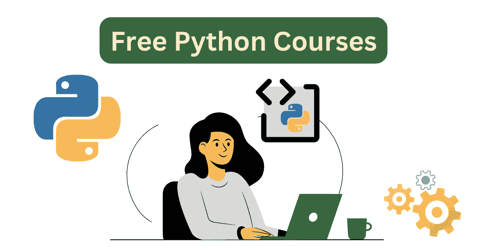

# 5 个适合数据科学初学者的免费 Python 课程

> 原文：[`www.kdnuggets.com/5-free-python-courses-for-data-science-beginners`](https://www.kdnuggets.com/5-free-python-courses-for-data-science-beginners)

图片由作者提供

如果你正在阅读这篇文章，你可能希望学习数据科学并尽快找到你的第一个数据角色。那么你该如何开始学习数据科学呢？

* * *

## 我们的三大课程推荐

 1\. [Google 网络安全证书](https://www.kdnuggets.com/google-cybersecurity) - 快速进入网络安全职业轨道

 2\. [Google 数据分析专业证书](https://www.kdnuggets.com/google-data-analytics) - 提升你的数据分析水平

 3\. [Google IT 支持专业证书](https://www.kdnuggets.com/google-itsupport) - 支持你组织的 IT

* * *

在复习完基本的数学技能后，你可以开始学习 SQL 或者像 Python 或 R 这样的编程语言。如果你学习 R，你可以进行数据和统计分析。但 Python 比 R 更加多才多艺且更易于学习。

这里有一份适合初学者的 Python 编程课程列表，这些课程将帮助你学习基础知识并开始构建项目。让我们开始吧！

## 1\. Python for Beginners – freeCodeCamp

[初学者的 Python 课程](https://youtu.be/eWRfhZUzrAc)是 freeCodeCamp 的 YouTube 频道上的一门完整的 Python 入门课程。该课程超过 4.5 小时，通过编写两个简单的游戏：石头剪子布和 Blackjack，让你掌握 Python 基础知识并快速上手。

课程开始时会探讨像数据类型、变量和运算符等基础知识。然后覆盖控制流、内置函数和数据结构。课程还探讨了高级概念，如装饰器、面向对象编程和函数式编程。

该课程不要求具备 Python 的任何编程经验。但它涵盖了足够的内容，帮助你感到自信，开始构建自己的项目。

**链接**: [Python for Beginners – Full Course [Programming Tutorial]](https://youtu.be/eWRfhZUzrAc)

## 2\. Python – Kaggle

如果你喜欢通过简短的文本课程进行学习，并在过程中运行代码片段，那么 [Python](https://www.kaggle.com/learn/python) 课程适合你。

除了 Python 的语法和变量基础之外，该课程还涵盖了以下主题：

+   函数

+   布尔值和条件语句

+   列表

+   循环和列表推导

+   字符串和字典

+   使用外部库

**链接**: [Learn Python | Kaggle](https://www.kaggle.com/learn/python)

## 3\. Python 教程（含迷你项目）– freeCodeCamp

在第一门课程中，[Python 初学者](https://youtu.be/eWRfhZUzrAc)，你将完成两个简单的游戏项目。 [初学者 Python 教程（附迷你项目）](https://youtu.be/qwAFL1597eM?) 是一个包含 23 章的免费视频课程，每章专注于一个不同的主题。

在课程中，你还将参与几个迷你项目。课程从基础知识如数据类型和内置数据结构开始。但它还涵盖了以下主题：

+   函数

+   递归

+   作用域和闭包

+   命令行参数

+   Lambda 函数和高阶函数

+   面向对象编程

+   错误和异常

+   文件操作

+   虚拟环境

**链接**: [初学者 Python 教程（附迷你项目）](https://youtu.be/qwAFL1597eM)

## 4\. Python 教程 – W3Schools

[Python 教程](https://www.w3schools.com/python/)在 W3Schools 上提供了简短的课程内容和快速练习题及示例，你可以在浏览器中运行这些示例。

W3Schools 的 Python 教程涵盖了以下主题：

+   控制流

+   内置数据结构

+   类和对象

+   继承多态

+   处理日期、JSON 和正则表达式

除了 Python 基础知识，Python 教程还包括有关 Python 数据科学库的课程：NumPy、pandas 和 matplotlib。

**链接**: [Python 教程](https://www.w3schools.com/python/)

## 5\. Python 的面向对象编程

从目前所学的课程中，你应该已经对 Python 中的面向对象编程（OOP）有所了解，现在是时候进一步学习了。 [Python 的面向对象编程](https://youtu.be/Ej_02ICOIgs) 在 freeCodeCamp 的 YouTube 频道上免费提供，是一门全面的课程，旨在学习 OOP 基础知识。

这门课程涵盖了以下内容：

+   开始学习类

+   构造函数

+   类方法与静态方法

+   继承

+   获取器和设置器

+   OOP 原则

**链接**: [面向对象编程 Python 完整课程（适合初学者）](https://youtu.be/Ej_02ICOIgs)

## 总结

如果你是一个希望学习 Python 的数据科学初学者，我希望你发现这个课程列表对你有帮助。即使在学习 Python 的过程中，也要确保在旁边做一些有趣的项目，以便你能够应用所学的知识并构建你的项目作品集。

祝学习愉快，编码顺利！

****[Bala Priya C](https://www.kdnuggets.com/wp-content/uploads/bala-priya-author-image-update-230821.jpg)**** 是来自印度的开发人员和技术作家。她喜欢在数学、编程、数据科学和内容创作的交汇点上工作。她的兴趣和专长领域包括 DevOps、数据科学和自然语言处理。她喜欢阅读、写作、编码和咖啡！目前，她正在通过编写教程、操作指南、观点文章等，学习并与开发者社区分享她的知识。Bala 还创建了引人入胜的资源概述和编码教程。

### 更多相关主题

+   [7 门适合数据科学初学者的免费 Kaggle 微课程](https://www.kdnuggets.com/7-free-kaggle-micro-courses-for-data-science-beginners)

+   [5 门适合数据科学初学者的免费 SQL 课程](https://www.kdnuggets.com/5-free-sql-courses-for-data-science-beginners)

+   [3 门适合初学者的免费机器学习课程](https://www.kdnuggets.com/2022/12/3-free-machine-learning-courses-beginners.html)

+   [KDnuggets 新闻，12 月 14 日：3 门免费机器学习课程…](https://www.kdnuggets.com/2022/n48.html)

+   [KDnuggets 新闻，10 月 5 日：适合初学者的顶级免费 Git GUI 客户端•…](https://www.kdnuggets.com/2022/n39.html)

+   [初学者免费数据工程课程](https://www.kdnuggets.com/free-data-engineering-course-for-beginners)
