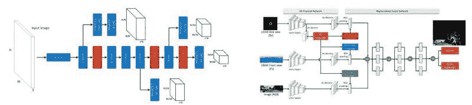
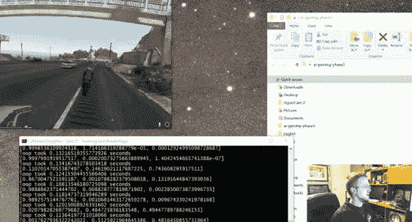

# 5 个免费的资源，帮助你入门自动驾驶车辆

> 原文：[`www.kdnuggets.com/2017/07/5-free-resources-getting-started-self-driving-vehicles.html`](https://www.kdnuggets.com/2017/07/5-free-resources-getting-started-self-driving-vehicles.html)

来自《计算机视觉在自主车辆中的应用：问题、数据集和最新进展》，见下文。

对自动驾驶车辆感兴趣？不知道从哪里或如何开始学习？

正式的相关教育资源稀缺，因此有兴趣学习的人必须以黑客的心态进行。我收集了一份短名单，包括 5 个免费的资源，帮助新手找到自己的方向。希望这些对一些人有用。

**1\. 自动驾驶汽车中使用的机器学习算法**

这篇 KDnuggets 文章将让你初步了解自主驾驶车辆算法的世界，提供对这条道路的入门见解，言外之意。

> 机器学习应用包括通过来自不同外部和内部传感器的数据融合来评估驾驶员状况或驾驶场景分类。我们考察了用于自动驾驶汽车的不同算法。

**2\. [自主车辆中的计算机视觉：问题、数据集和最新进展](https://arxiv.org/pdf/1704.05519.pdf)**

由 Joel Janai、Fatma Güney、Aseem Behl 和 Andreas Geiger 总结的当前自主车辆计算机视觉的状态。从摘要：

> 近年来，人工智能相关领域，如计算机视觉、机器学习和自主车辆，取得了惊人的进展。然而，随着任何快速发展的领域，保持最新或作为初学者进入该领域变得越来越困难。虽然已经撰写了几篇特定主题的调查论文，但至今没有关于自主车辆计算机视觉中问题、数据集和方法的一般调查。这篇论文试图通过提供该主题的最新调查来缩小这一差距。我们的调查包括历史上最相关的文献以及几个特定主题的最新进展，包括识别、重建、运动估计、跟踪、场景理解和端到端学习。

一篇详细而全面的概述，可能是任何希望快速入门该领域的最佳起点，集中在一个地方。

**3\. [自动驾驶汽车的深度学习](http://selfdrivingcars.mit.edu/)**

这是 MIT 6.S094 的课程网站。

> 这门课程通过构建自动驾驶汽车的实际主题介绍深度学习的实践。它对初学者开放，并设计为适合那些对机器学习新手，但也可以为希望了解深度学习方法及其应用的高级研究人员提供实用概述。

通过讲座幻灯片、视频和嘉宾讲座，这对于任何对深度神经网络应用于自动驾驶汽车感兴趣的人来说，都是一个很好的资源。

**4\. [Python 玩《侠盗猎车手 V》](https://www.youtube.com/watch?v=ks4MPfMq8aQ)**

这是 Harrison Kinsley（又名 sentdex）的一系列持续视频，描述如下：

> 这个项目的目的是使用 Python 玩《侠盗猎车手 5》。GTA V 中有很多事情可以做，但我们的首要目标是创建一个自动驾驶汽车（在这种情况下是滑板车）。

来自 Harrison Kinsley 的 Python 玩《侠盗猎车手 V》视频系列。

该系列目前已超过 17 个视频，分成易于消化的部分。查看这里的附带代码：[探索使用 Python 玩《侠盗猎车手 5》](https://github.com/Sentdex/pygta5)。此外，Harrison 还有许多其他视频教程系列，涵盖从 Python 基础到使用 Python 进行财务分析、实践机器学习等，可能也会引起读者的兴趣。

**5\. [自动驾驶汽车工程师纳米学位](https://www.udacity.com/course/self-driving-car-engineer-nanodegree--nd013)**

> 自动驾驶汽车代表了现代历史上最重要的进展之一。它们的影响将超越技术、超越交通、超越城市规划，改变我们日常生活的方式，这些方式我们尚未想象。
> 
> 参与此项目的学生将掌握将塑造未来的技术。

除了 Udacity 的市场营销之外，这可能是目前在自动驾驶车辆领域中可以获得的最全面、最集中的正规培训/教育。我之所以说**可能**，是因为我没有第一手经验，但我也没有看到其他可能竞争者。目前课程资料可以免费访问，而报名纳米学位证书则需要一些费用。

这里是一个学生的 [第一学期回顾](https://medium.com/@mithi/a-short-review-of-udacitys-self-driving-car-engineer-nanodegree-term-1-e36f5b9a72)，帮助填补这个空白。如果你想了解你将在这样的课程集合中学到什么，可以在这里找到另一位学生的 [课程笔记和代码](https://github.com/jessicayung/self-driving-car-nd)。以下是直接来自 Udacity 的一些 [额外自动驾驶汽车资源](https://github.com/udacity/self-driving-car)。

**相关**：

+   开始人工智能的 5 个免费课程

+   进入机器学习职业前要读的 5 本电子书

+   机器学习和数据科学必读的 10 本免费书籍

* * *

## 我们的前三大课程推荐

 1\. [谷歌网络安全证书](https://www.kdnuggets.com/google-cybersecurity) - 快速进入网络安全职业的快车道。

 2\. [谷歌数据分析专业证书](https://www.kdnuggets.com/google-data-analytics) - 提升你的数据分析技能

 3\. [谷歌 IT 支持专业证书](https://www.kdnuggets.com/google-itsupport) - 在 IT 领域支持你的组织

* * *

### 更多相关内容

+   [开始使用自动化文本摘要](https://www.kdnuggets.com/2019/11/getting-started-automated-text-summarization.html)

+   [开始清理数据](https://www.kdnuggets.com/2022/01/getting-started-cleaning-data.html)

+   [开始使用 SQL 备忘单](https://www.kdnuggets.com/2022/08/getting-started-sql-cheatsheet.html)

+   [开始使用 spaCy 进行自然语言处理](https://www.kdnuggets.com/2022/11/getting-started-spacy-nlp.html)

+   [开始使用 PyCaret](https://www.kdnuggets.com/2022/11/getting-started-pycaret.html)

+   [开始使用 PyTorch Lightning](https://www.kdnuggets.com/2022/12/getting-started-pytorch-lightning.html)
