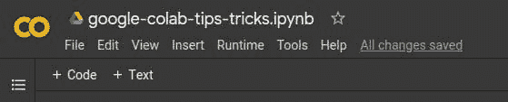
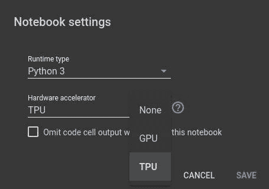
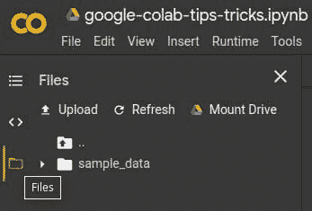
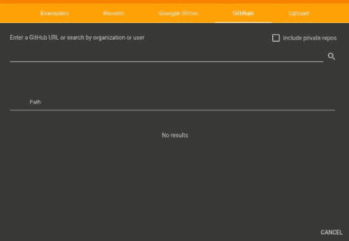
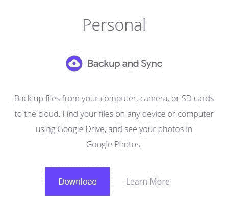

# 5 个 Google Colaboratory 小贴士

> 原文：[`www.kdnuggets.com/2020/03/5-google-colaboratory-tips.html`](https://www.kdnuggets.com/2020/03/5-google-colaboratory-tips.html)

评论

作为一个用于学习和实践的计算平台，特别是用于机器学习和数据科学，Google Colab 几乎无与伦比。无需设置、易于使用、稳定的笔记本环境——与从多个设备无缝访问云端的功能相结合——在许多非关键情况下，这种速度、可靠性和可配置性的适度降低是值得的。对我来说，笔记本、工作站和 Chromebook 之间无忧的便携共享访问对于学习和测试至关重要，Colab 在这方面做得非常好，且极为简便。

我们之前介绍了以下 Google Colab 小贴士与技巧：

**3 个重要的 Google Colaboratory 小贴士与技巧**

1.  使用免费 GPU 运行时

1.  安装库

1.  上传和使用数据文件

**3 个更多的 Google Colab 环境管理小贴士**

1.  下载文件到本地计算机

1.  访问你的 Google Drive 文件系统

1.  使用存储在 Google Drive 中的自定义库和模块

现在，这里有 5 个额外的技巧和窍门，帮助你充分利用 Colab 冒险。

### **1\. 使用张量处理单元 (TPU) 运行时**

你已经知道可以免费使用 Colab 的 GPU 运行时。但是你知道还可以使用 [张量处理单元 (TPU)](https://cloud.google.com/tpu/) 吗？

什么是 TPU？

> 云 TPU 是定制设计的机器学习 ASIC，支持 Google 产品，如 Translate、Photos、Search、Assistant 和 Gmail。

在处理单元的层级中，从低到高，依次是 CPU → GPU → TPU。这些由 Google 设计的 ASIC 仅用于一个目的，[即一个目的](https://cloud.google.com/tpu/docs/tpus)：

> 云 TPU 资源加速线性代数计算的性能，这在机器学习应用中被广泛使用。TPU 最小化训练大型复杂神经网络模型时的时间与准确性。以前在其他硬件平台上需要几周时间训练的模型，现在在 TPU 上可以在几小时内收敛。



要测试 TPU，并查看它们如何影响你的张量处理代码的执行速度，请选择 **Runtime** → **Change Runtime Type**，然后从 **Accelerator type** 下拉菜单中选择 **TPU**。你需要重新启动笔记本的运行时环境，但选择即时提示中的 "Yes" 将会为你完成这项操作。

### **2\. 使用文件资源管理器 GUI**

你可以使用内联代码来上传文件到和从本地驱动器下载文件到 Colab。然而，Colab 编辑器左侧的文件浏览器 GUI 也可以通过点击完成相同操作。你还可以使用这个菜单来挂载你的 Google Drive，以便无缝访问其中的所有文件。

下面的图片展示了点击位置以启用菜单的可见性，**上传**和**挂载驱动器**的选项都可以在其中看到。



### **3\. 在 Colab 中打开 Jupyter 笔记本**

如果你想在 Colab 内打开现有的 Colab 笔记本，说明无需解释。但如果你想打开一个存储在你电脑上或互联网上其他地方的 Jupyter 笔记本呢？实际上，这也很简单。

点击**文件** → **打开笔记本**，将打开与启动 Colab 时相同的笔记本选择窗口。然而，如果你通常不太注意顶部的功能区，你可能会错过从 GitHub repo 打开笔记本或从本地驱动器上传的选项。以下是**GitHub** 标签的样子：



填入 repo 和路径（或使用搜索功能），然后就可以开始了。**上传** 标签更容易使用：只需点击即可。

### **4\. 直接在计算机上处理文件**

你是否有数据文件、训练参数权重、自定义库或其他文件要使用，但不想手动上传到 Colab？你是否更愿意在本地处理这些文件？

Google Drive 同步可以在这里派上用场。每个操作系统的过程不同，但基本的想法是[设置你的 Google Drive 账户和本地计算机之间的同步](https://www.google.com/drive/download/)，选择你要与 Google Drive 同步的本地文件夹，然后直接在这些文件夹中工作，文件更改后会立即同步到 Google Drive。



对于 Chrome OS，这种设置和配置尤其简单，特别是对于那些至少在该环境中工作的我们。

### **5\. 训练完成时的电子邮件提醒**

这是一个通过[Rohit Midha](https://rohitmidha23.github.io/Colab-Tricks/)提供的实用技巧。这不仅仅是一个 Colab 或机器学习或数据科学的提示，但对我们来说仍然很有用。

如果你在 Colab 上运行了一个长时间的训练任务，为什么要费心监控它呢，当你可以在训练完成后直接给自己发送一封邮件？这段代码再次感谢 [Rohit Midha](https://rohitmidha23.github.io/Colab-Tricks/)，可以放在你的训练循环之后，训练完成后会向你发送一条消息。你可能会设想一些更有创意的方式来配置失败任务、完成任务等类型的邮件，或者在机器学习管道的不同点设置检查点邮件。

这段代码片段使用了 `smtplib` 库，该库默认包含在你的 Colab 环境中。只需填写电子邮件地址和密码（例如，两个都使用相同的，以便发送邮件给自己），以及消息内容，就可以开始使用了。

```py` ``` import smtplib    server = smtplib.SMTP('smtp.gmail.com', 587)  server.starttls()  server.login("sender_gmail_here@gmail.com", "your_password_here")    msg = "your message to email goes here"  server.sendmail("sender_gmail_here@gmail.com", "receiver_gmail_here@gmail.com", msg)  server.quit() ```py ````

还有 5 个额外的 Google Colab 提示和技巧。下一次我们将深入探讨如何有效使用 Google Colab 中的代码片段，以及它们如何自动化环境设置和配置，并简化其他常见和重复的代码任务。

**相关**：

+   3 个更多 Google Colab 环境管理技巧

+   3 个必备的 Google Colaboratory 提示和技巧

+   如何优化你的 Jupyter Notebook

* * *

## 我们的前三大课程推荐

 1\. [谷歌网络安全证书](https://www.kdnuggets.com/google-cybersecurity) - 快速进入网络安全职业生涯。

 2\. [谷歌数据分析专业证书](https://www.kdnuggets.com/google-data-analytics) - 提升你的数据分析技能

 3\. [谷歌 IT 支持专业证书](https://www.kdnuggets.com/google-itsupport) - 支持你的组织进行 IT 支持

* * *

### 更多相关话题

+   [12 个提示：从数据分析师到创业合伙人](https://www.kdnuggets.com/2021/12/12-tips-data-analyst-to-co-founder.html)

+   [在 Heroku 云上部署深度学习 Web 应用的技巧和窍门](https://www.kdnuggets.com/2021/12/tips-tricks-deploying-dl-webapps-heroku.html)

+   [数据科学项目管理的 7 个技巧](https://www.kdnuggets.com/2023/03/7-tips-data-science-project-management.html)

+   [7 个必须知道的 Python 编程面试技巧](https://www.kdnuggets.com/2023/03/7-mustknow-python-tips-coding-interviews.html)

+   [12 个 VSCode Python 开发提示和技巧](https://www.kdnuggets.com/2023/05/12-vscode-tips-tricks-python-development.html)

+   [将 ChatGPT 融入数据科学工作流程：技巧与最佳实践](https://www.kdnuggets.com/2023/05/integrating-chatgpt-data-science-workflows-tips-best-practices.html)
