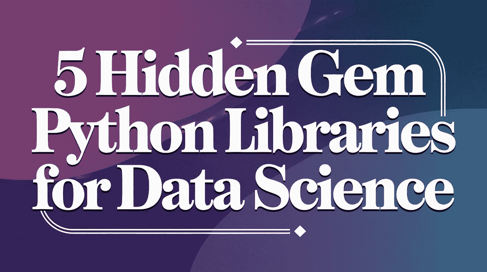

# 5 个数据科学的隐藏宝石 Python 库

> 原文：[`www.kdnuggets.com/5-hidden-gem-python-libraries-for-data-science`](https://www.kdnuggets.com/5-hidden-gem-python-libraries-for-data-science)

图片由编辑 | Ideogram

数据科学已经发展到几乎依赖 Python 生态系统以提高工作效率的地步。这就是为什么如此多的 Python 库被开发出来以适应数据科学任务。

* * *

## 我们的三大课程推荐

 1\. [Google 网络安全证书](https://www.kdnuggets.com/google-cybersecurity) - 快速进入网络安全职业生涯。

 2\. [Google 数据分析专业证书](https://www.kdnuggets.com/google-data-analytics) - 提升你的数据分析技能

 3\. [Google IT 支持专业证书](https://www.kdnuggets.com/google-itsupport) - 支持你的组织的 IT

* * *

然而，许多优秀的库可能因受 Pandas、Scikit-learn、Seaborn 等流行库的掩盖而陷入默默无闻的境地。事实上，许多隐藏的宝石在某些情况下比流行库表现更好。

本文将深入探讨 5 个这样的数据科学隐藏宝石 Python 库，这些库可以帮助你的工作。

## 1\. Cleanlab

数据科学的核心在于数据。如果你拥有质量差的数据，你的分析和模型也会差。甚至有一句话：“垃圾进，垃圾出。”这就是为什么我们需要妥善管理数据质量。Cleanlab 是一个可以帮助你提升数据质量的库。

[Cleanlab](https://github.com/cleanlab/cleanlab) 自动清理我们的数据集，并识别目标标签中的问题。该库在发现数据集中的问题并处理错误以提高模型性能方面表现良好。如果你有数据质量问题，不要犹豫，去看看 Cleanlab 库。

## 2\. H3 Uber

地理数据可能是最令人兴奋的数据科学项目之一，但处理起来却是最困难的之一。保持数据的一致性以获得精确的空间数据具有挑战性，因为分段通常是不规则的，并且随着时间的推移而变化。

[Uber 的开源 H3 库](https://github.com/uber/h3)可以帮助促进地理数据的使用。H3 库使用六边形网格系统，将数据划分为六边形单元和结构，以获得一致的位置数据。这些数据可以用于任何精确的基于位置的分析，并改善地理应用。

## 3\. IceCream

不，这不是甜点。Python 库 [IceCream](https://github.com/gruns/icecream) 是一种甜蜜的工具，可以通过改善调试过程来丰富你的数据科学工作。一般来说，大部分编程活动发生在后台，我们看不到发生了什么，包括数据结构和处理。

IceCream 将简单的打印函数转变为一个调试机器，可以生成更好的信息。该库可以做很多事情，例如输出同时打印函数或变量名称及其值，并突出显示输出语法。打印数据结构也变得很美观，消除了混乱。此外，它还可以检查程序的整体执行情况。

## 4\. Fairlearn

数据科学项目对企业有用，但我们还必须记住，许多我们使用的数据集与人类有诸多关联。我们建立的模型系统需要尽可能地避免偏见，消除任何可能歧视某些社会群体的可能性。虽然在模型创建过程中进行偏见评估可能不是你的首要直觉，但它应始终存在。这正是 Fairlearn 可以帮助你的地方。

[Fairlearn](https://github.com/fairlearn/fairlearn)是一个 Python 库，帮助减少我们机器学习系统中的不公平问题。该库包含公平性指标和算法。公平性指标评估哪些群体受到了模型的负面影响以及整体公平性。同时，算法提供了减少偏差和不公平的缓解技术。

## 5\. Scikit-posthocs

数据科学涉及大量的统计分析，尤其是比较数据集和组。人们可能认为数据科学完全依赖于机器学习建模，但简单的统计分析也能解决许多项目问题。一项常见的分析是组间假设检验，例如 ANOVA。

后验分析是在初步的方差分析（ANOVA）或类似分析中发现显著性之后进行的。[Scikit-posthocs](https://github.com/maximtrp/scikit-posthocs)是一个 Python 库，便于在我们的工作流程中进行后验分析。它提供了所有你可以使用的工具来执行参数检验和非参数检验，API 类似于 Scikit-learn。如果你想验证你的测试结果，可以尝试使用这个库。

## 结论

在本文中，我们探讨了 5 个你可能不太熟悉的 Python 数据科学库。尝试使用这些隐藏的宝石，可能会为你的分析库增添新兵器。

**[Cornellius Yudha Wijaya](https://www.linkedin.com/in/cornellius-yudha-wijaya/)** 是数据科学助理经理和数据撰稿人。尽管全职在 Allianz Indonesia 工作，他仍喜欢通过社交媒体和写作媒体分享 Python 和数据技巧。Cornellius 涉猎广泛的 AI 和机器学习主题。

### 了解更多相关内容

+   [ChatGPT 驱动的数据探索：解锁数据集中的隐藏见解](https://www.kdnuggets.com/2023/07/chatgptpowered-data-exploration-unlock-hidden-insights-dataset.html)

+   [微积分：机器学习的隐藏基石](https://www.kdnuggets.com/2022/02/mlm-hidden-building-block-machine-learning.html)

+   [每个 AI 从业者都应了解的隐藏技术债务](https://www.kdnuggets.com/2022/07/hidden-technical-debts-every-ai-practitioner-aware.html)

+   [我每天使用 ChatGPT 五个月。这些是一些隐藏的宝石……](https://www.kdnuggets.com/2023/07/used-chatgpt-every-day-5-months-hidden-gems-change-life.html)

+   [揭示隐藏的模式：层次聚类简介](https://www.kdnuggets.com/unveiling-hidden-patterns-an-introduction-to-hierarchical-clustering)

+   [BigQuery 中的异常检测：揭示隐藏见解并驱动行动](https://www.kdnuggets.com/anomaly-detection-in-bigquery-uncover-hidden-insights-and-drive-action)
