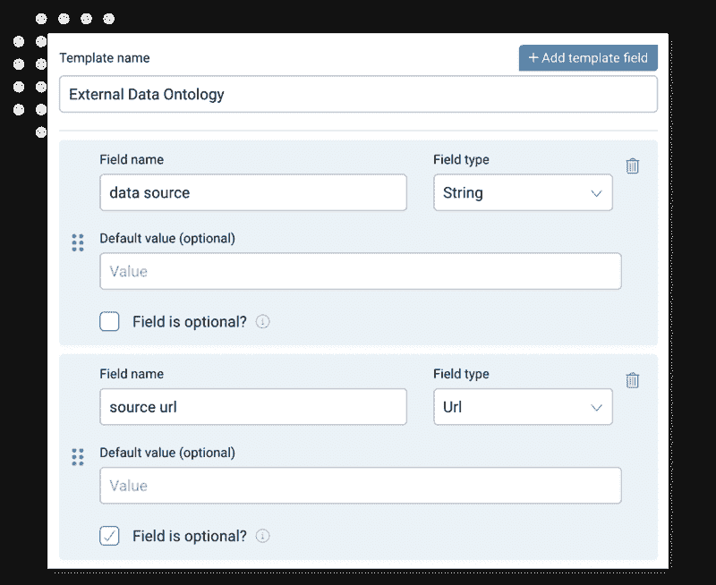
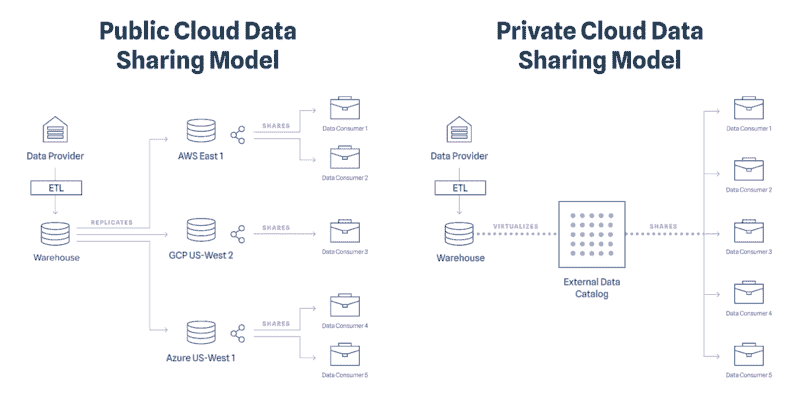

# 数据共享平台的 5 个关键组成部分

> 原文：[`www.kdnuggets.com/2022/05/5-key-components-data-sharing-platform.html`](https://www.kdnuggets.com/2022/05/5-key-components-data-sharing-platform.html)

越来越多的公司专注于寻找连接新的、宝贵的数据源的方法，以增强其分析能力，丰富其模型，或为其业务部门提供更多洞察。

由于对新数据源的需求增加，公司也开始以不同的方式看待其内部数据。那些拥有有价值数据集的组织开始探索让他们可以在业务四面墙之外共享和货币化数据的机会。

# 数据共享的格局是什么样的？

* * *

## 我们的前 3 个课程推荐

 1\. [Google 网络安全证书](https://www.kdnuggets.com/google-cybersecurity) - 快速进入网络安全职业生涯。

 2\. [Google 数据分析专业证书](https://www.kdnuggets.com/google-data-analytics) - 提升您的数据分析技能

 3\. [Google IT 支持专业证书](https://www.kdnuggets.com/google-itsupport) - 支持您的组织 IT

* * *

数据共享受到了很多关注。部分原因是因为数据货币化正在成为一个大问题，公司需要找到一种机制来将数据展示给愿意购买的人。更普遍地说，公司对来自非传统来源的数据非常渴望，这些数据可以用来增强模型，揭示隐藏的趋势，并（是的）发现“alpha”。这种需求引起了对数据发现平台和市场的广泛关注。Venturebeat 特别将数据共享作为其[2021 年机器学习、人工智能和数据生态](https://venturebeat.com/2021/10/16/the-2021-machine-learning-ai-and-data-landscape/)的一部分，并重点介绍了该领域的一些关键发展：

Google 于 2021 年 5 月推出了[Analytics Hub](https://cloud.google.com/analytics-hub)作为一个结合数据集和共享数据、仪表板和机器学习模型的平台。Google 还推出了[Datashare](https://cloud.google.com/solutions/financial-services/datashare)，这是一个针对金融服务并基于 Analytics Hub 开发的工具。

Databricks 在 Google 发布的同一天宣布了[Delta Sharing](https://delta.io/sharing/)。Delta Sharing 是一种用于跨组织安全数据共享的开源协议。

2021 年 6 月，Snowflake 开放了其[数据市场](https://www.snowflake.com/data-marketplace/#datasets)的广泛访问权限，并配备了安全的数据共享功能。

我工作的公司 ThinkData 最初是在开放数据领域起步的，因此一直将数据共享作为我们技术的基石。最近，我们利用数据虚拟化来帮助我们合作的组织安全地共享数据（你可以在[这里](https://blog.thinkdataworks.com/secure-data-sharing-why-we-recommend-vertica)阅读更多相关内容）。

# 企业需求的变化

分享数据时需要考虑一些问题。你选择谁使用你的数据以及用途的过程是一个组织应该深思熟虑的战略问题。但除了关于谁将使用你的数据以及为什么使用的规则外，分享数据还有一些更具技术性而非法律性质的后勤问题。

无论是数据的输入还是输出，公共还是私有，核心流程的一部分还是实验的一小部分，你如何连接到数据上往往和为什么要连接一样重要。对于希望从数据中获得更多收益的现代公司来说，选择部署数据目录不应意味着你必须迁移数据。一个让你组织、发现、共享和变现数据的平台的好处不能以将你的数据库迁移到公共云为代价。

[发现和使用新数据的价值很明显](https://blog.thinkdataworks.com/secure-data-sharing-why-we-recommend-vertica)，但组织应该如何分享和接收数据的过程却不那么清晰。

闪存驱动器是行不通的，那么一个好的共享解决方案应该是什么样的呢？

# 什么是所有者定义的访问权限？

通常，当组织想要分享他们拥有的数据时，他们必须对数据集进行切割和处理，以去除敏感信息或创建面向客户的数据集副本。除了构建客户友好版本的数据集的开销外，从数据治理的角度来看，这也是一种不良做法。

制作和分发数据集的副本每次都会创建一种新的数据处理错误方式，并且可能导致不一致、错误和安全问题。如果你想将数据集分享给十个不同的人用于十种不同的用途，每次你这样做都会重复工作并增加风险。

一个好的数据共享解决方案允许数据所有者在数据集上创建行级和列级权限，创建一个主文件的定制视图，确保所有的数据共享仍然汇总到一个真实的来源。

# 一致且可配置的元数据

大多数数据集并不是为消费者设计的。如果数据是作为核心业务过程的副产品生成的，它可能特别适用于某个特定的使用场景，这可能不会被希望使用数据的最终用户所共享。

元数据是让我们有效理解和使用数据的关键。无论是描述性（告诉我们谁创建了数据以及我们应该如何解读）还是管理性（声明谁拥有数据以及如何使用），附加和维护高质量的元数据是确保任何人都能理解如何使用他们所访问的数据的最有效方式。

在 ThinkData 平台中构建自定义元数据模板。这些模板可以添加到任何引入数据目录的数据集中。

# 数据应该如何安全共享？

这应该是不言而喻的，但你可能会惊讶于仍然有很多组织在不同楼层之间通过电子邮件发送电子表格。如果你分享的是开放数据，你可能不必担心数据安全，但如果数据即使只是略微敏感（更不用说有价值），你将需要确保有办法追踪数据的去向。

确保数据通过具有足够数据保护措施的服务进行传递是很重要的，并且确保传递过程可靠稳定将增加信任。

这涵盖了内部共享，但组织之间，甚至部门之间的数据共享怎么办？

从历史上看，如果你将数据提供给另一个业务部门，这就像是将数据从一个黑箱传输到另一个黑箱。但如果你是一个对数据使用有严格限制的组织，你需要知道哪些用户在未来访问数据集。一个好的数据共享平台不仅应让你控制数据流动，还应提供有关用户如何连接数据及其时间的洞察。

# 支持本地和公共云

大多数现代数据共享计划专门为公共云设计，这不仅限制了谁可以利用它们，还增加了提供商和消费者的开支，因为他们使用更多的存储来访问所有共享给他们的数据。

现实是，任何处于数据驱动转型阶段的现代化公司都需要在尽可能少扰动其标准操作程序的情况下，建立系统和基础设施。许多共享解决方案和传统数据目录的问题之一是，迁移到公共云的主要步骤不可行。对于具有关键任务或敏感数据以及事务性工作负载的组织来说，数据中心的细粒度控制将始终是必要的。

即使对于那些希望将业务迁移到公共云的组织来说，法律和实际操作方面的各种考量也会使这一过程停滞不前，尤其是在他们尝试现代化的过程中。一个跨国金融机构无法花几个月时间将数据物理迁移到云端。

无论你的数据库状态如何，你仍然应该能够安全地提供对数据的访问，而无需将其迁移到公共云或创建不必要的副本。

# 发现新数据的机制

[数据市场的兴起](https://blog.thinkdataworks.com/rise-of-the-data-marketplace)表明，大多数组织强烈需要利用一种解决方案，帮助他们找到并连接到存在于其业务四壁之外的数据。

然而，数据市场通常失败的地方在于，它们提供的是购物体验，而不是消费模型。数据市场历来是一个让用户能够找到数据的地方，但不是一个可以让他们连接到数据的机制，这有点像让某人购物但不给他们试穿任何衣物的感觉。

从这一需求中，出现了一个新的数据共享模型，Snowflake 在去年推出了 Snowflake 数据市场，作为一个用户可以双向共享数据到彼此账户的地方，引起了轰动。

这种模型在公共云中效果良好，在那里创建一个新云区域中的数据集相对容易，但它有点笨重（在每个云区域中重新创建数据会给过程带来相当大的开销），如果不小心，还可能产生计算和存储的高额费用。

ThinkData 平台允许任何组织在各种数据源中一致地获取数据，并以标准化的方式直接交付。 [ThinkData 市场](https://marketplace.namara.io/?__hstc=82057097.e66629f923de7e9dd48c7927fe61eee4.1642011453209.1644847224594.1644867810973.37&__hssc=82057097.8.1644867810973&__hsfp=4126683531) 是一个展示可用公共数据的商店，也是数据提供者与数据买家连接的中心枢纽。

ThinkData 平台提供了一系列的消费模型。通过按需数据产品化，你可以轻松地将公共数据资产配置成理想的格式和模式。通过数据虚拟化，你可以确保即时的数据共享，而不引发数据仓库和安全问题。ThinkData 市场提供了一个数据消费模型，使数据需求旺盛的组织不仅能够发现各种数据，还能快速有效地开始使用新的数据来源。

# 引入低迁移数据共享

需要的是一种方式，让组织能够在不需要先移动数据的情况下进行数据共享。

数据虚拟化提供了一个解决方案，它允许用户在不移动或复制数据的情况下，将外部仓库的数据与其他来源的数据一起查看。

| **公共云数据共享模型** | **私有云数据共享模型** |
| --- | --- |

|

+   跨多个仓库的数据冗余

+   新工具、培训和时间的开销

+   繁琐的操作复杂性

|

+   数据的唯一真实来源

+   在现有基础设施上启用共享

+   简单且低维护的数据访问

|

ThinkData 平台使组织能够实现数据虚拟化，这些组织希望对数据应用治理、元数据管理和数据共享，而无需将数据从其存放的位置移出。通过直接从数据仓库中获取数据并通过平台 UI 提供，我们让用户在无需大规模迁移的操作障碍（和成本）的情况下，获得数据目录的所有好处。

如果你对数据共享感兴趣，[观看我们的网络研讨会](https://www.youtube.com/watch?v=BITnd4GRDNo&t=28s&ab_channel=ThinkDataWorks)，看看在团队和个人之间分发数据有多么简单。我们的平台超越了数据目录所提供的传统发现和治理。通过添加数据共享和报告，ThinkData 平台解锁了以前不可能实现的协作和货币化机会。

**[路易斯·温恩-琼斯](https://www.linkedin.com/in/lewis-wynne-jones-9a9918a7/)** 是 ThinkData Works 的产品总监，他在帮助构建行业领先的数据目录，以帮助组织通过连接、丰富和分发数据资产来解锁数据的价值，并在安全且可配置的环境中操作。

### 更多相关内容

+   [它活了！用 Python 和一些便宜的组件构建你的第一个机器人](https://www.kdnuggets.com/2023/06/manning-build-first-robots-python-cheap-basic-components.html)

+   [数据科学家的代码块共享新方式](https://www.kdnuggets.com/2022/03/new-ways-sharing-code-blocks.html)

+   [KDnuggets 新闻，5 月 18 日：5 个免费的机器学习平台](https://www.kdnuggets.com/2022/n20.html)

+   [数据成熟度金字塔：从报告到主动的智能数据平台](https://www.kdnuggets.com/the-data-maturity-pyramid-from-reporting-to-a-proactive-intelligent-data-platform)

+   [5 个免费的机器学习应用托管平台](https://www.kdnuggets.com/2022/05/5-free-hosting-platform-machine-learning-applications.html)

+   [Qdrant: 开源向量搜索引擎与托管云平台](https://www.kdnuggets.com/2023/02/qdrant-open-source-vector-search-engine-managed-cloud-platform.html)
