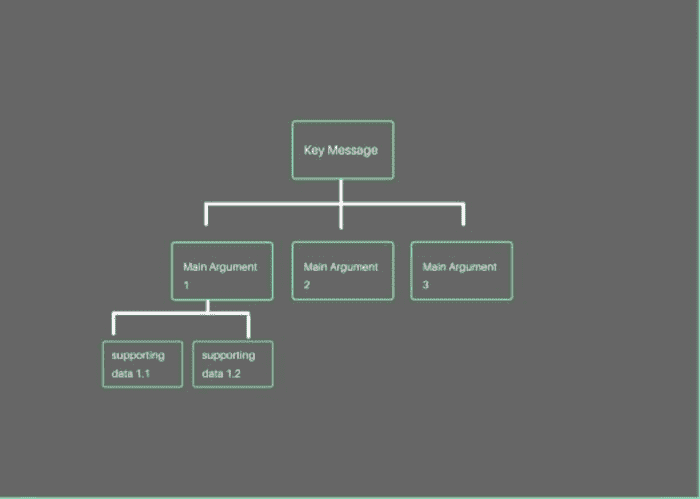
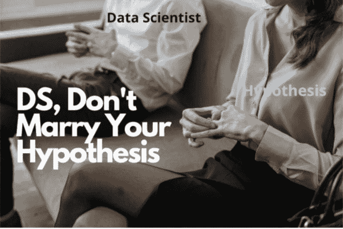

# 麦肯锡教给我的 5 个经验教训，让你成为更好的数据科学家

> 原文：[`www.kdnuggets.com/2021/07/5-lessons-mckinsey-taught-better-data-scientist.html`](https://www.kdnuggets.com/2021/07/5-lessons-mckinsey-taught-better-data-scientist.html)

评论

**作者 [Tessa Xie](https://www.linkedin.com/in/tessayuqingxie/)，数据科学家**

由[Dan Dimmock](https://unsplash.com/@dandimmock?utm_source=medium&utm_medium=referral)拍摄，发布在[Unsplash](https://unsplash.com/?utm_source=medium&utm_medium=referral)

* * *

## 我们的前三个课程推荐

 1\. [Google Cybersecurity Certificate](https://www.kdnuggets.com/google-cybersecurity) - 快速进入网络安全职业道路。

 2\. [Google Data Analytics Professional Certificate](https://www.kdnuggets.com/google-data-analytics) - 提升你的数据分析能力

 3\. [Google IT Support Professional Certificate](https://www.kdnuggets.com/google-itsupport) - 支持你的组织的 IT 工作

* * *

数据科学是近年来最热门的领域之一，吸引了大量有才华的人才争夺顶级公司数据科学团队的职位。虽然有很多文章教你如何[准备数据科学面试](https://towardsdatascience.com/the-ultimate-interview-prep-guide-for-data-scientists-and-data-analysts-18621db1da47)并“从其他面试者中脱颖而出”，但求职之旅显然不仅仅是获得聘用。获得工作邀请只是第一步；然而，很少有人讨论如何在你通过面试并加入公司后，*在其他被录用的数据科学家中脱颖而出*。

在我于麦肯锡工作的这些年里，我有幸与麦肯锡及我服务的顶级公司中的无数聪明的数据科学家共事，并观察到那些获得合作伙伴和客户高度评价的顶尖数据科学家所具备的共同特质。也许对你们中的一些人来说，最优秀的数据科学家并不一定是那些构建最炫酷模型或编写最高效代码的人（当然，他们必须具备相当高的技术技能才能被聘用），而是那些在分析能力之上还拥有一些重要**“软技能”**的人。本文总结了我在麦肯锡期间的经验和观察，归纳为 5 条经验教训，帮助你成为更优秀的数据科学家。

[via GIPHY](https://giphy.com/gifs/theresidentonfox-no-worries-its-big-deal-dont-thank-me-UrDMt0wLHipx7Obdc3)

作为一个喜爱精确的数据人士，我想指出，尽管“数据科学家”这一职称如今涵盖了行业中广泛的工作，但在本文中，我主要关注的是对业务决策有影响的数据科学家的技巧（而不是那些在更多研究导向的“核心数据科学”角色中的人）。

### **课程 1. 自上而下的沟通是关键**

自上而下的沟通，或称金字塔原则，是由麦肯锡合伙人芭芭拉·敏托提出并普及的，许多人认为这是在商业（甚至个人生活）中最有效的沟通结构。尽管对于一些像战略顾问这样的职业来说，这是第二天性，但很多数据科学家在这方面却会陷入困境。这个想法很简单：当你尝试传达一个观点/论点时，如果你从**关键信息**开始，然后是几个**主要论点**来支持这个关键信息；如果需要，每个论点可以跟随**支持数据**，这样对观众来说最有效、最容易理解。

采用自上而下的沟通有以下几个优势：

1.  关键要点在前：如果你在电子邮件/备忘录的开头看到**TLDR**或在研究论文的开头看到执行摘要，你会理解这点的重要性。将关键信息放在前面，可以确保即使观众没有抓住所有细节，他们也能大致了解内容。

1.  演示/沟通可以轻松地针对不同的听众进行调整：你可以准备一套沟通材料，保持“关键信息”的水平，针对高层管理人员的主要论点，并根据需要扩展细节以满足对细节有兴趣的同行和其他分析型听众。

对于那些大部分时间都在进行深入分析的数据科学家来说，这种沟通结构可能不自然且可能违反直觉。太频繁地看到数据科学家以深入细节开始演示或沟通，导致观众迷失而未能传达关键信息。

**如何实践**：一个简单的实践方法是在会议前根据这种结构记录下你的想法，以便在沟通分析的关键发现时保持方向。同时，频繁地退后一步问自己你实际要解决的问题是什么，这应该是你传达的关键信息。

作者提供的图片

### **课程 2. 成为“翻译者”**

如果你查看麦肯锡建议的 [公司数据组织蓝图](https://www.mckinsey.com/industries/financial-services/our-insights/building-an-effective-analytics-organization)，它强调了一个名为“翻译者”的角色的重要性，该角色被认为是业务和数据团队之间沟通的桥梁，将分析洞察转化为业务可操作的内容（我认为这个角色部分来源于我上面提到的挫折）。我相信作为数据科学家，你已经被要求“像给五岁小孩讲解一样解释”或者“用简单的英语解释”。那些脱颖而出的数据科学家正是能做到这一点的人——充当自己的翻译者；如果被要求，他们可以向没有分析背景或时间阅读白皮书的首席执行官很好地解释他们的机器学习模型，并始终将分析结果与业务影响联系起来。这些数据科学家因以下原因而受到重视：

1.  从非分析型人员那里获取“翻译者”是很困难的：麦肯锡确实尝试过培训一组战略顾问，成为不同分析研究的“翻译者”；但在我看来，从未成功。原因很简单：为了准确解释复杂分析的关键要点和准确反映警告，你需要具备分析思维和深刻理解，这些是通过几周的分析训练营无法获得的。例如，如果你不知道肘部法则，你如何解释你为 K 均值选择的簇数？如果你不知道 SSE 是什么，你如何解释肘部法则？作为数据科学家，你花时间教授这门大多不成功的速成课程，可能更好地用于打造自己的沟通风格，并自己进行翻译。

1.  如果数据科学家可以解释自己的分析，可以避免精确度丧失：我相信大多数人玩过“电话”游戏或其变体。信息传递时间越长，保持其精确度就越困难。现在想象你的分析工作经历同样的过程；如果你依赖他人来解释/翻译你的工作，信息到达最终用户时可能与现实相差甚远。

[通过 GIPHY](https://giphy.com/gifs/naruto-ufszmdQvbMNH2)

**如何练习：**与朋友（最好是没有任何分析背景的朋友）练习，通过向他们解释你的模型/分析（当然不透露任何敏感信息）。这也是发现你方法中的知识差距的好方法；正如“大解释者”**理查德·费曼**所相信的，如果你无法简单地解释某事，很大程度上是因为你自己没有很好地理解它。

### **第 3 课：以解决方案为驱动是第一规则**

这不仅限于数据人才；对公司中*任何*职能/角色的人来说都是至关重要的。能够识别问题并提出关注点当然非常有价值，但更受欢迎的是提出潜在解决方案的能力。如果房间里没有一个以解决方案为导向的人，讨论往往会陷入循环，过于执着于问题而不是尝试找出前进的路径。

在大多数顶级咨询公司中，以解决方案为导向是第一条规则，我认为这种方法也应该转移到科技界。作为数据科学家，你可能经常遇到由于缺乏分析背景而出现荒谬的数据要求的令人沮丧的情况。我见过无数的数据科学家不知道如何处理这些情况，因而在利益相关者管理中失败，因为他们总是消极拒绝。与其直接否定，不如以解决方案为导向，利用你对数据和分析工具的更好理解，帮助他们重新定义要求并限定范围。

注重解决方案并不意味着你不能对任何事物说“不”或总是必须有完美的解决方案；而是意味着你应该在每次说“不”的同时，总要跟上一句“但如果…会怎么样呢？”。

**如何实践：**当你遇到问题时，花一点时间考虑潜在的解决方案，然后再向你的团队或经理提出。运用你的创造力解决问题，不要害怕提出新的解决方案。还可以跳出你的工作领域，了解更多关于业务和其他团队的工作。了解全局通常有助于你将点连起来，并带你找到创造性的解决方案。

[通过 GIPHY](https://giphy.com/gifs/ClapBackLibrary-ulnhrHe036USLl6jAx)

### **第 4 课：在商业环境中，解释性优于精确性**

> 没有人真正想要预测客户流失，每个人都在试图理解客户流失。

现在，当每家公司都在构建模型来预测客户流失时，很难退一步问自己为什么我们最初想要预测客户流失。公司希望预测流失，以便找到可行的解决方案来防止它。所以，如果你的模型告诉 CEO“**网站访问次数的立方根**是指示客户流失的重要特征之一”，那他能用这些信息做什么？可能什么也做不了……

作为数据科学家，就像许多你们一样，我过去只关注准确性作为建模时的成功指标。但我逐渐意识到，通过添加无法解释的特征和微调超参数将准确性从 96%提高到 98%，对业务来说没有意义，如果你不能将其与业务影响联系起来（当然，这只适用于面向业务的数据科学家，在某些机器学习领域，这种增加可能意义重大）。

如果模型是黑箱子，那么从 C 级高管那里获得可信度也很困难。模型归根结底是用来指导商业决策的工具，所以它的价值在很大程度上基于其实用性和可解释性，这一点不应感到意外。

**如何实践：**在构建模型或进行分析时始终保持对商业影响的关注。在构建模型时，避免随意将互动特征丢给模型并希望其中一个会有效；相反，在开始构建模型之前，对特征工程阶段要非常用心。记录下模型/分析得出的商业建议，也将帮助你重新评估构建模型时所做的设计选择。

### **第 5 课：确保有一个假设，但不要固守于一个假设**

作者提供的图片

对于大多数分析，从特征探索到探索性数据分析（EDA），有假设作为起点是重要的。没有假设，你将没有方向来切分和处理数据进行 EDA 或测试哪些特征。没有假设，进行 AB 测试也没有意义（这就是它被称为假设检验的原因）。但我经常看到数据科学家在没有明确假设的情况下深入分析阶段，然后迷失在复杂的情况中。更常见的是，数据科学家将假设构建过程完全留给不了解数据的团队成员，后来发现没有足够的数据来测试这些假设。在我看来，最佳方法是数据科学家从一开始就参与这些假设头脑风暴会议，并利用假设来指导和优先考虑后续分析。

虽然假设非常重要，但它们应该作为起点，而不是终点。我多次见过许多数据科学家（或与数据科学家合作的人）坚持一个假设，即使有相反的发现。这种对初始假设的“忠诚”会导致数据窥探和调整数据以适应某种叙事。如果你对“[辛普森悖论](https://en.wikipedia.org/wiki/Simpson%27s_paradox#:~:text=Simpson's%20paradox%2C%20which%20also%20goes,when%20these%20groups%20are%20combined.)”熟悉，你会理解数据讲述“错误故事”的力量。好的数据科学家应该能够保持数据完整性，并将叙事调整为符合数据，而不是相反。

**如何实践：** 重要的是建立业务理解和洞察力，以便提出好的假设。保持对假设的关注，以指导你在数据探索过程中，但要开放心态，承认数据可能与最初的“有根据的猜测”不同。良好的商业感觉也将帮助你在过程中调整最初的理论，并根据数据调整叙述。

在涉及业务角色时，人们往往认为才能可以分为两类：分析型和战略型，好像这两种能力处于光谱的两端。我告诉你一个秘密，最好的分析型人才也是那些理解战略/业务方面，并知道如何与业务利益相关者沟通的人，而最好的战略角色人才则对分析和数据有一定的理解。

**简介：[Tessa Xie](https://www.linkedin.com/in/tessayuqingxie/)** 目前是一名 AV 行业的数据科学家，曾任麦肯锡数据科学家；热爱旅行、潜水和绘画。

[原文](https://towardsdatascience.com/5-lessons-mckinsey-taught-me-that-will-make-you-a-better-data-scientist-66cd9cc16aba)。经授权转载。

**相关：**

+   作为数据科学初学者你应该避免的 10 个错误

+   数据科学家将在 10 年内消失

+   数据科学在 10 年内不会消失，你的技能可能会

### 更多相关话题

+   [成为一名优秀数据科学家所需的 5 项关键技能](https://www.kdnuggets.com/2021/12/5-key-skills-needed-become-great-data-scientist.html)

+   [每个初学者数据科学家应该掌握的 6 种预测模型](https://www.kdnuggets.com/2021/12/6-predictive-models-every-beginner-data-scientist-master.html)

+   [2021 年最佳 ETL 工具](https://www.kdnuggets.com/2021/12/mozart-best-etl-tools-2021.html)

+   [建立一个坚实的数据团队](https://www.kdnuggets.com/2021/12/build-solid-data-team.html)

+   [使用管道编写干净的 Python 代码](https://www.kdnuggets.com/2021/12/write-clean-python-code-pipes.html)

+   [每个数据科学家都应该知道的三大 R 语言库（即使你使用 Python）](https://www.kdnuggets.com/2021/12/three-r-libraries-every-data-scientist-know-even-python.html)
