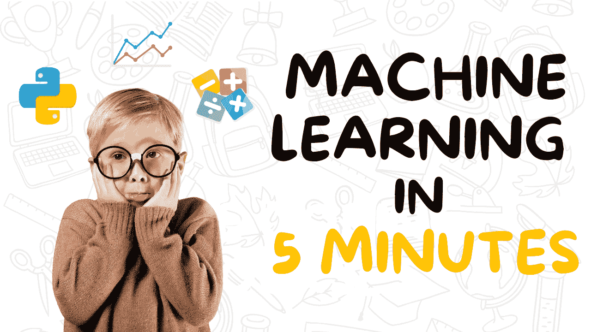
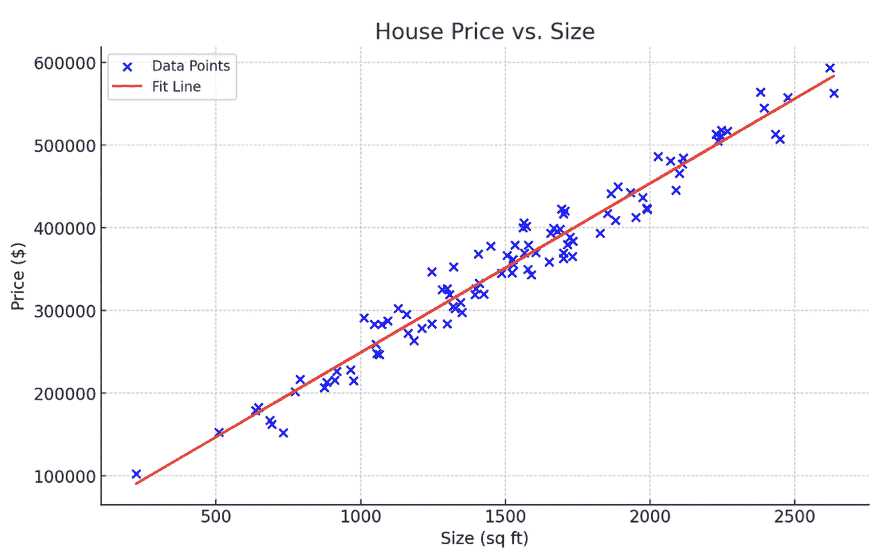
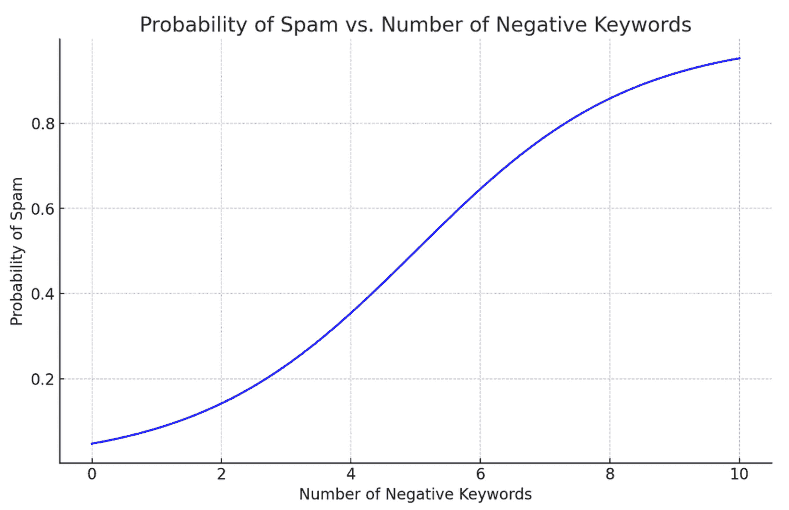
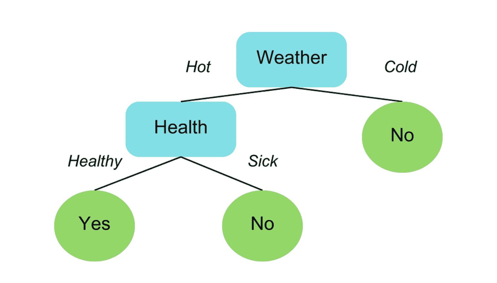
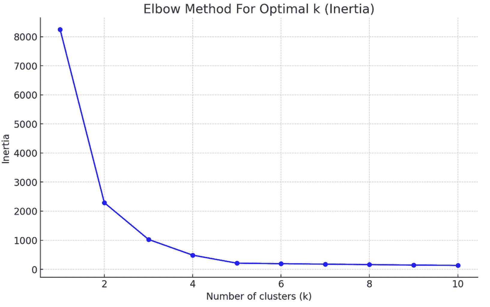

# 5 种机器学习模型在 5 分钟内解释

> 原文：[`www.kdnuggets.com/5-machine-learning-models-explained-in-5-minutes`](https://www.kdnuggets.com/5-machine-learning-models-explained-in-5-minutes)

图片由作者提供

机器学习是一种计算机算法，帮助机器在不需要明确编程的情况下进行学习。

* * *

## 我们的前三个课程推荐

 1\. [谷歌网络安全证书](https://www.kdnuggets.com/google-cybersecurity) - 快速进入网络安全职业生涯。

 2\. [谷歌数据分析专业证书](https://www.kdnuggets.com/google-data-analytics) - 提升你的数据分析技能

 3\. [谷歌 IT 支持专业证书](https://www.kdnuggets.com/google-itsupport) - 支持你组织的 IT 工作

* * *

今天，我们在导航系统、电影流媒体平台和电子商务应用中都能看到机器学习的应用。

实际上，从你早上醒来到晚上睡觉，你可能已经与数十个机器学习模型互动而未曾意识到。

预计机器学习行业将在 2024 年至 2030 年间增长超过 36%。

鉴于几乎每个大型组织都在积极投资于人工智能，你只会从提升机器学习技能中受益。

无论你是数据科学爱好者、开发者，还是想提升该领域知识的普通人，以下是 5 种你应该了解的常用机器学习模型：

## 1\. 线性回归

线性回归是最受欢迎的机器学习模型，用于执行定量任务。

该算法用于使用一个或多个自变量(X)预测连续结果(y)。

例如，如果你被要求根据房屋大小预测房价，你会使用线性回归。

在这种情况下，房屋大小是你的自变量 X，用于预测房价，房价是因变量。

这是通过拟合一个线性方程来建模 X 与 y 之间的关系，表示为 y=mX+c。

这里是一个表示线性回归的图示，用于建模房价与房屋大小之间的关系：

图片由作者提供

**学习资源**

要了解更多关于线性回归的直觉以及它如何在数学上运作，我推荐观看[Krish Naik 的 YouTube 教程](https://youtu.be/1-OGRohmH2s?si=GY_8m59v-QNk310w)。

## 2\. 逻辑回归

逻辑回归是一种分类模型，用于预测给定一个或多个自变量的离散结果。

例如，给定一个句子中的负面关键词数量，可以使用逻辑回归预测给定消息是否应该被分类为合法或垃圾邮件。

这里是展示逻辑回归如何工作的图表：

作者提供的图片

注意，与表示直线的线性回归不同，逻辑回归被建模为 S 形曲线。

正如上面的曲线所示，负面关键词的数量增加时，消息被分类为垃圾邮件的概率也增加。

此曲线的 x 轴表示负面关键词的数量，y 轴显示邮件被标记为垃圾邮件的概率。

通常，在逻辑回归中，0.5 或更高的概率表示正面结果——在这种情况下，这意味着消息是垃圾邮件。

相反，低于 0.5 的概率表示负面结果，意味着消息不是垃圾邮件。

**学习资源**

如果你想了解更多关于逻辑回归的内容，[StatQuest 的逻辑回归教程](https://youtu.be/yIYKR4sgzI8?si=p8j-zl4IzBe6l-dQ)是一个很好的起点。

## 3. 决策树

决策树是一种流行的机器学习模型，用于分类和回归任务。

它们通过根据数据集的特征将其分解，创建树状结构来建模这些数据。

简而言之，决策树允许我们根据特定参数持续拆分数据，直到做出最终决策。

这里是一个简单决策树的示例，用于确定一个人在某一天是否应该吃冰淇淋：

作者提供的图片

+   树从天气开始，识别是否适合吃冰淇淋。

+   如果天气温暖，则进入下一个节点，即健康。如果不是，决策为“不”，不再进行拆分。

+   在下一个节点，如果这个人健康，他们可以吃冰淇淋。否则，他们应该避免这样做。

注意决策树中每个节点的数据如何拆分，将分类过程分解为简单、易管理的问题。

你可以为回归任务绘制类似的决策树，且过程中的直觉将保持不变。

**学习资源**

要了解更多关于决策树的内容，我建议观看[StatsQuest 的视频教程](https://youtu.be/_L39rN6gz7Y?si=GRUk4fUta-UkbtSj)。

## 4. 随机森林

随机森林模型结合了多个决策树的预测，并返回一个单一的输出。

直观上，这种模型应优于单一决策树，因为它利用了多个预测模型的能力。

这借助一种称为袋装法或自助聚合的技术来完成。

以下是袋装法的工作原理：

一种叫做自助法的统计技术用于多次有放回地抽样数据集。

然后，在每个样本数据集上训练一个决策树。所有树的输出最终合并以生成一个单一的预测。

对于回归问题，最终输出是通过对每个决策树做出的预测进行平均来生成的。对于分类问题，则是做出多数类预测。

**学习资源**

你可以观看 [Krish Naik 关于随机森林的教程](https://youtu.be/nxFG5xdpDto?si=0xYYqDPk6jL5W0Kt)以深入了解模型背后的理论和直觉。

## 5\. K-Means 聚类

到目前为止，我们讨论的所有机器学习模型都属于一种叫做监督学习的方法。

监督学习是一种利用标记数据集来训练算法以预测结果的技术。

相比之下，非监督学习是一种不处理标记数据的技术。它识别数据中的模式，而无需训练以确定特定的结果。

K-Means 聚类是一种非监督学习模型，基本上处理未标记的数据并将每个数据点分配到一个簇中。

观察属于与均值最近的簇。

这里是 K-Means 聚类模型的可视化表示：

作者提供的图片

注意算法如何将每个数据点分组为三个不同的簇，每个簇由不同的颜色表示。这些簇是根据它们与中心点的接近程度进行分组的，中心点由一个红色的 X 标记表示。

简单来说，Cluster 1 中的所有数据点都具有相似的特征，这就是它们被归为一组的原因。相同的原则也适用于 Cluster 2 和 Cluster 3。

在构建 K-Means 聚类模型时，你必须明确指定你想生成的簇数量。

这可以通过一种叫做肘部法的方法实现，该方法只是将模型在不同簇值下的错误分数绘制在折线图上。然后，你选择曲线的拐点，或称为“肘部”，作为最佳的簇数量。

这里是肘部法的可视化表示：

作者提供的图片

注意到此曲线上的拐点在 3 簇标记处，这意味着该算法的最佳簇数量是 3。

**学习资源**

如果你想了解更多关于该主题的信息，StatQuest 提供了一个

[8 分钟视频](https://youtu.be/4b5d3muPQmA?si=QovwM1R8yAIGaATd)清晰地解释了 K-Means 聚类的工作原理。

## 下一步

本文解释的机器学习算法在行业应用中非常常见，例如预测、垃圾邮件检测、贷款审批和客户细分。

如果你能坚持到这里，恭喜你！你现在已经对最广泛使用的预测算法有了扎实的掌握，并迈出了进入机器学习领域的第一步。

但旅程并未结束。

为了巩固你对机器学习模型的理解，并能够将它们应用于实际应用，我建议学习一种编程语言，如 Python 或 R。

Freecodecamp 的 [初学者 Python 课程](https://youtu.be/rfscVS0vtbw?si=jWWytrkcy_-b4reH)

课程是一个很好的起点。如果你在编程学习过程中遇到困难，我有一个 [YouTube 视频](https://youtu.be/NRKCLqIREMM?si=3DQKouzvAnb871QX) 解释了如何从零开始学习编程。

一旦你学会了编程，你将能够使用像 Scikit-Learn 和 Keras 这样的库在实践中实现这些模型。

为了提高你的数据科学和机器学习技能，我建议你利用像 ChatGPT 这样的生成式 AI 模型为自己制定一个量身定制的学习路径。这里有一个更详细的路线图，帮助你开始利用 [ChatGPT 学习数据科学](https://towardsdatascience.com/how-i-would-learn-data-science-with-chatgpt-if-i-could-start-over-8e1f6ae4bb80)。

**[Natassha Selvaraj](https://linktr.ee/natasshaselvaraj)** 是一位自学成才的数据科学家，热衷于写作。Natassha 涉及所有数据科学相关的话题，是数据领域的真正大师。你可以通过 [LinkedIn](https://www.linkedin.com/in/natassha-selvaraj-33430717a/) 与她联系，或者查看她的 [YouTube 频道](https://www.youtube.com/@natassha_ds)。

### 更多相关内容

+   [在 5 分钟内构建机器学习网页应用](https://www.kdnuggets.com/2022/03/build-machine-learning-web-app-5-minutes.html)

+   [KDnuggets 新闻 2022 年 3 月 9 日：在 5 分钟内构建机器学习网页应用…](https://www.kdnuggets.com/2022/n10.html)

+   [三种难度级别解释大型语言模型](https://www.kdnuggets.com/large-language-models-explained-in-3-levels-of-difficulty)

+   [多模态模型解释](https://www.kdnuggets.com/2023/03/multimodal-models-explained.html)

+   [3 分钟理解偏差-方差权衡](https://www.kdnuggets.com/2020/09/understanding-bias-variance-trade-off-3-minutes.html)

+   [在 5 分钟内用 Python 构建一个网页爬虫](https://www.kdnuggets.com/2022/02/build-web-scraper-python-5-minutes.html)
