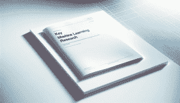

# 2024 年值得阅读的 5 篇机器学习论文

> 原文：[`www.kdnuggets.com/5-machine-learning-papers-to-read-in-2024`](https://www.kdnuggets.com/5-machine-learning-papers-to-read-in-2024)

使用 DALL-E 3 生成的图像

机器学习是人工智能的一个子集，它通过提供效率和预测性洞察来为企业带来价值。它是任何企业的宝贵工具。

* * *

## 我们的前三个课程推荐

 1\. [Google 网络安全证书](https://www.kdnuggets.com/google-cybersecurity) - 快速进入网络安全职业生涯。

 2\. [Google 数据分析专业证书](https://www.kdnuggets.com/google-data-analytics) - 提升您的数据分析能力

 3\. [Google IT 支持专业证书](https://www.kdnuggets.com/google-itsupport) - 支持您的组织进行 IT 工作

* * *

我们知道去年充满了机器学习的突破，今年也不例外。需要学习的内容实在太多了。

在如此多的学习内容中，我挑选了 2024 年几篇值得阅读的论文，以提升您的知识。

这些论文是什么？让我们深入了解一下。

## HyperFast：表格数据的即时分类

HyperFast 是由[Bonet *et al.* (2024)](https://arxiv.org/pdf/2402.14335v1.pdf)研究开发的一个元训练超网络模型。它旨在提供一个能够在一次前向传递中即时分类表格数据的分类模型。

作者表示，HyperFast 可以生成一个任务特定的神经网络，用于未见数据集的分类预测，且无需训练模型。这种方法可以显著减少计算需求和部署机器学习模型所需的时间。

HyperFast 框架展示了输入数据通过标准化和降维处理，然后经过一系列超网络生成网络层的权重，这些权重包括基于最近邻的分类偏差。

总的来说，结果显示 HyperFast 表现出色。它比许多经典方法更快，无需微调。论文总结道，HyperFast 可能成为一种可以应用于许多实际案例的新方法。

## EasyRL4Rec：一个用户友好的基于强化学习的推荐系统代码库

接下来的论文讨论的是由[Yu *et al.* (2024)](https://arxiv.org/pdf/2402.15164v1.pdf)提出的新库 EasyRL4Rec。这篇论文的重点是一个旨在开发和测试基于强化学习（RL）的推荐系统（RSs）的用户友好型代码库，名为 EasyRL4Rec。

该库提供了一个具有四个核心模块（环境、策略、状态跟踪器和收集器）的模块化结构，每个模块处理强化学习过程的不同阶段。

整体结构表明，它围绕强化学习工作流的核心模块进行操作，包括用于模拟用户交互的环境（Envs）、用于收集交互数据的收集器、用于创建状态表示的状态跟踪器以及用于决策的策略模块。它还包括一个用于管理数据集的数据层和一个包含训练评估器的执行器层，用于监督 RL 代理的学习和性能评估。

作者总结道，EasyRL4Rec 包含一个用户友好的框架，可以解决推荐系统中 RL 的实际挑战。

## 标签传播用于视觉语言模型的零-shot 分类

[Stojnic *et al.* (2024)](https://arxiv.org/pdf/2404.04072v1.pdf) 的论文介绍了一种名为 ZLaP 的技术，即 Zero-shot Classification with Label Propagation。它是通过利用测地距离进行分类的视觉语言模型零-shot 分类的增强方法。

众所周知，像 GPT-4V 或 LLaVa 这样的视觉模型具备零-shot 学习能力，可以在没有标注图像的情况下进行分类。然而，这些模型仍然可以进一步增强，这也是研究小组开发 ZLaP 技术的原因。

ZLaP 的核心思想是利用图结构数据集中的标签传播，该数据集包括图像和文本节点。ZLaP 在此图中计算测地距离以进行分类。该方法还设计用于处理文本和图像的双重模态。

在性能方面，ZLaP 显示了在零-shot 学习中持续超越其他最先进方法的结果，通过在 14 个不同数据集实验中利用转导和归纳推理方法。

总的来说，该技术显著提高了多个数据集上的分类准确性，这表明 ZLaP 技术在视觉语言模型中的前景广阔。

## 不留任何上下文：使用 Infini-attention 的高效无限上下文 Transformer

我们将讨论的第四篇论文由 [Munkhdalai *et al.* (2024)](https://arxiv.org/pdf/2404.07143v1.pdf) 发表。该论文介绍了一种名为 Infini-attention 的方法，以在有限计算能力下处理无限长输入，来扩展基于 Transformer 的大型语言模型（LLMs）。

Infini-attention 机制将压缩内存系统集成到传统的注意力框架中。将传统的因果注意力模型与压缩内存结合，可以存储和更新历史上下文，并通过在 Transformer 网络内聚合长期和局部信息来高效处理扩展序列。

总体而言，该技术在处理长上下文语言建模任务方面表现优越，例如从长序列中检索密码和书籍总结，相较于当前可用模型。

该技术可能提供许多未来的应用途径，尤其是对需要处理大量文本数据的应用。

## AutoCodeRover: 自主程序改进

我们将讨论的最后一篇论文由 [Zhang *et al.* (2024)](https://arxiv.org/pdf/2404.05427v2.pdf) 撰写。该论文的主要关注点是名为 AutoCodeRover 的工具，它利用能够执行复杂代码搜索的大型语言模型（LLMs）来自动解决 GitHub 问题，主要是错误和功能请求。通过使用 LLM 解析和理解 GitHub 上的问题，AutoCodeRover 可以比传统的基于文件的方法更有效地导航和操作代码结构以解决问题。

AutoCodeRover 的工作有两个主要阶段：上下文检索阶段和补丁生成目标。它通过分析结果来检查是否已收集到足够的信息以识别代码中的错误部分，并尝试生成补丁来修复问题。

论文表明，AutoCodeRover 相较于之前的方法提升了性能。例如，它解决了 SWE-bench-lite 数据集中 22-23% 的问题，平均每个问题的解决时间少于 12 分钟。这是一个改进，因为通常解决这些问题需要两天时间。

总体而言，论文显示出前景，因为 AutoCodeRover 能显著减少程序维护和改进任务所需的人工努力。

## 结论

2024 年有许多机器学习论文可读，以下是我推荐的论文：

1.  HyperFast: 表格数据的即时分类

1.  EasyRL4Rec: 面向基于强化学习的推荐系统的用户友好型代码库

1.  使用视觉-语言模型进行零样本分类的标签传播

1.  留住上下文：具有 Infini-attention 的高效无限上下文变换器

1.  AutoCodeRover: 自主程序改进

希望这些对你有帮助！

****[Cornellius Yudha Wijaya](https://www.linkedin.com/in/cornellius-yudha-wijaya/)**** 是数据科学助理经理和数据撰稿人。在全职工作于 Allianz Indonesia 的同时，他喜欢通过社交媒体和写作媒体分享 Python 和数据技巧。Cornellius 撰写了多种 AI 和机器学习主题的文章。

### 更多相关主题

+   [KDnuggets 新闻，4 月 27 日：代码论文简要介绍；…](https://www.kdnuggets.com/2022/n17.html)

+   [2023 年顶级机器学习论文](https://www.kdnuggets.com/2023/03/top-machine-learning-papers-read-2023.html)

+   [过去 12 个月必须阅读的 NLP 论文](https://www.kdnuggets.com/2023/03/must-read-nlp-papers-last-12-months.html)

+   [你应该阅读的生成式智能体研究论文](https://www.kdnuggets.com/generative-agent-research-papers-you-should-read)

+   [2022 年你需要阅读的机器学习书籍](https://www.kdnuggets.com/2022/04/machine-learning-books-need-read-2022.html)

+   [关于论文与代码的简要介绍](https://www.kdnuggets.com/2022/04/brief-introduction-papers-code.html)
