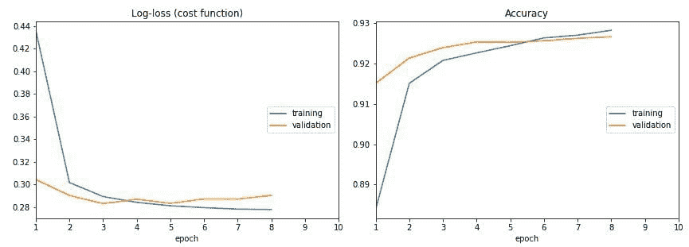
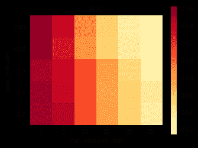

# 不容错过的 5 个机器学习项目，2018 年 6 月

> 原文：[`www.kdnuggets.com/2018/06/5-machine-learning-projects-overlook-jun-2018.html`](https://www.kdnuggets.com/2018/06/5-machine-learning-projects-overlook-jun-2018.html)

 评论

我们回来了。又一次。“Overlook...” 的帖子已经沉寂了几个月，但不用担心，这里有另一篇文章。我们继续着这个谦逊的任务，将强大的、不太为人知的机器学习项目展示给更多的眼睛。

这次外出活动完全由 Python 项目组成，这并非故意设计，而是无疑受到了我自身偏见的影响。虽然之前的版本包含了各种语言的项目（R、Go、C++、Scala、Java 等），我保证不久将推出一个全 R 版本，并在评估这些项目时会请外部协助（我承认对 R 生态系统的了解不深）。

这里有 5 个精心挑选的项目，可以提供一些潜在的新机器学习想法。

**1\. [实时损失图](https://github.com/stared/livelossplot/)**



> 不要盲目训练深度学习模型！要有耐心，查看你训练的每个周期！
> 
> 在 Jupyter Notebook 中的 Keras、PyTorch 和其他框架的实时训练损失图。这是 Piotr Migdał 等人发布的一个开源 Python 包。

与 Keras 一起使用时，实时损失图是一个简单的回调函数。

```py

from livelossplot import PlotLossesKeras

model.fit(X_train, Y_train,
          epochs=10,
          validation_data=(X_test, Y_test),
          callbacks=[PlotLossesKeras()],
          verbose=0)
```

**2\. [Parfit](https://github.com/jmcarpenter2/parfit)**

我们下一个项目来自 Jason Carpenter，他是旧金山大学数据科学硕士候选人，同时也是 Manifold 的机器学习工程实习生。

> 一个用于并行拟合和灵活评分 sklearn 机器学习模型的包，带有可视化例程。
> 
> 导入后，你可以自由使用 bestFit() 或其他函数。



一个代码示例：

```py

from parfit import bestFit # Necessary if you wish to use bestFit

# Necessary if you wish to run each step sequentially
from parfit.fit import *
from parfit.score import *
from parfit.plot import *
from parfit.crossval import *

grid = {
    'min_samples_leaf': [1, 5, 10, 15, 20, 25],
    'max_features': ['sqrt', 'log2', 0.5, 0.6, 0.7],
    'n_estimators': [60],
    'n_jobs': [-1],
    'random_state': [42]
}
paramGrid = ParameterGrid(grid)

best_model, best_score, all_models, all_scores = bestFit(RandomForestClassifier(), paramGrid,
                                                    X_train, y_train, X_val, y_val, # nfolds=5 [optional, instead of validation set]
                                                    metric=roc_auc_score, greater_is_better=True, 
                                                    scoreLabel='AUC')

print(best_model, best_score)

```

**3\. [Yellowbrick](https://github.com/DistrictDataLabs/yellowbrick)**

Yellowbrick 是“用于机器学习模型选择的视觉分析和诊断工具。” 更详细地说：

> Yellowbrick 是一套被称为“可视化工具”的视觉诊断工具，它扩展了 scikit-learn API，以允许人工引导模型选择过程。简而言之，Yellowbrick 将 scikit-learn 与 matplotlib 结合在一起，延续了 scikit-learn 文档的最佳传统，但用于生成模型的可视化！


查看 Github 仓库中的示例，以及 [文档以获取更多信息](http://www.scikit-yb.org/en/latest/)。

**4\. [textgenrnn](https://github.com/minimaxir/textgenrnn)**

textgenrnn 为文本生成任务带来了额外的抽象层，旨在让你“轻松训练自己规模和复杂度的文本生成神经网络，只需几行代码即可在任何文本数据集上进行训练。”

该项目基于 Keras 构建，具有以下精选功能：

> +   一种现代的神经网络架构，利用新的技术，如注意力加权和跳跃嵌入，以加速训练并提高模型质量。
> +   
> +   能够在字符级别或词级别上训练和生成文本。
> +   
> +   能够配置 RNN 大小、RNN 层数以及是否使用双向 RNN。
> +   
> +   能够在任何通用的输入文本文件上进行训练，包括大型文件。
> +   
> +   能够在 GPU 上训练模型，然后使用 CPU 生成文本。
> +   
> +   能够利用强大的 CuDNN 实现的 RNN，在 GPU 上训练时显著加速训练时间，相比于典型的 LSTM 实现。

textgenrnn 非常容易启动和运行：

```py

from textgenrnn import textgenrnn

textgen = textgenrnn()
textgen.train_from_file('hacker-news-2000.txt', num_epochs=1)
textgen.generate()

```


你可以在上述链接的 Github 仓库中找到更多信息和示例。

**5\. [Magnitude](https://github.com/plasticityai/magnitude)**

Magnitude 是“一个快速、简单的向量嵌入实用库”。

> 这是一个功能丰富的 Python 包和向量存储文件格式，用于以快速、高效和简单的方式在机器学习模型中利用向量嵌入，由 Plasticity 开发。它主要旨在成为 Gensim 的一个更简单/更快速的替代品，但也可以作为一个通用的键-向量存储，用于 NLP 之外的领域。

该仓库提供了各种流行嵌入模型的链接，这些模型已经以 .magnitude 格式准备好使用，还包括将其他词嵌入文件转换为相同格式的说明。

如何导入？

```py

from pymagnitude import *
vectors = Magnitude("/path/to/vectors.magnitude")
```

一针见血。

Github 仓库里充满了更多信息，包括使用这个简化的预训练词嵌入库所需了解的一切。

**相关**：

+   5 个你不应忽视的机器学习项目，2018 年 2 月

+   5 个你再也不能忽视的机器学习项目

+   5 个你再也不能忽视的机器学习项目（续）

* * *

## 我们的前三大课程推荐

 1\. [谷歌网络安全证书](https://www.kdnuggets.com/google-cybersecurity) - 快速进入网络安全职业。

 2\. [谷歌数据分析专业证书](https://www.kdnuggets.com/google-data-analytics) - 提升您的数据分析技能

 3\. [谷歌 IT 支持专业证书](https://www.kdnuggets.com/google-itsupport) - 支持您的组织 IT

* * *

### 更多相关主题

+   [每个数据科学家都应该知道的三种 R 语言库（即使你使用 Python）](https://www.kdnuggets.com/2021/12/three-r-libraries-every-data-scientist-know-even-python.html)

+   [停止学习数据科学以找到目标，并找到目标去…](https://www.kdnuggets.com/2021/12/stop-learning-data-science-find-purpose.html)

+   [学习数据科学统计学的顶级资源](https://www.kdnuggets.com/2021/12/springboard-top-resources-learn-data-science-statistics.html)

+   [一个 90 亿美元的 AI 失败，探讨](https://www.kdnuggets.com/2021/12/9b-ai-failure-examined.html)

+   [成功的数据科学家的 5 个特征](https://www.kdnuggets.com/2021/12/5-characteristics-successful-data-scientist.html)

+   [是什么使 Python 成为初创公司理想的编程语言](https://www.kdnuggets.com/2021/12/makes-python-ideal-programming-language-startups.html)
