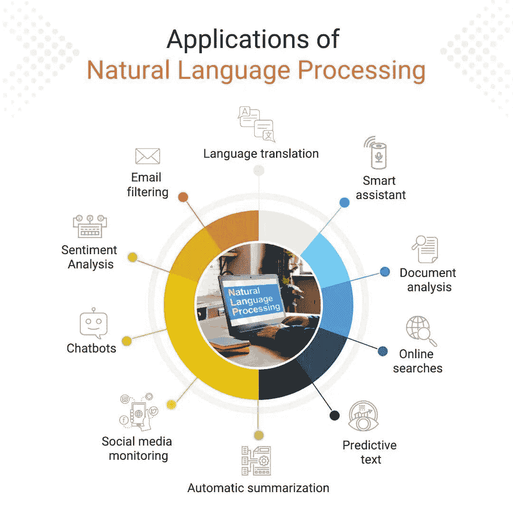
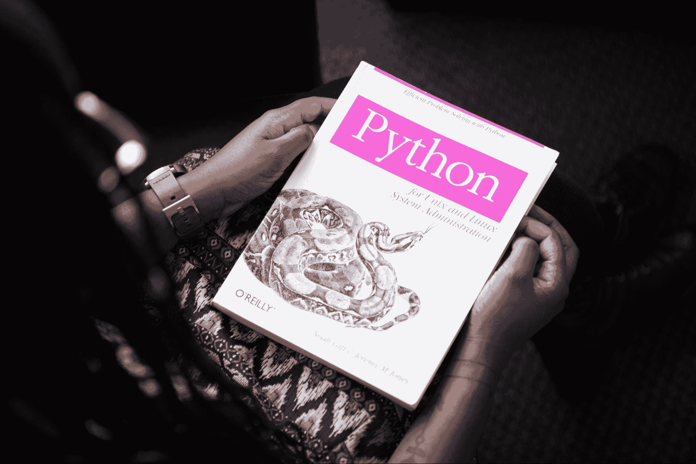

# 2023 年每位机器学习工程师应该掌握的 5 项机器学习技能

> 原文：[`www.kdnuggets.com/2023/03/5-machine-learning-skills-every-machine-learning-engineer-know-2023.html`](https://www.kdnuggets.com/2023/03/5-machine-learning-skills-every-machine-learning-engineer-know-2023.html)

图片来源 [olia danilevich](https://www.pexels.com/photo/man-using-3-computers-4974914/)

2022 年，越来越多的人开始接受人工智能。最引人注目的是，文本生成图像模型（AI 艺术）变得极其流行。搜索引擎被像 ChatGPT 这样的复杂聊天机器人所取代。随着像 [PaLM + RLHF](https://github.com/lucidrains/PaLM-rlhf-pytorch) 这样的开源替代品的出现，人工智能和机器学习将变得对新手开发人员更加可及。然而，成为真正的机器学习工程师需要的不仅仅是脚本编写或编码技能。它目前是全球最需求量大的技术职位之一。

* * *

## 我们的前三大课程推荐

 1\. [谷歌网络安全证书](https://www.kdnuggets.com/google-cybersecurity) - 快速通道进入网络安全职业。

 2\. [谷歌数据分析专业证书](https://www.kdnuggets.com/google-data-analytics) - 提升你的数据分析能力

 3\. [谷歌 IT 支持专业证书](https://www.kdnuggets.com/google-itsupport) - 支持你所在的组织的 IT 需求

* * *

因此，越来越多的人开始将其视为潜在的职业道路。然而，随着机器学习和人工智能的迅速发展，即使是最有经验的机器学习工程师也很难跟上最新的实践。那么，2023 年你需要具备哪些技能才能成为机器学习工程师或提升为一名机器学习工程师呢？本指南将回答这些问题。

# 什么是机器学习工程师？

那么，机器学习工程师与软件开发人员或工程师之间的区别是什么呢？归根结底，其实没有区别。机器学习工程师 [是软件开发人员的下一次进化](https://thenewstack.io/ai-machine-learning-and-the-future-of-software-development/)。

他们是高度专业的程序员，专注于编写促进软件和机器自动化的算法。从根本上说，如果你对编程充满热情或已经是软件开发人员，你已经在成为机器学习工程师的路上。但有哪些好处呢？为什么不继续做传统的软件或网页开发人员呢？

晋升为机器学习工程师可以帮助你丰富工作 portfolio，并且[开启你更多的](https://www.waveapps.com/freelancing/back-end-web-developer-portfolio)就业机会，让你积极参与人工智能和共生网络的发展。这是一个非常有成就感的职业。你也不必走就业的路线，你仍然可以以自由职业者的身份与个人客户合作。但是，哪些技能能带你到达下一个水平呢？

## 1\. 深度学习

深度学习[是机器学习的一个子集](https://www.ibm.com/topics/deep-learning)，因其能够分析和解释大量数据而变得至关重要。它利用受到人脑结构启发的人工神经网络，旨在检测数据中的模式并从中学习，以做出准确的预测。

深度学习的一个主要应用是计算机视觉，它用于分析和分类图像和视频。例如，它可以用于识别面孔、识别图像中的物体以及检测医学图像中的异常。

深度学习还用于自然语言处理，以分析和解释人类语言。这包括情感分析、机器翻译和语言建模等任务。此外，深度学习还用于语音识别，以转录口语和识别语音模式。

作为一名机器学习工程师，深入理解深度学习并熟练使用深度学习工具和库如[TensorFlow](https://www.tensorflow.org/)、[Keras](https://docs.google.com/document/d/1JLjQchx0W6qxGcLESuf95e9KPHYe49TaLBzUgRe3t1E/edit#heading=h.lo6nomq6xvk)和[PyTorch](https://pytorch.org/)是非常重要的。

## 2\. 自然语言处理

自然语言处理（NLP）是人工智能的一个子领域，[专注于计算机和人类语言之间的互动](https://www.techtarget.com/searchenterpriseai/definition/natural-language-processing-NLP)。NLP 的目标是使机器能够理解、解释和生成包括书面文本和口语在内的人类语言。它涉及开发可以分析语言数据并从中提取意义的算法和模型。

来自[datasciencedojo](https://datasciencedojo.com/blog/natural-language-processing-applications/)的图像

自然语言处理在机器学习中很重要，因为它使机器能够以自然的方式与人类交流。这一点尤其重要，因为越来越多需要人机互动的应用正在开发。如果没有 NLP，这些互动将仅限于简单的命令或响应，这将显著降低它们的有用性和潜在影响。

## 3\. 统计分析

统计分析是收集、分析和解释数据的过程 [以获取洞察](https://www.sas.com/en_us/insights/analytics/statistical-analysis.html) 并做出明智的决策。统计分析是机器学习中的一个关键技能，因为它为许多机器学习算法提供了数学基础。统计分析用于识别数据中的模式、检验假设和做出预测。

在统计分析中使用的一些关键工具和库包括 R、Python、SAS 和 SPSS。了解这些工具和语言对于提高统计分析的能力至关重要。

## 4\. 数据准备

数据准备 [是这个过程](https://www.tibco.com/reference-center/what-is-data-preparation) 收集、清理和组织数据，以便在训练机器学习模型之前使用。这是机器学习流程中的一个关键步骤，因为用于训练模型的数据质量显著影响预测的准确性。数据质量差会导致不正确或不可靠的预测，而高质量的数据有助于创建更准确的模型。

数据准备涉及的数据处理任务包括数据清理、数据转换、特征工程和数据整合。

在数据准备中使用的一些关键工具和库包括 Python 中的 [pandas](https://pandas.pydata.org/)、[NumPy](https://numpy.org/) 和 [scikit-learn](https://scikit-learn.org/)，以及 R 中的 [dplyr](https://dplyr.tidyverse.org/) 和 [tidyr](https://tidyr.tidyverse.org/)。了解这些工具和库，以及像 Python 和 R 这样的编程语言，对于提高数据准备能力是非常重要的。

图片来自 [Pexels](https://www.pexels.com/photo/python-book-1181671/)

此外，了解统计概念，如概率和假设检验，以及数据库系统和 SQL 的知识也很重要。

## 5\. 编程

编程是机器学习工程师的一个重要技能，因为它是创建和训练机器学习模型的主要工具。Python、R 和 Java 等编程语言在机器学习中被广泛使用，因为它们易于使用，并且有许多机器学习库和框架。

获得编程技能的最佳方式之一是 [通过实践和从事机器学习项目](https://www.hellobonsai.com/blog/how-to-improve-coding-skills)。这提供了将编程概念应用于实际问题的动手经验。参与机器学习项目还提供了向其他开发人员学习和与他们合作的机会。

作为机器工程师，你应该学习的一些关键编程概念包括数据结构、算法、面向对象编程以及软件开发原则，如版本控制、调试和测试。

# 附加提示

成为一名机器学习工程师是一个多方面的职业，需要相当多的时间和精力。因此，你必须务实地学习和分配时间。这本身就是一种技能。然而，有一些技能你不应浪费太多时间去磨练。

例如，有些来源可能会告诉你，成为一名有效的机器学习工程师绝对需要掌握应用数学。这是不准确的。现代应用机器学习涉及的数学很少。然而，掌握这些技能仍然是非常有价值的。它可以教会你如何系统地和逻辑地解决问题。然而，难度较大的应用数学通常是多余的。

此外，你也不应该浪费时间磨练你的建模技能。许多机器学习建模[已被民主化](https://www.forbes.com/sites/adrianbridgwater/2021/12/20/machine-learning-democratized-of-the-people-for-the-people-by-the-machine/)。因此，你所需的许多模型都是可用且自动化的。然而，你必须能够识别出最适合特定问题的模型。归根结底，建模是一个已解决的问题，它是机器学习工程师工作中最简单的部分之一。

## 获得认证

如果你计划寻求机器学习工程师的职位，你必须确保你获得了适当的认证。大多数公司要求拥有计算机科学或相关领域（如应用数学和物理学）的学士学位。

几乎具有讽刺意味的是，许多招聘人员使用自动化和机器学习来识别最佳候选人。如果你的目标是找到工作，你必须争取尽可能多的面试机会。

这些招聘工具关注的标准之一是认证。在某些情况下，认证的来源甚至无关紧要。只要你在简历上有认证即可。认证应该与上述指南中的技能相关联。因此，你应该拥有所有编程语言的专业认证，机器学习的应用统计学认证，如何使用机器学习库的认证等。

## 建立公共代码库

当你等待关于求职申请的回复时，你应该考虑开设一个公共 GitHub 仓库，里面包含你自己个人的机器学习项目。这个仓库应该得到妥善维护，并且定期更新。你也可以在简历中包含它，让潜在的雇主看到你的工作样本。

# 结论

与大多数技术职位一样，机器学习工程师必须愿意终身学习。你必须跟上最新框架、技术和实践。耐心、韧性以及开放的学习态度是作为机器学习工程师需要磨练的好技能。这是辛苦的工作，需要时间，但这个过程是充实的。优秀的软件开发人员和机器学习工程师很少会长时间处于失业状态。上述指南探讨了 2023 年每个机器学习工程师应该掌握的 5 项机器学习技能。将其收藏起来，随时回顾，当你感到迷茫并希望提升自己时。

**[Nahla Davies](http://nahlawrites.com/)** 是一名软件开发人员和技术作家。在全职从事技术写作之前，她还曾担任 Inc. 5,000 名企业品牌组织的首席程序员，该组织的客户包括三星、时代华纳、Netflix 和索尼。

### 更多相关话题

+   [每个数据工程师应该知道的 7 个 Python 库](https://www.kdnuggets.com/7-python-libraries-every-data-engineer-should-know)

+   [每个 AI 工程师应了解的工具：实用指南](https://www.kdnuggets.com/tools-every-ai-engineer-should-know-a-practical-guide)

+   [未来证明你的数据技能：每个数据科学家在 2023 年需要的顶级技能](https://www.kdnuggets.com/futureproof-your-data-game-top-skills-every-data-scientist-needs-in-2023)

+   [2023 年成为数据科学家需要掌握的 19 项顶级技能](https://www.kdnuggets.com/2023/04/top-19-skills-need-know-2023-data-scientist.html)

+   [2023 年你应该知道的 10 个令人惊叹的机器学习可视化](https://www.kdnuggets.com/2022/11/10-amazing-machine-learning-visualizations-know-2023.html)

+   [每个数据科学家应具备的 13 项顶级技能](https://www.kdnuggets.com/2022/03/top-13-skills-every-data-scientist.html)
