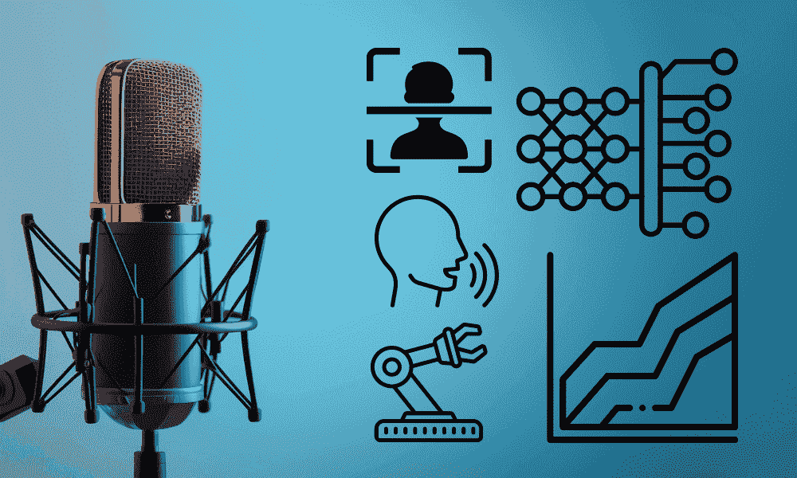

# 每个机器学习爱好者都应该关注的 5 个播客

> 原文：[`www.kdnuggets.com/5-podcasts-every-machine-learning-enthusiast-should-follow`](https://www.kdnuggets.com/5-podcasts-every-machine-learning-enthusiast-should-follow)

图片来源：编辑

机器学习是一个巨大的领域，改变了世界，我敢打赌它会继续增长。如果你关注当前的趋势，你会发现人工智能和机器学习已经慢慢但确实地融入了人们的日常生活，不仅仅是创造商业竞争优势的工具，而是为人们的生活提供真正的价值。

* * *

## 我们的三大课程推荐

 1\. [Google Cybersecurity Certificate](https://www.kdnuggets.com/google-cybersecurity) - 快速进入网络安全职业的快车道。

 2\. [Google Data Analytics Professional Certificate](https://www.kdnuggets.com/google-data-analytics) - 提升你的数据分析能力

 3\. [Google IT Support Professional Certificate](https://www.kdnuggets.com/google-itsupport) - 支持你组织的 IT 需求

* * *

随着机器学习的普及，越来越多的人尝试进入这一领域。然而，很难找到一个能够引导这些热衷者进入机器学习领域的声音。

幸运的是，许多播客专门讨论机器学习及其相关职业。这些播客都是什么？让我们来了解一下。

# 1\. 本周机器学习与人工智能

由 Sam Charrington 主持的热门播客《[本周机器学习与人工智能](https://twimlai.com/podcast/twimlai/)》自 2016 年开始运行，已经发布了数百期节目。它是最久经考验的机器学习播客之一，并且仍在持续进行。每周该播客都会发布一期新节目，邀请各种机器学习和人工智能专家讨论该领域的最新话题。

播客话题讨论通常围绕机器学习的最新突破，例如新的算法或方法论。但它也可以扩展到相关的任何内容，例如应用、商业用途和伦理考量。

讨论的话题可能对爱好者来说比较先进，但它可能为你未来的职业提供洞察和灵感。你将获得在教科书或论文中找不到的见解，确保你与最新发现保持同步。

# 2\. 机器学习播客

[机器学习播客](https://www.themachinelearningpodcast.com/episodes)由 Tobias Macey 主持，是一个自 2022 年开始运行的机器学习专注播客，每月为听众制作一期节目。这个播客邀请了各种机器学习领域的嘉宾讨论机器学习中的重要话题以及幕后发生的事情。

话题可以是最新的算法、技术、工具、公司或任何与机器学习相关的内容。重要的是每集一小时的节目都希望听众能从机器学习中获得价值，并将其带到商业中。

这是一个适合那些想了解商业中发生什么以及机器学习在公司中为何重要的爱好者的好播客。如果你想在机器学习领域获得优势，不要错过这些播客。

# 3\. 实用 AI

[实用 AI](https://changelog.com/practicalai)播客由 Chris Benson 和 Daniel Whitenack 主持，是你机器学习收听列表中的一个极好补充。自 2018 年以来，该播客每周提供一期节目，以便让听众更容易理解机器学习和人工智能。

许多话题涵盖了实用的方法和高级的机器学习，使得听众能够在行业外工作。然而，它主要集中在当前流行的主题上，如 LLM，因此可能无法涵盖机器学习行业中发生的所有事情。

这个播客非常适合那些想要理解高级内容并跟上世界动态的爱好者。

# 4\. 超级数据科学播客

[超级数据科学播客](https://www.superdatascience.com/podcast)由 Jon Krohn 主持，并不一定只集中于机器学习，因为该话题涵盖了整个数据科学领域。然而，许多集讨论了适合初学者的机器学习介绍及相关领域，以更好地教会听众该领域的知识。

该播客自 2016 年开始运行，至今每周制作一期专注于数据科学领域的节目。对于机器学习爱好者来说，有超过 100 集节目供你收听和学习，因此你不必担心很快就会用尽所有节目。

# 5\. 机器学习街谈

[机器学习街谈播客](https://podcasts.apple.com/us/podcast/machine-learning-street-talk-mlst/id1510472996)由 Tim Scarfe 主持，是一个顶尖播客，较为轻松地讨论了许多最近的机器学习和人工智能话题。有时，节目会深入讨论该领域，但有时也会是主持人与嘉宾之间的辩论。

这个播客的推广比其他播客更轻松，因此非常适合那些因技术术语而害怕进入该领域的爱好者。你可以听上数百集，尽管更新不固定，长度可能在 1 小时到 3 小时甚至更长之间变化。

# 结论

这些是推荐给机器学习爱好者的五个播客。播客将为你带来专家对机器学习的全新视角，并提供关于如何在该领域导航的见解。如果你有更多的播客推荐，请在评论中分享。

****[Cornellius Yudha Wijaya](https://www.linkedin.com/in/cornellius-yudha-wijaya/)****是一位数据科学助理经理和数据撰写员。在全职工作于印尼安联期间，他喜欢通过社交媒体和写作媒体分享 Python 和数据技巧。Cornellius 涉及各种 AI 和机器学习主题的写作。

### 更多相关主题

+   [值得关注的数据科学、机器学习与 AI 的最佳 Instagram 账户](https://www.kdnuggets.com/2022/08/best-instagram-accounts-follow-data-science-machine-learning-ai.html)

+   [2022 年顶级数据科学播客](https://www.kdnuggets.com/2022/06/top-data-science-podcasts-2022.html)

+   [2024 年不可错过的 5 大 AI 播客](https://www.kdnuggets.com/top-5-ai-podcasts-you-cant-miss-in-2024)

+   [每位机器学习工程师应该掌握的 5 种机器学习技能](https://www.kdnuggets.com/2023/03/5-machine-learning-skills-every-machine-learning-engineer-know-2023.html)

+   [OpenAI API 初学者指南：易于跟随的入门指南](https://www.kdnuggets.com/openai-api-for-beginners-your-easy-to-follow-starter-guide)

+   [每位数据科学家应该了解的 6 种 Python 机器学习工具](https://www.kdnuggets.com/2022/05/6-python-machine-learning-tools-every-data-scientist-know.html)
