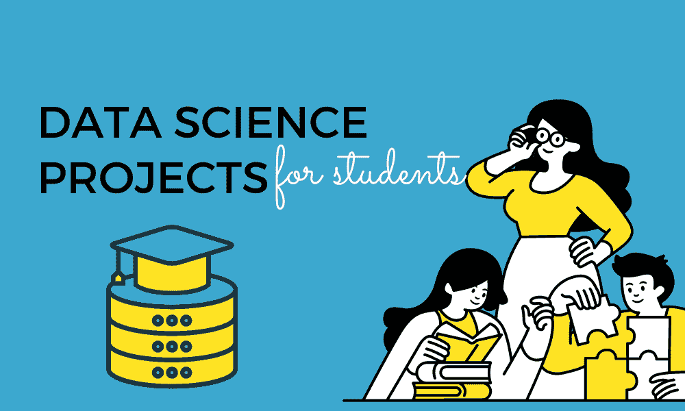
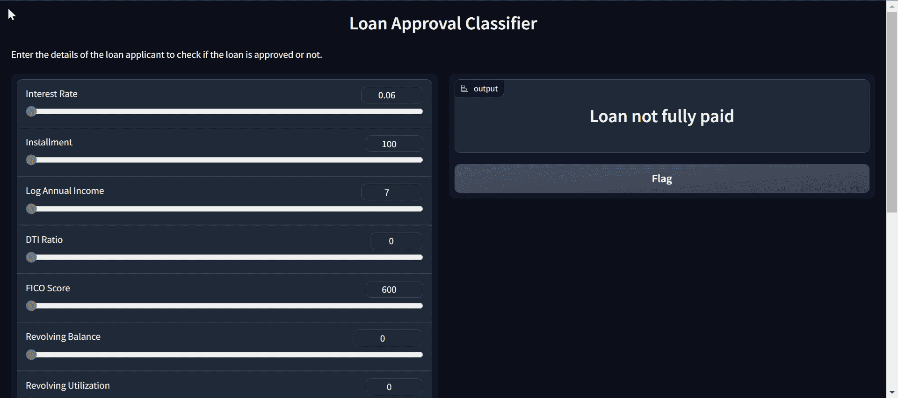
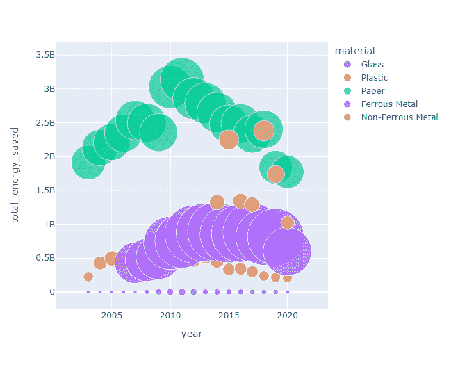
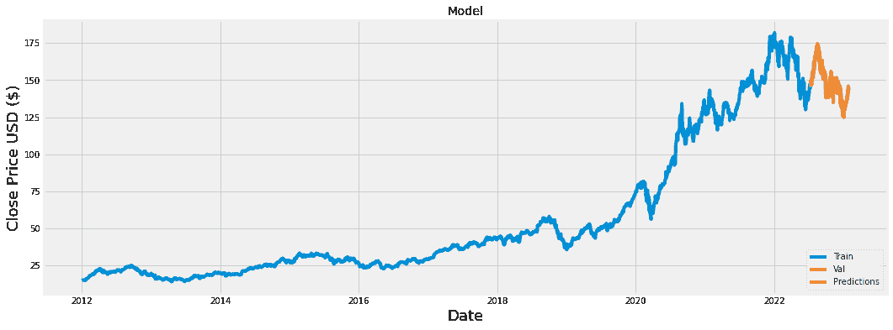
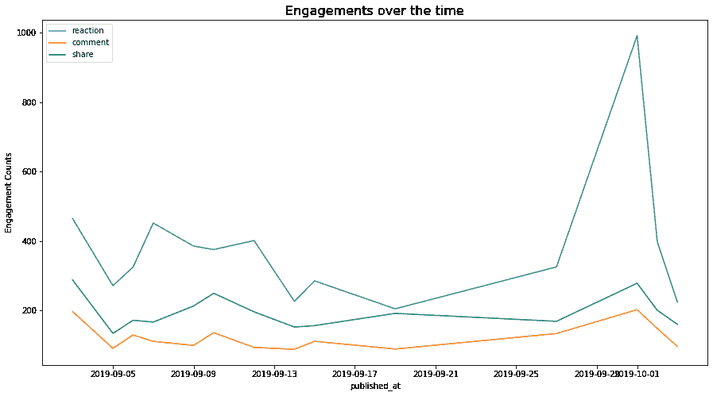
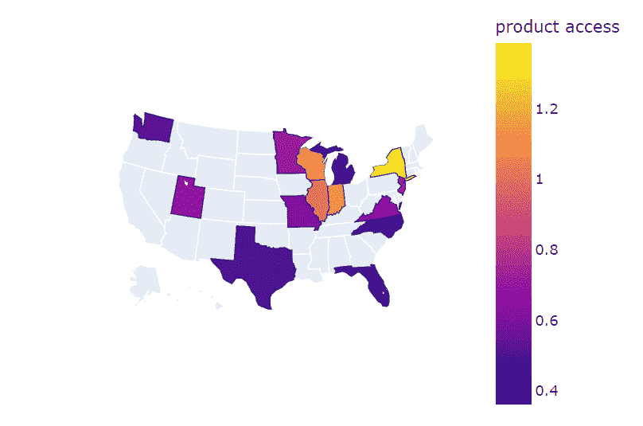

# 5 个数据科学最终年学生的作品集项目

> 原文：[`www.kdnuggets.com/5-portfolio-projects-for-final-year-data-science-students`](https://www.kdnuggets.com/5-portfolio-projects-for-final-year-data-science-students)

图片作者提供

构建数据科学项目的作品集是初学者进入该领域的重要一步。随着动手实践变得越来越重要，拥有展示你技能的多样化作品集可以帮助你脱颖而出。

* * *

## 我们的前三个课程推荐

 1\. [Google 网络安全证书](https://www.kdnuggets.com/google-cybersecurity) - 快速进入网络安全职业道路。

 2\. [Google 数据分析专业证书](https://www.kdnuggets.com/google-data-analytics) - 提升你的数据分析技能

 3\. [Google IT 支持专业证书](https://www.kdnuggets.com/google-itsupport) - 支持你的组织的 IT

* * *

除了展示技术能力，项目还允许你突出你的问题解决技能和分析思维。招聘人员通常寻找能够利用数据提供战略业务洞察并构建数据驱动解决方案以应对现实问题的候选人。执行良好的项目可以让你脱颖而出，成为能为组织增值的人。

在这篇博客中，我们将探索从数据分析到机器学习的简单作品集项目。你将发现如何清理和处理数据，然后使用各种分析技术向非技术利益相关者传达洞察。

# 1\. 从头到尾的数据科学项目与 ChatGPT

在 [从头到尾的数据科学项目与 ChatGPT](https://www.datacamp.com/tutorial/chatgpt-data-science-projects) 项目中，你将使用 ChatGPT 进行项目规划、数据分析、数据预处理、模型选择、超参数调整、开发 web 应用程序以及在 Spaces 上部署它。

现在，任何知识有限的人都可以使用 ChatGPT 理解数据并构建机器学习应用程序。这个项目将展示你可以使用最新的 AI 技术来产生快速而有效的结果。

图片来自项目

# 2\. 新加坡节约的回收能源

对于[新加坡回收能源节省](https://towardsdatascience.com/annual-recycled-energy-saved-in-singapore-2d6bad49bfb2)项目，你将使用回收统计数据来确定 2003 年至 2020 年间从五种不同废物类型（塑料、纸张、玻璃、铁金属和非铁金属）中节省的年度能源量。具体来说，你将加载和组织数据集，合并不同的 CSV 文件，并进行探索性数据分析。这个项目将挑战你的分析和数据处理能力。

项目图片

# 3\. 股票市场分析

[股票市场分析](https://www.kaggle.com/code/faressayah/stock-market-analysis-prediction-using-lstm/notebook#5.-How-much-value-do-we-put-at-risk-by-investing-in-a-particular-stock?) 项目使用现实世界的金融数据来展示时间序列分析技能。清洗数据后，使用 Matplotlib 和 Seaborn 进行探索性分析和可视化，以分析风险指标和股票之间的关系。

长短期记忆（LSTM）模型在时间序列数据上进行训练，以预测未来价格。通过涵盖数据收集、清洗、可视化和建模，这个项目突显了在核心数据分析和机器学习工作流程中的熟练程度。

项目图片

# 4\. 分析和预测消费者参与

在[分析和预测消费者参与项目](https://deepnote.com/@abid/Analyzing-and-Predicting-Consumer-Engagement-6da86419-8c62-4e7d-95b4-de4973e49e4c)中，你将使用来自 Kaggle 的互联网新闻和消费者参与数据集来预测最受欢迎的文章及其受欢迎程度分数。你将分析数据以寻找模式，如相关性、分布、均值和时间序列分析。你将使用文本回归和文本分类模型来预测参与分数和基于标题的热门文章。

在这个项目中，你将学习如何处理文本数据，使用 Python 库进行文本分析，将文本转换为向量，并构建 LGBM 分类器模型。

项目图片

# 5\. COVID19 期间数字学习的演变

在[COVID19 期间数字学习的演变](https://www.kaggle.com/code/kingabzpro/evolution-of-digital-learning-during-covid19#Geographical-Analysis)项目中，我们将使用数据分析工具来找出数字学习的趋势以及它对改善社区的有效性。我们将比较各地区和各州在人口统计、互联网接入、学习产品接入和财务等因素上的差异。最后，我们将总结报告并指出需要更多关注的领域，以使美国所有学生都能获得教育。

你将学习使用所有主要的数据分析和可视化工具。这也是一个指南，适合那些希望在展示中生成引人注目的可视化效果的人。

项目中的图像

# 结论

构建数据科学项目作品集可以帮助初学者向潜在雇主展示他们的技术技能和解决问题的能力。通过展示在数据收集、清理、分析、建模和可视化方面的能力，这些项目可以突出个人在数据科学工作流中的熟练程度。

在这篇博客中，我们回顾了五个针对最终年数据科学学生的作品集项目。它涵盖了数据处理、操控、可视化和建模基础。要探索更多项目，请查看数据科学项目完整合集 – 第一部分和第二部分。

**[Abid Ali Awan](https://www.polywork.com/kingabzpro)** ([@1abidaliawan](https://www.linkedin.com/in/1abidaliawan/)) 是一位认证的数据科学专业人士，热衷于构建机器学习模型。目前，他专注于内容创作，并撰写关于机器学习和数据科学技术的技术博客。Abid 拥有技术管理硕士学位和电信工程学士学位。他的愿景是使用图神经网络为那些在精神健康上挣扎的学生开发 AI 产品。

### 主题更多内容

+   [学生在数据科学简历中缺失的 7 件事](https://www.kdnuggets.com/7-things-students-are-missing-in-a-data-science-resume)

+   [5 个高级数据科学作品集项目](https://www.kdnuggets.com/2023/03/5-advance-projects-data-science-portfolio.html)

+   [5 个用于数据科学作品集的 Python 项目](https://www.kdnuggets.com/2022/12/5-python-projects-data-science-portfolio.html)

+   [生成式 AI：初稿而非最终稿](https://www.kdnuggets.com/generative-ai-the-first-draft-not-final)

+   [7 个机器学习作品集项目以提升简历](https://www.kdnuggets.com/2022/09/7-machine-learning-portfolio-projects-boost-resume.html)

+   [LLM 项目组合创意以惊艳雇主](https://www.kdnuggets.com/llm-portfolio-projects-ideas-to-wow-employers)
