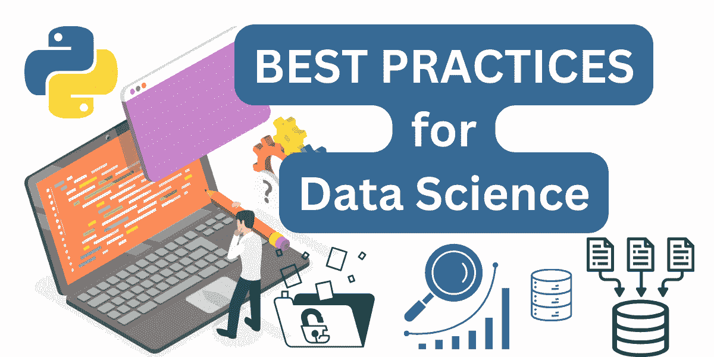
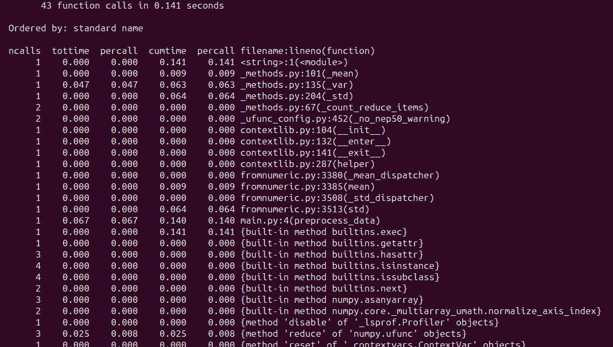

# 5 个 Python 数据科学最佳实践

> 原文：[`www.kdnuggets.com/5-python-best-practices-for-data-science`](https://www.kdnuggets.com/5-python-best-practices-for-data-science)



图片由作者提供

扎实的 Python 和 SQL 技能对许多数据专业人员都至关重要。作为数据专业人员，你可能对 Python 编程非常熟悉——以至于编写 Python 代码感觉相当自然。但在进行数据科学项目时，你是否遵循了最佳实践呢？

* * *

## 我们的前三个课程推荐

 1\. [Google 网络安全证书](https://www.kdnuggets.com/google-cybersecurity) - 快速进入网络安全职业生涯。

 2\. [Google 数据分析专业证书](https://www.kdnuggets.com/google-data-analytics) - 提升你的数据分析能力

 3\. [Google IT 支持专业证书](https://www.kdnuggets.com/google-itsupport) - 支持你的组织进行 IT 管理

* * *

尽管学习 Python 并用它构建数据科学应用很简单，但写出难以维护的代码可能更容易。为了帮助你编写更好的代码，本教程探讨了一些 Python 编码最佳实践，这些实践有助于依赖管理和维护性，例如：

+   在本地进行数据科学项目时，设置专用的虚拟环境

+   通过类型提示提高可维护性

+   使用 Pydantic 进行数据建模和验证

+   代码分析

+   尽可能使用矢量化操作

所以让我们开始编码吧！

## 1\. 为每个项目使用虚拟环境

虚拟环境确保项目依赖被隔离，防止不同项目之间的冲突。在数据科学中，项目通常涉及不同的库和版本集合，虚拟环境对于维护可重复性和有效管理依赖特别有用。

此外，虚拟环境还使合作者能够更轻松地设置相同的项目环境，而无需担心依赖冲突。

你可以使用像 Poetry 这样的工具来创建和管理虚拟环境。使用 Poetry 有很多好处，但如果你只需要为你的项目创建虚拟环境，你也可以使用 [内置的 venv 模块](https://docs.python.org/3/library/venv.html)。

如果你使用的是 Linux 机器（或 Mac），你可以这样创建和激活虚拟环境：

```py
 # Create a virtual environment for the project
 python -m venv my_project_env

 # Activate the virtual environment
 source my_project_env/bin/activate 
```

如果你是 Windows 用户，你可以 [查看文档](https://docs.python.org/3/library/venv.html) 了解如何激活虚拟环境。因此，为每个项目使用虚拟环境有助于保持依赖的隔离和一致性。

## 2\. 添加类型提示以提高可维护性

由于 Python 是动态类型语言，你不需要为你创建的变量指定数据类型。然而，你可以添加类型提示——指明期望的数据类型——以使你的代码更易维护。

让我们以一个计算数据集中数值特征均值的函数为例，并进行适当的类型注释：

```py
from typing import List

def calculate_mean(feature: List[float]) -> float:
         # Calculate mean of the feature
          mean_value = sum(feature) / len(feature)
          return mean_value 
```

在这里，类型提示让用户知道`calcuate_mean`函数接受一个浮点数列表并返回一个浮点值。

记住，Python 在运行时不会强制类型。但你可以使用 mypy 或类似工具来对无效类型引发错误。

## 3\. 使用 Pydantic 建模你的数据

之前我们讨论了添加类型提示以使代码更易维护。这对于 Python 函数非常有效。但是在处理来自外部来源的数据时，通常通过定义具有预期数据类型的类和字段来建模数据会更有帮助。

你可以使用 Python 内置的数据类，但没有开箱即用的数据验证支持。使用 Pydantic，你可以建模你的数据，还可以利用其内置的数据验证功能。要使用 Pydantic，你可以通过 pip 安装它及其邮件验证器：

```py
$ pip install pydantic[email-validator]
```

这里是一个使用 Pydantic 建模客户数据的示例。你可以创建一个继承自`BaseModel`的模型类，并定义各种字段和属性：

```py
from pydantic import BaseModel, EmailStr

class Customer(BaseModel):
	customer_id: int
	name: str
	email: EmailStr
	phone: str
	address: str

# Sample data
customer_data = {
	'customer_id': 1,
	'name': 'John Doe',
	'email': 'john.doe@example.com',
	'phone': '123-456-7890',
	'address': '123 Main St, City, Country'
}

# Create a customer object
customer = Customer(**customer_data)

print(customer) 
```

你可以通过添加验证来进一步检查字段是否都具有有效值。如果你需要关于使用 Pydantic——定义模型和验证数据的教程——请阅读 [Pydantic 教程：Python 数据验证简化](https://www.kdnuggets.com/pydantic-tutorial-data-validation-in-python-made-simple)。

## 4\. 进行代码性能分析以识别性能瓶颈

性能分析对于优化应用程序性能是非常有帮助的。在数据科学项目中，你可以根据具体情况分析内存使用和执行时间。

假设你正在进行一个机器学习项目，其中预处理大数据集是训练模型之前的关键步骤。让我们对一个应用常见预处理步骤（如标准化）的函数进行性能分析：

```py
import numpy as np
import cProfile

def preprocess_data(data):
	# Perform preprocessing steps: scaling and normalization
	scaled_data = (data - np.mean(data)) / np.std(data)
	return scaled_data

# Generate sample data
data = np.random.rand(10000000)

# Profile preprocessing function
cProfile.run('preprocess_data(data)') 
```

当你运行脚本时，你应该会看到类似的输出：



在这个例子中，我们正在对`preprocess_data()`函数进行性能分析，该函数用于预处理样本数据。性能分析通常有助于识别潜在的瓶颈——指导优化以提高性能。以下是一些关于 Python 性能分析的教程，你可能会觉得有用：

+   [使用 timeit 和 cProfile 进行 Python 代码性能分析](https://www.kdnuggets.com/profiling-python-code-using-timeit-and-cprofile)

+   [Python 内存性能分析介绍](https://www.kdnuggets.com/introduction-to-memory-profiling-in-python)

## 5\. 使用 NumPy 的向量化操作

对于任何数据处理任务，你总是可以从头编写 Python 实现。但是，当处理大量数字数组时，你可能不想这样做。对于大多数常见操作——这些操作可以表述为对向量的操作——你可以使用 NumPy 更高效地执行它们。

让我们以以下逐元素相乘的例子为例：

```py
import numpy as np
import timeit

# Set seed for reproducibility
np.random.seed(42)

# Array with 1 million random integers
array1 = np.random.randint(1, 10, size=1000000)  
array2 = np.random.randint(1, 10, size=1000000) 
```

这里是 Python 仅实现和 NumPy 实现：

```py
# NumPy vectorized implementation for element-wise multiplication
def elementwise_multiply_numpy(array1, array2):
	return array1 * array2

# Sample operation using Python to perform element-wise multiplication
def elementwise_multiply_python(array1, array2):
	result = []
	for x, y in zip(array1, array2):
    	result.append(x * y)
	return result 
```

让我们使用`timeit`模块中的`timeit`函数来测量上述实现的执行时间：

```py
# Measure execution time for NumPy implementation
numpy_execution_time = timeit.timeit(lambda: elementwise_multiply_numpy(array1, array2), number=10) / 10
numpy_execution_time = round(numpy_execution_time, 6)

# Measure execution time for Python implementation
python_execution_time = timeit.timeit(lambda: elementwise_multiply_python(array1, array2), number=10) / 10
python_execution_time = round(python_execution_time, 6)

# Compare execution times
print("NumPy Execution Time:", numpy_execution_time, "seconds")
print("Python Execution Time:", python_execution_time, "seconds") 
```

我们看到 NumPy 实现的速度快了约 100 倍：

```py
Output >>>
NumPy Execution Time: 0.00251 seconds
Python Execution Time: 0.216055 seconds 
```

## 总结

在本教程中，我们探讨了几种数据科学的 Python 编码最佳实践。希望你觉得这些实践对你有帮助。

如果你对学习用于数据科学的 Python 感兴趣，请查看[5 个免费课程掌握 Python 数据科学](https://www.kdnuggets.com/5-free-courses-to-master-python-for-data-science)。祝学习愉快！

**[](https://twitter.com/balawc27)**[Bala Priya C](https://www.kdnuggets.com/wp-content/uploads/bala-priya-author-image-update-230821.jpg)** 是一位来自印度的开发人员和技术作家。她喜欢在数学、编程、数据科学和内容创作的交汇点上工作。她的兴趣和专长领域包括 DevOps、数据科学和自然语言处理。她喜欢阅读、写作、编程和咖啡！目前，她正在通过编写教程、操作指南、评论文章等与开发者社区分享她的知识。Bala 还制作了引人入胜的资源概述和编码教程。**

### 更多相关话题

+   [将 ChatGPT 集成到数据科学工作流程中：技巧和最佳实践](https://www.kdnuggets.com/2023/05/integrating-chatgpt-data-science-workflows-tips-best-practices.html)

+   [数据科学团队协作的 5 个最佳实践](https://www.kdnuggets.com/2023/06/5-best-practices-data-science-team-collaboration.html)

+   [迁移到 AWS 云的 11 个最佳实践](https://www.kdnuggets.com/2023/04/11-best-practices-cloud-data-migration-aws-cloud.html)

+   [数据可视化最佳实践与有效沟通的资源](https://www.kdnuggets.com/2023/04/data-visualization-best-practices-resources-effective-communication.html)

+   [数据仓库和 ETL 的最佳实践](https://www.kdnuggets.com/2023/02/data-warehousing-etl-best-practices.html)

+   [构建机器学习 ETL 的最佳实践](https://www.kdnuggets.com/best-practices-for-building-etls-for-ml)
