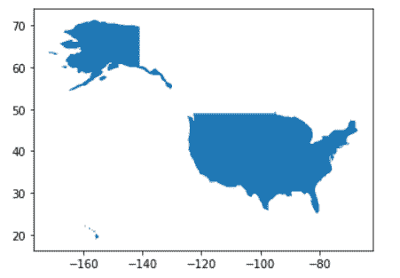
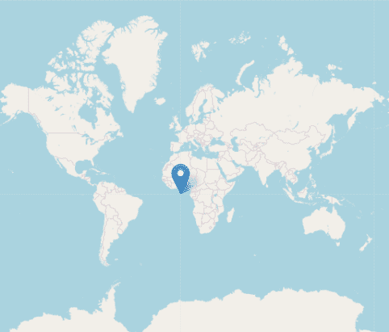
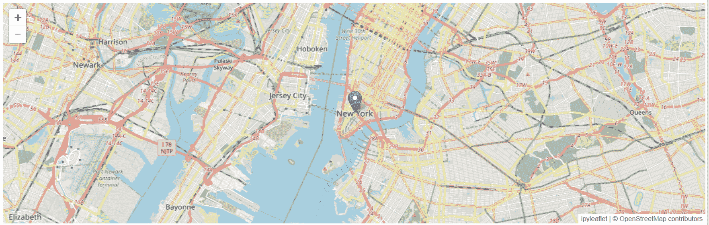
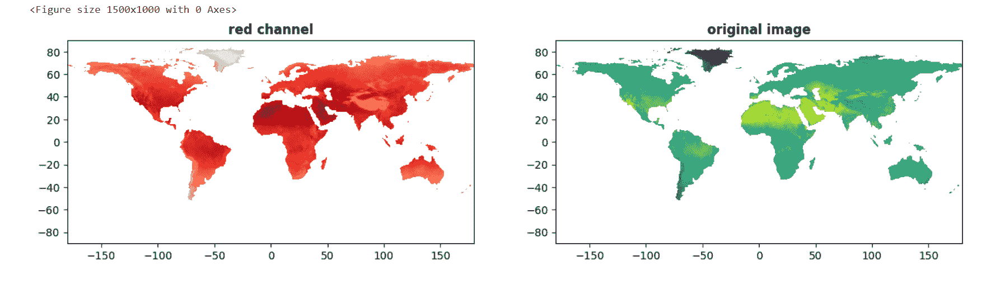
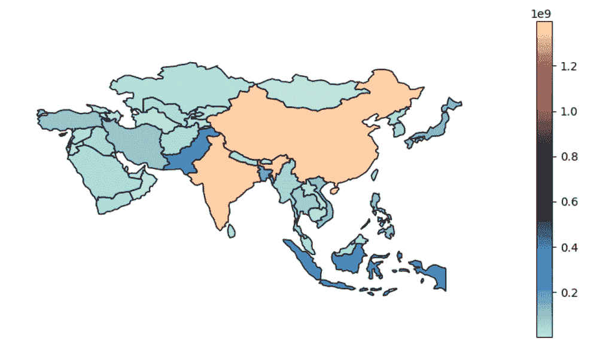

# 5 个用于地理空间数据分析的 Python 包

> 原文：[`www.kdnuggets.com/2023/08/5-python-packages-geospatial-data-analysis.html`](https://www.kdnuggets.com/2023/08/5-python-packages-geospatial-data-analysis.html)

# 介绍

* * *

## 我们的前三课程推荐

 1\. [Google 网络安全证书](https://www.kdnuggets.com/google-cybersecurity) - 快速进入网络安全职业生涯。

 2\. [Google 数据分析专业证书](https://www.kdnuggets.com/google-data-analytics) - 提升你的数据分析技能

 3\. [Google IT 支持专业证书](https://www.kdnuggets.com/google-itsupport) - 支持你的组织 IT

* * *

地理空间数据分析在城市规划、环境研究、农业和交通运输等行业至关重要。不断增长的需求导致了 Python 包的使用增加，用于各种地理数据分析需求，例如分析气候模式、调查城市发展或追踪疾病传播等。评估和选择具有快速处理、修改和可视化能力的正确工具，对于有效分析和可视化地理空间数据至关重要。

# 理解地理空间数据

首先理解什么是地理空间数据是很重要的。地理空间数据是具有地理或地理组件的数据，代表地球表面上对象、特征或事件的位置和属性。它描述了物理宇宙中各种项目的空间连接、分布和属性。地理空间数据主要有两种类型：

+   **光栅数据**：适用于没有固定边界的连续信息，以网格单元的形式表示，其中值指示观察到的特征。通常在固定间隔进行监测，并通过插值创建连续的表面。

+   **矢量数据**：使用点、线和多边形来表示空间属性，包括兴趣点、交通网络、行政边界和土地区块，通常用于具有精确位置或硬约束的离散数据。

地理空间数据可以存储在各种格式中，例如：

+   ESRI Shapefile

+   GeoJSON

+   Erdas Imagine 图像文件格式（EIF）

+   GeoTIFF, Geopackage（GPKG）

+   GeoJSON, 光检测

+   范围（LiDAR）等许多其他类型。

地理空间数据涵盖多种类型，如卫星图像、海拔模型、点云、土地使用分类和基于文本的信息，为跨行业的空间分析和决策提供了宝贵的见解。像微软、谷歌、Esri 和亚马逊网络服务这样的主要公司利用地理空间数据获得有价值的见解。让我们来探讨五个用于地理空间数据分析的顶级 Python 包。这些包支持数据的读取/写入、处理、可视化、地理编码和地理索引，适合初学者和经验丰富的用户。发现这些包如何有效地进行探索、可视化和从地理空间数据中提取见解。让我们开始吧！

# 1\. Geopandas

**适合：** 矢量数据

Geopandas 是一个广泛使用的 Python 库，用于处理矢量地理空间数据，在 Pandas DataFrames 中提供直观的地理数据处理。它支持 Shapefiles 和 GeoJSON 等格式，并提供如合并、分组和空间连接等空间操作。Geopandas 与 Pandas、NumPy 和 Matplotlib 等流行库无缝集成。它可以处理大型数据集，但这可能会带来挑战。Geopandas 包通常用于空间数据分析任务，包括空间连接、查询和像缓冲区和交集分析等地理空间操作。Geopandas 需要不同的包，如 Shapely 处理几何操作，Fiona 访问文件，matplotlib 用于绘图。

例如，Geopandas 可以用于探索房地产数据，以识别城市中最昂贵的社区，或分析人口数据以可视化不同社区的增长和迁移模式。

我们可以使用 pip 安装该包：

```py
pip install geopandas
```

## 使用 GeoPandas 绘图

让我们查看下面显示的内置地图：

```py
import geopandas 
# Check available maps
geopandas.datasets.available
```

我们将使用 Geopandas 加载一个世界地图数据集，提取美国的 shapefile，并用以下代码在图表上绘制它：

```py
# Selecting a particular map
geopandas.datasets.get_path('naturalearth_lowres')
# Open the selected map - GeoDataFrame
world = geopandas.read_file(geopandas.datasets.get_path('naturalearth_lowres'))
# Create a subset of the GeoDataFrame
usa = world[world.name == "United States of America"]
# Plot the subset
usa.plot();
```

上述代码打印了子集数据框的地图：



# 2\. Folium

**适合：** 点云

Folium 是一个用于创建带有标记、弹出窗口、等值线图和其他地理空间可视化的 Python 库。它与 Leaflet JavaScript 库集成，并允许将地图导出为 HTML。它可以与 Geopandas 和 Cartopy 结合使用，并通过 Map Tiles 处理大型数据集。Folium 在简单性、美观性和与其他地理空间库的集成方面表现出色。然而，对于高级地理空间分析和处理，Folium 可能有其局限性。

例如，Folium 可以在供应链和物流中用于可视化分销网络、优化路线和监控货物位置。

我们可以使用以下命令安装 Folium：

```py
pip install folium
```

## 使用 Folium 绘图

让我们用以下代码行打印一个以 [0, 0] 为中心的样本交互式地图，并在同一位置放置一个标记：

```py
import folium
# Generate a Folium map with center coordinates (0, 0)
map = folium.Map(location=[0, 0], zoom_start=2)
# Locate the coordinates 0, 0
folium.Marker([0, 0]).add_to(map)
# Display the map
map
```



这个地图可以通过添加标记、图层或根据特定地理空间数据进行样式调整来进一步自定义。

# 3\. ipyleaflet

**适用于：** 点云，互动

ipyleaflet 包使在 Python 中创建交互式地图变得简单，特别是在 Jupyter notebooks 中，允许用户生成和共享具有各种底图、标记和其他地理空间操作的交互式地图。ipyleaflet 基于 leaflet JavaScript 库，支持 GeoJSON 和 WMS 图层、CSS 和 JavaScript 样式以及地理空间计算。虽然 ipyleaflet 在交互式小部件方面表现出色，但由于其对 JavaScript 的依赖，可能不适合纯 Python 项目。

例如，ipyleaflet 可以应用于环境监测，以可视化传感器数据、监测空气质量，并实时评估环境变化。

要安装 ipyleaflet，我们使用 pip 命令：

```py
pip install ipyleaflet
```

## 使用 ipyleaflet 绘图

让我们使用以下代码创建一个交互式地图，在坐标 (40.7128, -74.0060) 放置一个标记，表示纽约市的一个兴趣点：

```py
from ipyleaflet import Map, Marker
# Create the map
m = Map(center=(40.7128, -74.0060), zoom=12)
# Add the market
marker = Marker(location=(40.7128, -74.0060))
m.add_layer(marker)
```

以下是代码的输出：



# 4\. Rasterio

**适用于：** 光栅数据

Rasterio 是一个功能强大的 Python 库，用于处理地理空间光栅数据，提供高效的性能和广泛的操作，如裁剪、重新投影和重采样。它支持多种光栅格式，并与其他地理空间库集成良好，尽管它在处理矢量数据和复杂分析任务时存在局限性。然而，Rasterio 是 Python 中高效的光栅数据操作和处理的必备工具。

例如，rasterio 可用于读取和写入卫星图像、进行地形分析、从数字高程模型中提取数据以及进行遥感分析等任务。

```py
!pip install rasterio
```

rasterio.open() 函数打开文件，read() 方法将图像读取为 numpy 数组。最后，使用 Matplotlib 的 plt.imshow() 函数来显示图像，plt.show() 显示输出中的图表。

## 使用 rasterio 绘图

```py
import rasterio
from rasterio.plot import show
```

我们使用 rasterio 库从 kaggle 数据集‘气候数据的高分辨率 GeoTIFF 图像’中的 'sample.tif' 文件打开并可视化一个光栅图像，显示红色通道（图像中的颜色通道之一）作为一个子图，并使用 Reds 颜色图谱，而原始图像（包含多个颜色通道）作为另一个子图，使用 viridis 颜色图谱。其他颜色通道，如绿色和蓝色，也可以使用这种方法进行可视化。

```py
src = rasterio.open('/content/sample.tif')
plt.figure(figsize=(15,10))
fig, (axr, axg) = plt.subplots(1,2, figsize=(15,7))
show((src, 1), ax=axr, cmap='Reds', title='red channel')
show((src), ax=axg, cmap='viridis', title='original image')
plt.show()
```



原始 GeoTIFF 图像（右）来源：[kaggle.com](https://www.kaggle.com/datasets/abireltaief/highresolution-geotiff-images-of-climatic-data)

在地理空间分析中分析特定的颜色通道如红色、蓝色和绿色，目的是关注或提取与这些颜色组件相关的特定属性、特征或特性的信息。例如，可能包括遥感中的植被健康、植被指数或水体等。

# 5\. Geoplot

**适用于：** 矢量数据，交互式

Geoplot 是一个用户友好的 Python 库，用于快速创建视觉上吸引人的地理空间可视化，包括分层地图和散点图。它与流行的数据处理库如 Pandas 无缝集成，并支持多种地图投影。然而，Geoplot 在交互式地图支持方面有局限性，且与专门的地理空间库相比，图表类型的范围较小。尽管如此，它仍然在快速地理空间数据可视化和洞察空间模式方面具有价值。

```py
!pip install geoplot
```

## 使用 geoplot 绘图

我们将使用 Geoplot 绘制分层地图可视化，从世界 shapefile 中选择亚洲国家，基于“pop_est”属性分配颜色强度，并使用“icefire”颜色映射绘制地图，图例的大小为 10 x 5。

```py
import geoplot
#Plotting population for Asia
asia = world.query("continent == 'Asia'")
geoplot.choropleth(asia, hue = "pop_est", cmap = "icefire",legend=True, figsize = (10, 5));
```



例如，geoplot 包可以创建人口密度的分层地图，绘制犯罪事件的空间模式，展示环境因素的分布，并基于地理数据分析疾病的传播。

# 结论

总之，地理空间 Python 包有助于有效地分析基于位置的信息。每个讨论过的包都有其优点和缺点，但它们结合在一起可以形成一个强大的 Python 工具套件，用于处理地理空间数据。因此，对于初学者或经验丰富的 GIS 专业人士，这些包在分析、可视化和处理地理空间数据方面都非常有价值。

你可以在我的 GitHub 仓库 [这里](https://github.com/Devashree21/Top-5-Python-Packages-for-Geospatial-Data-Analysis) 找到本文的代码。

如果你觉得这篇文章有启发，欢迎在 [LinkedIn](https://www.linkedin.com/in/devashree-madhugiri) 和 [Twitter](https://twitter.com/Dev_Subhash11) 上与我联系。记得关注我在 [Kaggle](https://www.kaggle.com/devsubhash) 的页面，那里你可以访问我的机器学习和深度学习项目、笔记本以及引人注目的数据可视化作品。

**[Devashree Madhugiri](https://www.linkedin.com/in/devashree-madhugiri)** 拥有德国信息技术硕士学位，并具有数据科学背景。她喜欢从事各种机器学习和深度学习项目。她通过在多个技术平台上撰写与数据可视化、机器学习、计算机视觉相关的技术文章来分享她在 AI 方面的知识。她目前是 Kaggle Notebooks Master，闲暇时间喜欢解数独谜题。

### 更多相关话题

+   [使用 Geemap 进行地理空间数据分析](https://www.kdnuggets.com/geospatial-data-analysis-with-geemap)

+   [使用 GeoPandas 在 Python 中利用地理空间数据](https://www.kdnuggets.com/leveraging-geospatial-data-in-python-with-geopandas)

+   [在 Python 中使用 Google Earth 构建地理空间应用程序…](https://www.kdnuggets.com/2022/03/building-geospatial-application-python-google-earth-engine-greppo.html)

+   [2023 年必知的顶级数据 Python 包](https://www.kdnuggets.com/2023/01/top-data-python-packages-know-2023.html)

+   [3 个用于数据可视化的 Julia 包](https://www.kdnuggets.com/2023/02/3-julia-packages-data-visualization.html)

+   [掌握 SQL、Python、数据清洗、数据整理和探索性数据分析的指南合集](https://www.kdnuggets.com/collection-of-guides-on-mastering-sql-python-data-cleaning-data-wrangling-and-exploratory-data-analysis)
