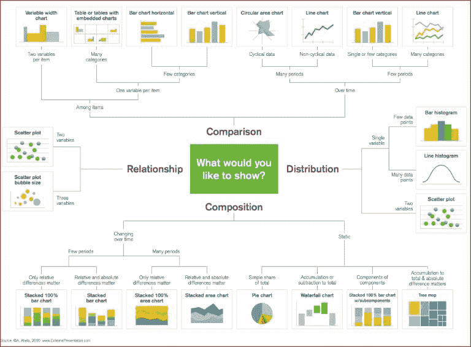
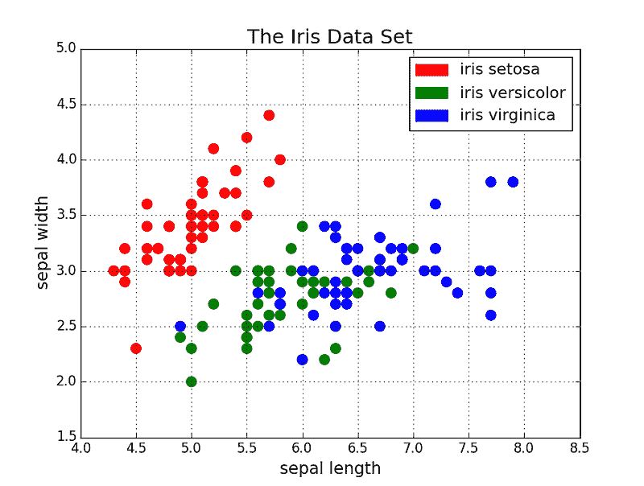
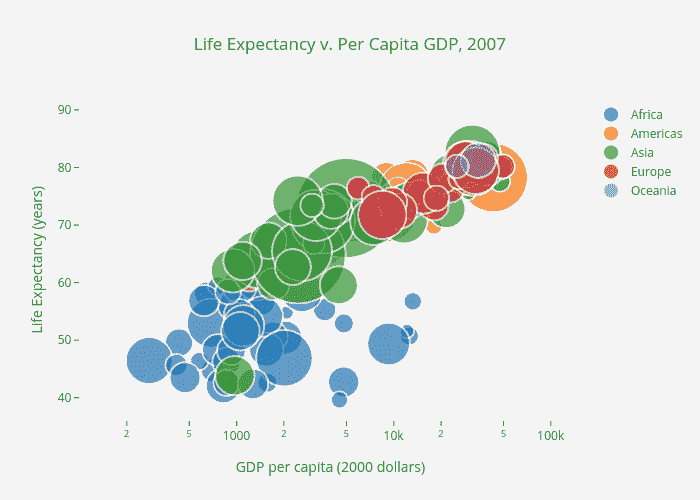
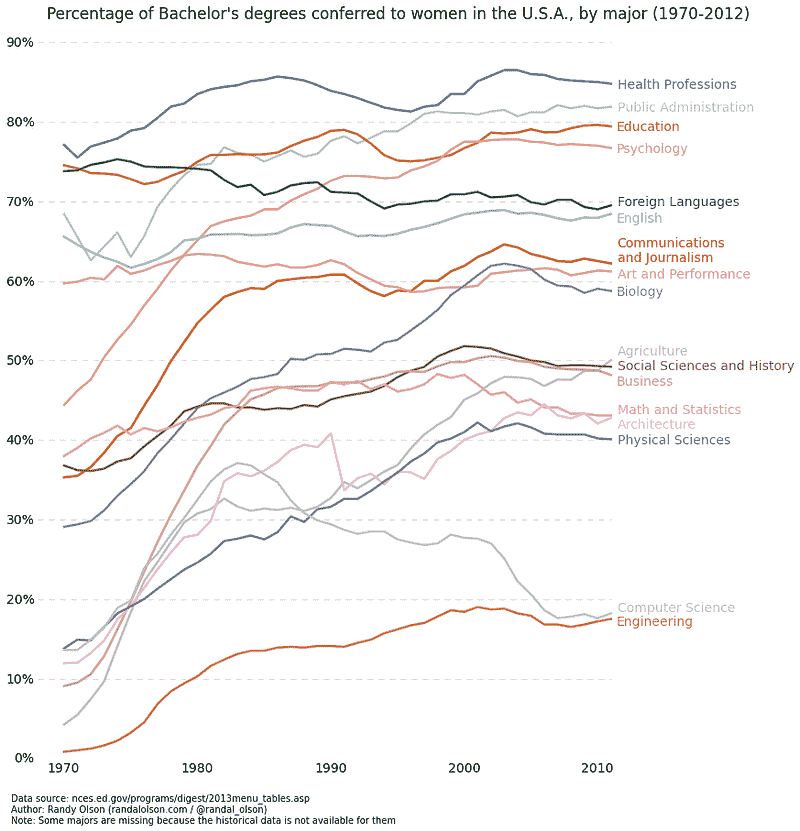
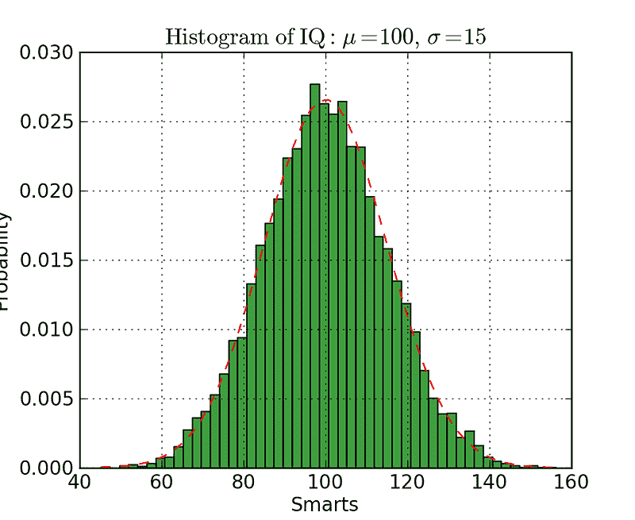
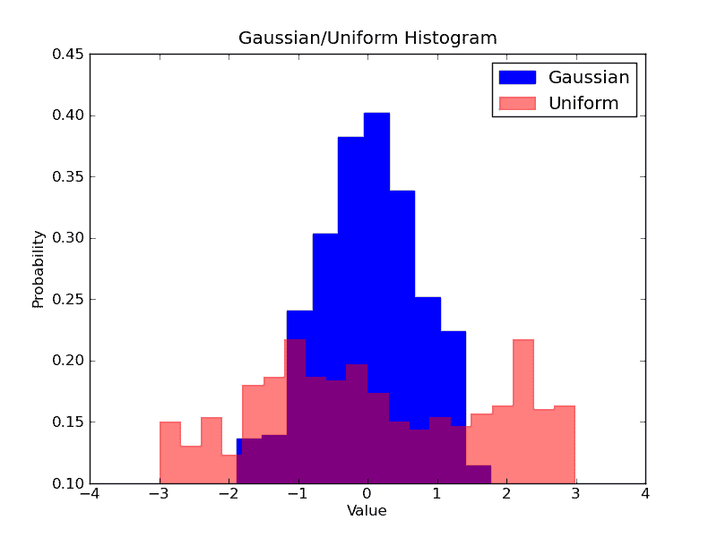
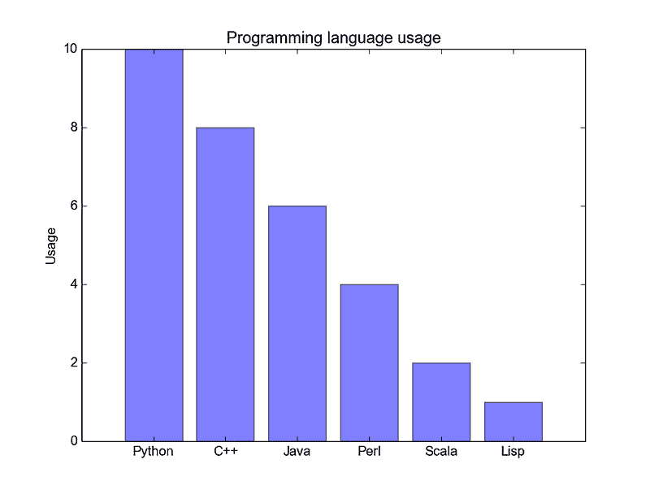
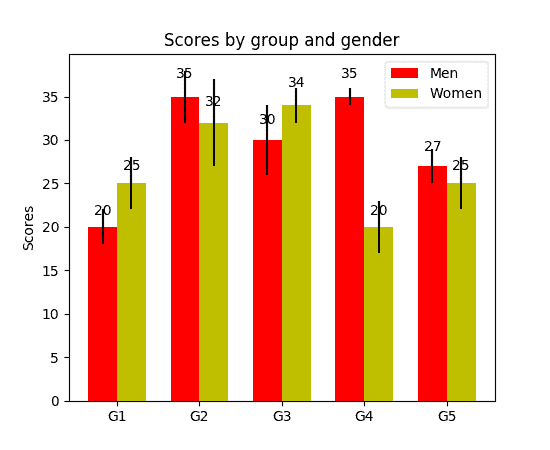
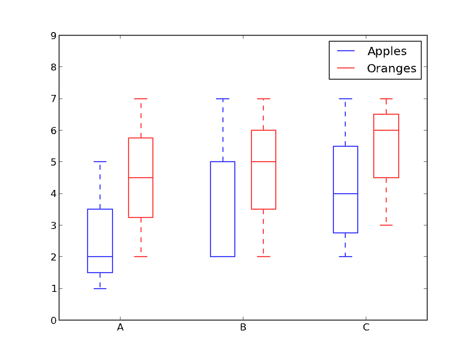

# 使用代码进行的 5 种快速简便的数据可视化

> 原文：[`www.kdnuggets.com/2018/07/5-quick-easy-data-visualizations-python-code.html`](https://www.kdnuggets.com/2018/07/5-quick-easy-data-visualizations-python-code.html)

评论

数据可视化是数据科学家工作的重要组成部分。在项目的早期阶段，你通常会进行探索性数据分析（EDA），以获得对数据的一些见解。创建可视化图表有助于让事物更加清晰和易于理解，特别是在处理较大、高维数据集时。在项目结束时，能够以清晰、简洁和有说服力的方式展示最终结果是很重要的，以便你的观众（通常是非技术客户）能够理解。

Matplotlib 是一个流行的 Python 库，可以轻松创建数据可视化。然而，每次启动新项目时，设置数据、参数、图形和绘图可能会变得相当麻烦和繁琐。在这篇博客文章中，我们将介绍 6 种数据可视化方法，并用 Python 的 Matplotlib 为它们编写一些快速简便的函数。同时，这里有一个很棒的图表，可以帮助你选择适合的可视化方式！

* * *

## 我们的三大课程推荐

 1\. [谷歌网络安全证书](https://www.kdnuggets.com/google-cybersecurity) - 快速开启网络安全职业生涯

 2\. [谷歌数据分析专业证书](https://www.kdnuggets.com/google-data-analytics) - 提升您的数据分析技能

 3\. [谷歌 IT 支持专业证书](https://www.kdnuggets.com/google-itsupport) - 支持您组织的 IT 需求

* * *

用于选择适当数据可视化技术的图表

### **散点图**

散点图非常适合展示两个变量之间的关系，因为你可以直接看到数据的原始分布。通过对不同数据组进行颜色编码，你还可以查看这些数据组之间的关系，如下图所示。想要可视化三个变量之间的关系？没问题！只需使用另一个参数，如点的大小，将第三个变量编码进去，如下图所示。

带有颜色分组的散点图

带有颜色分组和尺寸编码的散点图，用于表示国家的大小

现在是代码部分。我们首先导入 Matplotlib 的 pyplot，别名为“plt”。要创建新的图形，我们调用`plt.subplots()`。我们将 x 轴和 y 轴数据传递给函数，然后传递给`ax.scatter()`来绘制散点图。我们还可以设置点的大小、颜色和透明度。甚至可以将 y 轴设置为对数尺度。然后为图形设置标题和轴标签。这是一个易于使用的函数，从头到尾创建散点图！

### **折线图**

当你可以清楚地看到一个变量随着另一个变量的变化而变化很大，即它们具有较高的协方差时，折线图最为适用。我们来看看下面的图示。我们可以清楚地看到所有专业的百分比随时间的变化量很大。用散点图绘制这些数据会非常混乱且杂乱无章，使得很难真正理解和看到发生了什么。折线图在这种情况下非常适合，因为它们基本上为我们提供了两个变量（百分比和时间）协方差的快速总结。同样，我们也可以使用颜色编码进行分组。

示例折线图

这里是折线图的代码。它与上面的散点图非常相似，只是变量有一些小的变化。

### **直方图**

直方图对于查看（或真正发现）数据点的分布非常有用。查看下面的直方图，我们绘制了频率与智商的直方图。我们可以清楚地看到中心的集中情况以及中位数。我们还可以看到它遵循高斯分布。使用条形图（例如，而不是散点图）确实可以清晰地可视化每个箱子的频率之间的相对差异。使用箱子（离散化）真的帮助我们看到“大局”，而如果我们使用所有数据点而没有离散箱子，可能会有很多噪音在可视化中，使得很难看到实际情况。

直方图示例

Matplotlib 中的直方图代码如下。需要注意两个参数。首先，`n_bins`参数控制我们希望为直方图设置多少个离散的箱子。更多的箱子将提供更精细的信息，但也可能引入噪音并使我们偏离大局；另一方面，较少的箱子则能给我们一个更“宏观的视角”，并提供事件的整体图像，而没有细节。其次，`cumulative`参数是一个布尔值，允许我们选择直方图是否为累积的。这基本上是在选择概率密度函数（PDF）或累积分布函数（CDF）。

想象一下我们要比较数据中两个变量的分布。可能有人会认为你需要制作两个单独的直方图并将它们并排放置以进行比较。但是，实际上有一个更好的方法：我们可以将直方图叠加，并改变透明度。查看下图。均匀分布的透明度设置为 0.5，以便我们可以看到其背后的内容。这使我们能够在同一图上直接查看两个分布。

叠加直方图

为叠加直方图设置代码有几个步骤。首先，我们设置水平范围以适应两个变量分布。根据这个范围和所需的箱数，我们可以计算每个箱的宽度。最后，我们将两个直方图绘制在同一图上，其中一个稍微更透明。

### **条形图**

当你试图可视化分类数据且分类较少（可能<10）时，条形图最为有效。如果分类过多，则条形图会在图中显得非常杂乱且难以理解。条形图对于分类数据很有用，因为你可以很容易地根据条形的大小（即幅度）看到分类之间的差异；分类也很容易分割和颜色编码。我们将要查看三种不同类型的条形图：普通、分组和堆积。查看下方的代码。

正常的条形图在下图的第一个图中。在`barplot()`函数中，`x_data`表示 x 轴上的刻度线，`y_data`表示 y 轴上的条形高度。误差条是在每个条形中心绘制的额外线条，用于显示标准差。

分组条形图允许我们比较多个分类变量。查看下图中的第二个条形图。我们比较的第一个变量是分数如何按组（G1、G2、... 等）变化。我们还通过颜色编码比较性别本身。查看代码，`y_data_list`变量现在实际上是一个列表的列表，每个子列表代表一个不同的组。然后我们遍历每个组，对于每个组，我们为 x 轴上的每个刻度绘制条形；每个组也有颜色编码。

堆积条形图非常适合可视化不同变量的分类组成。在下面的堆积条形图中，我们比较了从一天到另一天的服务器负载。通过颜色编码的堆积条形图，我们可以轻松地看到和理解哪些服务器在每一天工作最多，以及这些负载如何与其他服务器在所有天数上的负载进行比较。其代码遵循与分组条形图相同的风格。我们遍历每个组，只是这一次我们将新条形绘制在旧条形上方，而不是旁边。

普通条形图

分组条形图！

堆积条形图

### **箱型图**

我们之前看过直方图，它们对于可视化变量的分布非常有用。但如果我们需要更多的信息呢？也许我们想更清楚地看到标准差？也许中位数与均值差异很大，从而出现许多异常值？如果有偏斜，且许多值集中在一侧呢？

这就是箱型图的用武之地。箱型图为我们提供了上述所有信息。箱子的底部和顶部始终是第一个和第三个四分位数（即数据的 25% 和 75%），箱子内部的带子始终是第二个 [四分位数](https://en.wikipedia.org/wiki/Quartile)（即 [中位数](https://en.wikipedia.org/wiki/Median)）。须状线（即带有末端条的虚线）从箱子延伸以显示数据的范围。

由于箱型图是为每个组/变量绘制的，所以设置起来非常简单。`x_data` 是一个包含组/变量的列表。Matplotlib 函数 `boxplot()` 为 `y_data` 的每一列或 `y_data` 中的每个向量绘制箱型图；因此，`x_data` 中的每个值对应于 `y_data` 中的一列/向量。我们需要设置的只是图表的美学。

箱型图示例

### **结论**

这里是使用 Matplotlib 制作的 5 个快速且简单的数据可视化。将内容抽象成函数总能使你的代码更易读、更易用！希望你喜欢这篇文章并学到了新的有用的知识。如果是这样，请随意点赞。

干杯！

**简介：[George Seif](https://towardsdatascience.com/@george.seif94)** 是一位认证极客及人工智能/机器学习工程师。

[原始](https://towardsdatascience.com/5-quick-and-easy-data-visualizations-in-python-with-code-a2284bae952f)。已获得许可转载。

**相关：**

+   数据科学家需要了解的 5 种聚类算法

+   你应该了解的 7 种 R 中的简单数据可视化

+   我们最喜欢的 5 个免费可视化工具

### 更多相关主题

+   [每位数据科学家都应了解的三个 R 库（即使你使用 Python）](https://www.kdnuggets.com/2021/12/three-r-libraries-every-data-scientist-know-even-python.html)

+   [是什么让 Python 成为初创公司的理想编程语言](https://www.kdnuggets.com/2021/12/makes-python-ideal-programming-language-startups.html)

+   [停止学习数据科学以寻找目的，寻找目的来…](https://www.kdnuggets.com/2021/12/stop-learning-data-science-find-purpose.html)

+   [学习数据科学统计的顶级资源](https://www.kdnuggets.com/2021/12/springboard-top-resources-learn-data-science-statistics.html)

+   [成功数据科学家的 5 个特征](https://www.kdnuggets.com/2021/12/5-characteristics-successful-data-scientist.html)

+   [90 亿美元的人工智能失败，深度解析](https://www.kdnuggets.com/2021/12/9b-ai-failure-examined.html)
