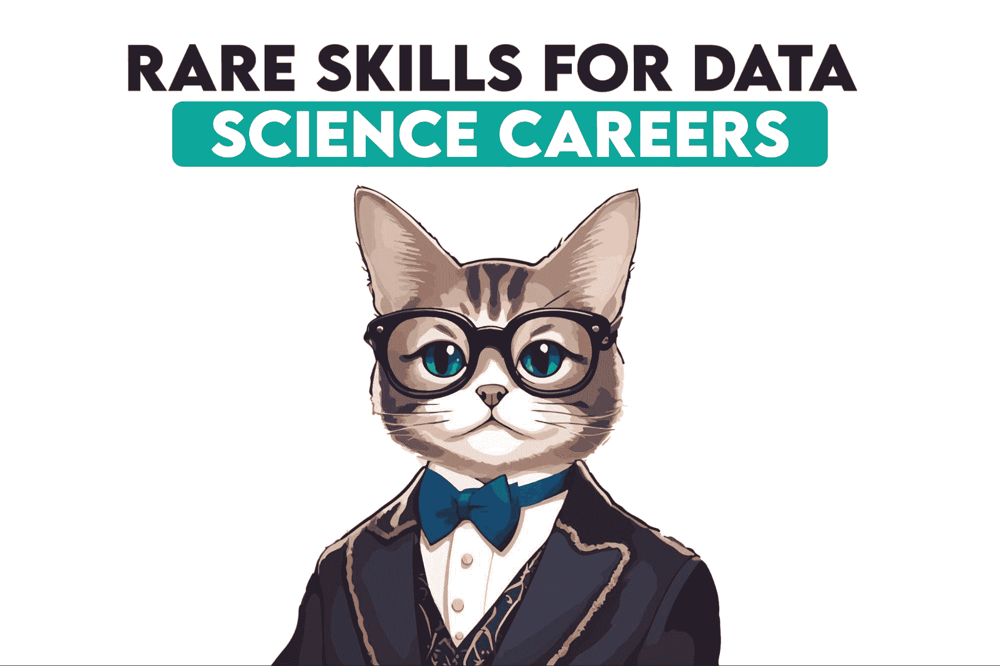
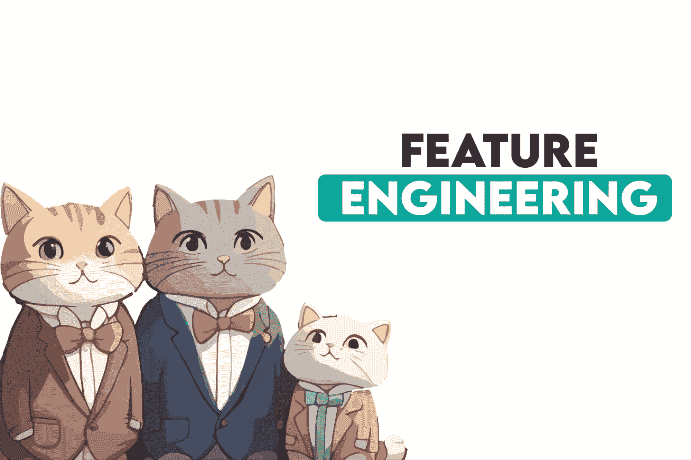
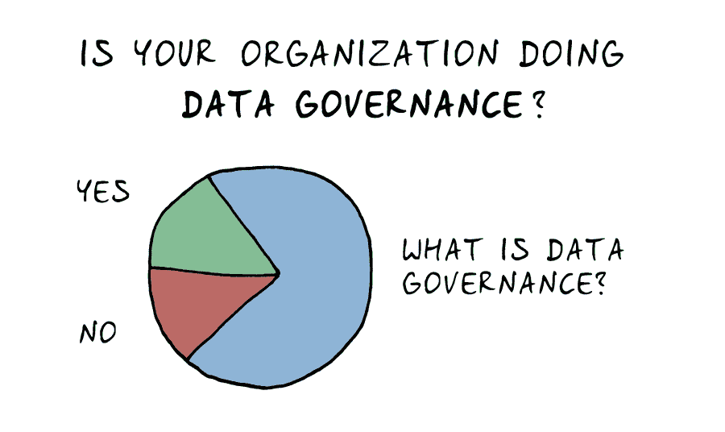

# 5 种稀有的数据科学技能，能够帮助你获得就业机会

> 原文：[`www.kdnuggets.com/5-rare-data-science-skills-that-can-help-you-get-employed`](https://www.kdnuggets.com/5-rare-data-science-skills-that-can-help-you-get-employed)

图片由作者提供

如果你知道如何创建机器学习决策树，恭喜你，你已经具备了与 ChatGPT 及成千上万其他数据科学家相当的[编码专业水平](https://courses.cfte.education/chatgpt-outperforms-4m-programmers/)，而这些数据科学家也在竞争你想要的职位。

* * *

## 我们的三大课程推荐

 1\. [Google 网络安全证书](https://www.kdnuggets.com/google-cybersecurity) - 快速进入网络安全职业轨道。

 2\. [Google 数据分析专业证书](https://www.kdnuggets.com/google-data-analytics) - 提升你的数据分析能力

 3\. [Google IT 支持专业证书](https://www.kdnuggets.com/google-itsupport) - 支持你所在组织的 IT。

* * *

最近，招聘经理们发现一个有趣的趋势，那就是单纯的编码能力已经不再足够了。要获得聘用，你需要超越对编程语言、框架和如何在 StackOverflow 上搜索的了解。你需要更深入的概念理解，以及对当今数据科学领域的把握——包括那些你认为只有公司 CEO 才需要关注的事项，如数据治理和伦理。

你应该知道许多技术性和非技术性的[数据科学技能](https://www.stratascratch.com/blog/what-skills-do-you-need-as-a-data-scientist/?utm_source=blog&utm_medium=click&utm_campaign=kdn+5+rare+ds+skills)，但如果你在找工作时遇到困难，这些较为少见的数据科学技能可能是帮助你迈入就业门槛的关键。

# 1\. 模型可视化

以前，数据科学家通常在孤立的环境中工作，在黑暗的地下室里生产模型。这些模型会生成预测或洞察；这些内容会传递给高层管理人员，他们会在没有理解模型的情况下采取行动。（我稍微夸张了一点，但差别不会很大。）

今天，领导层在理解数据科学家的产品方面扮演着更加积极的角色。这意味着，作为数据科学家，你需要能够解释模型的工作原理、它们的运作方式以及它们如何得出特定的预测。

尽管你可以向你的老板展示运行你模型的实际代码，但通过可视化展示模型的工作原理要更有用（也就是说，更具备就业价值）。例如，假设你开发了一个预测电信公司客户流失的机器学习模型。与其展示代码的截图，你可以使用流程图或决策树图来直观地解释模型如何对客户进行分段，并识别出有流失风险的客户。这使得模型的逻辑变得透明，更易于理解。

理解如何可视化代码是一个罕见的技能，但绝对值得培养。虽然目前还没有相关课程，但我建议你尝试使用像 Miro 这样的免费工具来创建文档化决策树的流程图。更好的是，试着向非数据科学家朋友或家人解释你的代码。解释得越简单越好。

# 2\. 特征工程

作者提供的图像

许多数据科学家倾向于更多地关注模型算法，而忽视输入数据的细微差别。特征工程是选择、修改和创建特征（输入变量）的过程，以提高机器学习模型的性能。

例如，如果你正在开发一个房地产价格预测模型，你可能会从基本特征开始，比如平方英尺、卧室数量和位置。然而，通过特征工程，你可以创建更细化的特征。你可能会计算到最近公共交通站的距离，或创建一个表示物业年龄的特征。你甚至可以结合现有特征来创建新的特征，例如基于犯罪率、学校评分和便利设施接近度的“位置吸引力评分”。

这是一个罕见的技能，因为它不仅需要技术知识，还需要深入的领域知识和创造力。你需要真正*理解*你的数据和手头的问题，然后创造性地转化数据，使其对建模更有用。

特征工程通常作为 Coursera、edX 或 Udacity 等平台上更广泛的机器学习课程的一部分进行讲解。但我发现最好的学习方式是通过实践经验。在真实世界的数据上工作，并尝试不同的特征工程策略。

# 3\. 理解数据治理

这里有一个假设性的问题：假设你是一家医疗保健公司的数据科学家。你被委托开发一个预测模型来识别某种疾病的高风险患者。你可能面临的最大挑战是什么？

如果你回答了“处理 ETL 管道”，那你错了。你最大的挑战可能是确保你的模型不仅有效，而且符合合规、伦理和可持续性要求。这包括确保你为模型收集的任何数据都符合像 HIPAA 和 GDPR 这样的法规，这取决于你的所在地区。你需要知道何时使用这些数据是合法的，如何对其进行匿名处理，需要从患者那里获得哪些同意，以及如何获得这些同意。

你还需要能够记录数据来源、转换过程和模型决策，以便非专家能够审计模型。这种可追溯性不仅对法规合规至关重要，也对未来模型的审计和改进至关重要。

学习数据治理的地方：虽然内容很复杂，但一个很好的资源是[全球数据管理社区](https://www.dama.org/cpages/body-of-knowledge)。

图片来源于[dataedo](https://dataedo.com/cartoon/tag/data-governance)

# 4\. 伦理

“我知道数据科学基本上涉及统计学、模型创建、趋势发现，但如果你问我，我无法想到任何真正的伦理困境，我认为数据科学只是揭示真实的事实，”[Reddit 用户 Carlos_tec17](https://www.reddit.com/r/datascience/comments/16kcf8t/ethical_dilemmas_and_data_science/?utm_source=share&utm_medium=web2x&context=3) 错误地说道。

除了法律合规之外，还需要考虑伦理方面。你需要确保你创建的任何模型不会无意中引入可能导致对某些群体不平等待遇的偏见。

我喜欢用[亚马逊旧招聘模型](https://www.reuters.com/article/us-amazon-com-jobs-automation-insight-idUSKCN1MK08G)来说明伦理问题的重要性。如果你不熟悉这个案例，亚马逊的数据科学家们试图通过创建一个能够基于简历挑选潜在雇员的模型来加快招聘流程。问题在于，他们用的是现有的简历数据，这些数据中男性占据主导地位。他们的新模型对男性雇员有偏见。这是极其不道德的。

我们已经远离了数据科学的“快速行动，破坏一切”阶段。现在，作为一名数据科学家，你需要知道你的决策会对人们产生真正的影响。无知不再是借口；你需要充分了解模型可能带来的所有后果，并理解它做出这些决策的原因。

UMichigan 提供了一门关于“数据科学伦理”的[课程](https://online.umich.edu/courses/data-science-ethics/)。我还喜欢[这本书](https://www.goodreads.com/book/show/50489349-the-alignment-problem)，它展示了伦理如何以及为何在数据科学等“基于数字”的科学中出现。

# 5\. 市场营销

一个秘密的生活窍门是，你越了解如何推销自己，找工作的难度就会越小。所谓“推销”，我指的是“知道如何让事情变得吸引人”。有了市场营销的能力，你将更擅长制作能推销自己技能的简历。你将更擅长吸引面试官。而在数据科学领域，你将更擅长解释为什么你的模型及其结果很重要。

记住，无论你的模型有多好，如果你无法说服其他人它是必要的，那也没有意义。例如，假设你开发了一个可以预测制造工厂设备故障的模型。从理论上讲，你的模型可以为公司节省数百万的计划外停机时间。但如果你无法向高管传达这一点，你的模型将会在电脑上闲置。

利用市场营销技巧，你可以通过有说服力的展示证明你模型的使用价值和必要性，突出财务利益、生产力提升的潜力，以及采用你模型的长期优势。

这在数据科学领域是一项非常罕见的技能，因为大多数数据科学家本质上是数字型的人。大多数有志成为数据科学家的人真的相信，只需尽力而为、默默工作就是一种成功的就业策略。不幸的是，雇佣你的不是计算机，而是人类。在今天的就业市场上，能够推销自己、自己的技能和产品是一个真正的优势。

要学习如何推销自己，我推荐一些初学者的免费课程，如 Coursera 提供的[《数字世界中的营销》](https://www.coursera.org/learn/marketing-digital?siteID=SAyYsTvLiGQ-iQB0JuivrkyWlmqD1_tW8A&utm_content=10&utm_medium=partners&utm_source=linkshare&utm_campaign=SAyYsTvLiGQ)。我特别喜欢其中关于“在数字世界中提供持久的产品创意”的部分。虽然目前没有针对数据科学的专门市场营销课程，但我喜欢[这篇博客文章](https://www.edlitera.com/blog/posts/most-important-skill-data-science)，它介绍了如何将自己作为数据科学家进行市场推广。

# 结束语

外面的环境很艰难。尽管根据劳动统计局的数据，[数据科学家就业的预计增长](https://www.bls.gov/ooh/math/data-scientists.htm) 仍然存在，但许多初级数据科学的求职者发现很难找到工作，[正如](https://www.reddit.com/r/datascience/comments/ykyte6/no_one_is_hiring_juniors_midlevel_data_scientists/) [这些](https://www.reddit.com/r/datascience/comments/14xzcdi/is_data_science_oversaturated_now_job_market/) [Reddit](https://www.reddit.com/r/datascience/comments/16nrcdp/if_the_job_market_is_bad_why_are_companies_still/) [帖子](https://www.reddit.com/r/datascience/comments/12kmpif/anyone_else_struggling_to_find_work/) [所示](https://www.reddit.com/r/datascience/comments/110i4ji/is_it_difficult_to_compete_for_data_science_jobs/)。ChatGPT 的竞争以及裁员的阴影也在盘旋。

要在就业市场中竞争并脱颖而出，你必须超越单纯的技术能力。数据治理、伦理、模型可视化、特征工程和营销技能使你成为一个更具深度、全面且引人注目的候选人。

****[Nate Rosidi](https://twitter.com/StrataScratch)**** 是一名数据科学家，专注于产品战略。他还是一名兼职教授，教授分析学，并且是 StrataScratch 的创始人，该平台帮助数据科学家通过来自顶级公司的真实面试问题来准备面试。Nate 撰写关于职业市场最新趋势的文章，提供面试建议，分享数据科学项目，并涵盖所有 SQL 内容。

### 更多相关内容

+   [可以帮助你解决实际问题的数据科学项目](https://www.kdnuggets.com/2022/11/data-science-projects-help-solve-real-world-problems.html)

+   [生成性 AI 如何帮助你改进数据可视化图表](https://www.kdnuggets.com/how-generative-ai-can-help-you-improve-your-data-visualization-charts)

+   [可以帮助你成为专业人士的免费 Python 资源](https://www.kdnuggets.com/free-python-resources-that-can-help-you-become-a-pro)

+   [数据科学家如何获得 CFO 的关注（以及为什么你需要它）](https://www.kdnuggets.com/2021/12/data-scientists-get-ear-cfos-want.html)

+   [大多数公司在数据访问方面严重不足，71%的人认为……](https://www.kdnuggets.com/2023/07/mostly-data-access-severely-lacking-synthetic-data-help.html)

+   [级别系统如何帮助预测 AI 成本](https://www.kdnuggets.com/2022/03/level-system-help-forecast-ai-costs.html)
