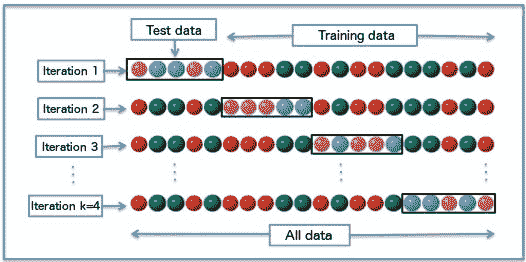

# 为什么你应该在数据科学项目中使用交叉验证的 5 个理由

> 原文：[`www.kdnuggets.com/2018/10/5-reasons-cross-validation-data-science-projects.html`](https://www.kdnuggets.com/2018/10/5-reasons-cross-validation-data-science-projects.html)

 评论

**由 [Dima Shulga](https://www.linkedin.com/in/shudima/)，HiredScore 数据科学家**

交叉验证是数据科学家工具箱中的一个重要工具。它使我们能够更好地利用我们的数据。在我给你介绍使用交叉验证的五个理由之前，我想简单讲解一下交叉验证是什么，并展示一些常见的策略。

* * *

## 我们的前 3 个课程推荐

 1\. [谷歌网络安全证书](https://www.kdnuggets.com/google-cybersecurity) - 快速进入网络安全职业道路

 2\. [谷歌数据分析专业证书](https://www.kdnuggets.com/google-data-analytics) - 提升你的数据分析水平

 3\. [谷歌 IT 支持专业证书](https://www.kdnuggets.com/google-itsupport) - 支持你的组织进行 IT 工作

* * *

当我们使用数据构建机器学习模型时，我们通常会将数据拆分为训练集和验证/测试集。训练集用于训练模型，而验证/测试集用于验证模型在从未见过的数据上的表现。经典的方法是进行简单的 80%-20%拆分，有时也会用 70%-30%或 90%-10%。在交叉验证中，我们会进行多次拆分。我们可以进行 3 次、5 次、10 次或任何 K 次拆分。这些拆分称为折叠（Folds），我们可以使用多种策略来创建这些折叠。

k 折交叉验证的图示，k=4。

**简单 K 折交叉验证** — 我们将数据拆分为 K 个部分，以 K=3 作为玩具示例。如果我们有 3000 个实例的数据集，我们将其拆分为三个部分，部分 1、部分 2 和部分 3。然后我们构建三个不同的模型，每个模型在两个部分上训练，并在第三个部分上测试。我们的第一个模型在部分 1 和 2 上训练，并在部分 3 上测试。我们的第二个模型在部分 1 和 3 上训练，并在部分 2 上测试，以此类推。

**留一法** — 这是最极端的交叉验证方式。对于数据集中的每个实例，我们使用所有其他实例构建一个模型，然后在选定的实例上进行测试。

**分层交叉验证** — 当我们将数据拆分为折叠时，我们希望确保每个折叠都能很好地代表整个数据。最基本的例子是，我们希望每个折叠中的不同类别的比例相同。大多数时候，通过随机拆分就能实现，但有时在复杂的数据集中，我们必须强制每个折叠中有正确的分布。

以下是我建议你使用交叉验证的五个理由：

### ****1\. 使用你所有的数据****

当我们拥有的数据非常少时，将其分割为训练集和测试集可能会导致测试集非常小。例如，如果我们只有 100 个样本，简单的 80-20 划分会得到 20 个测试样本。这是不够的。我们几乎只能因为运气而在这个集合上获得任何性能。当我们遇到多类问题时，情况更糟。如果我们有 10 个类别，只有 20 个样本，那么平均每个类别只有 2 个样本。仅在 2 个样本上测试是无法得出任何实际结论的。

如果在这种情况下使用交叉验证，我们会构建 K 个不同的模型，从而能够对**所有**数据进行预测。对于每个实例，我们通过一个没有见过这个示例的模型来做出预测，因此我们在测试集上获得了 100 个样本。对于多类问题，我们平均每个类别得到 10 个样本，这比仅有的 2 个样本要好得多。在评估我们的学习算法之后（见下文第 #2 点），我们现在可以在所有数据上训练模型，因为如果我们的 5 个模型在使用不同训练集时具有相似的性能，我们假设在所有数据上训练会得到类似的性能。

通过进行交叉验证，我们能够将所有 100 个样本同时用于训练和测试，同时在从未见过的样本上评估我们的学习算法。

### ****2\. 获取更多的指标****

如第 #1 点所述，当我们使用学习算法创建五个不同的模型并在五个不同的测试集上进行测试时，我们可以对算法的性能更有信心。当我们在测试集上进行单次评估时，我们只会得到一个结果。这个结果可能是由于运气或某种原因造成的偏差测试集。通过训练五个（或十个）不同的模型，我们可以更好地了解情况。例如，我们训练了五个模型，并以准确率作为衡量标准。我们可能会遇到几种不同的情况。最佳情况是我们的准确率在所有折叠中都相似，比如 92.0、91.5、92.0、92.5 和 91.8。这意味着我们的算法（和数据）是一致的，我们可以确信在所有数据集上训练并部署到生产中将会得到类似的性能。

但是，我们可能会遇到稍微不同的情况，比如 92.0、**44.0**、91.5、92.5 和 91.8。这些结果看起来很奇怪。看起来我们的一个折叠来自不同的分布，我们必须回去确认我们的数据是否如我们所想。

我们可能面临的最糟糕的情况是结果有很大的差异，比如 80、44、99、60 和 87。这里看起来我们的算法或数据（或两者）都不一致，可能是我们的算法无法学习，或者数据非常复杂。

通过使用交叉验证，我们能够获得更多的指标，并对我们的算法和数据得出重要结论。

### ****3\. 使用模型堆叠****

有时我们希望（或必须）构建一个模型管道来解决问题。例如，考虑神经网络。我们可以创建多个层。每一层可以使用前一层的输出，并学习数据的新表示，因此最终能够产生良好的预测。我们能够训练这些不同的层，因为我们使用了反向传播算法。每一层计算其误差并将其传递给前一层。

当我们做类似的事情但不使用神经网络时，我们不能以相同的方式进行训练，因为并不总是有一个明确的“误差”（或导数）可以传递回去。

例如，我们可能创建一个随机森林模型来为我们做预测，然后我们希望进行线性回归，依赖于之前的预测并产生一些实际的数字。

这里的关键部分是我们的第二个模型必须学习**第一个模型**的**预测**。最好的解决方案是为每个模型使用两个不同的数据集。我们在数据集 A 上训练随机森林。然后我们使用数据集 B 来进行预测。接着我们使用数据集 B 的预测来训练我们的第二个模型（逻辑回归），最后我们使用数据集 C 来评估我们的完整解决方案。我们使用第一个模型进行预测，将其传递给我们的第二个模型，然后与真实值进行比较。

当我们拥有有限的数据（在大多数情况下），我们实际上无法做到这一点。此外，我们不能在相同的数据集上训练两个模型，因为这样，第二个模型会在第一个模型已经看到的预测上进行学习。这些预测可能会过拟合，或者至少在不同的数据集上效果更好。这意味着我们的第二个算法并不是在其将被测试的内容上进行训练的。这可能会在最终评估中导致不同的效果，这将很难理解。

通过使用交叉验证，我们可以以之前描述的相同方式对数据集进行预测，从而使第二个模型的输入将是真实的预测，而这些数据是第一个模型之前从未见过的。

### ****4\. 处理依赖/分组数据****

当我们对数据进行随机训练-测试拆分时，我们假设我们的样本是独立的。这意味着知道/看到某个实例不会帮助我们理解其他实例。然而，这并不总是如此。

以语音识别系统为例。我们的数据可能包括不同的发言者说不同的词。以[这个数据集](https://github.com/Jakobovski/free-spoken-digit-dataset)为例，其中有 3 个发言者和 1500 个录音（每个发言者 500 个）。如果我们进行随机拆分，我们的训练集和测试集将会包含相同发言者说的相同词！这当然会提升我们的算法性能，但一旦在新发言者上测试，我们的结果将会大幅下滑。

正确的方法是将发言者分开，即使用 2 个发言者进行训练，使用第三个发言者进行测试。然而，这样我们只能在一个发言者上测试我们的算法，这还不够。我们需要了解我们的算法在不同发言者上的表现。

我们可以在发言者层面上使用交叉验证。我们将训练 3 个模型，每次使用一个发言者进行测试，其他两个进行训练。这样我们可以更好地评估我们的算法（如上所述），最终在所有发言者上构建我们的模型。

### ****5\. 参数微调****

这是进行交叉验证最常见和明显的原因之一。大多数学习算法需要进行一些参数调整。这可能是梯度提升分类器中的树木数量，神经网络中的隐藏层大小或激活函数，支持向量机中的核类型等等。我们希望找到适合我们问题的最佳参数。我们通过尝试不同的值并选择最佳值来实现。方法有很多，可以是手动搜索、网格搜索或更复杂的优化。然而，在所有这些情况下，我们不能仅在训练测试集上进行，也不能在测试集上进行。我们必须使用第三组数据，即验证集。

通过将我们的数据拆分成三组而不是两组，我们将处理之前讨论过的所有相同问题，尤其是在数据量不多的情况下。通过交叉验证，我们能够使用单一数据集完成所有这些步骤。

### ****结论****

交叉验证是一个非常强大的工具。它帮助我们更好地利用数据，并提供有关算法性能的更多信息。在复杂的机器学习模型中，有时很容易没有足够注意，并在管道的不同步骤中使用相同的数据。这可能导致大多数情况下的良好但不真实的性能，或者在其他情况下引入奇怪的副作用。我们必须确保对我们的模型充满信心。交叉验证帮助我们应对数据科学项目中的非平凡挑战。

如果你想了解更多关于数据科学管道中可能出现的不同陷阱，欢迎阅读我关于[如何在数据科学中撒谎](https://towardsdatascience.com/how-to-lie-with-data-science-5090f3891d9c)的文章。

如果你想阅读一些其他的做事理由，欢迎阅读我的文章 [5 个理由为什么“逻辑回归”应该是你成为数据科学家时首先学习的内容](https://towardsdatascience.com/5-reasons-logistic-regression-should-be-the-first-thing-you-learn-when-become-a-data-scientist-fcaae46605c4)

**个人简介：[迪玛·舒尔加](https://www.linkedin.com/in/shudima/)** 是 HiredScore 的数据科学家。

[原文](https://towardsdatascience.com/5-reasons-why-you-should-use-cross-validation-in-your-data-science-project-8163311a1e79)。经授权转载。

**相关：**

+   通过交叉验证构建可靠的机器学习模型

+   5 个理由为什么逻辑回归应该是你成为数据科学家时首先学习的内容

+   如何在数据科学中撒谎

### 更多相关内容

+   [你为何应该使用线性回归模型而不是…的 3 个理由](https://www.kdnuggets.com/2021/08/3-reasons-linear-regression-instead-neural-networks.html)

+   [数据科学家为何应该使用 LightGBM 的 3 个理由](https://www.kdnuggets.com/2022/01/data-scientists-reasons-lightgbm.html)

+   [你应该避免数据科学职业的 5 个理由](https://www.kdnuggets.com/2022/04/top-5-reasons-avoid-data-science-career.html)

+   [你应该获得认证的 5 个理由](https://www.kdnuggets.com/2023/05/sas-5-reasons-get-certified.html)

+   [你不应该使用机器学习的 4 个理由](https://www.kdnuggets.com/2021/12/4-reasons-shouldnt-machine-learning.html)

+   [你为何难以找到数据科学工作的 7 个理由](https://www.kdnuggets.com/7-reasons-why-youre-struggling-to-land-a-data-science-job)
