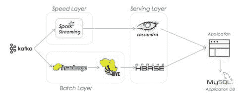
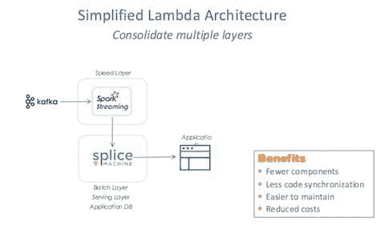

# 5 个理由说明机器学习应用需要更好的 Lambda 架构

> 原文：[`www.kdnuggets.com/2016/05/5-reasons-machine-learning-applications-lambda-architecture.html`](https://www.kdnuggets.com/2016/05/5-reasons-machine-learning-applications-lambda-architecture.html)

 评论

**作者 [Monte Zweben](https://www.linkedin.com/in/mzweben)，[Splice Machine](http://www.splicemachine.com)首席执行官。**

Lambda 架构在机器学习和数据科学应用中随处可见。Lambda 架构能够实现对实时数据的持续处理，而不会受到传统 ETL 延迟的困扰，这种延迟困扰着传统的操作型（OLTP）和分析型（OLAP）实现。在传统架构中，OLTP 数据库经过性能优化的规范化处理，然后大量 ETL 管道将这些数据反规范化，通常转换为 OLAP 引擎上的星型模式。这一过程通常需要至少一天时间。Lambda 架构绕过了这种延迟。在其最纯粹的形式中，Lambda 架构将数据分为两条路径：批处理层和速度层。批处理层聚合原始数据并训练模型。批处理层的结果随后转移到服务层，以供应用展示。速度层允许应用访问“错过”上一个批处理窗口的最新数据。

那么公司如何实施这一架构呢？对于批处理层，他们通常使用 Hadoop 上的批分析处理引擎，如 MapReduce、Hive 或 Spark。对于服务层，他们使用表现良好的 NoSQL/键值引擎，如 ElephantDB 和 Voldemort。对于速度层，他们需要支持快速读取和写入的数据存储，如 Cassandra 或 HBase。在这一架构的前端，通常会有一个排队系统，如 Kafka，以及一个流处理系统，如 Storm、Spark 或 Flink，用于将连续数据分割成块进行处理。

企业使用我称之为企业级“胶带”的方法来维持这一架构。这是一个痛苦的过程，虽然能够完成工作，但代价巨大。以下是我们需要更好 Lambda 架构的五个理由：

1.  简化操作复杂性——基于版本保持这些系统同步并调优性能是非常昂贵的。这需要对过多的技术有专门的知识。

1.  消除对专门编码技能的需求——开发人员必须能够编写相当低级的代码来处理基本操作，如连接、聚合、排序和分组，更不用说应用分析了。他们还需要编写批处理程序来清理和过滤单个记录。

1.  提供对标准工具的访问 – 99% 的数据科学家知道 SQL 并使用 BI 可视化工具。为什么我们要放弃这些强大的工具，现在它们不再面临第一代数据库的性能和灵活性问题？

1.  最小化存储 – Lambda 通常需要在多个引擎中重复存储数据。

1.  支持集成应用程序 – 现代应用程序的逻辑与分析逻辑并不分离。这些工作负载需要交融。你希望能够在业务应用中实时使用操作原始数据，用它来执行特征工程和训练模型，并能够同时进行可视化。这需要传统数据库的 ACID 属性、NoSQL 的摄取能力和 Hadoop/Spark 引擎的可扩展能力。

那么，什么是更好的解决方案呢？我们称之为 Lambda-R (ƛ-R) 关系型 Lambda。使用新的可扩展 RDBMS 系统，你现在可以以更简单的架构获得 Lambda 的所有好处。

这就是机器学习应用如何使用 ƛ-R：

+   批量文件摄取 – 原始数据文件的导入直接插入到分片表中，并与数据原子性更新的索引并行，以实现快速访问。

+   实时流摄取 – 存储过程使用标准 SQL 和自动分片连续摄取流数据。

+   数据清理 – 使用标准 SQL、约束和触发器，高效地清理小子集数据以及整个数据集，无需大批处理或文件爆炸。

+   特征工程和广泛的 ETL – 执行复杂的聚合、连接、排序和分组，使用高效的 SQL 自动并行化和优化，无需在应用程序级别编写代码。

+   模型训练 – 存储过程直接对数据执行分析，例如，使用内置函数如 ResultSetToRDD，将 SQL 结果处理为 Spark RDDs，或直接在数据库结果集上执行 R 和 Python 库。

+   应用逻辑 – ACID 语义使架构能够在没有额外移动部件的情况下支持并发的 CRUD 应用程序。

+   模型执行 – 存储过程和用户定义的函数封装模型。

+   报告和数据可视化 – 使用 Tableau、Domo、MicroStrategy 和其他 ODBC/JDBC 工具进行开箱即用。

能做到这一点的一个可扩展 RDBMS 是 Splice Machine。Splice Machine 是一个双引擎 RDBMS，建立在 Hadoop 和 Spark 之上。

Splice Machine RDBMS 提供：

+   ANSI SQL – Splice Machine 提供 ANSI SQL-99 覆盖，包括完整的 DDL 和 DML。

+   ACID 事务 – Splice Machine 提供完全的 ACID 事务，并具有快照隔离语义，可以处理非常小的操作查询和大规模的分析查询。

+   原地更新 – Splice Machine 中的更新从单行到数百万行的单次事务都能扩展。

+   二级索引 – Splice Machine 支持数据的真实二级索引，包括唯一和非唯一形式

+   参考完整性 – 参考完整性，如主键和外键约束，可以在不需要底层应用程序行为的情况下强制执行

+   联接 – Splice Machine 支持使用广播、合并、合并排序、批量嵌套循环和嵌套循环等算法的内连接、外连接、交叉连接和自然连接

+   资源隔离 基于查询计划的估算，成本优化器选择数据流引擎 – OLTP 运行在 HBase 上，OLAP 运行在 Spark 上

总结来说，通过集中在 ƛ-R 架构上，团队可以非常快速地构建 ML 应用程序，用标准的运营人员维护这些应用程序，并能够将 ML 紧密集成到应用程序中，而无需广泛使用“企业胶带”。

**相关：**

+   访谈：Antonio Magnaghi，TicketMaster 论通过 Lambda 架构统一异构分析

+   Bill Moreau，美国奥委会关于通过分析赋能世界顶级运动员

+   Hobson Lane，SHARP 实验室关于如何通过分析展示“你看不到的所有光”

* * *

## 我们的前三名课程推荐

 1\. [谷歌网络安全证书](https://www.kdnuggets.com/google-cybersecurity) - 快速进入网络安全职业的捷径。

 2\. [谷歌数据分析专业证书](https://www.kdnuggets.com/google-data-analytics) - 提升你的数据分析技能

 3\. [谷歌 IT 支持专业证书](https://www.kdnuggets.com/google-itsupport) - 支持你的组织在 IT 方面

* * *

### 更多相关内容

+   [Python Lambda 函数解析](https://www.kdnuggets.com/2023/01/python-lambda-functions-explained.html)

+   [KDnuggets 新闻，5 月 18 日：5 个免费的机器学习托管平台……](https://www.kdnuggets.com/2022/n20.html)

+   [你需要合成数据的 5 个理由](https://www.kdnuggets.com/2023/02/5-reasons-need-synthetic-data.html)

+   [KDnuggets™ 新闻 22:n07，2 月 16 日：如何为机器学习学习数学……](https://www.kdnuggets.com/2022/n07.html)

+   [机器学习并不像你的大脑 第三部分：基本架构](https://www.kdnuggets.com/2022/06/machine-learning-like-brain-part-3-fundamental-architecture.html)

+   [构建 LLM 应用程序时需要了解的 5 件事](https://www.kdnuggets.com/2023/08/5-things-need-know-building-llm-applications.html)
