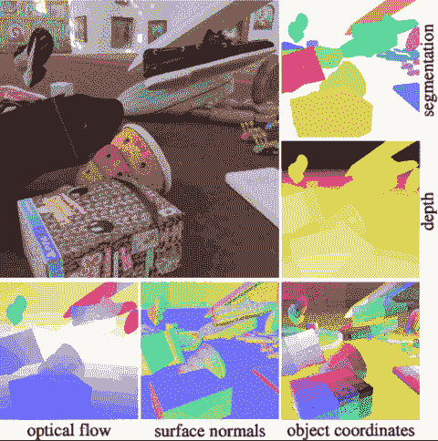
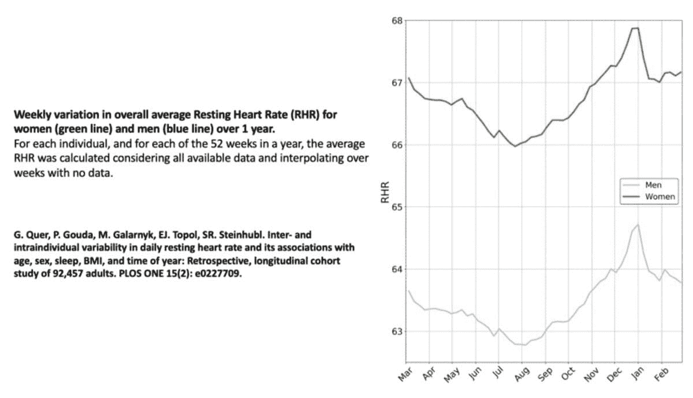
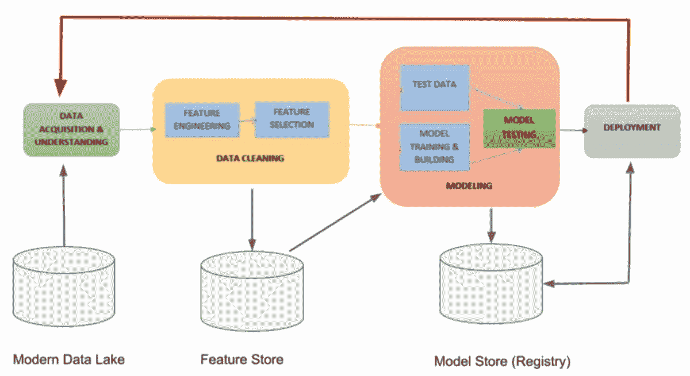
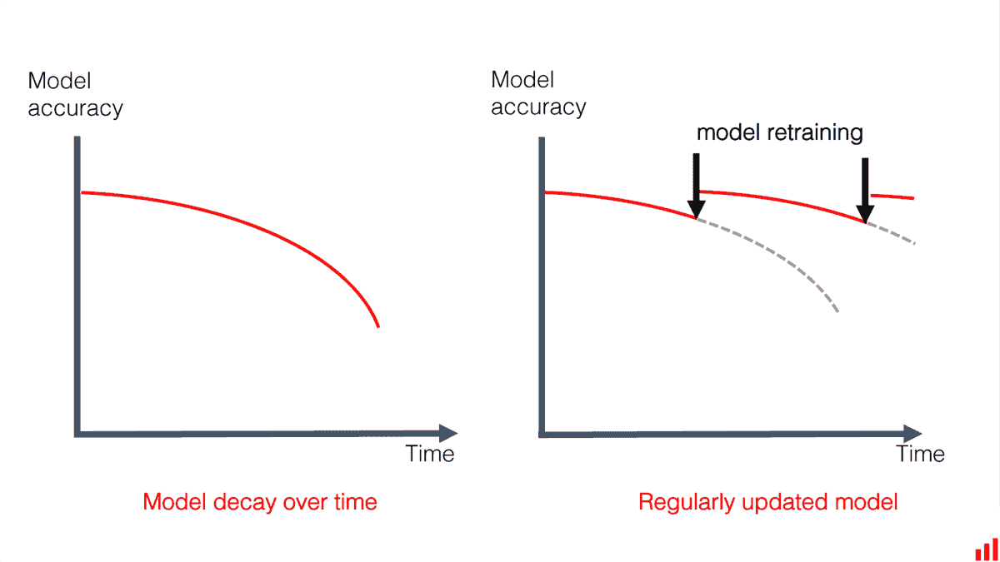
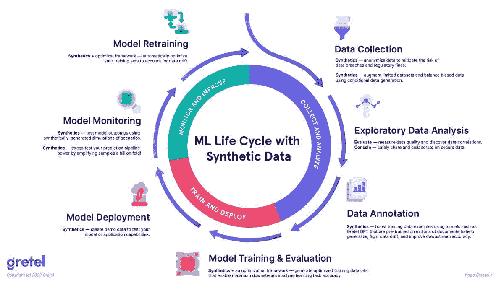

# 5 个你需要合成数据的理由

> 原文：[`www.kdnuggets.com/2023/02/5-reasons-need-synthetic-data.html`](https://www.kdnuggets.com/2023/02/5-reasons-need-synthetic-data.html)

从 [Kubric](https://github.com/google-research/kubric) 生成的合成数据

要训练机器学习模型，你需要数据。数据科学任务通常不是 Kaggle 竞赛那种拥有大型整理过的数据集的情况，这些数据集都是预标记好的。有时你必须收集、整理和清洗自己的数据。这个在现实世界中收集和标记数据的过程可能是费时的、繁琐的、昂贵的、不准确的，有时甚至是危险的。此外，在这个过程中，你最终获得的数据可能在质量、多样性（例如，类别不平衡）和数量上不一定符合你的期望。以下是处理真实数据时常见的问题：

+   真实数据收集和标记不可扩展

+   手动标记真实数据有时可能是不可能的

+   真实数据存在隐私和安全问题

+   真实数据不可编程

+   仅通过真实数据训练的模型表现不够好（例如，开发速度慢）

* * *

## 我们的前三个课程推荐

 1\. [谷歌网络安全证书](https://www.kdnuggets.com/google-cybersecurity) - 快速进入网络安全职业生涯。

 2\. [谷歌数据分析专业证书](https://www.kdnuggets.com/google-data-analytics) - 提升你的数据分析技能

 3\. [谷歌 IT 支持专业证书](https://www.kdnuggets.com/google-itsupport) - 支持你的组织的 IT 需求

* * *

幸运的是，像这些问题可以通过合成数据来解决。你可能会想知道，[什么是合成数据](https://paralleldomain.com/accelerate-your-ai-progress-with-synthetic-data)? 合成数据可以定义为通过模拟现实世界过程的算法生成的人工数据，从其他道路使用者的行为到光线与表面交互的行为。这篇文章讨论了现实世界数据的局限性，以及合成数据如何帮助克服这些问题并提高模型性能。

# 真实数据收集和标记不可扩展

对于小型数据集，通常可以收集和手动标注数据；然而，许多复杂的机器学习任务需要大量数据来训练。例如，为自动驾驶汽车应用训练的模型需要从附加在汽车或无人机上的传感器收集大量数据。这个数据收集过程很慢，可能需要几个月甚至几年。原始数据收集后，还必须由人类手动注释，这也是昂贵且耗时的。此外，返回的标注数据可能不一定对训练数据有益，因为它可能不包含解决模型当前知识缺口的示例。

标注这些数据通常涉及人类在传感器数据上手工绘制标签。这是非常昂贵的，因为高薪的机器学习团队通常花费大量时间确保标签的正确性，并将错误反馈给标注员。合成数据的一大优势是你可以生成任意多的完美标注数据。你需要的只是生成高质量合成数据的方法。

*生成合成数据的开源软件：* [*Kubric*](https://github.com/google-research/kubric) *(多对象视频，包含分割掩码、深度图和光流) 和* [*SDV*](https://github.com/sdv-dev/SDV) *(表格数据、关系数据和时间序列数据)。*

*一些（众多的）销售产品或构建平台来生成合成数据的公司包括* [*Gretel.ai*](https://gretel.ai/) *(合成数据集，确保真实数据的隐私)、* [*NVIDIA*](https://www.nvidia.com/en-us/omniverse/) *(全视界) 和* [*Parallel Domain*](https://paralleldomain.com/) *(自动驾驶)。更多信息，* [*请参见 2022 年合成数据公司名单*](https://elise-deux.medium.com/everything-that-happened-in-the-synthetic-data-space-in-2022-c5d6cb5aaf06)*。*

# 手动标注真实数据有时是不可能的

图片来自 [Parallel Domain](https://paralleldomain.com/)

有些数据人类无法完全解读和标注。以下是一些合成数据是唯一选择的使用案例：

+   从单张图像准确估计深度和[光流](https://medium.com/swlh/what-is-optical-flow-and-why-does-it-matter-in-deep-learning-b3278bb205b5)

+   利用雷达数据进行自驾应用，这些数据对人眼不可见

+   生成深度伪造技术以测试人脸识别系统

# 真实数据存在隐私和安全问题

图片由 [Michael Galarnyk](https://towardsdatascience.com/an-introduction-to-reinforcement-learning-with-openai-gym-rllib-and-google-colab-48fc1ddfb889) 提供

合成数据对于那些难以获得真实数据的领域非常有用。这包括一些类型的车祸数据和大多数受隐私限制的健康数据（例如，[电子健康记录](https://ai.googleblog.com/2022/12/ehr-safe-generating-high-fidelity-and.html)）。近年来，医疗研究人员对利用 ECG 和 PPG 信号预测房颤（不规则心律）产生了兴趣。开发一种心律失常检测器不仅具有挑战性，因为这些信号的标注繁琐且成本高，而且还受到隐私限制。这也是[模拟这些信号的研究](https://physionet.org/content/ecg-ppg-simulator-arrhythmia/1.3.1/)存在的一个原因。

重要的是要强调，收集真实数据不仅需要时间和精力，而且实际上可能是危险的。像自动驾驶汽车这样的机器人应用程序的核心问题之一是，它们是机器学习的物理应用。你不能在现实世界中部署一个不安全的模型，因为缺乏相关数据而发生碰撞。使用合成数据来增强数据集可以帮助模型避免这些问题。

*以下是一些使用合成数据提高应用安全性的公司：* [*丰田*](https://youtu.be/QIYttoVxf2w?t=30)*，* [*Waymo*](https://venturebeat.com/ai/waymo-is-using-ai-to-simulate-autonomous-vehicle-camera-data/)*，和* [*Cruise*](https://techcrunch.com/2021/11/05/cruise-lays-out-its-plan-for-how-it-will-make-robotaxis-a-reality/)*。*

# 真实数据不可编程

图片来自 [Parallel Domain](https://paralleldomain.com/)

合成图像展示了一个被学校巴士遮挡的骑自行车的孩子在加州风格的郊区环境中从巴士后面出现并横穿街道。

自动驾驶应用程序通常处理相对“不常见”（与正常驾驶条件相比）的事件，如夜间行人或骑自行车的人在道路中间行驶。模型通常需要数十万甚至数百万个例子来学习一个场景。一个主要的问题是，收集到的真实世界数据可能在质量、多样性（例如，类别不平衡、天气条件、地点）和数量上不符合要求。另一个问题是，对于自动驾驶汽车和机器人，你并不总是知道你需要什么数据，这与具有固定数据集和固定基准的传统机器学习任务不同。[虽然一些数据增强技术可以系统或随机地改变图像是有帮助的](https://towardsdatascience.com/augmenting-images-for-deep-learning-3f1ea92a891c)，但这些技术也可能[引入自身的问题](https://natecibik.medium.com/synthetic-data-and-autonomous-vehicles-408748e5bbb0)。

这就是合成数据派上用场的地方。合成数据生成 API 允许你工程化数据集。这些 API 可以为你节省大量费用，因为在现实世界中建造机器人和收集数据非常昂贵。尝试生成数据并利用合成数据集生成来搞清楚工程原理要好得多，也更快速。

*以下是一些突显可编程合成数据如何帮助模型学习的示例：* [*防止欺诈交易（美国运通）*](https://blogs.nvidia.com/blog/2019/12/10/american-express-deep-learning/)*,* [*更好的骑行者检测（Parallel Domain）*](https://paralleldomain.com/parallel-domain-synthetic-data-improves-cyclist-detection/)*，以及* [*手术分析与评审（Hutom.io）*](https://www.anyscale.com/blog/how-hutom-io-uses-ray-and-pytorch-to-scale-surgical-video-analysis-and)。

# 仅依赖真实数据训练的模型表现不够理想

模型开发周期的阶段 | 图片来自 [Jules S. Damji](https://twitter.com/2twitme)

在行业中，[有很多因素影响机器学习项目在开发和生产中的可行性/性能](https://towardsdatascience.com/considerations-for-deploying-machine-learning-models-in-production-89d38d96cc23)（例如，数据获取、注释、模型训练、扩展、部署、监控、模型重新训练和开发速度）。最近，[18 名机器学习工程师参加了一项访谈研究](https://arxiv.org/abs/2209.09125)，旨在了解各组织和应用（如自动驾驶、计算机硬件、零售、广告、推荐系统等）中的常见 MLOps 实践和挑战。研究得出的结论之一是开发速度的重要性，这可以大致定义为快速原型设计和迭代想法的能力。

影响开发速度的一个因素是需要数据来进行初始模型训练和评估 **以及由于数据漂移、概念漂移或训练-服务偏差造成的模型性能下降，需要频繁重新训练模型**。

图片来自 [Evidently AI](https://www.evidentlyai.com/)

研究还报告说，这种需求导致一些组织设置团队来频繁标记实时数据。这既昂贵又耗时，还限制了组织频繁重新训练模型的能力。

图片来自 [Gretel.ai](https://gretel.ai/)

注意，这个图示并没有涵盖合成数据如何用于 [推荐系统中的 MLOps 测试](https://github.com/microsoft/recommenders/tree/main/tests)。

合成数据有潜力在机器学习生命周期中（如上图所示）与真实数据一起使用，以帮助组织保持模型的长期性能。

# 结论

合成数据生成在机器学习工作流中变得越来越普遍。事实上，[Gartner](https://www.gartner.com/en/newsroom/press-releases/2022-06-22-is-synthetic-data-the-future-of-ai)预测到 2030 年，合成数据将比真实数据用于训练机器学习模型的频率要高得多。如果你对这篇文章有任何问题或想法，欢迎在评论区或通过[Twitter](https://twitter.com/GalarnykMichael)与我联系。

**[Michael Galarnyk](https://www.linkedin.com/in/michaelgalarnyk/)** 是一名数据科学专家，在 Parallel Domain 从事合成数据工作。

### 更多相关话题

+   [一个合成数据的社区已经出现，这就是我们需要它的原因](https://www.kdnuggets.com/2022/04/community-synthetic-data-need.html)

+   [避免数据科学职业的前 5 个理由](https://www.kdnuggets.com/2022/04/top-5-reasons-avoid-data-science-career.html)

+   [7 个你不应成为数据科学家的原因](https://www.kdnuggets.com/7-reasons-why-you-shouldnt-become-a-data-scientist)

+   [7 个你难以找到数据科学工作的原因](https://www.kdnuggets.com/7-reasons-why-youre-struggling-to-land-a-data-science-job)

+   [4 个你不应使用机器学习的理由](https://www.kdnuggets.com/2021/12/4-reasons-shouldnt-machine-learning.html)

+   [3 个你应使用线性回归模型而不是…](https://www.kdnuggets.com/2021/08/3-reasons-linear-regression-instead-neural-networks.html)
