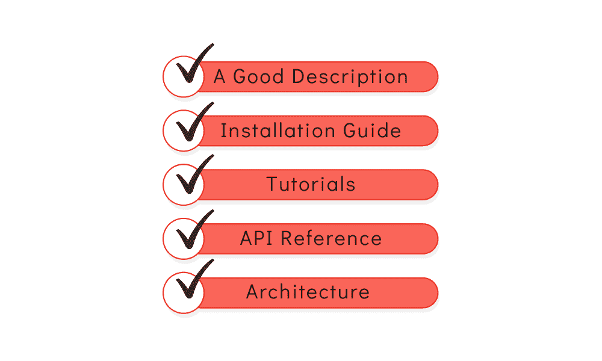

# 良好的数据科学项目文档的 5 条规则

> 原文：[`www.kdnuggets.com/2022/12/5-rules-good-data-science-project-documentation.html`](https://www.kdnuggets.com/2022/12/5-rules-good-data-science-project-documentation.html)

图片由编辑提供

所以你完成了项目，得到了优秀的数据，处理了它，清洗了它，训练了你的模型，将其应用于数据，并获得了极好的结果。就这样。

* * *

## 我们的前三大课程推荐

 1\. [Google 网络安全证书](https://www.kdnuggets.com/google-cybersecurity) - 快速进入网络安全职业生涯。

 2\. [Google 数据分析专业证书](https://www.kdnuggets.com/google-data-analytics) - 提升你的数据分析技能

 3\. [Google IT 支持专业证书](https://www.kdnuggets.com/google-itsupport) - 支持你组织的 IT

* * *

实际上并非如此。

通常，软件是为了他人使用而开发的，因此一旦程序员或数据科学家完成了项目，他们将需要完成大多数人都不喜欢的任务…

记录代码。

在软件工程中，一般来说，编写文档是指主要开发者编写一个脚本，详细解释代码的功能、目标及实现方式。程序员讨厌写文档的主要原因是，作为程序员，你更愿意编写代码而不是解释它。

不仅如此，为了使文档质量良好，它需要简单易懂，即使不是专业程序员也能理解。正如我们所知 — 也许不是所有人 — 程序员擅长编写代码，但不擅长解释其理论。

# 1\. 一个好的描述

在文档的开头，必须有一个简短而精炼的描述。这个描述应该只有几句话，并清楚地解释项目的功能及其实现方式。

你已经在之前的工作中使用了一些开源项目，因此这里有一些知名数据科学项目的优秀描述。

[**Pandas**:](https://pandas.pydata.org/) “pandas 是一个快速、强大、灵活且易于使用的开源数据分析和处理工具，建立在 [Python](https://www.python.org/) 编程语言之上。” — Pandas 文档

[**Matplotlib**:](https://matplotlib.org/) “Matplotlib 是一个用于创建静态、动画和交互式可视化的全面库。Matplotlib 使简单的事情变得简单，使困难的事情变得可能。” — Matplotlib 文档

[**Bokeh**](https://docs.bokeh.org/en/latest/)：“Bokeh 是一个用于现代网络浏览器的互动可视化库。它提供了优雅、简洁的多功能图形构建，并在大型或流数据集上提供高性能的互动。Bokeh 可以帮助任何希望快速轻松地制作互动图表、仪表板和数据应用程序的人。” — Bokeh 文档。

# 2. 清晰简明的安装指南

当你开发一个项目时，你通常会将其托管在远程服务器上供人们使用。他们可能需要从 GitHub 克隆它、使用 pip 安装，或者从官方网站下载。

对于经验丰富的程序员来说，这可能显得很简单；毕竟，他们在职业生涯中安装了许多库。然而，如果一个新程序员试图使用你的项目呢？他们可能需要一些帮助。

在描述了你的项目及其功能之后，接下来应有一个“快速入门”部分。该部分的主要目标是为用户提供安装项目和运行一个小示例以证明其安装正确的简单步骤。

此外，它通常包含该项目依赖的其他库或模块，以便正常运行。

# 3. 教程

此时，用户已经知道项目的功能以及如何安装它。现在，是时候深入探讨并开始使用它了。好的文档通常会包含关于项目不同用例的教程以及如何利用项目的内部函数完成这些用例。

许多教程并不等同于优秀的文档；重要的是质量而非数量。然而，一些项目有少量教程突出项目的用法，明确说明如何扩展到其他情况。这意味着用户只需阅读 2 或 3 个教程即可理解项目代码的内部工作原理。

最常用的教程格式是几行解释后跟一些代码、更多描述等。

# 4. 详细的 API 参考

这一部分通常会在你听到或阅读“文档”这个词时浮现。这部分是你对项目中的所有函数、公共变量和类进行说明的地方，简要解释其功能、属性和返回值。

简短的解释通常是两到三句话，直接解释函数/类的目的，展示其类型、常见属性的类型及其返回值，形式为函数头。这个头部通常包括一个嵌入链接，指向源代码中的函数/类定义（无论它托管在哪里）。

# 5. 架构解释

到目前为止，你的文档已经解释了项目的核心内部工作原理、主要功能和一些用例。文档的最后一部分应解释为什么你的项目按这种方式工作。

并非所有代码都包含这一部分；毕竟，它不像我们讨论的其他部分那么重要。然而，这一部分可能对于将项目开源是必要的。在这种情况下，这一部分可以指导贡献者如何在不影响核心功能的情况下向代码中添加新功能。

# 收获

如今，编写强健的代码已不再是唯一要求；为了证明你的能力和你对项目及领域的熟悉程度，你需要提供撰写良好的文档，突出说明你的代码如何工作以及如何使用。

产生优质文档取决于许多因素；在这篇文章中，我们探讨了 5 个部分，如果包含这些部分，将为你的文档增加价值，并使其尽可能有用。

你可能认为“良好的文档”这个术语非常模糊，并且因人而异。例如，我可能会认为某些文档很好且有用，而你可能认为正好相反。如果我们不能设定严格的规则来定义什么是好的文档，*我们如何决定文档是否好？*

简单的答案就是反馈。大多数现代文档通常包含一个“*请给我们反馈*”的部分。用户可以联系程序员，报告文档中的遗漏或不准确的信息，以便使其更加完善和有用。

**[Sara Metwalli](https://www.linkedin.com/in/sara-a-metwalli/)** 是庆应义塾大学的博士候选人，研究测试和调试量子电路的方法。我是 IBM 的研究实习生和 Qiskit 倡导者，致力于构建一个更加量子化的未来。我还是 Medium、Built-in、She Can Code 和 KDN 上的文章作者，撰写关于编程、数据科学和技术主题的文章。我也是 Woman Who Code Python 国际章的负责人，火车爱好者、旅行者和摄影爱好者。

### 更多相关主题

+   [数据质量：好、坏与丑](https://www.kdnuggets.com/2022/01/data-quality-good-bad-ugly.html)

+   [什么时候使用集成技术是个好选择？](https://www.kdnuggets.com/2022/07/would-ensemble-techniques-good-choice.html)

+   [什么使可视化变得优秀？](https://www.kdnuggets.com/2022/10/sphere-makes-visualization-good.html)

+   [你的特性重要吗？这并不意味着它们好](https://www.kdnuggets.com/your-features-are-important-it-doesnt-mean-they-are-good)

+   [机器学习不像你的大脑 第七部分：神经元](https://www.kdnuggets.com/2022/08/machine-learning-like-brain-part-seven-neurons-good.html)

+   [从数据收集到模型部署：数据科学项目的 6 个阶段](https://www.kdnuggets.com/2023/01/data-collection-model-deployment-6-stages-data-science-project.html)
