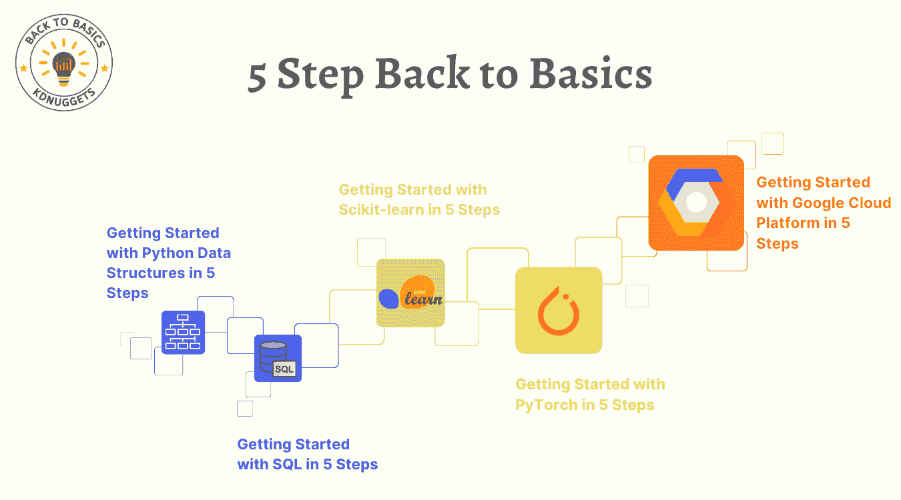

# 5 Simple Steps 系列：掌握 Python、SQL、Scikit-learn、PyTorch 和 Google Cloud

> 原文：[`www.kdnuggets.com/5-simple-steps-series-master-python-sql-scikit-learn-pytorch-google-cloud`](https://www.kdnuggets.com/5-simple-steps-series-master-python-sql-scikit-learn-pytorch-google-cloud)

对数据科学和机器学习世界不太熟悉？欢迎来到你的**终极指南**和起点，无论你是想进入这一行业、学习新知识，还是提升现有技能。Back to Basics: Getting Started in 5 Steps 系列是你所需要的一切，旨在将复杂的概念转化为简单明了的知识。

作为 KDnuggets 在数据科学、机器学习和人工智能领域 30 年历程的一部分，团队齐心协力为你策划了一系列文章，供你尽可能多地吸收知识。

* * *

## 我们的前三个课程推荐

 1\. [Google 网络安全证书](https://www.kdnuggets.com/google-cybersecurity) - 加速你的网络安全职业生涯。

 2\. [Google 数据分析专业证书](https://www.kdnuggets.com/google-data-analytics) - 提升你的数据分析能力

 3\. [Google IT 支持专业证书](https://www.kdnuggets.com/google-itsupport) - 支持你的组织进行 IT 事务

* * *

开始新的事物时，总是很难入门。KDnuggets 团队通过我们的 Back to Basics: Getting Started in 5 Steps 系列，帮你减轻这个负担，该系列包括：

+   Python 数据结构

+   SQL

+   Scikit-learn

+   PyTorch

+   Google Cloud Platform

所以让我们直接进入主题……

# Python 数据结构的 5 个步骤

本教程涵盖了 Python 的基础数据结构——列表、元组、字典和集合。了解它们的特性、使用场景和实际示例，所有这些都在 5 个步骤中完成。

在学习编程时，不管你使用哪种编程语言，你会发现有几个主要主题可以对大部分你接触到的内容进行分类。

其中一些，按理解的基本顺序排列，包括语法（语言的词汇）；命令（将词汇组合成有用的方式）；流程控制（如何引导命令执行的顺序）；算法（我们为解决特定问题所采取的步骤……这个词怎么变得如此令人困惑？）；最后，数据结构（我们在算法执行过程中用于数据操作的虚拟存储库（这些算法又是一系列步骤））。

学习 5 个步骤：**开始 Python 数据结构的 5 个步骤**

# SQL in 5 Steps

本全面的 SQL 教程涵盖了从设置 SQL 环境到掌握如连接和子查询等高级概念，以及优化查询性能的所有内容。通过逐步示例，这个指南非常适合想要提升数据管理技能的初学者。

在关系型数据库中管理和操作数据时，结构化查询语言（SQL）是最重要的名称。SQL 是一个主要的领域特定语言，它是数据库管理的基石，并提供了一种标准化的方式与数据库进行交互。

随着数据成为决策和创新的驱动力，SQL 仍然是一个关键技术，数据分析师、开发人员和数据科学家必须给予高度关注。

学习这 5 个步骤：**5 步快速入门 SQL**

# Scikit-learn 5 步

本教程提供了 Scikit-learn 机器学习的全面实践指南。读者将学习包括数据预处理、模型训练与评估、超参数调优和编译集成模型以提升性能的关键概念和技术。

在学习如何使用[Scikit-learn](https://scikit-learn.org/stable/)时，我们必须具备对机器学习基本概念的理解，因为 Scikit-learn 只是实现机器学习原理和相关任务的实用工具。机器学习是人工智能的一个子集，使计算机能够通过经验进行学习和改进，而无需明确编程。算法利用训练数据通过揭示模式和洞察进行预测或决策。

学习这 5 个步骤：**5 步快速入门 Scikit-learn**

# PyTorch 5 步

本教程提供了使用 PyTorch 及其高级封装库 PyTorch Lightning 的深入介绍。文章涵盖了从安装到高级主题的必要步骤，提供了构建和训练神经网络的实践方法，并强调了使用 Lightning 的好处。

[PyTorch](https://pytorch.org/)是一个基于 Python 的流行开源机器学习框架，经过优化以支持 GPU 加速计算。最初由 Meta AI 于 2016 年开发，现在成为 Linux 基金会的一部分，PyTorch 迅速成为深度学习研究和应用中最广泛使用的框架之一。

与其他框架如 TensorFlow 不同，PyTorch 使用动态计算图，允许更大的灵活性和调试能力。

学习这 5 个步骤：**5 步快速入门 PyTorch**

# Google Cloud Platform 5 步

探索 Google Cloud Platform 在数据科学和机器学习中的基本要素，从账户设置到模型部署，包含实际项目示例。

本文旨在提供一个关于如何开始使用[Google Cloud Platform](https://cloud.google.com/)（GCP）进行数据科学和机器学习的逐步概述。我们将介绍 GCP 及其在分析方面的关键功能，演示账户设置，探索[BigQuery](https://cloud.google.com/bigquery)和[Cloud Storage](https://cloud.google.com/storage)等基本服务，构建一个示例数据项目，并使用 GCP 进行机器学习。

无论你是 GCP 的新手还是寻找快速复习的方式，请继续阅读以学习基础知识，并迅速上手 Google Cloud。

学习这 5 个步骤：**5 步开始使用 Google Cloud Platform**

# 结束语

这个《回到基础：5 步开始使用》系列将使你了解数据科学中使用的基础工具。你将熟悉 Python、SQL、使用 Scikit-learn 和 PyTorch 进行机器学习的基础知识，同时也将涉足 Google Cloud Platform。

数据掌握之路并未止步于此，它是一个持续的旅程，需要你不断学习新技能和工具以提高熟练度。

关注 KDnuggets，获取更多见解、高级指南，并享受一个和你一样对数据科学充满热情的社区的支持。

**[Nisha Arya](https://www.linkedin.com/in/nisha-arya-ahmed/)** 是一名数据科学家、自由撰稿人以及 KDnuggets 的编辑和社区经理。她特别关注提供数据科学职业建议或教程以及与数据科学相关的理论知识。Nisha 涉及广泛的话题，并希望探索人工智能如何有助于人类寿命的延续。作为一个热衷的学习者，Nisha 致力于拓宽她的技术知识和写作技能，同时帮助他人。

### 更多相关话题

+   [5 步开始使用 Google Cloud Platform](https://www.kdnuggets.com/5-steps-google-cloud-platform)

+   [5 步开始使用 PyTorch](https://www.kdnuggets.com/5-steps-getting-started-pytorch)

+   [5 个简单步骤使用 Python 自动化数据清理](https://www.kdnuggets.com/5-simple-steps-to-automate-data-cleaning-with-python)

+   [11 个 AWS 云和数据迁移的最佳实践](https://www.kdnuggets.com/2023/04/11-best-practices-cloud-data-migration-aws-cloud.html)

+   [25 本免费书籍掌握 SQL、Python、数据科学、机器学习等](https://www.kdnuggets.com/25-free-books-to-master-sql-python-data-science-machine-learning-and-natural-language-processing)

+   [使用 SQL 处理时间序列中的缺失值](https://www.kdnuggets.com/2022/09/handling-missing-values-timeseries-sql.html)
