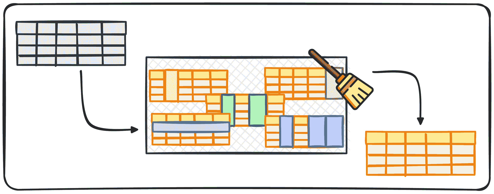
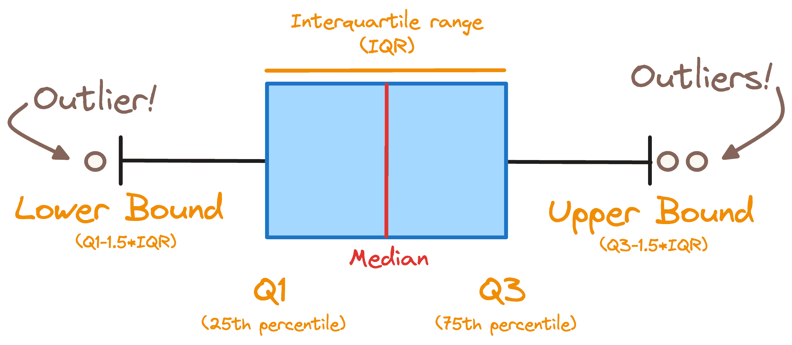

# 使用 Python 自动化数据清理的 5 个简单步骤

> 原文：[`www.kdnuggets.com/5-simple-steps-to-automate-data-cleaning-with-python`](https://www.kdnuggets.com/5-simple-steps-to-automate-data-cleaning-with-python)

作者提供的图像

数据科学家普遍认为，数据清理占据了我们大量的工作时间。然而，这也是最不令人兴奋的部分之一。因此，这就引出了一个非常自然的问题：

* * *

## 我们的三大课程推荐

 1\. [谷歌网络安全证书](https://www.kdnuggets.com/google-cybersecurity) - 快速进入网络安全职业生涯。

 2\. [谷歌数据分析专业证书](https://www.kdnuggets.com/google-data-analytics) - 提升你的数据分析技能

 3\. [谷歌 IT 支持专业证书](https://www.kdnuggets.com/google-itsupport) - 支持你所在组织的 IT

* * *

*是否有办法自动化这个过程？*

自动化任何过程总是说起来容易做起来难，因为执行步骤大多依赖于具体项目和目标。但总有办法至少自动化其中的一部分。

本文旨在生成一个管道，包含一些步骤以确保我们的数据干净且准备好使用。

## 数据清理过程

在生成管道之前，我们需要了解哪些部分的过程可以自动化。

由于我们希望构建一个几乎可以用于任何数据科学项目的过程，因此我们需要首先确定哪些步骤是反复执行的。

因此，在处理新的数据集时，我们通常会问以下问题：

+   数据以什么格式存在？

+   数据是否包含重复项？

+   数据是否包含缺失值？

+   数据包含哪些数据类型？

+   数据是否包含异常值？

这 5 个问题可以轻松地转换为 5 个代码块来处理每一个问题：

### 1. 数据格式

数据可以有不同的格式，例如 JSON、CSV，甚至 XML。每种格式都需要自己特定的数据解析器。例如，pandas 提供 read_csv 处理 CSV 文件，以及 read_json 处理 JSON 文件。

通过识别格式，你可以选择合适的工具来开始清理过程。

我们可以使用 os 库中的 path.plaintext 函数轻松识别我们处理的文件格式。因此，我们可以创建一个函数，首先确定文件扩展名，然后直接应用于相应的解析器。

### 2\. 重复数据

数据的某些行往往包含与其他行完全相同的值，即我们所说的重复数据。重复数据可能会扭曲结果，导致分析不准确，这一点非常不好。

这就是为什么我们总是需要确保没有重复项的原因。

Pandas 提供了 `drop_duplicated()` 方法来处理重复数据，该方法可以删除数据框中的所有重复行。

我们可以创建一个简单的函数，利用此方法来删除所有重复值。如有必要，我们添加一个列输入变量，使函数能够根据特定的列名列表删除重复项。

### 3\. 缺失值

在处理数据时，缺失数据是一个常见问题。根据数据的性质，我们可以简单地删除包含缺失值的观察数据，或者使用前向填充、后向填充、或用列的均值或中位数填充这些空缺。

Pandas 提供了 `.fillna()` 和 `.dropna()` 方法来有效处理这些缺失值。

处理缺失值的选择取决于：

+   缺失值的类型

+   缺失值相对于我们拥有的总记录数的比例。

处理缺失值是一个相当复杂的任务——通常也是最重要的任务之一！——你可以在[以下文章中了解更多。](https://www.kdnuggets.com/2020/06/missing-values-dataset.html)

对于我们的管道，我们将首先检查所有包含空值的行的总数。如果只有 5% 或更少的行受影响，我们将删除这些记录。如果更多行存在缺失值，我们将逐列检查，然后采取以下措施：

+   填充该值的中位数。

+   生成警告以便进一步调查。

在这种情况下，我们通过混合人工验证过程来评估缺失值。正如你所知，评估缺失值是一个不能被忽视的重要任务。

在处理常规数据类型时，我们可以直接使用 pandas 的 `.astype()` 函数来转换列，因此你可以实际修改代码以生成常规对话。

否则，通常假设在处理新数据时转换会顺利进行是过于冒险的。

### 5\. 处理异常值

异常值可以显著影响数据分析的结果。处理异常值的技术包括设定阈值、限制值或使用统计方法如 Z 分数。

为了确定数据集中是否存在异常值，我们使用一个常见的规则，将超出以下范围的记录视为异常值。[Q1 — 1.5 * IQR , Q3 + 1.5 * IQR]

其中 IQR 代表四分位距，Q1 和 Q3 分别是第一四分位数和第三四分位数。下面你可以看到所有之前的概念在箱线图中的展示。

图片来源：作者

为了检测异常值的存在，我们可以轻松定义一个函数，检查哪些列中的值超出了先前的范围，并生成警告。

## 最终思考

数据清理是任何数据项目中至关重要的一部分，但它通常也是最枯燥和浪费时间的阶段。这就是为什么本文将全面的方法提炼为一个实用的 5 步流程，以 Python 实现数据清理自动化。

这个流程不仅仅是实现代码。它整合了深思熟虑的决策标准，指导用户处理不同的数据场景。

这种将自动化与人工监督相结合的方法确保了效率和准确性，使其成为数据科学家优化工作流程的强大解决方案。

你可以在以下的 [GitHub 仓库](https://github.com/rfeers/data-science-portfolio/blob/main/data-analytics/automate-data-cleaning/data_cleaning_automation.ipynb)查看我完整的代码。

****[Josep Ferrer](https://www.linkedin.com/in/josep-ferrer-sanchez)**** 是一位来自巴塞罗那的分析工程师。他毕业于物理工程专业，目前在应用于人类移动的数据科学领域工作。他还是一位兼职内容创作者，专注于数据科学和技术。Josep 关注人工智能的所有事物，涵盖了该领域正在爆炸式增长的应用。

### 更多相关内容

+   [5 个使用 Python 自动化的任务](https://www.kdnuggets.com/2021/06/5-tasks-automate-python.html)

+   [使用 Python 自动化 Microsoft Excel 和 Word](https://www.kdnuggets.com/2021/08/automate-microsoft-excel-word-python.html)

+   [使用 GPT-4 和 Python 自动化无聊的工作](https://www.kdnuggets.com/2023/03/automate-boring-stuff-chatgpt-python.html)

+   [使用 Promptr 和 GPT 自动化您的代码库](https://www.kdnuggets.com/2023/04/automate-codebase-promptr-gpt.html)

+   [使用 ChatGPT Canva 插件自动化图形设计活动](https://www.kdnuggets.com/automate-graphic-design-activity-with-chatgpt-canva-plugin)

+   [AI 自动化网络安全：自动化哪些内容？](https://www.kdnuggets.com/ai-automated-cybersecurity-what-to-automate)
