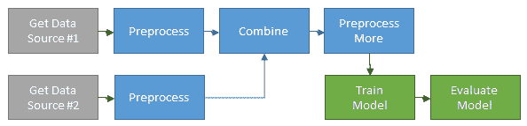

# 使用 d6tflow 构建可扩展深度学习管道的 5 步指南

> 原文：[`www.kdnuggets.com/2019/09/5-step-guide-scalable-deep-learning-pipelines-d6tflow.html`](https://www.kdnuggets.com/2019/09/5-step-guide-scalable-deep-learning-pipelines-d6tflow.html)

评论

**作者 [Norman Niemer](https://www.linkedin.com/in/normanniemer/)，首席数据科学家 & [Samuel Showalter](https://www.linkedin.com/in/samuelrshowalter/)，技术顾问**

### 介绍：为什么要这样做？

构建深度学习模型通常涉及复杂的数据管道，以及大量的试错过程、调整模型架构和参数，这些参数的性能需要进行比较。通常很难跟踪所有实验，这往往会导致困惑，最糟糕的情况则是得出错误结论。

在 [4 个原因说明为什么你的机器学习代码很糟糕](https://www.kdnuggets.com/2019/02/4-reasons-machine-learning-code-probably-bad.html) 中，我们探讨了如何将机器学习代码组织为 DAG 工作流以解决这个问题。在本指南中，我们将通过一个实际案例研究，将现有的 pytorch 脚本转换为使用 [d6tflow](https://github.com/d6t/d6tflow) 的可扩展深度学习管道。起点是 [Facebook 的 pytorch 深度推荐模型](https://github.com/facebookresearch/dlrm)，我们将经过将代码迁移到可扩展深度学习管道的 5 个步骤。下面的步骤以部分伪代码形式编写以说明概念，完整代码也可用，详见文章末尾的说明。

开始吧！

### 步骤 1：规划你的 DAG

为了规划你的工作并帮助他人理解你的管道如何整合在一起，你需要首先考虑数据流、任务之间的依赖关系和任务参数。这有助于你将工作流组织成逻辑组件。你可能会想绘制一个类似这样的图示



以下是 FB DLRM 的 pytorch 模型训练 DAG。它展示了训练任务`TaskModelTrain`及其所有依赖项，以及这些依赖项之间的关系。如果你编写的是函数式代码，很难看到你的工作流如何像这样整合在一起。

```py
task = TaskModelTrain()
print(d6tflow.preview(task, clip_params=True))
```

```py
## 
## └─--[TaskModelTrain-{'data_generation': 'random'}[more] ([94mPENDING[0m)]
##    |--[TaskBuildNetwork-{'data_generation': 'random'}[more] ([94mPENDING[0m)]
##    |  └─--[TaskGetTrainDataset-{'data_generation': 'random'}[more] ([94mPENDING[0m)]
##    |--[TaskGetTrainDataset-{'data_generation': 'random'}[more] ([94mPENDING[0m)]
##    └─--[TaskGetTestDataset-{'data_generation': 'random'}[more] ([94mPENDING[0m)]
## None
```

### 步骤 2：编写任务而不是函数

数据科学代码通常以函数的形式组织，这会导致很多问题，具体见 [4 个原因说明为什么你的机器学习代码很糟糕](https://www.kdnuggets.com/2019/02/4-reasons-machine-learning-code-probably-bad.html)。相反，你应该编写 d6tflow 任务。这样做的好处包括：

+   将任务链入 DAG，以便所需的依赖项自动运行

+   轻松从依赖项中加载任务输入数据

+   轻松保存任务输出，如预处理数据和训练模型。这样你就不会意外地重新运行长时间运行的训练任务

+   参数化任务，以便可以智能地管理（见下一步）

+   将输出保存到 [d6tpipe](https://github.com/d6t/d6tpipe)，以将数据与代码分开并轻松共享数据，参见 [数据科学家的十大编码错误](https://www.kdnuggets.com/2019/04/top-10-coding-mistakes-data-scientists.html)

下面是将功能代码转换为 d6tflow 任务后的 FB DLRM 代码的前后对比。

典型的 pytorch 功能代码扩展性差：

```py
# ***BEFORE***
# see dlrm_s_pytorch.py

def train_model():
    data = loadData()
    dlrm = DLRM_Net([...])
    model = dlrm.train(data) 
    torch.save({model},'model.pickle')

if __name__ == "__main__":

    parser.add_argument("--load-model")
    if load_model:
        model = torch.load('model.pickle')
    else:
        model = train_model()
```

使用可扩展的 d6tflow 任务编写的相同逻辑：

```py
# ***AFTER***
# see flow_tasks.py

class TaskModelTrain(d6tflow.tasks.TaskPickle):

    def requires(self):  # define dependencies
        return {'data': TaskPrepareData(), 'model': TaskBuildNetwork()}

    def run(self):
        data = self.input()['data'].load() # easily load input data
        dlrm = self.input()['model'].load()
        model = dlrm.train(data) 
        self.save(model) # easily save trained model as pickle

if __name__ == "__main__":
    if TaskModelTrain().complete(): # load ouput if task was run
        model = TaskModelTrain().output().load()
```

### 第 3 步：参数化任务

为了提高模型性能，你将尝试不同的模型、参数和预处理设置。为了跟踪这些，你可以将参数添加到任务中。这样你可以：

+   跟踪哪些模型使用了哪些参数进行训练

+   智能地重新运行任务以应对参数变化

+   帮助他人理解工作流中引入参数的位置

下面设置了 FB DLRM 模型训练任务及其参数。请注意，你不再需要手动指定保存训练模型和数据的位置。

```py
# ***BEFORE***
# dlrm_s_pytorch.py

if __name__ == "__main__":
    # define model parameters
    parser.add_argument("--learning-rate", type=float, default=0.01)
    parser.add_argument("--nepochs", type=int, default=1)
    # manually specify filename
    parser.add_argument("--save-model", type=str, default="") 
    model = train_model()
    torch.save(model, args.save_model)

# ***AFTER***
# see flow_tasks.py

class TaskModelTrain(d6tflow.tasks.TaskPickle):

    # define model parameters
    learning_rate = luigi.FloatParameter(default = 0.01)
    num_epochs = luigi.IntParameter(default = 1)
    # filename is determined automatically

    def run(self):
        data = self.input()['data'].load()
        dlrm = self.input()['model'].load()

        # use learning_rate param
        optimizer = torch.optim.SGD(dlrm.parameters(), lr=self.learning_rate)        
        # use num_epochs param
        while k < self.num_epochs: 
            optimizer.step()
        model = optimizer.get_model()
        self.save(model) # automatically save model, seperately for each parameter config
```

### 比较训练模型

现在你可以使用该参数轻松比较不同模型的输出。确保在加载任务输出之前运行带有该参数的工作流（参见第 #4 步）。

```py
model1 = TaskModelTrain().output().load() # use default num_epochs=1
print_accuracy(model1)
model2 = TaskModelTrain(num_epochs=10).output().load()
print_accuracy(model2)
```

### 继承参数

通常，你需要让参数通过工作流向下级传递。如果你编写功能代码，你必须在每个函数中重复参数。使用 d6tflow，你可以继承参数，这样终端任务可以根据需要将参数传递给上游任务。

在 FB DLRM 工作流中，`TaskModelTrain` 从 `TaskGetTrainDataset` 继承参数。这样你可以运行 `TaskModelTrain(mini_batch_size=2)`，它会将参数传递给上游任务，即 `TaskGetTrainDataset` 和所有依赖于它的其他任务。在实际代码中，请注意使用了 `self.clone(TaskName)` 和 `@d6tflow.clone_parent`。

```py
class TaskGetTrainDataset(d6tflow.tasks.TaskPickle):
    mini_batch_size = luigi.FloatParameter(default = 1)
    # [...]

@d6tflow.inherit(TaskGetTrainDataset)
class TaskModelTrain(d6tflow.tasks.TaskPickle):
    # no need to repeat parameters
    pass
```

### 第 4 步：运行 DAG 以处理数据和训练模型

要启动数据处理和模型训练，你需要运行 DAG。你只需运行终端任务，它会自动运行所有依赖项。在实际运行 DAG 之前，你可以预览将要运行的内容。如果你对代码或数据进行了任何更改，这尤其有用，因为它只会运行已更改的任务，而不是完整的工作流。

```py
task = TaskModelTrain() # or task = TaskModelTrain(num_epochs=10)
d6tflow.preview(task)
d6tflow.run(task)
```

### 第 5 步：评估模型性能

现在工作流已经运行完毕，所有任务都已完成，你可以加载预测结果和其他模型输出进行比较和可视化。因为任务知道每个输出保存的位置，你可以直接从任务中加载输出，而不必记住文件路径或变量名。这也使你的代码更具可读性。

```py
model1 = TaskModelTrain().output().load()
print_accuracy(model1)
```

### 比较模型

你可以轻松比较不同模型和不同参数的输出。

```py
model1 = TaskModelTrain().output().load() # use default num_epochs=1
print_accuracy(model1)
model2 = TaskModelTrain(num_epochs=10).output().load()
print_accuracy(model2)
```

### 不断迭代

当您迭代、更改参数、代码和数据时，您将需要重新运行任务。d6tflow 智能地判断哪些任务需要重新运行，这使得迭代变得非常高效。如果您更改了参数，您无需做任何操作，它会自动知道需要运行什么。如果您更改了代码或数据，您需要使用 `.invalidate()` 将任务标记为未完成，d6tflow 会处理其余的部分。

在 FB DLRM 工作流中，例如，您更改了训练数据或对训练预处理进行了更改。

```py
TaskGetTrainDataset().invalidate()

# or
d6tflow.run(task, forced=TaskGetTrainDataset())
```

### 完整源代码

所有代码都提供在 [`github.com/d6tdev/dlrm`](https://github.com/d6tdev/dlrm)。它与 [`github.com/facebook/dlrm`](https://github.com/facebook/dlrm) 相同，只是添加了 d6tflow 文件：

+   flow_run.py: 运行 flow => 运行此文件

+   flow_task.py: 任务代码

+   flow_viz.py: 显示模型输出

+   flow_cfg.py: 默认参数

+   dlrm_d6t_pytorch.py: 为 d6tflow 采用的 dlrm_data_pytorch.py

亲自尝试！

### 对于您的下一个项目

在本指南中，我们展示了如何构建可扩展的深度学习工作流。我们使用了现有的代码库，并展示了如何将线性深度学习代码转换为 d6tflow DAG 以及这样做的好处。

对于新项目，您可以从 [`github.com/d6t/d6tflow-template`](https://github.com/d6t/d6tflow-template) 开始一个可扩展的项目模板。结构非常相似：

+   run.py: 运行工作流

+   task.py: 任务代码

+   cfg.py: 管理参数

**[Norman Niemer](https://www.linkedin.com/in/normanniemer/)** 是一家大型资产管理公司的首席数据科学家，他提供数据驱动的投资洞察。他拥有哥伦比亚大学的金融工程硕士学位和卡斯商学院（伦敦）的银行与金融学士学位。

**[Samuel Showalter](https://www.linkedin.com/in/samuelrshowalter/)** 是一名技术顾问。他是近期毕业生，对数据科学、软件开发以及这些领域对个人和职业生活的价值充满热情。他曾在多个不同的角色中工作，但所有这些角色都专注于数据管理和分析。

[原文](https://htmlpreview.github.io/?https://github.com/citynorman/blogs-datasci/blob/master/blog-20190813-d6tflow-pytorch.html)。已获授权转载。

**相关：**

+   数据科学家犯的 10 个编码错误

+   4 个原因说明你的机器学习代码可能不好

+   数据管道、Luigi、Airflow：您需要知道的一切

* * *

## 我们的 Top 3 课程推荐

 1\. [Google 网络安全证书](https://www.kdnuggets.com/google-cybersecurity) - 快速进入网络安全职业的快车道。

 2\. [Google 数据分析专业证书](https://www.kdnuggets.com/google-data-analytics) - 提升您的数据分析技能

 3\. [Google IT 支持专业证书](https://www.kdnuggets.com/google-itsupport) - 支持您的组织进行 IT 工作

* * *

### 相关主题

+   [成为数据科学家的指南（逐步方法）](https://www.kdnuggets.com/2021/05/guide-become-data-scientist.html)

+   [如何结构化数据科学项目：逐步指南](https://www.kdnuggets.com/2022/05/structure-data-science-project-stepbystep-guide.html)

+   [使用 Python 和 Beautiful Soup 进行网络爬取的逐步指南](https://www.kdnuggets.com/2023/04/stepbystep-guide-web-scraping-python-beautiful-soup.html)

+   [文本到视频生成：逐步指南](https://www.kdnuggets.com/2023/08/text2video-generation-stepbystep-guide.html)

+   [逐步指南：阅读和理解 SQL 查询](https://www.kdnuggets.com/a-step-by-step-guide-to-reading-and-understanding-sql-queries)

+   [拆解 DENSE_RANK()：SQL 爱好者的逐步指南](https://www.kdnuggets.com/breaking-down-denserank-a-step-by-step-guide-for-sql-enthusiasts)
