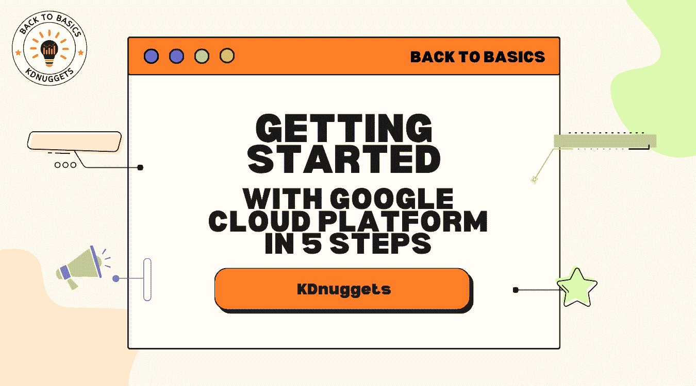

# 5 步骤开始使用 Google Cloud Platform

> 原文：[`www.kdnuggets.com/5-steps-google-cloud-platform`](https://www.kdnuggets.com/5-steps-google-cloud-platform)



# Google Cloud Platform 介绍

* * *

## 我们的前三大课程推荐

 1\. [Google 网络安全证书](https://www.kdnuggets.com/google-cybersecurity) - 快速进入网络安全职业道路。

 2\. [Google 数据分析专业证书](https://www.kdnuggets.com/google-data-analytics) - 提升你的数据分析技能

 3\. [Google IT 支持专业证书](https://www.kdnuggets.com/google-itsupport) - 支持你的组织的 IT 需求

* * *

本文旨在提供一个逐步的概述，帮助你开始使用 [Google Cloud Platform](https://cloud.google.com/) (GCP) 进行数据科学和机器学习。我们将概述 GCP 及其分析功能，介绍帐户设置，探索 [BigQuery](https://cloud.google.com/bigquery) 和 [Cloud Storage](https://cloud.google.com/storage) 等重要服务，构建一个示例数据项目，并使用 GCP 进行机器学习。无论你是 GCP 新手还是寻找快速复习的机会，继续阅读以了解基础知识，并迅速上手 Google Cloud。

## 什么是 GCP？

Google Cloud Platform 提供了一系列云计算服务，帮助你在 Google 的基础设施上构建和运行应用程序。对于计算能力，有 Compute Engine 让你创建虚拟机。如果你需要运行容器，Kubernetes 可以完成任务。BigQuery 处理你的数据仓储和分析需求。通过 Cloud ML，你可以通过 API 获取预训练的机器学习模型，用于视觉、翻译等功能。总的来说，GCP 的目标是提供你所需的基础构件，以便你专注于创建出色的应用程序，而不必担心底层基础设施。

## GCP 对数据科学的好处

GCP 为数据分析和机器学习提供了几个好处：

+   可扩展的计算资源，能够处理大数据工作负载

+   托管服务如 BigQuery 用于大规模数据处理

+   高级机器学习能力如 Cloud AutoML 和 AI 平台

+   集成的分析工具和服务

## GCP 如何与 AWS 和 Azure 比较

与亚马逊网络服务和微软 Azure 相比，GCP 在大数据、分析和机器学习方面具有优势，并且提供如 BigQuery 和 Dataflow 这样的托管服务用于数据处理。AI 平台使训练和部署机器学习模型变得简单。总体而言，GCP 价格具有竞争力，是数据驱动应用程序的首选。

| 特性 | Google Cloud Platform (GCP) | 亚马逊网络服务 (AWS) | 微软 Azure |
| --- | --- | --- | --- |
| 定价* | 具有持续使用折扣的竞争性定价 | 带有预留实例折扣的每小时定价 | 带有预留实例折扣的每分钟定价 |
| 数据仓库 | BigQuery | Redshift | Synapse Analytics |
| 机器学习 | Cloud AutoML、AI Platform | SageMaker | Azure Machine Learning |
| 计算服务 | 计算引擎、Kubernetes 引擎 | EC2、ECS、EKS | 虚拟机、AKS |
| 无服务器服务 | Cloud Functions、App Engine | Lambda、Fargate | Functions、Logic Apps |

**请注意，为了我们的目的，定价模型已经简化。AWS 和 Azure 也提供类似于 GCP 的持续使用或承诺使用折扣；定价结构复杂，可能会根据多种因素有显著变化，因此建议读者进一步了解以确定实际成本。**

在此表中，我们根据定价、数据仓库、机器学习、计算服务和无服务器服务等各种功能比较了 Google Cloud Platform、Amazon Web Services 和 Microsoft Azure。这些云平台各自拥有独特的服务和定价模式，满足不同的业务和技术需求。

# 步骤 1：设置您的 GCP 账户

## 创建 Google Cloud 账户

要使用 GCP，请首先注册一个 Google Cloud 账户。前往 [主页](https://cloud.google.com) 并点击“免费开始”。按照提示使用您的 Google 或 Gmail 凭据创建账户。

## 创建账单账户

接下来，您需要设置账单账户和付款方式。这允许您在免费层之外使用付费服务。请在控制台中导航到“账单”部分，并按照提示添加您的账单信息。

## 理解 GCP 定价

GCP 提供了为期 12 个月的慷慨免费层，并附带 $300 信用额度。这允许免费使用 Compute Engine、BigQuery 等关键产品。请查看定价计算器和文档以估算总成本。

## 安装 Google Cloud SDK

在本地机器上安装 Cloud SDK，以通过命令行管理项目/资源。从 [Cloud SDK 指南页面](https://cloud.google.com/sdk/docs/install-sdk) 下载并按照安装指南进行操作。

最后，请务必查看并随时参考 [开始使用 Google Cloud](https://cloud.google.com/docs/get-started) 文档。

# 步骤 2：GCP 数据科学服务

Google Cloud Platform (GCP) 提供了大量服务，旨在满足各种数据科学需求。在这里，我们将深入探讨一些关键服务，如 BigQuery、Cloud Storage 和 Cloud Dataflow，揭示它们的功能和潜在用途。

## BigQuery

BigQuery 是 GCP 完全托管、低成本的分析数据库。凭借其无服务器模型，BigQuery 通过利用 Google 基础设施的处理能力，能够对追加式表进行超快速 SQL 查询。它不仅仅是一个运行查询的工具，而是一个强大、大规模的数据仓库解决方案，能够处理 PB 级的数据。无服务器的方法消除了对数据库管理员的需求，使其成为希望降低运营开销的企业的一个有吸引力的选择。

**示例**：*深入*研究公共出生数据集，以获取有关美国出生的洞察。

```py
SELECT * FROM `bigquery-public-data.samples.natality`
LIMIT 10
```

## 云存储

Cloud Storage 提供了强大、安全和可扩展的对象存储。它是企业的一个优秀解决方案，因为它允许以高度的可用性和可靠性存储和检索大量数据。Cloud Storage 中的数据被组织到存储桶中，存储桶作为数据的独立容器，可以单独管理和配置。Cloud Storage 支持标准、近线、冷线和归档存储类，允许优化价格和访问要求。

**示例**：使用 gsutil CLI 将示例 CSV 文件上传到 Cloud Storage 存储桶。

```py
gsutil cp sample.csv gs://my-bucket
```

## Cloud Dataflow

Cloud Dataflow 是一个完全托管的服务，用于流处理和批处理数据。它在实时或接近实时的分析中表现出色，并支持提取、转换和加载 (ETL) 任务以及实时分析和人工智能 (AI) 用例。Cloud Dataflow 旨在以可靠、容错的方式处理大量数据的复杂性。它与 BigQuery 等其他 GCP 服务无缝集成，进行分析，与 Cloud Storage 集成进行数据暂存和临时结果，使其成为构建端到端数据处理管道的基石。

# 步骤 3：构建你的第一个数据项目

开始数据项目需要系统化的方法以确保准确和有洞察力的结果。在这一步，我们将通过创建一个 Google Cloud Platform (GCP) 项目，启用必要的 API，并为数据的摄取、分析和可视化设置基础，使用 BigQuery 和 Data Studio。对于我们的项目，让我们*深入*分析历史天气数据以识别气候趋势。

## 设置项目并启用 API

通过在 GCP 上创建一个新项目来开始你的旅程。导航到 Cloud Console，点击项目下拉菜单并选择“新建项目”。命名为“天气分析”，并按照设置向导完成操作。一旦你的项目准备好，前往 API 和服务仪表板，启用 BigQuery、Cloud Storage 和 Data Studio 等必需的 API。

## 将数据集加载到 BigQuery 中

对于我们的天气分析，我们需要一个丰富的数据集。NOAA 提供了大量的历史天气数据。下载部分数据后，前往 BigQuery 控制台。在这里，创建一个名为`weather_data`的新数据集。点击“创建表”，上传你的数据文件，并按照提示配置模式。

```py
Table Name: historical_weather
Schema: Date:DATE, Temperature:FLOAT, Precipitation:FLOAT, WindSpeed:FLOAT
```

## 在 BigQuery 中查询数据并进行分析

拥有数据后，是时候发掘洞察了。BigQuery 的 SQL 界面使运行查询变得轻而易举。例如，要找出多年的平均温度：

```py
SELECT EXTRACT(YEAR FROM Date) as Year, AVG(Temperature) as AvgTemperature
FROM `weather_data.historical_weather`
GROUP BY Year
ORDER BY Year ASC;
```

这个查询提供了每年的平均温度细分，这对我们的气候趋势分析至关重要。

## 使用 Data Studio 可视化洞察

数据的可视化展示通常揭示了原始数字中看不到的模式。将你的 BigQuery 数据集连接到 Data Studio，创建一个新报告，并开始构建可视化。展示多年温度趋势的折线图是一个不错的开始。Data Studio 的直观界面使拖放和自定义可视化变得简单易行。

使用“共享”按钮与团队分享你的发现，使利益相关者能够轻松访问和互动你的分析结果。

通过完成这一步骤，你已经设置了一个 GCP 项目，获取了真实世界的数据集，执行了 SQL 查询以分析数据，并可视化了你的发现以便更好地理解和分享。这种动手实践不仅有助于理解 GCP 的机制，还能从数据中获得可操作的洞察。

# 第 4 步：GCP 上的机器学习

利用机器学习 (ML) 可以显著增强你的数据分析，提供更深入的洞察和预测。在这一步中，我们将扩展我们的“天气分析”项目，利用 GCP 的 ML 服务基于历史数据预测未来的温度。GCP 提供了两种主要的 ML 服务：适合 ML 新手的 Cloud AutoML 和适合经验丰富的从业者的 AI 平台。

## Cloud AutoML 和 AI 平台概述

+   Cloud AutoML：这是一个完全托管的 ML 服务，简化了定制模型的训练过程，代码量很少。非常适合没有深厚机器学习背景的人士。

+   AI 平台：这是一个用于构建、训练和部署 ML 模型的托管平台。它支持流行的框架，如 TensorFlow、scikit-learn 和 XGBoost，非常适合具有 ML 经验的人士。

## 使用 AI 平台的实际操作示例

在继续我们的天气分析项目时，我们的目标是使用历史数据预测未来的温度。首先，准备训练数据是一个关键步骤。将数据预处理成适合 ML 的格式，通常是 CSV，并将其分成训练集和测试集。确保数据清洁，并选择相关特征以进行准确的模型训练。准备好后，将数据集上传到 Cloud Storage 桶中，创建类似`gs://weather_analysis_data/training/`和`gs://weather_analysis_data/testing/`的结构化目录。

训练模型是下一个重要步骤。导航到 GCP 的 AI Platform 并创建一个新模型。选择预构建的回归模型，因为我们正在预测一个连续目标——温度。将模型指向 Cloud Storage 中的训练数据，并设置训练所需的参数。GCP 将自动处理训练过程、调优和评估，简化模型构建过程。

在成功训练后，将训练好的模型部署到 AI Platform。部署模型可以方便地与其他 GCP 服务和外部应用程序集成，使模型能够进行预测。确保设置适当的版本控制和访问控制，以便安全有序地管理模型。

现在模型已经部署，是时候测试其预测结果了。通过 GCP Console 或 SDK 发送查询请求，测试模型的预测结果。例如，输入某一天的历史天气参数，观察预测的温度，这将给出模型准确性和表现的初步了解。

## 使用 Cloud AutoML 进行实际操作

对于更简单的机器学习方法，Cloud AutoML 提供了一个用户友好的界面来训练模型。首先确保数据格式正确并已分割，然后将其上传到 Cloud Storage。这一步与 AI Platform 中的数据准备类似，但更适合那些机器学习经验较少的用户。

接下来，导航到 GCP 上的 AutoML Tables，创建一个新数据集，并从 Cloud Storage 导入数据。这一设置非常直观，配置要求最低，使数据准备工作变得轻松。

在 AutoML 中训练模型是直接的。选择训练数据，指定目标列（Temperature），并启动训练过程。AutoML Tables 将自动处理特征工程、模型调优和评估，这样就能减轻你的负担，让你专注于理解模型的输出。

一旦模型训练完成，将其部署到 Cloud AutoML 中，并使用提供的界面或通过 GCP SDK 发送查询请求来测试其预测准确性。这一步将模型投入实际使用，允许你对新数据进行预测。

最后，评估模型的表现。检查模型的评估指标、混淆矩阵和特征重要性，以更好地了解其性能。这些见解至关重要，因为它们可以告知是否需要进一步的调优、特征工程或收集更多数据以提高模型的准确性。

通过深入了解 AI Platform 和 Cloud AutoML，你可以获得在 GCP 上应用机器学习的实际理解，为你的天气分析项目增添预测能力。通过这些实际操作示例，机器学习融入数据项目的路径被揭示，奠定了更高级探索的坚实基础。

# 步骤 5：将模型部署到生产环境

一旦您的机器学习模型训练满意，下一步就是将其部署到生产环境。这种部署允许您的模型开始接收实际数据并返回预测。在这一阶段，我们将探讨 GCP 上的各种部署选项，以确保您的模型能够高效且安全地提供服务。

## 通过无服务器服务提供预测

可以利用 GCP 上的无服务器服务，如 Cloud Functions 或 Cloud Run 来部署训练好的模型并提供实时预测。这些服务抽象了基础设施管理任务，使您可以专注于编写和部署代码。由于其自动扩展功能，它们非常适合间歇性或低容量的预测请求。

例如，通过 Cloud Functions 部署您的温度预测模型涉及将模型打包成一个函数，然后将其部署到云端。部署后，Cloud Functions 会根据需要自动扩展或缩减实例数量，以处理请求的速率。

## 创建预测服务

对于高容量或对延迟敏感的预测，将训练好的模型打包到 Docker 容器中并部署到 Google Kubernetes Engine (GKE) 是一种更合适的方法。这种设置允许可扩展的预测服务，满足潜在的大量请求。

通过将您的模型封装在容器中，您创建了一个可移植且一致的环境，确保无论容器部署在哪里，它都能以相同的方式运行。一旦您的容器准备好后，将其部署到 GKE，GKE 提供了一个托管的 Kubernetes 服务，可以高效地协调您的容器化应用。

## 最佳实践

将模型部署到生产环境还涉及遵循最佳实践，以确保模型的平稳运行和持续准确性。

+   **监控生产环境中的模型**：密切关注模型随时间的表现。监控可以帮助检测模型漂移等问题，即当模型的预测随着基础数据分布的变化而变得不那么准确时。

+   **定期在新数据上重新训练模型**：随着新数据的出现，重新训练您的模型以确保它们继续做出准确的预测。

+   **为模型迭代实施 A/B 测试**：在完全替换生产环境中的现有模型之前，使用 A/B 测试将新模型的性能与旧模型进行比较。

+   **处理故障场景和回滚**：做好故障准备，并制定回滚计划，以便在必要时恢复到先前的模型版本。

## 成本优化

成本优化对于在性能和费用之间保持平衡至关重要。

+   **使用预 emptible VMs 和自动扩展**：为了管理成本，利用预 emptible VMs，它们的成本远低于常规 VMs。结合自动扩展，可以确保在需要时拥有必要的资源，而不会过度配置。

+   **比较无服务器与容器化部署**：评估无服务器和容器化部署之间的成本差异，以确定最具成本效益的方法。

+   **根据模型资源需求选择合适的机器类型**：选择与模型资源需求相匹配的机器类型，以避免对低使用率资源的过度花费。

## 安全考虑

保护你的部署至关重要，以保护你的模型及其处理的数据。

+   **了解 IAM、认证和加密最佳实践**：熟悉身份和访问管理（IAM），并实施适当的认证和加密，以保护对模型和数据的访问。

+   **生产模型和数据的安全访问**：确保只有授权的个人和服务可以访问生产中的模型和数据。

+   **防止未经授权访问预测端点**：实施强有力的访问控制，防止未经授权访问预测端点，保护模型免受潜在滥用。

将模型部署到 GCP 的生产环境涉及技术和操作方面的考量。通过遵循最佳实践、优化成本和确保安全，你为成功的机器学习部署奠定了坚实的基础，使你的模型在实际应用中能够提供价值。

# 继续前进

在这本全面指南中，我们遍历了启动 Google Cloud Platform (GCP) 机器学习和数据科学之旅的要点。从设置 GCP 账户到在生产环境中部署模型，每一步都是创建强大数据驱动应用程序的基石。以下是继续在 GCP 上探索和学习的下一步。

+   **GCP 免费层**：利用 GCP 免费层进一步探索和实验云服务。免费层提供对核心 GCP 产品的访问，是无需额外费用的动手体验的绝佳方式。

+   **高级 GCP 服务**：深入了解更高级的 GCP 服务，如 Pub/Sub 实时消息传递、Dataflow 流处理和批处理，或 Kubernetes Engine 容器编排。了解这些服务将拓宽你在 GCP 上管理复杂数据项目的知识和技能。

+   **社区和文档**：GCP 社区是丰富的知识源，官方文档也很全面。参与论坛、参加 GCP 聚会，探索教程以继续学习。

+   **认证**：考虑获取 Google Cloud 认证，如专业数据工程师或专业机器学习工程师，以验证你的技能并提升职业前景。

+   **参与项目合作**：与同事合作项目或参与利用 GCP 的开源项目。实际的合作提供了不同的视角，并提升你的解决问题的技能。

技术领域，尤其是云计算和机器学习，持续不断地发展。保持对最新进展的关注、参与社区活动并从事实际项目是不断提升技能的绝佳方式。此外，反思已完成的项目，从遇到的挑战中学习，并将这些经验应用于未来的工作中。每个项目都是一个学习机会，而持续改进是你在 GCP 上数据科学和机器学习之旅成功的关键。

通过遵循本指南，你为在 Google Cloud Platform 上的冒险奠定了坚实的基础。未来的道路充满了学习、探索和大量的机会，让你的数据项目产生重大影响。

[**马修·梅奥**](https://www.linkedin.com/in/mattmayo13/) ([**@mattmayo13**](https://twitter.com/mattmayo13)) 拥有计算机科学硕士学位和数据挖掘研究生文凭。作为 KDnuggets 的总编辑，马修旨在让复杂的数据科学概念变得易于理解。他的专业兴趣包括自然语言处理、机器学习算法以及探索新兴的人工智能。他的使命是将数据科学社区的知识普及化。马修从 6 岁起就开始编程。

### 更多相关主题

+   [5 步开始使用 Python 数据结构](https://www.kdnuggets.com/5-steps-getting-started-python-data-structures)

+   [5 步开始使用 SQL](https://www.kdnuggets.com/5-steps-getting-started-with-sql)

+   [5 步开始使用 Scikit-learn](https://www.kdnuggets.com/5-steps-getting-started-scikit-learn)

+   [5 步开始使用 PyTorch](https://www.kdnuggets.com/5-steps-getting-started-pytorch)

+   [5 个简单步骤系列：精通 Python、SQL、Scikit-learn、PyTorch 等](https://www.kdnuggets.com/5-simple-steps-series-master-python-sql-scikit-learn-pytorch-google-cloud)

+   [Qdrant：开源向量搜索引擎与托管云平台](https://www.kdnuggets.com/2023/02/qdrant-open-source-vector-search-engine-managed-cloud-platform.html)
