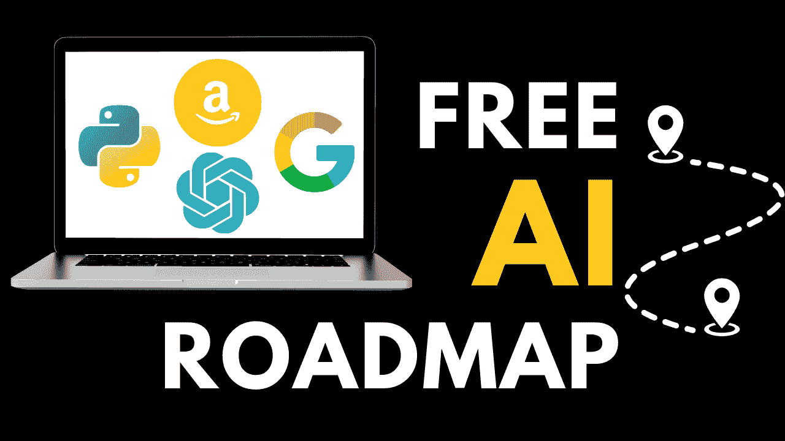

# 2024 年免费学习人工智能的 5 个步骤

> 原文：[`www.kdnuggets.com/5-steps-to-learn-ai-for-free-in-2024`](https://www.kdnuggets.com/5-steps-to-learn-ai-for-free-in-2024)

图片来源：作者

## 为什么你应该在 2024 年学习人工智能？

* * *

## 我们的前三个课程推荐

 1\. [Google 网络安全证书](https://www.kdnuggets.com/google-cybersecurity) - 快速进入网络安全职业。

 2\. [Google 数据分析专业证书](https://www.kdnuggets.com/google-data-analytics) - 提升你的数据分析能力

 3\. [Google IT 支持专业证书](https://www.kdnuggets.com/google-itsupport) - 支持你所在组织的 IT 需求

* * *

[对人工智能专业人才的需求](https://www.grandviewresearch.com/industry-analysis/artificial-intelligence-ai-market)在接下来的几年里将呈指数级增长。

随着公司开始将人工智能模型整合到工作流程中，新的角色将会出现，如**人工智能工程师**、**人工智能顾问**和**提示工程师**。

这些职业薪资高，年薪在[$136,000](https://www.coursera.org/articles/ai-engineer-salary)到[$375,000](https://www.businessinsider.com/ai-prompt-engineer-jobs-pay-salary-requirements-no-tech-background-2023-3)之间。

由于这个领域刚刚开始获得广泛关注，现在是进入职场、掌握人工智能技能的最佳时机。

然而，人工智能领域有太多东西需要学习。

行业内几乎每天都有新的发展，跟上这些变化并以如此快的速度学习新技术似乎是不可能的。

幸运的是，你不需要这样做。

进入人工智能领域并不需要了解每一种新技术。

你只需要了解几个基础概念，然后可以在此基础上开发适用于任何场景的人工智能解决方案。

在这篇文章中，我将给你提供一个由免费在线课程组成的**5 步人工智能路线图**。

这个框架将教你基础的人工智能技能——你将学习人工智能模型的理论，如何实现它们，以及如何使用 LLMs 开发人工智能驱动的产品。

最棒的部分是什么呢？

> 你将从一些世界顶级机构，如**哈佛**、**谷歌**、**亚马逊**和**DeepLearning.AI**那里免费学习这些技能。

让我们开始吧！

## 第一步：学习 Python

目前市场上有几十种低代码人工智能工具，可以让你在没有任何编程知识的情况下开发人工智能应用。

不过，如果你对入门人工智能非常认真，我仍然建议学习至少一种编程语言。如果你是初学者，我建议从 Python 开始。

原因如下：

+   多功能性和控制：无代码工具通常会限制你能够构建的应用类型。使用这些工具，你只能依赖付费平台内提供的功能。

    你还不了解你所构建的模型背后的运作方式，这可能导致透明度和控制方面的问题。

+   广泛的库：Python 拥有大量专为 AI 和机器学习设计的库。

    它还允许与数据库、网页应用程序和数据处理管道集成，从而使你能够构建一个端到端的 AI 解决方案，而不受任何限制。

+   就业能力：编程知识无疑能带来更多的职业机会，让你可以轻松过渡到数据科学、分析甚至网页开发等领域。

**免费课程**

要学习 Python，我推荐你参加 [Freecodecamp 的初学者 Python 课程](https://youtu.be/eWRfhZUzrAc?si=TE1rURzaNj-tdGP9)。

这是一个 4 小时的教程，将教你 Python 编程的基础知识，如数据类型、控制流程、运算符和函数。

## 步骤 2：通过哈佛的免费课程学习 AI

在完成 Python 课程后，你应该对该语言的基础知识有一定了解。

当然，要成为一个优秀的程序员，单靠在线课程是不够的。你需要实践并构建自己的项目。

如果你想学习如何提升你的编程技能，从初学者成长为能够实际构建酷炫项目的人，可以观看我的 [YouTube 编程学习视频](https://youtu.be/NRKCLqIREMM?si=LtLsTQHjDyAc_yRf)。

在获得一定的编程熟练度后，你可以开始学习如何在 Python 中构建 AI 应用。

这个阶段你需要学习两件事：

+   理论：AI 模型是如何工作的？这些算法背后的基本技术是什么？

+   实际应用：如何利用这些模型构建对最终用户有价值的 AI 应用？

**免费课程**

上述概念在 [哈佛的 Python AI 入门课程](https://pll.harvard.edu/course/cs50s-introduction-artificial-intelligence-python)中教授。

你将学习用于开发 AI 解决方案的技术背后的理论，如图搜索算法、分类、优化和强化学习。

然后，课程将教你如何在 Python 中实现这些概念。在课程结束时，你将构建用于玩井字棋、扫雷和尼姆等游戏的 AI 应用。

哈佛 CS50 的 Python 人工智能课程可以在 [YouTube](https://youtu.be/5NgNicANyqM?si=CNbi7Ppb9yHvqqmJ) 和 [edX](https://www.edx.org/learn/artificial-intelligence/harvard-university-cs50-s-introduction-to-artificial-intelligence-with-python) 上找到，在这些平台上可以免费试听。

## 步骤 3：学习 Git 和 GitHub

完成上述课程后，你将能够使用各种数据集在 Python 中实现 AI 模型。

在这个阶段，学习 Git 和 GitHub 对于有效管理模型的代码并与更广泛的 AI 社区合作至关重要。

Git 是一种版本控制系统，允许多个人同时在一个项目上工作而不互相干扰，而 GitHub 是一个流行的托管服务，让你可以管理 Git 仓库。

简而言之，通过 GitHub，你可以轻松克隆他人的 AI 项目并对其进行修改，这对于初学者来说是提高知识的好方法。

你还可以轻松跟踪你对 AI 模型所做的任何更改，与其他程序员在开源项目上合作，甚至向潜在雇主展示你的作品。

**免费课程**

要学习 Git 和 GitHub，你可以参加 [Freecodecamp 提供的一个小时速成课程](https://youtu.be/RGOj5yH7evk?si=hdTUF63p9VqtOdx7)。

## 步骤 4：掌握大型语言模型

自从 2022 年 11 月 ChatGPT 发布以来，大型语言模型（LLMs）一直处于 AI 革命的前沿。

这些模型与传统 AI 模型的不同之处在于：

+   规模和参数：LLMs 在来自互联网的大型数据集上进行训练，拥有万亿级参数。这使它们能够理解人类语言的复杂性，并理解类似人类的文本。

+   泛化能力：虽然传统 AI 模型在特定任务中表现出色，但生成式 AI 模型可以在广泛的领域内执行任务。

+   上下文理解：LLMs 使用上下文嵌入，这意味着它们在生成响应之前会考虑一个词出现的整个上下文。这种细致的理解使得这些模型在生成响应时表现良好。

大型语言模型的上述特性使它们能够执行各种任务，从编程到任务自动化和数据分析。

公司越来越倾向于将 LLMs 集成到他们的工作流程中以提高效率，因此了解这些算法的工作原理对你来说至关重要。

**免费课程**

这里有 2 个免费课程可以帮助你深入了解大型语言模型：

+   [谷歌的语言模型介绍](https://www.cloudskillsboost.google/course_templates/539):

    这个课程提供了一个初学者友好的大型语言模型介绍，仅需 30 分钟。你将了解 LLMs 是什么，它们如何训练，以及它们在各个领域的应用。

+   [DeepLearning.AI 和 AWS 的生成式 AI 与 LLMs](https://www.deeplearning.ai/courses/generative-ai-with-llms/):

    在这个课程中，你将从在 Amazon 工作的行业专家那里学习有关 LLMs 的知识。你可以免费旁听这个课程，但如果你想获得认证，则需要支付 $50。该课程的主题包括生成式 AI 生命周期、LLMs 背后的 Transformer 架构，以及语言模型的训练和部署。

## 步骤 5：微调大型语言模型

在学习了大型语言模型的基础知识及其工作原理之后，我推荐深入探讨如微调这些模型和提升其能力等主题。

微调是将现有的语言模型（LLM）适应特定数据集或任务的过程，这是一个能产生大量商业价值的用例。

公司通常会拥有专有的数据集，可能希望基于这些数据集构建最终产品，如客户聊天机器人或内部员工支持工具。他们通常会为此招聘人工智能工程师。

**免费课程**

要了解更多关于大型语言模型的微调，你可以参加 [DeepLearning.AI 提供的这个免费课程](https://www.deeplearning.ai/short-courses/finetuning-large-language-models/)。

## 如何在 2024 年免费学习人工智能——下一步

完成本文中概述的 5 个步骤后，你将获得大量关于人工智能的新知识。

这些技能将为机器学习、人工智能工程和人工智能咨询的工作铺平道路。

然而，旅程并没有结束。

在线课程是获得基础知识的好方法。然而，为了提高找到工作的机会，我推荐你做以下三件事：

### 1\. 项目

项目将帮助你应用你所学的技能，通过自定义数据集获得实际经验。

它们还可以帮助你脱颖而出并获得该领域的工作，尤其是当你没有工作经验时。

如果你不知道从哪里开始，[这篇文章](https://www.datacamp.com/blog/7-ai-projects-for-all-levels)为你提供了一系列独特的、适合初学者的人工智能项目创意。如果你对数据科学和分析相关的项目感兴趣，你可以观看我关于该主题的[视频](https://youtu.be/sPPFDBUJzA0?si=KZ3O8TiWc5uOJRtH)。

### 2\. 紧跟人工智能趋势

人工智能行业正在比以往任何时候都更快地发展。

新技术和模型不断发布，保持对这些技术的更新将使你在行业专业人士中脱颖而出。

[KDNuggets](https://www.kdnuggets.com/) 和 [Towards AI](https://towardsai.net/) 是两个将复杂的人工智能话题转化为易于理解的出版物。

如果你想了解更多关于人工智能、编程和数据科学的内容，我还有一个 [YouTube 频道](https://www.youtube.com/@natassha_ds)，为初学者提供这些主题的技巧和教程。

此外，我推荐浏览 [Papers with Code](https://paperswithcode.com/) 平台。这是一个免费的资源，可以让你阅读学术论文及其相应的代码。

Papers with Code 让你通过在一个平台上阅读论文的摘要、方法论、数据集和代码，快速了解人工智能领域的前沿研究。

### 3\. 加入社区

最后，你应该考虑加入一个社区，以深化你在人工智能方面的知识和技能。

寻找志同道合的人进行合作是学习新事物的最佳方式，并且会为你在这个领域打开大量机会。

我建议你加入你所在地区的 AI 网络活动，以建立与该领域其他人的联系。

你还可以在 GitHub 上贡献开源项目，这将帮助你建立一个 AI 开发者的专业网络。

这些联系可以显著提高你获得工作、合作机会和导师指导的机会。

**[Natassha Selvaraj](https://linktr.ee/natasshaselvaraj)** 是一位自学成才的数据科学家，热衷于写作。Natassha 撰写与数据科学相关的所有内容，是数据话题的真正大师。你可以通过[LinkedIn](https://www.linkedin.com/in/natassha-selvaraj-33430717a/)与她联系，或者查看她的[YouTube 频道](https://www.youtube.com/@natassha_ds)。

### 更多相关内容

+   [为什么你应该在 2024 年学习 SQL](https://www.kdnuggets.com/why-you-should-learn-sql-in-2024)

+   [2024 年微软提供的 5 门免费 AI 课程](https://www.kdnuggets.com/5-free-courses-on-ai-with-microsoft-for-2024)

+   [2024 年技术趋势：AI 突破与发展见解来自…](https://www.kdnuggets.com/2024-tech-trends-ai-breakthroughs-development-insights-oreilly-free-report)

+   [2024 年顶级免费数据科学在线课程](https://www.kdnuggets.com/top-free-data-science-online-courses-for-2024)

+   [2024 年 AI Con USA：凭借免费虚拟通行证成为参与者](https://www.kdnuggets.com/2024/05/ai-con-usa-navigate-the-future-of-ai-with-a-free-virtual-pass)

+   [2024 年你可以尝试的 5 个免费 AI 沙盒](https://www.kdnuggets.com/5-free-ai-playgrounds-for-you-to-try-in-2024)
