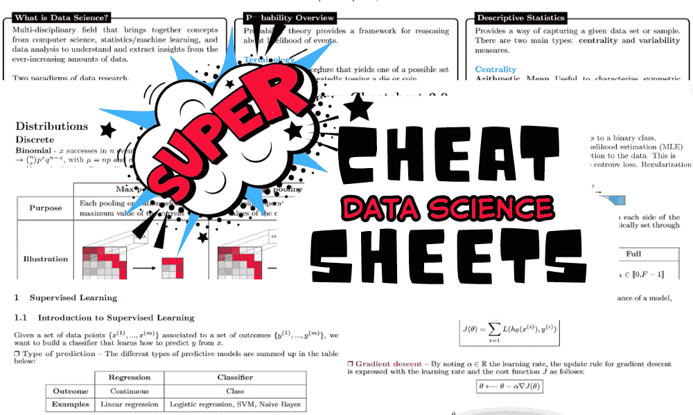
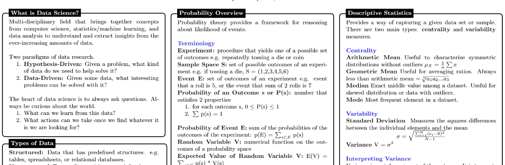
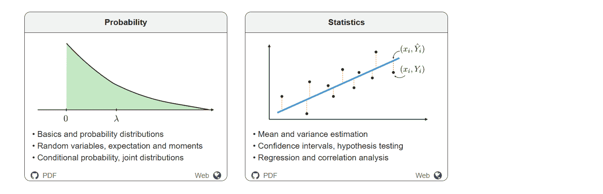
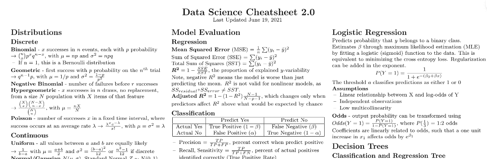
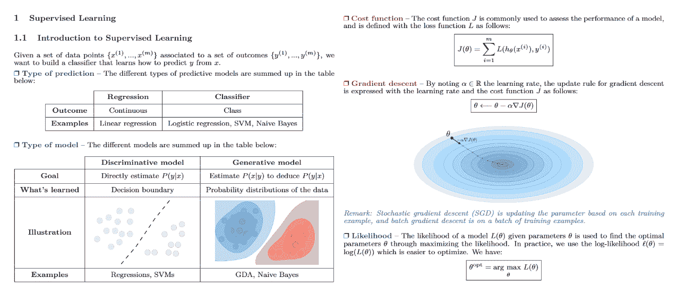
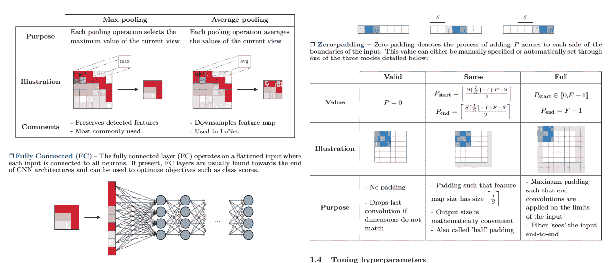

# 掌握数据科学的 5 大超级备忘单

> 原文：[`www.kdnuggets.com/5-super-cheat-sheets-to-master-data-science`](https://www.kdnuggets.com/5-super-cheat-sheets-to-master-data-science)

作者提供的图片

数据科学是一个广阔的领域，结合了统计学、机器学习和数据分析的元素。为了导航这个复杂的领域，拥有一套实用的备忘单可以极大地帮助你。

* * *

## 我们的前三大课程推荐

 1\. [谷歌网络安全证书](https://www.kdnuggets.com/google-cybersecurity) - 快速进入网络安全职业轨道。

 2\. [谷歌数据分析专业证书](https://www.kdnuggets.com/google-data-analytics) - 提升你的数据分析能力

 3\. [谷歌 IT 支持专业证书](https://www.kdnuggets.com/google-itsupport) - 支持你的组织的 IT 需求

* * *

这些备忘单还可以作为准备技术面试、复习关键概念和为初学者提供数据科学职业概述的宝贵资源。

以下是每个数据科学专业人员和爱好者都应该拥有的五个超级备忘单：

# 1\. 数据科学超级备忘单

**链接：** [数据科学备忘单/data-science-cheatsheet.pdf](https://github.com/ml874/Data-Science-Cheatsheet/blob/master/data-science-cheatsheet.pdf)

这份 9 页的综合参考资料涵盖了概率、统计学、统计学习、机器学习、大数据框架和 SQL 的基础知识。适合对统计学和线性代数有基本了解的人，是进入数据科学领域的绝佳起点。

# 2\. 斯坦福大学概率和统计备忘单

**链接：** [CME 106 (stanford.edu)](https://stanford.edu/~shervine/teaching/cme-106/)

这份备忘单是概率和统计学关键概念的简明总结。它包括随机样本、估计量、中心极限定理、置信区间、假设检验、回归分析、相关系数等主题。它非常适合理解数据科学中至关重要的基础统计概念。

# 3\. 数据科学备忘单 2.0

**链接：** [aaronwangy/数据科学备忘单](https://github.com/aaronwangy/Data-Science-Cheatsheet)

这份备忘单是数据科学知识的精华版本，涵盖了基于 MIT 机器学习课程 6.867 和 15.072 的一个学期的入门级机器学习内容。它包括线性回归、逻辑回归、决策树、支持向量机、K 最近邻等主题。这份备忘单是考试复习、面试准备和快速回顾关键机器学习概念的宝贵资源。

# 4. 超级机器学习备忘单

**链接：** [afshinea/stanford-cs-229-machine-learning](https://github.com/afshinea/stanford-cs-229-machine-learning/blob/master/en/super-cheatsheet-machine-learning.pdf)

这份备忘单总结了斯坦福大学 CS 229 机器学习课程中的关键概念。它包括相关主题（概率和统计、代数和微积分）的复习，以及每个机器学习领域的详细备忘单，最后汇总了重要概念。对于任何希望深入了解机器学习的人来说，这是一个必备的资源。它旨在为专家提供一个基础概念的快速参考。

# 5. 超级深度学习备忘单

**链接：** [afshinea/stanford-cs-230-deep-learning](https://github.com/afshinea/stanford-cs-230-deep-learning/blob/master/en/super-cheatsheet-deep-learning.pdf)

如果你对深度学习感兴趣，斯坦福大学的 CS 230 课程提供了一系列出色的资料，涵盖了关于卷积神经网络和递归神经网络的所有知识点，并提供了训练深度学习模型的技巧。这个资源对于专注于数据科学中深度学习方面的任何人来说都是无价的，而且是**免费的**。

# 结论

这些备忘单提供了一种简明有效的方式来复习和巩固你在数据科学各个学科的理解。从统计学基础到机器学习和深度学习的复杂性，这些资源对学生、专业人士和爱好者都非常宝贵。经常参考它们，以巩固基础概念或更新最新方法。

****[Abid Ali Awan](https://www.polywork.com/kingabzpro)**** ([@1abidaliawan](https://www.linkedin.com/in/1abidaliawan)) 是一位认证的数据科学专业人士，热衷于构建机器学习模型。目前，他专注于内容创作，并撰写有关机器学习和数据科学技术的技术博客。Abid 拥有技术管理硕士学位和电信工程学士学位。他的愿景是利用图神经网络构建一款 AI 产品，帮助那些挣扎于心理健康问题的学生。

### 更多相关内容

+   [7 份您需要的超级备忘单，以通过机器学习面试](https://www.kdnuggets.com/2022/12/7-super-cheat-sheets-need-ace-machine-learning-interview.html)

+   [5 份超级实用的 SQL 备忘单，您不可错过！](https://www.kdnuggets.com/5-super-helpful-sql-cheat-sheets-you-cant-miss)

+   [KDnuggets™ 新闻 22:n06，2 月 9 日：数据科学编程…](https://www.kdnuggets.com/2022/n06.html)

+   [KDnuggets 新闻，6 月 8 日：21 份数据科学备忘单…](https://www.kdnuggets.com/2022/n23.html)

+   [数据科学备忘单完整合集 - 第一部分](https://www.kdnuggets.com/2022/02/complete-collection-data-science-cheat-sheets-part-1.html)

+   [数据科学备忘单完整合集 - 第二部分](https://www.kdnuggets.com/2022/02/complete-collection-data-science-cheat-sheets-part-2.html)
