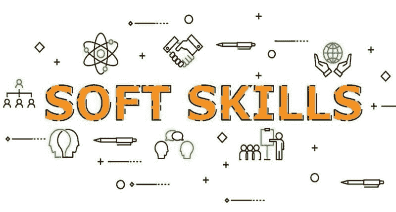

# 5 项支持技能，助你获得数据科学职位

> 原文：[`www.kdnuggets.com/2021/02/5-supporting-skills-data-science-job.html`](https://www.kdnuggets.com/2021/02/5-supporting-skills-data-science-job.html)

评论

当你开始追求数据科学职位时，一些需要掌握的技能会很明显。你知道你需要具备编码、分析和数学经验，但你也应该培养一些软技能。虽然这些技能在你想到数据科学时可能不会立刻浮现，但它们将在你的职业生涯中发挥关键作用。

数据科学职位仍然需求旺盛，但[新职位的数量在下降](https://sloanreview.mit.edu/article/the-recessions-impact-on-analytics-and-data-science/)，虽然下降速度比其他职业要慢。该领域的盈利能力也会吸引更多的申请者，因此竞争在上升。如果你想在申请者中脱颖而出，以下是一些你应该发展的辅助技能。

### **1\. 批判性思维**

许多职位会寻找具备强大批判性思维技能的申请者，特别是在数据科学领域。你应该能够从多个角度看待问题，了解如何处理它并分析你的结果。这个过程是许多数据科学应用的基础，即使它并非行业所独有。

作为数据科学家，你需要知道如何正确地提出问题，而不仅仅是回答问题。你必须从多个角度分析一个问题，以找到问题的根源。在解决问题后，你应该反思这个过程，并理解它为何如此发展。

要培养批判性思维技能，利用空闲时间参与各种解决问题的项目。尝试从多个角度进行分析，并展示多种解决方法。培养这样一个项目组合可以向潜在雇主展示你在批判性思维方面的能力。

### **2\. 沟通能力**

你可能不会把数据科学当作一个沟通密集的领域，但事实远非如此。虽然分析可能是你工作的核心，但你必须沟通你的结果。数据科学涉及大量的协作和报告，因此你需要知道如何有效地进行沟通。

研究表明，沟通不畅使大型公司每年平均损失[$62.4 百万](https://www.shrm.org/resourcesandtools/hr-topics/behavioral-competencies/communication/pages/the-cost-of-poor-communications.aspx)。如果你不能向同事和管理层解释你的问题或想法，他们将无法看到你技术能力的全部。误沟通可能导致流程未优化、缺陷和损失。

幸运的是，发展和展示沟通技能相对简单。你在工作和个人生活中，寻找团队项目。你在团队中工作的越多，你的沟通能力就会越强，并且你将拥有相关的证据。

### **3\. 知识好奇心**

一个好的数据科学家会寻找问题的解决方案，但一个伟大的数据科学家会寻找需要修复的事物。数据科学是一个潜在的颠覆性领域，因此你应该能够跳出传统框架进行思考。知识好奇心驱动数据科学家发现隐蔽的问题并创造性地解决它们。

雇主希望看到一个有强烈学习欲望的数据科学家。这种心态有助于找到解决方案，并可能推动公司扩展。好奇心驱动增长，因此任何企业都会乐意找到一个知识好奇的候选人。

为了培养知识好奇心，开始提问吧。追求独立项目，在每一个步骤中询问为什么和如何。随着时间的推移，你将积累一个充满独特问题解决方法和好奇心的作品集。

### **4\. 适应能力**

虽然科学看似严谨，但作为数据科学家，你必须具备适应能力。适应能力在几乎所有技术工种中都是令人向往的，因为员工经常在工作中[获得新技能](https://www.commercialvanshelving.com/blog/skilled-trade-jobs-highest-demand/)，以满足多样化的需求。你能够更好地应对新挑战，你就会成为更有价值的员工。

数据科学影响着今天商业的许多方面，因此你必须适应各种情况。作为一个技术导向的领域，数据科学也在不断发展。新的技术和方法不断出现，你需要能够适应这些变化。

你可以通过故意将自己置于陌生的情况来培养适应能力。开始一些你不太熟悉或不了解的领域的项目。在你当前的工作或学校中，志愿参与新的项目或过程。你将学习在这个过程中如何发展。

### **5\. 时间管理**

作为数据科学家，你应该具备可靠的时间管理技能。这个领域可能会很有挑战性，在今天快节奏的工作环境中，很容易感到不堪重负。如果你能够有效管理时间，你会更高效地工作，并避免倦怠。

一项研究发现，[65% 的美国工人](https://www.stress.org/workplace-stress)报告称工作压力造成了困难，其中 10%的人表示问题非常严重。时间管理技能可以帮助你减少这种压力。因此，你会感觉更好，工作也会有所改善。

你可以在当前职位或学业中开始应用时间管理技巧。测试不同的策略，比如设置定时器和优先处理重要任务，并找到最适合你的方法或组合。然后你可以向潜在的雇主解释你如何有效地管理时间。

### **成为最优秀的数据科学候选人**

在你努力获得数据科学所需的经验和技术技能时，请记住这些辅助技能。如果你能培养这些能力，你将成为更有价值的候选人。即使你已经在相关领域工作，也可以开始应用这些技能，以最大化你的潜力。

**个人简介：Devin Partida** 是一位大数据和技术作家，同时也是[**ReHack.com**](https://rehack.com/)的主编。

**相关：**

+   如何获得数据科学家的职位

+   7 个最推荐的技能，助你成为数据科学家

+   本文介绍了数据专业人士可以通过七种方式增加简历的多样性。

### 更多相关话题

+   [5 项稀有的数据科学技能，助你获得就业机会](https://www.kdnuggets.com/5-rare-data-science-skills-that-can-help-you-get-employed)

+   [数据科学项目，帮助你解决现实世界的问题](https://www.kdnuggets.com/2022/11/data-science-projects-help-solve-real-world-problems.html)

+   [生成性 AI 如何帮助你改进数据可视化图表](https://www.kdnuggets.com/how-generative-ai-can-help-you-improve-your-data-visualization-charts)

+   [帮助你成为专业人士的免费 Python 资源](https://www.kdnuggets.com/free-python-resources-that-can-help-you-become-a-pro)

+   [数据科学家如何赢得 CFO 的青睐（以及为什么你需要这样做）](https://www.kdnuggets.com/2021/12/data-scientists-get-ear-cfos-want.html)

+   [使用 ChatGPT 帮助找到数据科学工作](https://www.kdnuggets.com/using-chatgpt-to-help-land-a-data-science-job)
